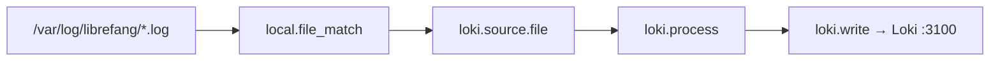

# deploy — alloy

# deploy/alloy

Konfiguracja Grafana Alloy dla lokalnego stosu deweloperskiego LibreFang. Alloy monitoruje pliki logów demona i przesyła je do Loki, dodając stabilną etykietę `service="librefang"`, dzięki której wpisy logów można wyszukiwać obok śladów z potoku OTel/Tempo/Jaeger.

## Przeznaczenie

Ten moduł dostarcza część zbierającą logi z lokalnego stosu obserwowalności. Daemon zapisuje pliki logów do `/var/log/librefang/` (zamontowane w trybie tylko do odczytu z hosta). Alloy wykrywa te pliki, wzbogaca każdą linię o spójne etykiety i przesyła je do Loki. Gdy daemon umieści `trace_id` w liniach logów (planowane w osobnym PR), pochodne pola Grafany umożliwią przejścia między śladami a logami w widoku eksploracji — połączenie etykiet jest już przygotowane, aby to obsługiwać.

## Konfiguracja

**Plik:** `config.alloy`

### Przegląd potoku



### Komponenty

#### Logowanie

```alloy
logging {
    level  = "warn"
    format = "logfmt"
}
```

Kontroluje diagnostyczny wynik samego Alloy. Ustawione na `warn`, aby utrzymać cichą konsolę kontenera podczas normalnej pracy deweloperskiej.

#### `local.file_match.librefang_logs`

Wykrywa pliki logów pasujące do wzorca glob `/var/log/librefang/*.log`. `sync_period` wynoszący 5 sekund oznacza, że Alloy ponownie skanuje katalog co 5s w celu wykrycia nowych plików (np. rotacja logów lub tworzenie nowego pliku przez demona przy starcie).

Ten wzorzec przechwytuje zarówno `daemon.log`, jak i `tui.log`, jeśli oba interfejsy zapisują do tego katalogu.

#### `loki.source.file.librefang`

Monitoruje pliki wykryte przez `local.file_match` i przekazuje surowe linie do etapu przetwarzania.

#### `loki.process.librefang`

Wzbogaca linie logów przed wysłaniem ich do Loki:

| Etap | Akcja | Uzasadnienie |
|---|---|---|
| `stage.static_labels` | Dodaje `service="librefang"` i `job="librefang"` | Etykieta `service` sprawia, że zapytania logów w Grafanie pasują do nazwy usługi raportowanej przez potok śledzenia OTel/Tempo/Jaeger. Ta spójność jest wymagana, aby przejścia między śladami a logami działały. |
| `stage.label_drop` | Usuwa `filename` | Zapobiega eksplozji etykiet o wysokiej kardynalności z etykiet dla każdego pliku. |

#### `loki.write.local`

Przesyła przetworzone wpisy logów do lokalnej instancji Loki pod adresem `http://loki:3100/loki/api/v1/push`. Nazwa hosta `loki` jest rozwiązywana przez usługę wykrywania Docker Compose w sieci stosu deweloperskiego.

## Punkty integracji

- **Wynik logów demona** — Daemon musi zapisywać do `/var/log/librefang/*.log`. Punkt montowania kontenera jest konfigurowany w innym miejscu konfiguracji wdrożenia (ścieżka hosta zamontowana w trybie tylko do odczytu w kontenerze Alloy).
- **Loki** — Wymaga usługi Loki o nazwie `loki` nasłuchującej na porcie 3100 w tej samej sieci Docker.
- **Grafana** — Można odpytywać za pomocą LogQL używając `{service="librefang"}`. Spójność etykiety `service` z potokiem śledzenia umożliwia korelację krzyżową w Grafana Explore.
- **Korelacja śladów** — Planowane: gdy daemon umieści `trace_id` w liniach logów, pochodne pola Grafany automatycznie połączą wpisy logów ze śladami Tempo/Jaeger. Żadna zmiana konfiguracji Alloy nie będzie do tego potrzebna — połączenie etykiet jest już przygotowane.

## Odpytywanie logów

W Grafanie lub przez API Loki, filtruj logy za pomocą:

```logql
{service="librefang"}
```

Aby zawęzić według źródła logów (gdy filtrowanie na podstawie nazwy pliku zostanie przywrócone lub daemon uwzględni identyfikator źródła w treści linii), rozszerz zapytanie odpowiednio. Należy zauważyć, że `filename` jest usuwane na poziomie Alloy, więc nie jest dostępne jako etykieta Loki.
