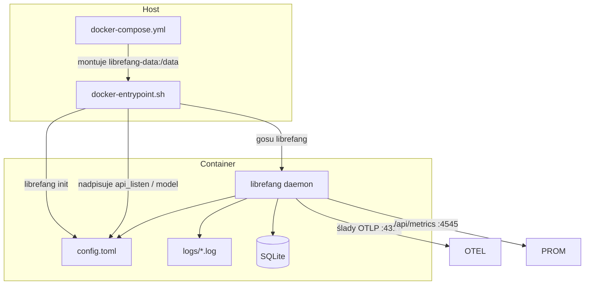
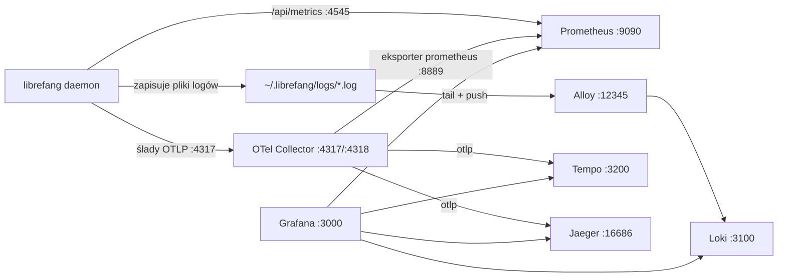

# deploy — deploy

# deploy — Wdrażanie i Obserwowalność

Definicje kontenerów, pliki usług i infrastruktura telemetrii do uruchamiania LibreFang w środowiskach produkcyjnych i deweloperskich.

## Przegląd

Katalog `deploy/` zawiera wszystko, co potrzebne do uruchomienia demona LibreFang poza kompilacją cargo na gołym metalu:

| Artefakt | Przeznaczenie |
|---|---|
| `docker-compose.yml` | Wdrożenie demona w pojedynczym kontenerze przez Docker |
| `docker-entrypoint.sh` | Dwumodalowy (root / bez uprawnień roota) punkt wejścia kontenera z utwardzeniem bezpieczeństwa |
| `librefang.service` | Jednostka systemd dla instalacji na poziomie hosta |
| `render.yaml` | Blueprint Render PaaS (warstwa bezpłatna) |
| `docker-compose.observability.yml` | Pełny lokalny stos telemetrii (metryki, ślady, logi) |
| `OBSERVABILITY.md` | Szybki start i dokumentacja obserwowalności dla operatorów |

## Topologia Wdrożenia



---

## docker-compose.yml — Wdrożenie Demona

Najprostsza droga do uruchomienia działającego demona. Pobiera opublikowany obraz z `ghcr.io/librefang/librefang:latest`, wystawia port `4545` i montuje nazwany wolumen w `/data` dla stanu trwałego (konfiguracja, baza SQLite, logi).

Klucze API i tokeny bota są przekazywane ze środowiska hosta z bezpiecznymi domyślnymi wartościami (`:-` puste zastąpienie), dzięki czemu plik compose nie koduje na stałe sekretów:

```yaml
environment:
  - ANTHROPIC_API_KEY=${ANTHROPIC_API_KEY:-}
  - OPENAI_API_KEY=${OPENAI_API_KEY:-}
  - GROQ_API_KEY=${GROQ_API_KEY:-}
```

Zmienna środowiskowa `LIBREFANG_LISTEN=0.0.0.0:4545` wymusza powiązanie z all-addresses (wildcard), aby demon był osiągalny z sieci hosta, a nie tylko z pętli zwrotnej kontenera.

---

## docker-entrypoint.sh — Punkt Wejścia Kontenera

Najbardziej wrażliwy element tego modułu. Uruchamia się przed demonem i obsługuje inicjalizację pierwszego uruchomienia, nadpisywanie konfiguracji i zarządzanie uprawnieniami.

### Działanie Dwumodalowe

Skrypt automatycznie wykrywa, czy działa jako root (Docker/Compose) czy jako uid 1001 (Kubernetes z ograniczonym bezpieczeństwem Pod) i dostosowuje się odpowiednio:

```sh
if [ "$(id -u)" = "0" ]; then
  ROOTLESS=0
else
  ROOTLESS=1
fi
```

Dwie funkcje pomocnicze abstrahują tę różnicę:

- **`as_app`** — Przechodzi na konto usługowe `librefang` przez `gosu` w trybie root; w trybie bez uprawnień roota przekazuje bezpośrednio (zrzucenie uprawnień jest niemożliwe i niepotrzebne, gdy jest się już uid 1001).
- **`own_as_app`** — Ponownie ustanawia własność plików po nadpisaniu konfiguracji w trybie root; brak operacji w trybie bez uprawnień roota.

Dzięki temu jeden obraz obsługuje zarówno Docker (który startuje jako root), jak i Kubernetes (który wymusza `runAsNonRoot: true`) bez konieczności budowania dwóch obrazów.

### Zabezpieczenie przed Wstrzykiwaniem TOML

**Krytyczna kontrola bezpieczeństwa (GH #3556).** Punkt wejścia wstawia `$PORT` i `$LIBREFANG_MODEL` bezpośrednio do `config.toml` przez `sed`. Bez walidacji atakujący kontrolujący te zmienne środowiskowe mógłby wydostać się z ciągu TOML i wstrzyknąć dowolne klucze — na przykład eksfiltrując lub nadpisując klucze API dostawców:

```
LIBREFANG_MODEL='gpt-5"\n[provider]\napi_key = "stolen'
```

Zabezpieczenie odrzuca nieprawidłowe wartości przed jakimkolwiek nadpisaniem:

| Zmienna | Walidacja | Wyzwalacz odrzucenia |
|---|---|---|
| `PORT` | `grep -qE '^[0-9]+$'` | Niecyfrowa lub pusta |
| `LIBREFANG_MODEL` | Shell `case` glob | Zawiera `"`, `\`, `[` lub `]` |
| `LIBREFANG_MODEL` | `wc -l` count | Osadzone znaki nowej linii |
| `LIBREFANG_MODEL` | `case` z `\r` | Znaki powrotu karetki |

`case` jest celowo używane zamiast `grep -E` do dopasowywania znaków, aby uniknąć niespodzianek z cytowaniem ukośników w wyrażeniach regularnych z nawiasami kwadratowymi.

Nieprawidłowa wartość natychmiast zatrzymuje kontener (`exit 1`) z komunikatem diagnostycznym, zamiast po cichu tworzyć zatruconą konfigurację.

### Sekwencja Inicjalizacji

1. **Ustalenie katalogu danych** — `$LIBREFANG_HOME` domyślnie przyjmuje `/data`.
2. **Walidacja środowiska** — Zabezpieczenie przed wstrzykiwaniem TOML uruchamia się na `PORT` i `LIBREFANG_MODEL`.
3. **Zapewnienie istnienia katalogu** — `mkdir -p "$DATA_DIR"`.
4. **Własność** (tylko tryb root) — `chown -R librefang:librefang`, jeśli wolumen nie jest już własnością konta usługowego.
5. **Test zapisu** (tylko tryb bez uprawnień roota) — Tworzy i usuwa plik tymczasowy w `$DATA_DIR`. Kończy się niepowodzeniem z komunikatem naprawczym wskazującym na `fsGroup: 1001` lub wcześniejsze ustanowienie własności, jeśli wolumen nie jest zapisywalny. Zapobiega niejasnemu „permission denied" przy późniejszym otwarciu SQLite przez demona.
6. **Utworzenie katalogu logów** — `as_app mkdir -p "$DATA_DIR/logs"` (obrona w głąb przeciwko GH #3058, gdzie brakujący katalog logów powodował cichy panic z exit 101).
7. **Inicjalizacja pierwszego uruchomienia** — Uruchamia `librefang init` tylko jeśli `config.toml` nie istnieje. Kolejne uruchomienia pomijają ten krok, aby uniknąć kumulacji kopii zapasowych konfiguracji z sygnaturami czasowymi.
8. **Nadpisywanie konfiguracji** — Trzy operacje `sed`, każda z następującym po niej `own_as_app`:
   - Wymusza powiązanie wildcard `0.0.0.0`, jeśli konfiguracja zawiera `127.0.0.1` (pętla zwrotna kontenera jest nieosiągalna z hosta).
   - Aplikuje `$PORT`, jeśli ustawiony (wstrzyknięcie portu PaaS).
   - Aplikuje `$LIBREFANG_MODEL`, jeśli ustawiony.
9. **Uruchomienie demona** — `exec gosu librefang "$@"` (root) lub `exec "$@"` (bez uprawnień roota).

### Niepowodzenie Zapisu w Trybie bez Uprawnień Roota

Gdy tryb bez uprawnień roota wykryje niezapisywalny wolumen, komunikat błędu jest celowo instruktażowy:

```
ERROR: działanie bez uprawnień roota jako uid 1001, ale /data nie jest zapisywalne.
       Ustaw 'fsGroup: 1001' w securityContext poda, lub nadaj uprawnienia
       do wolumenu jako 1001:1001, jeśli Twój sterownik CSI ignoruje fsGroup.
       Zobacz deploy/kubernetes/README.md ('Volume ownership').
```

To przewiduje typowy tryb awarii, w którym sterowniki CSI (NFS, CIFS lub jakikolwiek sterownik zgłaszający `fsGroupPolicy: None`) ignorują `chgrp fsGroup` wykonywany przez kubelet.

---

## librefang.service — Jednostka systemd

Do instalacji na poziomie hosta (goły metal, VM, LXC). Uruchamia demona w trybie first-plane pod dedykowanym użytkownikiem systemowym `librefang`.

**Kluczowe cechy:**

- **`ExecStart=/usr/local/bin/librefang start --foreground`** — Tryb first-plane utrzymuje proces podłączony do journald; systemd obsługuje cykl życia.
- **`EnvironmentFile=-/etc/librefang/env`** i **`-/var/lib/librefang/secrets.env`** — Podział na dwa pliki: konfiguracja w `/etc`, sekrety w `/var/lib`. Prowadzący `-` sprawia, że brak nie jest błędem krytycznym.
- **`Restart=on-failure`** z `RestartSec=5` — Automatyczne odzyskiwanie po awariach bez nadmiernego obciążania.
- **`ReadWritePaths=/var/lib/librefang`** — W połączeniu z `ProtectSystem=strict`, to jedyna ścieżka zapisywalna, którą demon może modyfikować.
- **`NoNewPrivileges=true`** — Blokuje eskalację setuid.
- **`ProtectHome=true`** — Ukrywa `/home`, `/root`, `/run/user` przed procesem.
- **`LimitNOFILE=65536`** — Podniesiony limit deskryptorów plików dla obciążeń z dużą liczbą połączeń.
- **`MemoryDenyWriteExecute=false`** — Jawnie odnotowane, ponieważ demon prawdopodobnie używa JIT-kompilowanych wyrażeń regularnych lub środowiska uruchomieniowego wymagającego poluzowania W^X.

---

## render.yaml — Blueprint Render PaaS

Celuje w bezpłatną warstwę Render. Istotne ograniczenia:

- **Brak trwałego dysku na warstwie bezpłatnej** — Dane (konfiguracja, historia konwersacji, baza SQLite) są ulotne. YAML dokumentuje ścieżkę montowania dysku z warstwy płatnej dla trwałości.
- **`healthCheckPath: /api/health`** — Render odpytuje ten endpoint, aby ustalić gotowość usługi.
- **Klucze tajne** używają `sync: false`, więc są zarządzane w panelu Render, a nie sprawdzane do blueprintu.

---

## Stos Obserwowalności

### Architektura



### Usługi

Siedem kontenerów orkiestrowanych przez `docker-compose.observability.yml`:

| Usługa | Obraz | Porty | Rola |
|---|---|---|---|
| `otel-collector` | `otel/opentelemetry-collector-contrib` | 4317, 4318, 8889, 13133 | Odbiera OTLP z demona; rozsyła do Tempo, Jaeger, Prometheus |
| `jaeger` | `jaegertracing/all-in-one` | 16686 | Samodzielny UI debugowania śladów (waterfall, diff, graf zależności) |
| `tempo` | `grafana/tempo` | 3200 | Magazyn śladów; backend korelacji w Grafanie |
| `loki` | `grafana/loki` | 3100 | Magazyn logów |
| `alloy` | `grafana/alloy` | 12345 | Tailsuje pliki logów demona; wysyła do Loki |
| `prometheus` | `prom/prometheus` | 9090 | Magazyn metryk |
| `grafana` | `grafana/grafana` | 3000 | Zunifikowany UI; auto-provisionowane źródła danych i panele |

### Kolejność Uruchamiania

Każdy `depends_on` używa `condition: service_healthy` z jawnymi kontrolami zdrowia. Było to celowe naprawienie warunku wyścigu przy starcie, gdzie `BatchSpanProcessor` demona logował `ConnectionRefused` do `127.0.0.1:4317`, podczas gdy kolektor jeszcze się uruchamiał.

Endpointy kontroli zdrowia:

| Usługa | Adres sprawdzania | `start_period` |
|---|---|---|
| otel-collector | `http://localhost:13133/` | 5s |
| jaeger | `http://localhost:16686/` | 5s |
| tempo | `http://localhost:3200/ready` | 15s |
| loki | `http://localhost:3100/ready` | 10s |
| alloy | `http://localhost:12345/-/ready` | 5s |
| prometheus | `http://localhost:9090/-/ready` | 5s |
| grafana | `http://localhost:3000/api/health` | 5s |

Dłuższy `start_period` Tempo uwzględnia ładowanie WAL i listy bloków, zanim `/ready` zwróci 200.

### Jaeger Nie Jest Opcjonalny

Potok `traces` w kolektorze zawiera `otlp/jaeger` jako eksporter. Uruchomienie stosu bez Jaeger spowoduje, że kolektor będzie logował `ConnectionRefused` przy każdej partii. Aby uruchomić tylko Tempo:

1. Skomentuj `otlp/jaeger` w `otel-collector/config.yaml`.
2. Usuń `jaeger` z `service.pipelines.traces.exporters`.
3. Usuń usługę `jaeger` z pliku compose.

### Wzajemne Powiązania

- **Ślad ↔ Ślad**: Ten sam `trace_id` płynie do Tempo i Jaeger. Oba są auto-provisionowane jako źródła danych Grafany (`librefang-tempo`, `librefang-jaeger`).
- **Log ↔ Ślad**: Źródło danych Loki (`librefang-loki`) ma skonfigurowane `derivedFields` do wyciągania `trace_id="<32-hex>"` z linii logów i generowania klikalnych linków do Tempo/Jaeger. To powiązanie jest na miejscu, ale wymaga, aby linie logów demona zawierały pole `trace_id` — oczekująca zmiana po stronie Rust.
- **Metryka ↔ Ślad**: Prometheus i eksporter Prometheus kolektora OTel (`:8889`) są oba provisionowane jako źródła danych Grafany.

### Szczegóły Przepływu Danych

**Ścieżka metryk**: Prometheus scrapuje `http://host.docker.internal:4545/api/metrics` co 15 sekund. Plik compose używa `extra_hosts: ["host.docker.internal:host-gateway"]` na zarówno `otel-collector`, jak i `prometheus`, aby upewnić się, że wewnętrzny alias Dockera wskazuje na bramę hosta.

**Ścieżka logów**: Alloy montuje `${HOME}/.librefang/logs` w trybie tylko do odczytu w `/var/log/librefang` wewnątrz kontenera. Ten stały punkt montowania oznacza, że konfiguracja Alloy nie musi znać `$HOME` operatora.

**Ścieżka śladów**: Demon wysyła OTLP do `127.0.0.1:4317` (port hosta zmapowany do kolektora). Kolektor przekazuje wewnętrznie do `tempo:4317` i `jaeger:4317` przez sieć bridge Dockera. Tempo i Jaeger nie wystawiają swoich portów 4317 do hosta — tylko 4317 kolektora jest zmapowane do hosta, co unika konfliktów portów.

### Odniesienie Metryk

**Metryki systemowe:**

| Metryka | Typ | Etykiety | Opis |
|---|---|---|---|
| `librefang_info` | gauge | `version` | Informacja o wersji kompilacji |
| `librefang_uptime_seconds` | gauge | — | Sekundy od uruchomienia demona |
| `librefang_agents_active` | gauge | — | Aktywne agenty |
| `librefang_agents_total` | gauge | — | Zarejestrowane agenty |
| `librefang_panics_total` | counter | — | Licznik panik supervisora |
| `librefang_restarts_total` | counter | — | Licznik restartów supervisora |
| `librefang_active_sessions` | gauge | — | Aktywne sesje dashboardu |
| `librefang_cost_usd_today` | gauge | — | Szacowany koszt dzienny (USD) |

**Metryki LLM i tokenów** (przesuwane okno 1h, na agenta):

| Metryka | Typ | Etykiety |
|---|---|---|
| `librefang_tokens` | gauge | `agent, provider, model` |
| `librefang_tokens_input` | gauge | `agent, provider, model` |
| `librefang_tokens_output` | gauge | `agent, provider, model` |
| `librefang_tool_calls` | gauge | `agent, provider, model` |
| `librefang_llm_calls` | gauge | `agent, provider, model` |

**Metryki HTTP** (wymagają flagi `telemetry`):

| Metryka | Typ | Etykiety |
|---|---|---|
| `librefang_http_requests_total` | counter | `method, path, status` |
| `librefang_http_request_duration_seconds` | histogram | `method, path` |

### Dołączone Panele

Cztery panele w `grafana/dashboards/`, auto-provisionowane przez `grafana/provisioning/`. Każdy zawiera linki nawigacji wzajemnej do pozostałych trzech:

| Panel | Plik | Zestawienie |
|---|---|---|
| LibreFang Overview | `librefang.json` | Zdrowie systemu: wersja, uptime, liczba agentów, sesje, koszty, paniki/restarty |
| LLM & Token Usage | `librefang-llm.json` | Konsumpcja tokenów na agenta ze zmiennymi szablonowymi Agent/Provider/Model |
| HTTP & API | `librefang-http.json` | Szybkość żądań, percentyle opóźnień (p50/p90/p99), rozkład statusów, najwolniejsze endpointy |
| Cost & Budget | `librefang-cost.json` | Analiza wydatków ze zmiennymi szablonowymi; ranking tokenów wyjściowych (tokeny wyjściowe kosztują 3–5× więcej niż wejściowe) |

### Wolumeny

Nazwane wolumeny dla stanu trwałego między restartami kontenerów:

- `prometheus-data` — Retencja metryk
- `tempo-data` — Bloki śladów
- `loki-data` — Fragmenty logów
- `grafana-data` — Edycje paneli (zmiany w UI są tu utrwalane, mimo że JSON paneli jest montowany w trybie tylko do odczytu z hosta)
