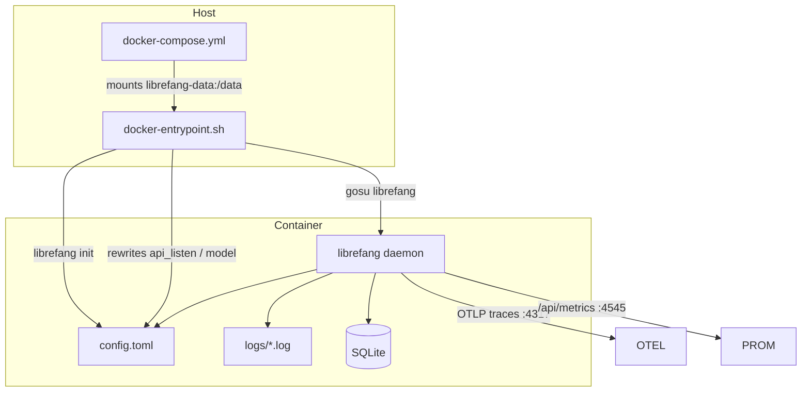
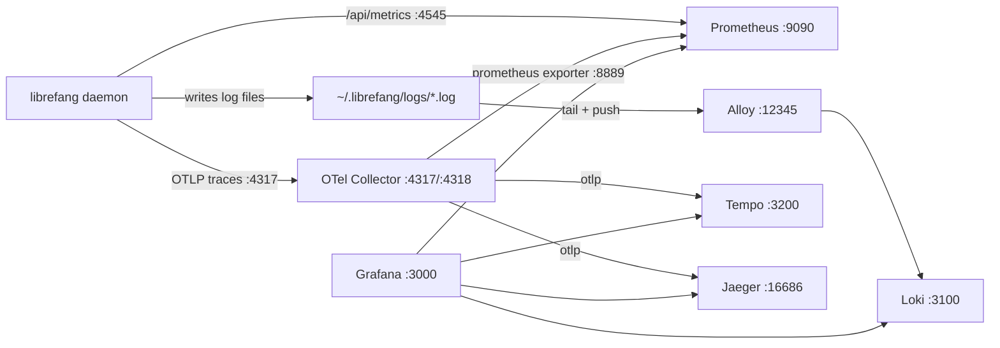

# deploy — deploy

# deploy — Deployment & Observability

Container definitions, service files, and telemetry infrastructure for running LibreFang in production and development environments.

## Overview

The `deploy/` directory provides everything needed to run the LibreFang daemon outside of a bare-metal cargo build:

| Artifact | Target |
|---|---|
| `docker-compose.yml` | Single-container daemon deployment via Docker |
| `docker-entrypoint.sh` | Dual-mode (root / rootless) container entrypoint with security hardening |
| `librefang.service` | systemd unit for host-level installs |
| `render.yaml` | Render PaaS Blueprint (free tier) |
| `docker-compose.observability.yml` | Full local telemetry stack (metrics, traces, logs) |
| `OBSERVABILITY.md` | Operator-facing observability quick-start and reference |

## Deployment Topology



---

## docker-compose.yml — Daemon Deployment

The simplest path to a running daemon. Pulls the published image from `ghcr.io/librefang/librefang:latest`, exposes port `4545`, and mounts a named volume at `/data` for persistent state (config, SQLite database, logs).

API keys and bot tokens are passed through from the host environment with safe defaults (`:-` empty fallback) so the compose file does not hardcode secrets:

```yaml
environment:
  - ANTHROPIC_API_KEY=${ANTHROPIC_API_KEY:-}
  - OPENAI_API_KEY=${OPENAI_API_KEY:-}
  - GROQ_API_KEY=${GROQ_API_KEY:-}
```

The `LIBREFANG_LISTEN=0.0.0.0:4545` environment variable forces a wildcard bind so the daemon is reachable from the host network, not just the container loopback.

---

## docker-entrypoint.sh — Container Entrypoint

The most security-sensitive piece in this module. It runs before the daemon and handles first-boot initialization, config rewriting, and privilege management.

### Dual-Mode Operation

The script auto-detects whether it is running as root (Docker/Compose) or as uid 1001 (Kubernetes restricted Pod Security) and adapts accordingly:

```sh
if [ "$(id -u)" = "0" ]; then
  ROOTLESS=0
else
  ROOTLESS=1
fi
```

Two helper functions abstract the difference:

- **`as_app`** — Drops to the `librefang` service account via `gosu` under root; passes through directly under rootless (privilege drop is impossible and unnecessary when already uid 1001).
- **`own_as_app`** — Re-asserts file ownership after config rewrites under root; no-ops under rootless.

This lets a single image satisfy both Docker (which starts as root) and Kubernetes (which enforces `runAsNonRoot: true`) without shipping two images.

### TOML Injection Guard

**Critical security control (GH #3556).** The entrypoint splices `$PORT` and `$LIBREFANG_MODEL` directly into `config.toml` via `sed`. Without validation, an attacker controlling those environment variables could break out of the TOML string and inject arbitrary keys — for example, exfiltrating or overwriting provider API keys:

```
LIBREFANG_MODEL='gpt-5"\n[provider]\napi_key = "stolen'
```

The guard rejects offending values before any rewrite occurs:

| Variable | Validation | Rejection trigger |
|---|---|---|
| `PORT` | `grep -qE '^[0-9]+$'` | Non-numeric or empty |
| `LIBREFANG_MODEL` | Shell `case` glob | Contains `"`, `\`, `[`, or `]` |
| `LIBREFANG_MODEL` | `wc -l` count | Embedded newlines |
| `LIBREFANG_MODEL` | `case` with `\r` | Carriage returns |

`case` is deliberately used instead of `grep -E` for character matching to avoid backslash-quoting surprises in regex bracket expressions.

A bad value crashes the container immediately (`exit 1`) with a diagnostic message rather than silently producing a poisoned config.

### Initialization Sequence

1. **Resolve data directory** — `$LIBREFANG_HOME` defaults to `/data`.
2. **Validate environment** — TOML injection guard runs on `PORT` and `LIBREFANG_MODEL`.
3. **Ensure directory exists** — `mkdir -p "$DATA_DIR"`.
4. **Ownership** (root mode only) — `chown -R librefang:librefang` if the volume isn't already owned by the service account.
5. **Writability probe** (rootless mode only) — Creates and removes a temp file in `$DATA_DIR`. Fails with an actionable message pointing to `fsGroup: 1001` or pre-ownership if the volume is not writable. Prevents an opaque "permission denied" from the daemon's SQLite open later.
6. **Create logs directory** — `as_app mkdir -p "$DATA_DIR/logs"` (defense in depth against GH #3058, where a missing logs dir caused a silent panic with exit 101).
7. **First-boot init** — Runs `librefang init` only if `config.toml` does not exist. Subsequent boots skip this to avoid accumulating timestamped config backups.
8. **Config rewrites** — Three `sed` rewrites, each followed by `own_as_app`:
   - Force `0.0.0.0` wildcard bind if config contains `127.0.0.1` (container loopback is unreachable from host).
   - Apply `$PORT` if set (PaaS port injection).
   - Apply `$LIBREFANG_MODEL` if set.
9. **Exec daemon** — `exec gosu librefang "$@"` (root) or `exec "$@"` (rootless).

### Rootless Writability Failure

When rootless mode detects an unwritable volume, the error message is intentionally prescriptive:

```
ERROR: running rootless as uid 1001 but /data is not writable.
       Set 'fsGroup: 1001' in the pod securityContext, or pre-own the
       volume as 1001:1001 if your CSI driver ignores fsGroup.
       See deploy/kubernetes/README.md ('Volume ownership').
```

This anticipates the common failure mode where CSI drivers (NFS, CIFS, or any driver reporting `fsGroupPolicy: None`) ignore the kubelet's `fsGroup` chgrp.

---

## librefang.service — systemd Unit

For host-level installs (bare metal, VM, LXC). Runs the daemon in foreground mode under a dedicated `librefang` system user.

**Key characteristics:**

- **`ExecStart=/usr/local/bin/librefang start --foreground`** — Foreground mode keeps the process attached to journald; systemd handles lifecycle.
- **`EnvironmentFile=-/etc/librefang/env`** and **`-/var/lib/librefang/secrets.env`** — Two-file split: config in `/etc`, secrets in `/var/lib`. The leading `-` makes absence non-fatal.
- **`Restart=on-failure`** with `RestartSec=5` — Automatic recovery from crashes without thrashing.
- **`ReadWritePaths=/var/lib/librefang`** — Combined with `ProtectSystem=strict`, this is the only writable path the daemon can touch.
- **`NoNewPrivileges=true`** — Blocks setuid escalation.
- **`ProtectHome=true`** — Hides `/home`, `/root`, `/run/user` from the process.
- **`LimitNOFILE=65536`** — Raised file descriptor ceiling for connection-heavy workloads.
- **`MemoryDenyWriteExecute=false`** — Explicitly noted because the daemon likely uses JIT-compiled regex or a runtime that needs W^X relaxation.

---

## render.yaml — Render PaaS Blueprint

Targets Render's free tier. Notable constraints:

- **No persistent disk on free tier** — Data (config, conversation history, SQLite DB) is ephemeral. The YAML documents the paid-tier disk mount path for persistence.
- **`healthCheckPath: /api/health`** — Render polls this to determine service readiness.
- **Secret keys** use `sync: false` so they are managed in the Render dashboard, not checked into the blueprint.

---

## Observability Stack

### Architecture



### Services

Seven containers orchestrated by `docker-compose.observability.yml`:

| Service | Image | Ports | Role |
|---|---|---|---|
| `otel-collector` | `otel/opentelemetry-collector-contrib` | 4317, 4318, 8889, 13133 | Receives OTLP from daemon; fans out to Tempo, Jaeger, Prometheus |
| `jaeger` | `jaegertracing/all-in-one` | 16686 | Standalone trace-debug UI (waterfall, diff, dependency graph) |
| `tempo` | `grafana/tempo` | 3200 | Trace store; Grafana correlation backend |
| `loki` | `grafana/loki` | 3100 | Log store |
| `alloy` | `grafana/alloy` | 12345 | Tails daemon log files; pushes to Loki |
| `prometheus` | `prom/prometheus` | 9090 | Metrics store |
| `grafana` | `grafana/grafana` | 3000 | Unified UI; auto-provisioned datasources and dashboards |

### Startup Ordering

Every `depends_on` uses `condition: service_healthy` with explicit healthchecks. This was a deliberate fix for a boot-time race where the daemon's `BatchSpanProcessor` would log `ConnectionRefused` against `127.0.0.1:4317` while the collector was still starting.

Healthcheck endpoints:

| Service | Check URL | `start_period` |
|---|---|---|
| otel-collector | `http://localhost:13133/` | 5s |
| jaeger | `http://localhost:16686/` | 5s |
| tempo | `http://localhost:3200/ready` | 15s |
| loki | `http://localhost:3100/ready` | 10s |
| alloy | `http://localhost:12345/-/ready` | 5s |
| prometheus | `http://localhost:9090/-/ready` | 5s |
| grafana | `http://localhost:3000/api/health` | 5s |

Tempo's longer `start_period` accounts for WAL and block list loading before `/ready` returns 200.

### Jaeger Is Not Optional

The collector's `traces` pipeline includes `otlp/jaeger` as an exporter. Starting the stack without Jaeger will cause the collector to log `ConnectionRefused` on every batch. To run Tempo-only:

1. Comment out `otlp/jaeger` in `otel-collector/config.yaml`.
2. Remove `jaeger` from `service.pipelines.traces.exporters`.
3. Drop the `jaeger` service from the compose file.

### Cross-Linking

- **Trace ↔ Trace**: Same `trace_id` flows to both Tempo and Jaeger. Both are auto-provisioned as Grafana datasources (`librefang-tempo`, `librefang-jaeger`).
- **Log ↔ Trace**: The Loki datasource (`librefang-loki`) has `derivedFields` configured to extract `trace_id="<32-hex>"` from log lines and generate clickable links to Tempo/Jaeger. This wiring is in place but requires daemon log lines to carry the `trace_id` field — a pending Rust-side change.
- **Metric ↔ Trace**: Prometheus and the OTel collector's Prometheus exporter (`:8889`) are both provisioned as Grafana datasources.

### Data Flow Details

**Metrics path**: Prometheus scrapes `http://host.docker.internal:4545/api/metrics` every 15 seconds. The compose file uses `extra_hosts: ["host.docker.internal:host-gateway"]` on both `otel-collector` and `prometheus` to ensure the Docker-internal alias resolves to the host gateway.

**Logs path**: Alloy mounts `${HOME}/.librefang/logs` read-only at `/var/log/librefang` inside the container. This fixed mount path means the Alloy config does not need to know the operator's `$HOME`.

**Traces path**: The daemon sends OTLP to `127.0.0.1:4317` (host port mapped to the collector). The collector forwards internally to `tempo:4317` and `jaeger:4317` over the Docker bridge network. Tempo and Jaeger do not expose their 4317 ports to the host — only the collector's 4317 is host-mapped, avoiding port conflicts.

### Metric Reference

**System metrics:**

| Metric | Type | Labels | Description |
|---|---|---|---|
| `librefang_info` | gauge | `version` | Build version info |
| `librefang_uptime_seconds` | gauge | — | Seconds since daemon started |
| `librefang_agents_active` | gauge | — | Running agents |
| `librefang_agents_total` | gauge | — | Registered agents |
| `librefang_panics_total` | counter | — | Supervisor panic count |
| `librefang_restarts_total` | counter | — | Supervisor restart count |
| `librefang_active_sessions` | gauge | — | Active dashboard sessions |
| `librefang_cost_usd_today` | gauge | — | Estimated daily cost (USD) |

**LLM & token metrics** (rolling 1h window, per agent):

| Metric | Type | Labels |
|---|---|---|
| `librefang_tokens` | gauge | `agent, provider, model` |
| `librefang_tokens_input` | gauge | `agent, provider, model` |
| `librefang_tokens_output` | gauge | `agent, provider, model` |
| `librefang_tool_calls` | gauge | `agent, provider, model` |
| `librefang_llm_calls` | gauge | `agent, provider, model` |

**HTTP metrics** (requires `telemetry` feature):

| Metric | Type | Labels |
|---|---|---|
| `librefang_http_requests_total` | counter | `method, path, status` |
| `librefang_http_request_duration_seconds` | histogram | `method, path` |

### Bundled Dashboards

Four dashboards in `grafana/dashboards/`, auto-provisioned via `grafana/provisioning/`. Each includes cross-navigation links to the other three:

| Dashboard | File | Focus |
|---|---|---|
| LibreFang Overview | `librefang.json` | System health: version, uptime, agent counts, sessions, cost, panics/restarts |
| LLM & Token Usage | `librefang-llm.json` | Per-agent token consumption with Agent/Provider/Model template variables |
| HTTP & API | `librefang-http.json` | Request rate, latency percentiles (p50/p90/p99), status distribution, slowest endpoints |
| Cost & Budget | `librefang-cost.json` | Spending drill-down with template variables; output token ranking (output tokens cost 3–5× input) |

### Volumes

Named volumes for persistent state across container restarts:

- `prometheus-data` — Metric retention
- `tempo-data` — Trace blocks
- `loki-data` — Log chunks
- `grafana-data` — Dashboard edits (UI changes persist here even though dashboard JSON is mounted read-only from the host)