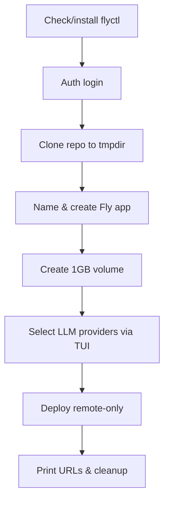
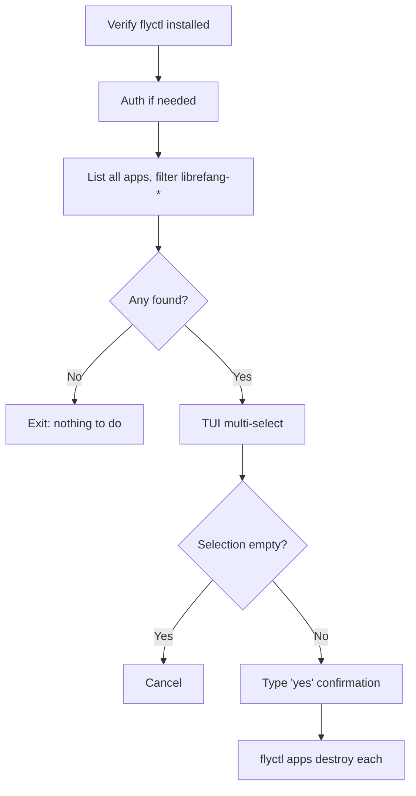

# deploy — fly

# deploy/fly — Fly.io Deployment Module

One-command deploy and teardown for LibreFang on Fly.io. This module contains three files: an interactive install script, an uninstall script, and the Fly.io app configuration template.

## Files

| File | Purpose |
|------|---------|
| `deploy.sh` | Bootstrap a new LibreFang instance on Fly.io from a clean shell |
| `uninstall.sh` | Discover and destroy LibreFang apps on your Fly.io account |
| `fly.toml` | App definition consumed by `flyctl deploy` |

## Public Usage

Both scripts are designed to be piped directly from the GitHub raw URL:

```bash
# Deploy
curl -sL https://raw.githubusercontent.com/librefang/librefang/main/deploy/fly/deploy.sh | bash

# Uninstall
curl -sL https://raw.githubusercontent.com/librefang/librefang/main/deploy/fly/uninstall.sh | bash
```

## deploy.sh — Step-by-Step Flow

The script runs under `set -euo pipefail` and orchestrates eight sequential phases:



### Phase Details

**1. flyctl bootstrap**
Checks `command -v flyctl`. If missing, runs the official `fly.io/install.sh` and prepends `~/.fly/bin` to `PATH`.

**2. Authentication**
Runs `flyctl auth whoami` to detect an existing session. Falls back to `flyctl auth login`, which opens a browser for OAuth.

**3. Repository clone**
Creates a temporary directory via `mktemp -d`, then `git clone --depth 1` of the main repo into it. This is necessary because the deploy uses `--remote-only`, which requires a full project checkout for the remote builder to read `fly.toml` and the Dockerfile context.

**4. App naming & creation**
Enters an interactive loop:
- If the user provides a custom name, it is sanitized: lowercased, non-alphanumeric characters replaced with `-`, leading/trailing dashes stripped, consecutive dashes collapsed.
- If left empty, generates `librefang-<8 hex chars>` via `openssl rand -hex 4`.
- Calls `flyctl apps create <name> --machines`. On failure (name taken), re-prompts.
- After successful creation, patches `deploy/fly/fly.toml` in the cloned working tree with `sed` to replace the `app = ` line with the chosen name.

**5. Persistent volume**
Creates a volume named `librefang_data` in region `nrt` (Tokyo), 1 GB. This volume is referenced by the `[mounts]` block in `fly.toml` and mounted at `/data`.

**6. LLM provider secret configuration**
Displays a custom TUI multi-select (see [TUI Implementation](#tui-implementation) below). For each selected provider, prompts for the API key and calls `flyctl secrets set`.

The supported providers and their environment variable names:

| Provider | Secret Key |
|----------|------------|
| OpenAI | `OPENAI_API_KEY` |
| Anthropic | `ANTHROPIC_API_KEY` |
| Google Gemini | `GEMINI_API_KEY` |
| Groq | `GROQ_API_KEY` |
| DeepSeek | `DEEPSEEK_API_KEY` |
| OpenRouter | `OPENROUTER_API_KEY` |
| Mistral | `MISTRAL_API_KEY` |
| xAI / Grok | `XAI_API_KEY` |

**7. Deploy**
```bash
flyctl deploy --app "$APP_NAME" --config deploy/fly/fly.toml --remote-only
```
`--remote-only` forces Fly.io to build the image on their infrastructure rather than locally, avoiding the need for a local Docker daemon.

**8. Output & cleanup**
Prints the dashboard URL (`https://<app>.fly.dev`), the health endpoint (`/api/health`), and the dashboard management command. Removes the temporary clone directory.

## uninstall.sh — Flow



App discovery uses `flyctl apps list --json` piped through a Python one-liner that filters names starting with `librefang`. Destruction requires a literal `yes` confirmation prompt. Each selected app is destroyed with `flyctl apps destroy <name> --yes`, which also removes associated volumes and secrets.

## TUI Implementation

Both scripts implement an identical interactive multi-select pattern via the `tui_multiselect` function. Key mechanics:

- **Cursor hiding**: ANSI `\033[?25l` hides the cursor on entry; a `trap` on `RETURN` restores it with `\033[?25h`.
- **Input handling**: Uses `read -rsn1` for single-character, no-echo reads from `/dev/tty` (critical for piped execution). Arrow keys are detected as escape sequences — `\x1b[A` (up) and `\x1b[B` (down) — by reading subsequent bytes with a 0.1s timeout.
- **Controls**: `↑/↓` or `k/j` navigate, `space` toggles, `enter` confirms (auto-selects the highlighted item if nothing else is toggled), `q` or `esc` skips/cancels.
- **State**: A `selected` array of 0/1 flags parallel to the items array. On exit, populates the global `SELECTED_INDICES` array with indices where the flag is 1.
- **Redraw**: On each keypress, moves cursor up N lines (`printf "\033[%dA" "$count"`) and re-renders the full menu.

The `draw_menu` inner function is redefined per-call, closing over the specific `TUI_ITEMS`/`PROVIDER_NAMES` arrays in scope.

## fly.toml — Configuration Reference

```toml
app = "librefang"              # Overwritten by deploy.sh with the actual app name
primary_region = "nrt"         # Tokyo
```

| Section | Key | Value | Notes |
|---------|-----|-------|-------|
| `[build]` | `image` | `ghcr.io/librefang/librefang:latest` | Pre-built OCI image; no Dockerfile build needed |
| `[env]` | `LIBREFANG_HOME` | `/data` | Matches the volume mount destination |
| `[env]` | `LIBREFANG_LISTEN` | `0.0.0.0:4545` | Must match `internal_port` |
| `[env]` | `LIBREFANG_ALLOW_NO_AUTH` | `1` | **Intentionally open for demo.** Remove and set `LIBREFANG_API_KEY` for private deployments |
| `[http_service]` | `force_https` | `true` | Automatic HTTP → HTTPS redirect |
| `[http_service]` | `auto_stop_machines` | `"suspend"` | Suspend rather than destroy idle machines |
| `[http_service]` | `auto_start_machines` | `true` | Wake on incoming request |
| `[http_service]` | `min_machines_running` | `1` | Always keep one warm replica |
| `[mounts]` | `source` → `destination` | `librefang_data` → `/data` | References the volume created in deploy phase 5 |
| `[[vm]]` | `memory` / `cpu_kind` / `cpus` | `256mb` / `shared` / `1` | Minimum viable sizing |

### Security Note

The default `fly.toml` ships with `LIBREFANG_ALLOW_NO_AUTH = "1"`, making the instance publicly accessible without an API key. This matches the live public demo configuration. For private deployments, remove that line and set a secret instead:

```bash
flyctl secrets set LIBREFANG_API_KEY=your-secret --app your-app-name
```

## Logging Helpers

All three files share four identical output functions:

| Function | Prefix | Color | Stream | Behavior |
|----------|--------|-------|--------|----------|
| `info` | `→` | Blue | stdout | Informational step |
| `ok` | `✓` | Green | stdout | Success confirmation |
| `warn` | `⚠` | Yellow | stdout | Non-fatal warning |
| `err` | `✗` | Red | stderr | **Calls `exit 1`** |

## Environment Requirements

- **flyctl** — auto-installed by `deploy.sh` if missing; `uninstall.sh` requires pre-installation
- **bash** with `set -euo pipefail` support (bash 4.0+ for associative arrays used in TUI)
- **git** — for shallow clone in deploy
- **openssl** — for random name generation
- **python3** — used only in `uninstall.sh` for JSON parsing of `flyctl apps list`
- **curl** — for flyctl bootstrap and piping the script itself
- A `/dev/tty` device — required for interactive TUI and all `read` prompts (scripts are designed to work even when piped through `curl | bash`)