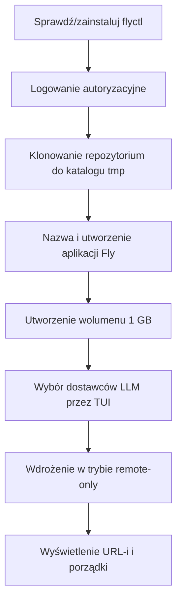
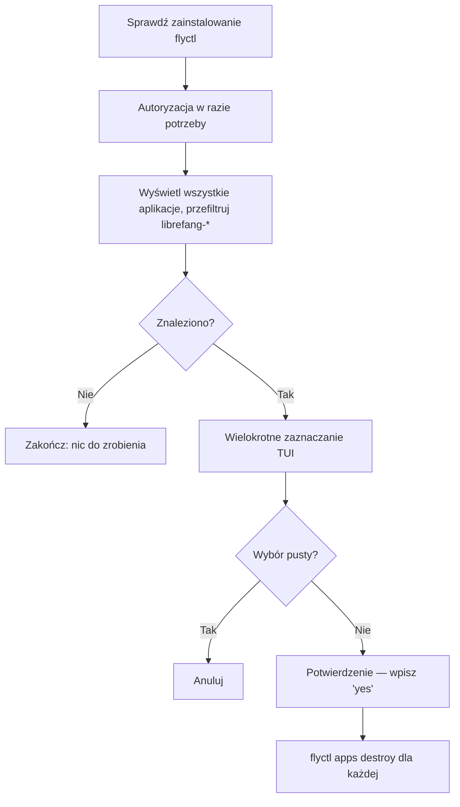

# deploy — fly

# deploy/fly — Moduł wdrożeniowy Fly.io

Jednokomendowe wdrożenie i usuwanie LibreFang na Fly.io. Ten moduł zawiera trzy pliki: interaktywny skrypt instalacyjny, skrypt odinstalowujący oraz szablon konfiguracji aplikacji Fly.io.

## Pliki

| Plik | Przeznaczenie |
|------|---------------|
| `deploy.sh` | Inicjalizacja nowej instancji LibreFang na Fly.io z czystej powłoki |
| `uninstall.sh` | Wykrywanie i usuwanie aplikacji LibreFang z Twojego konta Fly.io |
| `fly.toml` | Definicja aplikacji wykorzystywana przez `flyctl deploy` |

## Użytek publiczny

Oba skrypty są zaprojektowane tak, aby można je było bezpośrednio przesyłać potokowo z surowego adresu URL GitHub:

```bash
# Wdrożenie
curl -sL https://raw.githubusercontent.com/librefang/librefang/main/deploy/fly/deploy.sh | bash

# Odinstalowanie
curl -sL https://raw.githubusercontent.com/librefang/librefang/main/deploy/fly/uninstall.sh | bash
```

## deploy.sh — Krok po kroku

Skrypt uruchamiany jest z opcją `set -euo pipefail` i koordynuje osiem sekwencyjnych faz:



### Szczegóły faz

**1. Bootstrap flyctl**
Sprawdza `command -v flyctl`. Jeśli brak, uruchamia oficjalny `fly.io/install.sh` i dodaje `~/.fly/bin` na początek `PATH`.

**2. Autoryzacja**
Uruchamia `flyctl auth whoami` w celu wykrycia istniejącej sesji. W razie braku przechodzi do `flyctl auth login`, co otwiera przeglądarkę do autoryzacji OAuth.

**3. Klonowanie repozytorium**
Tworzy katalog tymczasowy przez `mktemp -d`, następnie wykonuje `git clone --depth 1` głównego repozytorium. Jest to konieczne, ponieważ wdrożenie używa `--remote-only`, co wymaga pełnego pobrania projektu, aby zdalny builder mógł odczytać `fly.toml` i kontekst Dockerfile.

**4. Nazwanie i utworzenie aplikacji**
Wchodzi w interaktywną pętlę:
- Jeśli użytkownik poda niestandardową nazwę, jest ona sanitzowana: zamiana na małe litery, znaki niealfanumeryczne zastępowane przez `-`, usuwanie początkowych/końcowych myślników, zwijanie powtórzonych myślników.
- Jeśli pozostanie pusta, generuje `librefang-<8 znaków hex>` przez `openssl rand -hex 4`.
- Wywołuje `flyctl apps create <nazwa> --machines`. W przypadku błędu (nazwa zajęta) — ponownie pyta.
- Po pomyślnym utworzeniu, poprawia `deploy/fly/fly.toml` w sklonowanym drzewie roboczym za pomocą `sed`, zastępując linię `app = ` wybraną nazwą.

**5. Wolumen trwały**
Tworzy wolumen o nazwie `librefang_data` w regionie `nrt` (Tokio), o rozmiarze 1 GB. Ten wolumen jest referencjonowany przez blok `[mounts]` w `fly.toml` i montowany w `/data`.

**6. Konfiguracja kluczy tajnych dostawców LLM**
Wyświetla niestandardowe wielokrotne zaznaczanie TUI (patrz [Implementacja TUI](#implementacja-tui) poniżej). Dla każdego wybranego dostawcy prosi o klucz API i wywołuje `flyctl secrets set`.

Obsługiwani dostawcy i nazwy ich zmiennych środowiskowych:

| Dostawca | Klucz tajny |
|----------|-------------|
| OpenAI | `OPENAI_API_KEY` |
| Anthropic | `ANTHROPIC_API_KEY` |
| Google Gemini | `GEMINI_API_KEY` |
| Groq | `GROQ_API_KEY` |
| DeepSeek | `DEEPSEEK_API_KEY` |
| OpenRouter | `OPENROUTER_API_KEY` |
| Mistral | `MISTRAL_API_KEY` |
| xAI / Grok | `XAI_API_KEY` |

**7. Wdrożenie**
```bash
flyctl deploy --app "$APP_NAME" --config deploy/fly/fly.toml --remote-only
```
`--remote-only` wymusza budowanie obrazu przez Fly.io na ich infrastrukturze, zamiast lokalnie, co eliminuje konieczność posiadania lokalnego demona Dockera.

**8. Wynik i porządki**
Wyświetla URL panelu (`https://<app>.fly.dev`), punkt kontrolny zdrowia (`/api/health`) oraz komendę zarządzania panelem. Usuwa tymczasowy katalog klonu.

## uninstall.sh — Przepływ



Wykrywanie aplikacji używa `flyctl apps list --json` przesyłane potokowo przez jednolinijkowy skrypt Pythona, który filtruje nazwy zaczynające się od `librefang`. Usunięcie wymaga dosłownego potwierdzenia wpisaniem `yes`. Każda wybrana aplikacja jest usuwana przez `flyctl apps destroy <nazwa> --yes`, co usuwa również powiązane wolumeny i klucze tajne.

## Implementacja TUI

Oba skrypty implementują identyczny wzorzec interaktywnego wielokrotnego zaznaczania za pomocą funkcji `tui_multiselect`. Kluczowe mechaniki:

- **Ukrywanie kursora**: ANSI `\033[?25l` ukrywa kursor przy wejściu; `trap` na `RETURN` przywraca go przez `\033[?25h`.
- **Obsługa wejścia**: Używa `read -rsn1` do odczytu pojedynczych znaków bez echa z `/dev/tty` (istotne przy wykonywaniu przez potok). Klawisze strzałek są wykrywane jako sekwencje ucieczki — `\x1b[A` (w górę) i `\x1b[B` (w dół) — poprzez odczyt kolejnych bajtów z limitem czasu 0,1 s.
- **Sterowanie**: `↑/↓` lub `k/j` nawigacja, `spacja` przełącza zaznaczenie, `enter` potwierdza (automatycznie zaznacza podświetloną pozycję, jeśli nic innego nie jest zaznaczone), `q` lub `esc` pomija/anuluje.
- **Stan**: Tablica `selected` flag 0/1 równoległa do tablicy elementów. Przy wyjściu wypełnia globalną tablicę `SELECTED_INDICES` indeksami, dla których flaga wynosi 1.
- **Ponowne rysowanie**: Przy każdym naciśnięciu klawisza przesuwa kursor w górę o N linii (`printf "\033[%dA" "$count"`) i renderuje pełne menu od nowa.

Wewnętrzna funkcja `draw_menu` jest redefiniowana przy każdym wywołaniu, zamykając w sobie specyficzne tablice `TUI_ITEMS`/`PROVIDER_NAMES` w zakresie.

## fly.toml — Odniesienie konfiguracji

```toml
app = "librefang"              # Nadpisywane przez deploy.sh rzeczywistą nazwą aplikacji
primary_region = "nrt"         # Tokio
```

| Sekcja | Klucz | Wartość | Uwagi |
|--------|-------|---------|-------|
| `[build]` | `image` | `ghcr.io/librefang/librefang:latest` | Gotowy obraz OCI; nie wymaga budowania z Dockerfile |
| `[env]` | `LIBREFANG_HOME` | `/data` | Odpowiada punktowi montowania wolumenu |
| `[env]` | `LIBREFANG_LISTEN` | `0.0.0.0:4545` | Musi odpowiadać `internal_port` |
| `[env]` | `LIBREFANG_ALLOW_NO_AUTH` | `1` | **Intencjonalnie otwarte na potrzeby demonstracji.** Usuń i ustaw `LIBREFANG_API_KEY` dla prywatnych wdrożeń |
| `[http_service]` | `force_https` | `true` | Automatyczne przekierowanie HTTP → HTTPS |
| `[http_service]` | `auto_stop_machines` | `"suspend"` | Uśpienie zamiast usuwania bezczynnych maszyn |
| `[http_service]` | `auto_start_machines` | `true` | Wybudzenie przy nadchodzącym żądaniu |
| `[http_service]` | `min_machines_running` | `1` | Zawsze utrzymuj jedną cieplą replikę |
| `[mounts]` | `source` → `destination` | `librefang_data` → `/data` | Referencja do wolumenu utworzonego w fazie 5 wdrożenia |
| `[[vm]]` | `memory` / `cpu_kind` / `cpus` | `256mb` / `shared` / `1` | Minimalne żywotne wymiary |

### Uwaga dotycząca bezpieczeństwa

Domyślny `fly.toml` jest dostarczany z `LIBREFANG_ALLOW_NO_AUTH = "1"`, co sprawia, że instancja jest publicznie dostępna bez klucza API. Jest to zgodne z konfiguracją publicznej demonstracji na żywo. W przypadku wdrożeń prywatnych usuń tę linię i ustaw klucz tajny:

```bash
flyctl secrets set LIBREFANG_API_KEY=twój-sekret --app nazwa-twojej-aplikacji
```

## Funkcje pomocnicze logowania

Wszystkie trzy pliki współdzielą cztery identyczne funkcje wyjściowe:

| Funkcja | Prefiks | Kolor | Strumień | Zachowanie |
|---------|---------|-------|----------|------------|
| `info` | `→` | Niebieski | stdout | Informacyjny krok |
| `ok` | `✓` | Zielony | stdout | Potwierdzenie sukcesu |
| `warn` | `⚠` | Żółty | stdout | Niekrytyczne ostrzeżenie |
| `err` | `✗` | Czerwony | stderr | **Wywołuje `exit 1`** |

## Wymagania środowiskowe

- **flyctl** — automatycznie instalowany przez `deploy.sh` w razie braku; `uninstall.sh` wymaga wcześniejszej instalacji
- **bash** z obsługą `set -euo pipefail` (bash 4.0+ ze względu na tablice asocjacyjne używane w TUI)
- **git** — do płytkiego klonowania podczas wdrożenia
- **openssl** — do generowania losowej nazwy
- **python3** — używany tylko w `uninstall.sh` do analizy JSON z `flyctl apps list`
- **curl** — do bootstrapa flyctl i przesyłania potokowego samego skryptu
- Urządzenie `/dev/tty` — wymagane dla interaktywnego TUI i wszystkich promptów `read` (skrypty są zaprojektowane tak, aby działać nawet gdy uruchamiane przez `curl | bash`)
