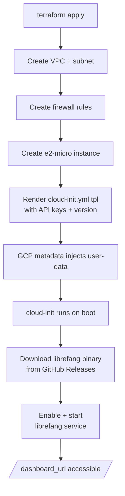

# deploy — gcp

# deploy — gcp

Terraform module that provisions a single GCP `e2-micro` instance running LibreFang, fully within GCP's always-free tier. The deployment is self-contained: Terraform creates the network, firewall, and compute instance, then hands off to a cloud-init template that installs the LibreFang binary and starts a hardened systemd service.

## What Gets Created

| Resource | Purpose |
|----------|---------|
| `google_compute_network.librefang` | Dedicated VPC (`10.0.1.0/24` subnet) |
| `google_compute_firewall.allow_ssh` | Inbound TCP 22 from `0.0.0.0/0` |
| `google_compute_firewall.allow_http` | Inbound TCP 4545 from `0.0.0.0/0` |
| `google_compute_instance.librefang` | `e2-micro` VM, Ubuntu 24.04 LTS, 30 GB standard disk |

The instance receives an ephemeral public IP via its `access_config` block. No load balancer or Cloud DNS is provisioned — access is by IP directly.

## Deployment Flow



## Key Files

### `main.tf` — Infrastructure definition

Contains the four resources listed above plus the provider configuration. The provider is pinned to `~> 5.0` of the Google Terraform provider and uses `var.project_id`, `var.region`, and `var.zone` for project scoping.

The instance metadata block is the integration point between Terraform and cloud-init:

```hcl
metadata = {
  ssh-keys  = "librefang:${file(pathexpand(var.ssh_pub_key_path))}"
  user-data = templatefile("${path.module}/cloud-init.yml.tpl", {
    librefang_version = var.librefang_version
    groq_api_key      = var.groq_api_key
    openai_api_key    = var.openai_api_key
    anthropic_api_key = var.anthropic_api_key
  })
}
```

The `templatefile()` call substitutes four variables into the cloud-init template at apply time. API keys are passed as environment variables into the systemd unit — they are never written to disk in plaintext files.

### `cloud-init.yml.tpl` — VM provisioning

Runs on first boot and performs four phases:

1. **User setup** — Creates the `librefang` user with passwordless sudo.
2. **Package install** — Installs `curl`, `jq`, `htop`, `fail2ban`.
3. **Systemd unit** — Writes `/etc/systemd/system/librefang.service` with:
   - `LIBREFANG_HOME=/data` as the data directory
   - `LIBREFANG_BIND=0.0.0.0:4545` to listen on all interfaces
   - API keys injected as `Environment=` entries
   - Hardening directives: `ProtectSystem=strict`, `PrivateTmp`, `NoNewPrivileges`, write access only to `/data`
4. **Binary install** — Downloads the release tarball from GitHub, extracting the correct architecture (`x86_64` or `aarch64`), then enables and starts the service.

The version resolution logic supports two modes:

- **`latest`** (default) — Queries the GitHub API to find the newest release asset matching the detected architecture.
- **Pinned version** (e.g., `v0.4.2-20260314`) — Constructs a direct download URL, bypassing the API call entirely.

### `variables.tf` — Configuration inputs

| Variable | Type | Default | Notes |
|----------|------|---------|-------|
| `project_id` | `string` | *(required)* | Target GCP project |
| `region` | `string` | `us-central1` | Must be a free-tier-eligible region |
| `zone` | `string` | `us-central1-a` | |
| `ssh_pub_key_path` | `string` | `~/.ssh/id_rsa.pub` | Path expanded via `pathexpand()` |
| `librefang_version` | `string` | `latest` | Release tag or `latest` |
| `groq_api_key` | `string` | `""` | Marked `sensitive` |
| `openai_api_key` | `string` | `""` | Marked `sensitive` |
| `anthropic_api_key` | `string` | `""` | Marked `sensitive` |

At least one API key must be non-empty for LibreFang to function. All three are passed through to cloud-init regardless of whether they're set — empty values simply result in empty environment variables, which LibreFang ignores.

### `outputs.tf` — Post-deploy access points

Three outputs are emitted after `terraform apply`:

- **`external_ip`** — Raw public IP of the instance.
- **`ssh_command`** — Ready-to-run SSH command (`ssh librefang@<ip>`).
- **`dashboard_url`** — Full URL to the dashboard/API (`http://<ip>:4545`).

All three derive from `google_compute_instance.librefang.network_interface[0].access_config[0].nat_ip`.

## Usage

```bash
cd deploy/gcp

# Authenticate GCP provider
gcloud auth application-default login

# Configure
cp terraform.tfvars.example terraform.tfvars
# Edit terraform.tfvars: set project_id and at least one API key

# Deploy
terraform init
terraform apply
```

The apply takes approximately 2 minutes for infrastructure creation. Cloud-init runs asynchronously on first boot and requires an additional ~60 seconds before the service is reachable. Verify with:

```bash
curl http://<external_ip>:4545/api/health
```

To destroy all resources:

```bash
terraform destroy
```

## Free Tier Constraints

This module is designed to stay within GCP's always-free tier limits:

| Resource | Free Tier Limit | This Deployment |
|----------|----------------|-----------------|
| `e2-micro` instance | 1 per month (in `us-central1`, `us-east1`, `us-west1`) | 1 |
| `pd-standard` disk | 30 GB/month | 30 GB |
| Egress | 1 GB/month (North America) | Minimal (API responses only) |

Deploying to a non-eligible region or scaling beyond a single instance will incur charges. Egress is the main variable cost — heavy LLM response traffic exceeding 1 GB/month will be billed.

## Security Posture

- **Network exposure** — SSH (22) and HTTP (4545) are open to `0.0.0.0/0`. For production, restrict `source_ranges` to known CIDRs.
- **SSH access** — Key-based only, injected via metadata. Password authentication is not configured.
- **fail2ban** — Installed by cloud-init to brute-force-protect SSH.
- **Service isolation** — The `librefang.service` unit runs with `ProtectSystem=strict`, `NoNewPrivileges=true`, and `PrivateTmp=true`. The process can only write to `/data`.
- **Secret handling** — API keys flow through Terraform sensitive variables → cloud-init template → systemd `Environment=` directives. They are visible in the instance metadata API to anyone with project access, and in the rendered systemd unit on the VM. For stronger isolation, consider GCP Secret Manager.

## How This Connects to LibreFang

This module has no direct code dependencies on the LibreFang application codebase. It deploys a pre-built binary from GitHub Releases (`librefang/librefang`). The only contract is:

1. The release artifact must be a `.tar.gz` containing a single `librefang` binary at the root.
2. The binary must accept `LIBREFANG_HOME` and `LIBREFANG_BIND` environment variables.
3. `librefang start` must be the command to launch the server.

Pin `librefang_version` to a specific tag when deploying against a known-good release rather than tracking `latest`.

## Customization Points

**Different region/zone** — Set `region` and `zone` in `terraform.tfvars`. Must be free-tier-eligible for zero-cost operation.

**Larger disk** — Modify `boot_disk.initialize_params.size` in `main.tf`. Anything above 30 GB exits the free tier.

**Multiple API keys** — Set any combination of the three key variables. LibreFang will use whichever providers have non-empty keys.

**Custom SSH key path** — Set `ssh_pub_key_path` to any local public key file.

**Service port** — Not currently parameterized. To change the port, update `LIBREFANG_BIND` in `cloud-init.yml.tpl`, the firewall port in `main.tf`, and the health check URL in your verification step.