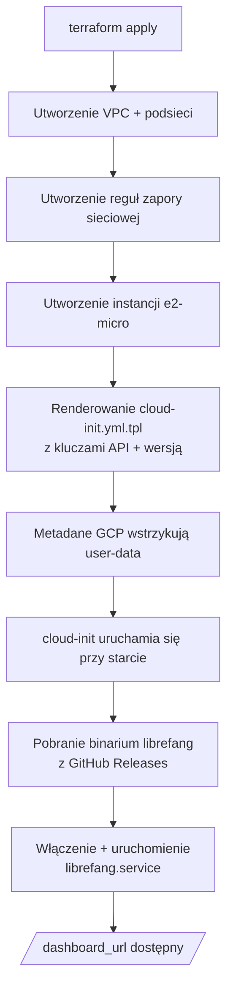

# deploy — gcp

# deploy — gcp

Moduł Terraform, który udostępnia pojedynczą instancję GCP `e2-micro` uruchamiającą LibreFang, w pełni w ramach bezpłatnego warstwy GCP. Wdrożenie jest samowystarczalne: Terraform tworzy sieć, zaporę sieciową i instancję obliczeniową, a następnie przekazuje sterowanie szablonowi cloud-init, który instaluje binarium LibreFang i uruchamia utwardzoną usługę systemd.

## Co zostaje utworzone

| Zasób | Przeznaczenie |
|----------|---------|
| `google_compute_network.librefang` | Dedykowana sieć VPC (`10.0.1.0/24` podsieć) |
| `google_compute_firewall.allow_ssh` | Ruch przychodzący TCP 22 z `0.0.0.0/0` |
| `google_compute_firewall.allow_http` | Ruch przychodzący TCP 4545 z `0.0.0.0/0` |
| `google_compute_instance.librefang` | Maszyna wirtualna `e2-micro`, Ubuntu 24.04 LTS, 30 GB standardowy dysk |

Instancja otrzymuje tymczasowy publiczny adres IP poprzez blok `access_config`. Nie jest udostępniany żaden load balancer ani Cloud DNS — dostęp odbywa się bezpośrednio po adresie IP.

## Przebieg wdrożenia



## Kluczowe pliki

### `main.tf` — Definicja infrastruktury

Zawiera cztery zasoby wymienione powyżej oraz konfigurację dostawcy. Dostawca jest przypięty do wersji `~> 5.0` dostawcy Google Terraform i używa `var.project_id`, `var.region` oraz `var.zone` do określenia zakresu projektu.

Blok metadanych instancji jest punktem integracji między Terraform a cloud-init:

```hcl
metadata = {
  ssh-keys  = "librefang:${file(pathexpand(var.ssh_pub_key_path))}"
  user-data = templatefile("${path.module}/cloud-init.yml.tpl", {
    librefang_version = var.librefang_version
    groq_api_key      = var.groq_api_key
    openai_api_key    = var.openai_api_key
    anthropic_api_key = var.anthropic_api_key
  })
}
```

Wywołanie `templatefile()` podstawia cztery zmienne w szablon cloud-init w momencie apply. Klucze API są przekazywane jako zmienne środowiskowe do jednostki systemd — nigdy nie są zapisywane na dysku w plikach czystotekstowych.

### `cloud-init.yml.tpl` — Inicjalizacja maszyny wirtualnej

Uruchamia się przy pierwszym uruchomieniu i wykonuje cztery fazy:

1. **Konfiguracja użytkownika** — Tworzy użytkownika `librefang` z sudo bez hasła.
2. **Instalacja pakietów** — Instaluje `curl`, `jq`, `htop`, `fail2ban`.
3. **Jednostka systemd** — Zapisuje `/etc/systemd/system/librefang.service` z:
   - `LIBREFANG_HOME=/data` jako katalogiem danych
   - `LIBREFANG_BIND=0.0.0.0:4545` nasłuchującym na wszystkich interfejsach
   - Kluczami API wstrzykniętymi jako wpisy `Environment=`
   - Dyrektywami utwardzającymi: `ProtectSystem=strict`, `PrivateTmp`, `NoNewPrivileges`, dostęp do zapisu tylko w `/data`
4. **Instalacja binarium** — Pobiera archiwum wydania z GitHub, wypakowując odpowiednią architekturę (`x86_64` lub `aarch64`), następnie włącza i uruchamia usługę.

Logika rozpoznawania wersji obsługuje dwa tryby:

- **`latest`** (domyślna) — Odpytuje API GitHub w celu znalezienia najnowszego wydania pasującego do wykrytej architektury.
- **Przypięta wersja** (np. `v0.4.2-20260314`) — Konstruuje bezpośredni URL pobierania, pomijając wywołanie API całkowicie.

### `variables.tf` — Wejścia konfiguracyjne

| Zmienna | Typ | Domyślna | Uwagi |
|----------|------|---------|-------|
| `project_id` | `string` | *(wymagana)* | Docelowy projekt GCP |
| `region` | `string` | `us-central1` | Musi być regionem kwalifikującym się do warstwy bezpłatnej |
| `zone` | `string` | `us-central1-a` | |
| `ssh_pub_key_path` | `string` | `~/.ssh/id_rsa.pub` | Ścieżka rozszerzana przez `pathexpand()` |
| `librefang_version` | `string` | `latest` | Tag wydania lub `latest` |
| `groq_api_key` | `string` | `""` | Oznaczona jako `sensitive` |
| `openai_api_key` | `string` | `""` | Oznaczona jako `sensitive` |
| `anthropic_api_key` | `string` | `""` | Oznaczona jako `sensitive` |

Przynajmniej jeden klucz API musi być niepusty, aby LibreFang mógł działać. Wszystkie trzy są przekazywane do cloud-init niezależnie od tego, czy są ustawione — puste wartości po prostu skutkują pustymi zmiennymi środowiskowymi, które LibreFang ignoruje.

### `outputs.tf` — Punkty dostępu po wdrożeniu

Po wykonaniu `terraform apply` emitowane są trzy wyjścia:

- **`external_ip`** — Surowy publiczny adres IP instancji.
- **`ssh_command`** — Gotowa do uruchomienia komenda SSH (`ssh librefang@<ip>`).
- **`dashboard_url`** — Pełny URL do dashboardu/API (`http://<ip>:4545`).

Wszystkie trzy pochodzą z `google_compute_instance.librefang.network_interface[0].access_config[0].nat_ip`.

## Użycie

```bash
cd deploy/gcp

# Uwierzytelnienie dostawcy GCP
gcloud auth application-default login

# Konfiguracja
cp terraform.tfvars.example terraform.tfvars
# Edytuj terraform.tfvars: ustaw project_id i przynajmniej jeden klucz API

# Wdrożenie
terraform init
terraform apply
```

Zastosowanie apply trwa około 2 minut na utworzenie infrastruktury. Cloud-init uruchamia się asynchronicznie przy pierwszym starcie i wymaga dodatkowych ~60 sekund, zanim usługa staje się osiągalna. Weryfikacja:

```bash
curl http://<external_ip>:4545/api/health
```

Aby zniszczyć wszystkie zasoby:

```bash
terraform destroy
```

## Ograniczenia warstwy bezpłatnej

Ten moduł jest zaprojektowany tak, aby mieścić się w limitach bezpłatnej warstwy GCP:

| Zasób | Limit warstwy bezpłatnej | To wdrożenie |
|----------|----------------|-----------------|
| instancja `e2-micro` | 1 na miesiąc (w `us-central1`, `us-east1`, `us-west1`) | 1 |
| dysk `pd-standard` | 30 GB/miesiąc | 30 GB |
| Ruch wychodzący | 1 GB/miesiąc (Ameryka Północna) | Minimalny (tylko odpowiedzi API) |

Wdrożenie do regionu niew kwalifikującego się do warstwy bezpłatnej lub skalowanie powyżej pojedynczej instancji spowoduje naliczenie opłat. Ruch wychodzący jest głównym kosztem zmiennym — intensywny ruch odpowiedzi LLM przekraczający 1 GB/miesiąc będzie płatny.

## Postawa bezpieczeństwa

- **Ekspozycja sieciowa** — SSH (22) i HTTP (4545) są otwarte dla `0.0.0.0/0`. W środowisku produkcyjnym ogranicz `source_ranges` do znanych CIDR.
- **Dostęp SSH** — Tylko oparty na kluczach, wstrzykiwany przez metadane. Uwierzytelnianie hasłem nie jest skonfigurowane.
- **fail2ban** — Zainstalowany przez cloud-init w celu ochrony SSH przed atakami brute-force.
- **Izolacja usługi** — Jednostka `librefang.service` działa z `ProtectSystem=strict`, `NoNewPrivileges=true` i `PrivateTmp=true`. Proces może zapisywać tylko do `/data`.
- **Obsługa sekretów** — Klucze API przepływają przez zmienne sensitive Terraform → szablon cloud-init → dyrektywy `Environment=` systemd. Są widoczne w API metadanych instancji dla każdego z dostępem do projektu oraz w renderowanej jednostce systemd na maszynie wirtualnej. Dla silniejszej izolacji rozważ GCP Secret Manager.

## Jak to łączy się z LibreFang

Ten moduł nie ma bezpośrednich zależności kodowych od bazy kodu aplikacji LibreFang. Wdraża prekompilowane binarium z GitHub Releases (`librefang/librefang`). Jedyną umową jest:

1. Artefakt wydania musi być `.tar.gz` zawierającym pojedyncze binarium `librefang` w katalogu głównym.
2. Binarium musi akceptować zmienne środowiskowe `LIBREFANG_HOME` i `LIBREFANG_BIND`.
3. `librefang start` musi być komendą uruchamiającą serwer.

Przypnij `librefang_version` do konkretnego tagu podczas wdrażania wobec sprawdzonego wydania zamiast śledzenia `latest`.

## Punkty dostosowania

**Inny region/strefa** — Ustaw `region` i `zone` w `terraform.tfvars`. Musi być kwalifikujący się do warstwy bezpłatnej dla operacji bezkosztowych.

**Większy dysk** — Zmień `boot_disk.initialize_params.size` w `main.tf`. Powyżej 30 GB opuszcza warstwę bezpłatną.

**Wiele kluczy API** — Ustaw dowolną kombinację trzech zmiennych kluczy. LibreFang użyje tych dostawców, które mają niepuste klucze.

**Niestandardowa ścieżka klucza SSH** — Ustaw `ssh_pub_key_path` na dowolny lokalny plik klucza publicznego.

**Port usługi** — Obecnie nie sparametryzowany. Aby zmienić port, zaktualizuj `LIBREFANG_BIND` w `cloud-init.yml.tpl`, port zapory w `main.tf` oraz URL sprawdzenia zdrowia w kroku weryfikacji.
