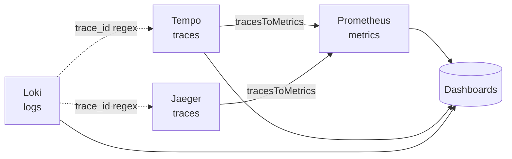

# deploy — grafana

# deploy/grafana

Grafana observability stack for LibreFang. This module provisions four datasources (Prometheus, Tempo, Loki, Jaeger) and ships five pre-built dashboards covering system health, LLM/token consumption, HTTP API performance, cost/budget, and local Ollama GPU usage. Everything is file-provisioned — no manual Grafana UI configuration is required after deployment.

## Module layout

```
deploy/grafana/
├── dashboards/                       # JSON dashboard definitions (mounted into the container)
│   ├── librefang.json                # uid: librefang-overview
│   ├── librefang-llm.json            # uid: librefang-llm
│   ├── librefang-http.json           # uid: librefang-http
│   ├── librefang-cost.json           # uid: librefang-cost
│   └── ollama.json                   # uid: ollama-local
└── provisioning/
    ├── dashboards/
    │   └── dashboard.yml             # File provider: watches /var/lib/grafana/dashboards
    └── datasources/
        ├── prometheus.yml            # uid: librefang-prometheus  (default)
        ├── tempo.yml                 # uid: librefang-tempo
        ├── loki.yml                  # uid: librefang-loki
        └── jaeger.yml                # uid: librefang-jaeger
```

The two directories map to Grafana's provisioning system. `provisioning/datasources/*.yml` are read once at startup and register datasources by stable UID. `provisioning/dashboards/dashboard.yml` declares a single file provider named **LibreFang** that watches `/var/lib/grafana/dashboards` and hot-reloads any JSON in that path. The dashboard JSON files in `deploy/grafana/dashboards/` are expected to be volume-mounted there by the compose/k8s setup that brings Grafana up.

## Datasources and cross-linking

The four datasources form a connected observability graph rather than four isolated panels. Cross-links are wired at the provisioning level so that navigating from a log line to a trace, or from a span to a metric, works without additional UI setup.



- **Prometheus** (`librefang-prometheus`, default) — `http://prometheus:9090`. Source for every numeric panel across all five dashboards.
- **Tempo** (`librefang-tempo`) — `http://tempo:3200`. `tracesToMetrics` is pointed back at Prometheus so a selected span can pivot to its underlying metrics. Node graph enabled.
- **Jaeger** (`librefang-jaeger`) — `http://jaeger:16686`. Same `tracesToMetrics` link to Prometheus and node graph enabled. Jaeger all-in-one serves both UI and query API on `16686`; the datasource reuses that port over the docker bridge, so the host port remains available for direct UI access.
- **Loki** (`librefang-loki`) — `http://loki:3100`. Two `derivedFields` are configured to extract a 32-hex `trace_id` from log lines and turn it into clickable links to Tempo and Jaeger. The regex (`trace_id="?([0-9a-f]{32})"?`) is intentionally inert until the daemon emits `trace_id` in log lines — provisioning is in place so no Grafana change is required when the Rust-side logging change lands.

## Dashboard catalog

Each LibreFang dashboard carries a consistent set of dashboard links in its top bar — sibling dashboards plus three external shortcuts: Tempo Explore (prefilled `{ resource.service.name="librefang" }`), Loki Explore (prefilled `{service="librefang"}`), and the standalone Jaeger UI. The `keepTime: true` flag on the Explore links preserves the current time window when pivoting.

### LibreFang Overview (`librefang-overview`)

Tags: `librefang`, `overview`. Default time range: last 1 hour.

Top-row stat strip surfaces the high-signal vitals:

| Stat | Metric | Notes |
|------|--------|-------|
| Version | `librefang_info{version}` | Rendered as `textMode: name` so the version label shows as the value |
| Uptime | `librefang_uptime_seconds` | `dtdurations` unit formats as `Xd Yh` |
| Active Agents | `librefang_agents_active` | Thresholds: green → yellow at 10 → red at 50 |
| Total Agents | `librefang_agents_total` | |
| Active Sessions | `librefang_active_sessions` | Yellow at 5, red at 20 |
| Cost Today (USD) | `librefang_cost_usd_today` | 4-decimal USD; yellow at $1, red at $10 |
| Panics | `librefang_panics_total` | Orange at 1, red at 100 |
| Restarts | `librefang_restarts_total` | Red at 1 |

Two time-series panels follow: **Panics & Restarts Over Time** and **Active vs Total Agents**. This dashboard has no template variables — it intentionally shows the global view.

### LibreFang LLM & Token Usage (`librefang-llm`)

Tags: `librefang`, `llm`, `tokens`. The deep-dive view for model consumption. Three template variables provide filtering:

- `agent` — `label_values(librefang_tokens, agent)`
- `provider` — `label_values(librefang_tokens, provider)`
- `model` — `label_values(librefang_tokens{provider=~"$provider"}, model)` (cascaded from provider)

All variables default to All (regex `.*`), support multi-select, and refresh on dashboard load (`refresh: 2`). Every panel target carries the `{agent=~"$agent",provider=~"$provider",model=~"$model"}` selector so filters apply uniformly.

Four stat panels at the top: total tokens, input tokens, output tokens, LLM calls (all 1-hour window). Below them: tokens-by-agent (stacked area), LLM calls by agent (stacked bars), input-vs-output stacked bars, tokens by provider/model (stacked area), an agent token breakdown donut, an input/output ratio donut, and **Tool Calls by Agent** as stacked bars. The tool-calls panel is the only one driven by `librefang_tool_calls`.

### LibreFang HTTP & API (`librefang-http`)

Tags: `librefang`, `http`, `api`. No template variables — fixed global view.

Built on two Prometheus series:

- `librefang_http_requests_total{method, status, path}` — counter for request volume and error rates
- `librefang_http_request_duration_seconds_bucket{path, le}` — histogram for latency

Panels:
- **HTTP Request Rate** — total `rate(...[5m])` plus per-method breakdown
- **Request Latency (p50 / p90 / p99)** — `histogram_quantile()` over the duration bucket; p50 green, p90 orange, p99 red
- **Request Rate by Status Code** — stacked area by `status` label
- **HTTP Error Rate (4xx / 5xx)** — two regex matchers `status=~"4.."` and `status=~"5.."`, colored orange/red
- **Top Endpoints by Request Count** — `topk(10, sum by (path) (increase(...[1h])))`
- **Slowest Endpoints (p99 Latency)** — `topk(10, histogram_quantile(0.99, sum by (path, le) (...)))`

### LibreFang Cost & Budget (`librefang-cost`)

Tags: `librefang`, `cost`, `budget`. Same `agent`/`provider`/`model` template variables as the LLM dashboard. Default time range extended to **last 6 hours** (vs. 1 hour elsewhere) because cost trends are more meaningful over a longer window.

This dashboard treats token consumption as the primary cost proxy. Panels:
- **Cost Today (USD)** stat with gradient thresholds: green < $1, yellow < $5, orange < $10, red ≥ $10
- **Total Tokens** and **LLM Calls** stats (1-hour window)
- **Cost Trend** time-series on `librefang_cost_usd_today`
- **Tokens by Agent** stacked area (legend sorted by last value, descending)
- **Cost by Model (token share)** donut — `sum by (provider, model)`, instant query
- **Output Tokens by Agent** horizontal bar gauge — `topk(10, librefang_tokens_output{...})`, thresholds at 10k (yellow) and 100k (red). Panel description notes output tokens are typically 3–5× more expensive than input tokens.
- **Input / Output Token Ratio** donut — two instant queries with fixed blue (input) and orange (output) colors

### Ollama (`ollama-local`)

Tags: `ollama`. 30-second auto-refresh. Local inference monitoring, completely separate from the LibreFang dashboards and carries no dashboard links to the others.

| Panel | Metric(s) |
|-------|-----------|
| Service Status | `ollama_up` (value mapping: 0 = DOWN/red, 1 = UP/green) |
| Installed Models | `ollama_models_total` |
| Loaded in VRAM | `ollama_loaded_models_total` |
| VRAM Usage by Model | `ollama_model_vram_bytes > 0` (bar gauge, max 16 GB, thresholds at 8 GB / 14 GB) |
| Model Sizes | `ollama_model_size_bytes` |
| VRAM Used (Total) | `sum(ollama_model_vram_bytes)` plus per-model breakdown |

## Metrics reference

The dashboards consume the following Prometheus series. The instrumented LibreFang daemon must expose all of these for the dashboards to render:

**Core system** (overview): `librefang_info`, `librefang_uptime_seconds`, `librefang_agents_active`, `librefang_agents_total`, `librefang_active_sessions`, `librefang_panics_total`, `librefang_restarts_total`, `librefang_cost_usd_today`

**LLM usage** (llm + cost dashboards): `librefang_tokens`, `librefang_tokens_input`, `librefang_tokens_output`, `librefang_llm_calls`, `librefang_tool_calls` — all carrying labels `{agent, provider, model}`

**HTTP** (http dashboard): `librefang_http_requests_total{method,status,path}` (counter), `librefang_http_request_duration_seconds_bucket{path,le}` (histogram)

**Ollama** (ollama dashboard): `ollama_up`, `ollama_models_total`, `ollama_loaded_models_total`, `ollama_model_vram_bytes{model}`, `ollama_model_size_bytes{model}`

## Provisioning mechanics

`provisioning/dashboards/dashboard.yml` declares one provider:

```yaml
providers:
  - name: "LibreFang"
    orgId: 1
    folder: ""
    type: file
    disableDeletion: false
    editable: true
    options:
      path: /var/lib/grafana/dashboards
      foldersFromFilesStructure: false
```

Key behaviors:
- Dashboards load flat into the root folder (no subfolder hierarchy from file structure).
- `editable: true` allows in-UI edits, but changes are not persisted back to these JSON files — the file is the source of truth on container restart.
- `disableDeletion: false` means deleting a JSON from the mounted path removes its dashboard.
- All datasource YAMLs set `editable: false`, so datasource endpoints can only be changed by editing these files and restarting Grafana.

The expected docker-compose pattern is to mount `deploy/grafana/dashboards` to `/var/lib/grafana/dashboards` and `deploy/grafana/provisioning` to `/etc/grafana/provisioning`. Grafana reads provisioning on boot and hot-reloads dashboards when files change.

## Modifying dashboards

When editing a dashboard JSON:

1. **UID stability** — the `uid` field is how dashboard links resolve (`/d/librefang-overview`, etc.). Never change a UID without updating the `links` array in every sibling dashboard.
2. **Template variable selectors** — any new panel on the llm or cost dashboards should include the full `{agent=~"$agent",provider=~"$provider",model=~"$model"}` selector so filters behave consistently.
3. **Datasource references** — panels reference datasources by UID (`librefang-prometheus`), not by name. This is intentional; it keeps dashboards portable across environments where datasource display names might differ.
4. **Schema version** — these dashboards target schema version 38–39. Bumping is safe but not required; Grafana will auto-upgrade on load.
5. **Version field** — bump the top-level `version` integer on each save to help diff tracking, though Grafana does not enforce this.