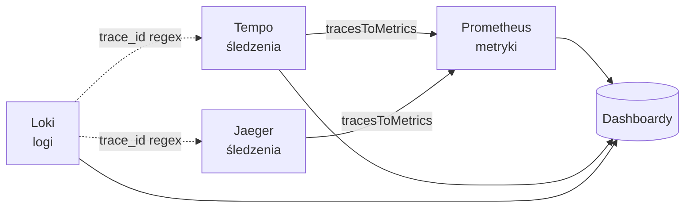

# deploy — grafana

# deploy/grafana

Stos obserwowalności Grafana dla LibreFang. Ten moduł aprowizuje cztery źródła danych (Prometheus, Tempo, Loki, Jaeger) i dostarcza pięć gotowych dashboardów obejmujących stan systemu, zużycie LLM/tokenów, wydajność HTTP API, koszty/budżet oraz lokalne wykorzystanie GPU przez Ollamę. Wszystko jest aprowizowane z plików — po wdrożeniu nie jest wymagana żadna ręczna konfiguracja w interfejsie Grafany.

## Układ modułu

```
deploy/grafana/
├── dashboards/                       # Definicje dashboardów w JSON (montowane w kontenerze)
│   ├── librefang.json                # uid: librefang-overview
│   ├── librefang-llm.json            # uid: librefang-llm
│   ├── librefang-http.json           # uid: librefang-http
│   ├── librefang-cost.json           # uid: librefang-cost
│   └── ollama.json                   # uid: ollama-local
└── provisioning/
    ├── dashboards/
    │   └── dashboard.yml             # Dostawca plikowy: obserwuje /var/lib/grafana/dashboards
    └── datasources/
        ├── prometheus.yml            # uid: librefang-prometheus  (domyślny)
        ├── tempo.yml                 # uid: librefang-tempo
        ├── loki.yml                  # uid: librefang-loki
        └── jaeger.yml                # uid: librefang-jaeger
```

Te dwa katalogi mapują się do systemu aprowizacji Grafany. Pliki `provisioning/datasources/*.yml` są odczytywane raz przy starcie i rejestrują źródła danych za pomocą stabilnych UID. Plik `provisioning/dashboards/dashboard.yml` deklaruje jednego dostawcę plikowego o nazwie **LibreFang**, który obserwuje `/var/lib/grafana/dashboards` i dynamicznie przeładowuje każdy JSON w tej ścieżce. Pliki JSON dashboardów w `deploy/grafana/dashboards/` powinny być zamontowane jako wolumeny w tej lokalizacji przez konfigurację compose/k8s uruchamiającą Grafanę.

## Źródła danych i powiązania między nimi

Cztery źródła danych tworzą połączony graf obserwowalności, a nie cztery odizolowane panele. Powiązania są skonfigurowane na poziomie aprowizacji, dzięki czemu nawigacja z wiersza logu do śledzenia lub z zakresu do metryki działa bez dodatkowej konfiguracji w interfejsie.



- **Prometheus** (`librefang-prometheus`, domyślny) — `http://prometheus:9090`. Źródło dla każdego panelu numerycznego we wszystkich pięciu dashboardach.
- **Tempo** (`librefang-tempo`) — `http://tempo:3200`. `tracesToMetrics` wskazuje z powrotem na Prometheus, aby wybrany zakres mógł przejść do powiązanych metryk. Graf węzłów włączony.
- **Jaeger** (`librefang-jaeger`) — `http://jaeger:16686`. To samo powiązanie `tracesToMetrics` do Prometheus i graf węzłów włączony. Jaeger all-in-one obsługuje zarówno interfejs, jak i API zapytań na porcie `16686`; źródło danych ponownie używa tego portu przez most docker, więc port hosta pozostaje dostępny do bezpośredniego dostępu z interfejsu.
- **Loki** (`librefang-loki`) — `http://loki:3100`. Skonfigurowano dwa `derivedFields` do wyodrębniania 32-znakowego szesnastkowego `trace_id` z wierszy logów i zamiany go na klikalne linki do Tempo i Jaeger. Wyrażenie regularne (`trace_id="?([0-9a-f]{32})"?`) jest celowo nieaktywne, dopóki demon nie zacznie emitować `trace_id` w wierszach logów — aprowizacja jest już na miejscu, więc po wprowadzeniu zmian w logowaniu po stronie Rusta nie będzie wymagana żadna modyfikacja Grafany.

## Katalog dashboardów

Każdy dashboard LibreFang ma w górnym pasku spójny zestaw linków do dashboardów — dashboardy równorzędne oraz trzy skróty zewnętrzne: Tempo Explore (wstępnie wypełnione `{ resource.service.name="librefang" }`), Loki Explore (wstępnie wypełnione `{service="librefang"}`) i samodzielny interfejs Jaeger. Flaga `keepTime: true` na linkach Explore zachowuje bieżące okno czasowe podczas przełączania.

### Przegląd LibreFang (`librefang-overview`)

Tagi: `librefang`, `overview`. Domyślny zakres czasu: ostatnia 1 godzina.

Górny pasek statystyk prezentuje kluczowe wskaźniki:

| Statystyka | Metryka | Uwagi |
|------------|---------|-------|
| Wersja | `librefang_info{version}` | Renderowana jako `textMode: name`, aby etykieta wersji wyświetlała się jako wartość |
| Czas pracy | `librefang_uptime_seconds` | Jednostka `dtdurations` formatuje jako `Xd Yh` |
| Aktywne agenty | `librefang_agents_active` | Progi: zielony → żółty przy 10 → czerwony przy 50 |
| Wszystkie agenty | `librefang_agents_total` | |
| Aktywne sesje | `librefang_active_sessions` | Żółty przy 5, czerwony przy 20 |
| Koszt dzisiaj (USD) | `librefang_cost_usd_today` | 4 miejsca po przecinku; żółty przy $1, czerwony przy $10 |
| Paniki | `librefang_panics_total` | Pomarańczowy przy 1, czerwony przy 100 |
| Restarty | `librefang_restarts_total` | Czerwony przy 1 |

Następują dwa panele szeregów czasowych: **Paniki i restarty w czasie** oraz **Aktywne vs wszystkie agenty**. Ten dashboard nie ma zmiennych szablonowych — celowo pokazuje widok globalny.

### LibreFang LLM i zużycie tokenów (`librefang-llm`)

Tagi: `librefang`, `llm`, `tokens`. Widok szczegółowy zużycia modelu. Trzy zmienne szablonowe umożliwiają filtrowanie:

- `agent` — `label_values(librefang_tokens, agent)`
- `provider` — `label_values(librefang_tokens, provider)`
- `model` — `label_values(librefang_tokens{provider=~"$provider"}, model)` (kaskadowo z provider)

Wszystkie zmienne domyślnie ustawione na Wszystkie (regex `.*`), obsługują wielokrotny wybór i odświeżają się przy ładowaniu dashboardu (`refresh: 2`). Każdy cel panelu zawiera selektor `{agent=~"$agent",provider=~"$provider",model=~"$model"}`, dzięki czemu filtry działają jednolicie.

Cztery panele statystyk na górze: tokeny całkowite, tokeny wejściowe, tokeny wyjściowe, wywołania LLM (wszystkie w oknie 1 godziny). Poniżej: tokeny według agenta (obszar skumulowany), wywołania LLM według agenta (słupki skumulowane), słupki skumulowane wejście/wyjście, tokeny według dostawcy/modelu (obszar skumulowany), pierścień podziału tokenów według agenta, pierścień stosunku wejście/wyjście oraz **Wywołania narzędzi według agenta** jako słupki skumulowane. Panel wywołań narzędzi jest jedynym napędzanym przez `librefang_tool_calls`.

### LibreFang HTTP i API (`librefang-http`)

Tagi: `librefang`, `http`, `api`. Brak zmiennych szablonowych — stały widok globalny.

Oparty na dwóch seriach Prometheus:

- `librefang_http_requests_total{method, status, path}` — licznik dla wolumenu żądań i wskaźnika błędów
- `librefang_http_request_duration_seconds_bucket{path, le}` — histogram dla opóźnień

Panele:
- **Wskaźnik żądań HTTP** — całkowity `rate(...[5m])` plus podział według metody
- **Opóźnienie żądań (p50 / p90 / p99)** — `histogram_quantile()` na bucketach czasu trwania; p50 zielony, p90 pomarańczowy, p99 czerwony
- **Wskaźnik żądań według kodu statusu** — obszar skumulowany według etykiety `status`
- **Wskaźnik błędów HTTP (4xx / 5xx)** — dwa matchery regex `status=~"4.."` i `status=~"5.."`, kolor pomarańczowy/czerwony
- **Top punktów końcowych według liczby żądań** — `topk(10, sum by (path) (increase(...[1h])))`
- **Najwolniejsze punkty końcowe (opóźnienie p99)** — `topk(10, histogram_quantile(0.99, sum by (path, le) (...)))`

### LibreFang Koszty i budżet (`librefang-cost`)

Tagi: `librefang`, `cost`, `budget`. Te same zmienne szablonowe `agent`/`provider`/`model` co na dashboardzie LLM. Domyślny zakres czasu rozszerzony do **ostatnich 6 godzin** (vs. 1 godzina w pozostałych), ponieważ trendy kosztowe są bardziej znaczące w dłuższym oknie.

Ten dashboard traktuje zużycie tokenów jako główną proxy kosztów. Panele:
- **Koszt dzisiaj (USD)** statystyka z progami gradientowymi: zielony < $1, żółty < $5, pomarańczowy < $10, czerwony ≥ $10
- **Tokeny całkowite** i **Wywołania LLM** statystyki (okno 1 godziny)
- **Trend kosztów** szereg czasowy na `librefang_cost_usd_today`
- **Tokeny według agenta** obszar skumulowany (legenda posortowana według ostatniej wartości, malejąco)
- **Koszty według modelu (udział tokenów)** pierścień — `sum by (provider, model)`, zapytanie natychmiastowe
- **Tokeny wyjściowe według agenta** poziomy pasek miernika — `topk(10, librefang_tokens_output{...})`, progi przy 10k (żółty) i 100k (czerwony). Opis panelu zaznacza, że tokeny wyjściowe są zazwyczaj 3–5× droższe niż tokeny wejściowe.
- **Stosunek tokenów wejściowych / wyjściowych** pierścień — dwa zapytania natychmiastowe z ustalonymi kolorami niebieskim (wejście) i pomarańczowym (wyjście)

### Ollama (`ollama-local`)

Tagi: `ollama`. Automatyczne odświeżanie co 30 sekund. Monitorowanie lokalnej inferencji, całkowicie oddzielone od dashboardów LibreFang i nie zawiera linków do pozostałych.

| Panel | Metryki |
|-------|---------|
| Status usługi | `ollama_up` (mapowanie wartości: 0 = WYŁĄCZONA/czerwony, 1 = WŁĄCZONA/zielony) |
| Zainstalowane modele | `ollama_models_total` |
| Załadowane w VRAM | `ollama_loaded_models_total` |
| Wykorzystanie VRAM według modelu | `ollama_model_vram_bytes > 0` (miernik słupkowy, max 16 GB, progi przy 8 GB / 14 GB) |
| Rozmiary modeli | `ollama_model_size_bytes` |
| Wykorzystanie VRAM (całkowite) | `sum(ollama_model_vram_bytes)` plus podział według modelu |

## Odniesienie metryk

Dashboardy konsumują następujące serie Prometheus. Instrumentowany demon LibreFang musi eksponować wszystkie te metryki, aby dashboardy mogły się renderować:

**System podstawowy** (przegląd): `librefang_info`, `librefang_uptime_seconds`, `librefang_agents_active`, `librefang_agents_total`, `librefang_active_sessions`, `librefang_panics_total`, `librefang_restarts_total`, `librefang_cost_usd_today`

**Zużycie LLM** (dashboardy llm + cost): `librefang_tokens`, `librefang_tokens_input`, `librefang_tokens_output`, `librefang_llm_calls`, `librefang_tool_calls` — wszystkie z etykietami `{agent, provider, model}`

**HTTP** (dashboard http): `librefang_http_requests_total{method,status,path}` (licznik), `librefang_http_request_duration_seconds_bucket{path,le}` (histogram)

**Ollama** (dashboard ollama): `ollama_up`, `ollama_models_total`, `ollama_loaded_models_total`, `ollama_model_vram_bytes{model}`, `ollama_model_size_bytes{model}`

## Mechanika aprowizacji

`provisioning/dashboards/dashboard.yml` deklaruje jednego dostawcę:

```yaml
providers:
  - name: "LibreFang"
    orgId: 1
    folder: ""
    type: file
    disableDeletion: false
    editable: true
    options:
      path: /var/lib/grafana/dashboards
      foldersFromFilesStructure: false
```

Kluczowe zachowania:
- Dashboardy ładują się płasko do folderu głównego (bez hierarchii podfolderów ze struktury plików).
- `editable: true` pozwala na edycję w interfejsie, ale zmiany nie są zapisywane z powrotem do tych plików JSON — plik jest źródłem prawdy przy restarcie kontenera.
- `disableDeletion: false` oznacza, że usunięcie JSON z zamontowanej ścieżki usuwa jego dashboard.
- Wszystkie pliki YAML źródeł danych mają ustawione `editable: false`, więc punkty końcowe źródeł danych mogą być zmieniane tylko przez edycję tych plików i restart Grafany.

Oczekiwany wzorzec docker-compose polega na zamontowaniu `deploy/grafana/dashboards` do `/var/lib/grafana/dashboards` oraz `deploy/grafana/provisioning` do `/etc/grafana/provisioning`. Grafana odczytuje aprowizację przy starcie i dynamicznie przeładowuje dashboardy po zmianie plików.

## Modyfikowanie dashboardów

Podczas edycji pliku JSON dashboardu:

1. **Stabilność UID** — pole `uid` to sposób, w jaki linki do dashboardów się rozwiązują (`/d/librefang-overview` itd.). Nigdy nie zmieniaj UID bez aktualizacji tablicy `links` w każdym dashboardzie równorzędnym.
2. **Selektory zmiennych szablonowych** — każdy nowy panel na dashboardach llm lub cost powinien zawierać pełny selektor `{agent=~"$agent",provider=~"$provider",model=~"$model"}`, aby filtry działały spójnie.
3. **Odwołania do źródeł danych** — panele odnoszą się do źródeł danych za pomocą UID (`librefang-prometheus`), a nie nazwy. To celowe; sprawia, że dashboardy są przenośne między środowiskami, gdzie nazwy wyświetlane źródeł danych mogą się różnić.
4. **Wersja schematu** — te dashboardy celują w schemat w wersji 38–39. Zwiększenie jest bezpieczne, ale nie wymagane; Grafana automatycznie uaktualni schemat przy ładowaniu.
5. **Pole wersji** — zwiększ liczbę całkowitą `version` najwyższego poziomu przy każdym zapisie, aby ułatwić śledzenie zmian (diff), choć Grafana tego nie wymusza.
