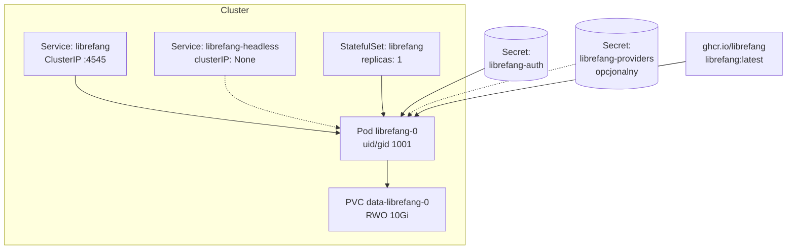
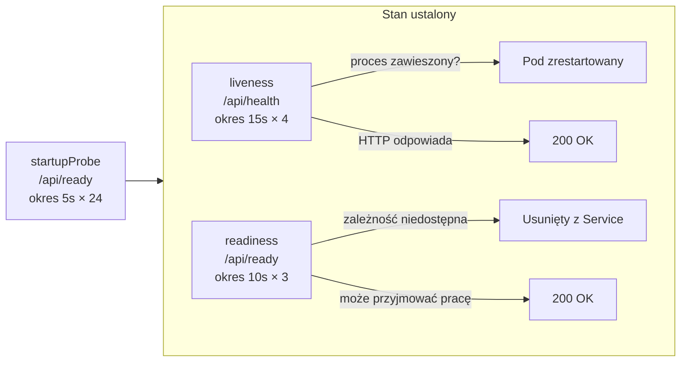

# deploy — kubernetes

# deploy/kubernetes

Manifesty Kustomize uruchamiające demona LibreFang jako jednoreplikowy StatefulSet w Kubernetes. Kształt wdrożenia jest celowo ograniczony do jednej repliki — to architektura, którą demon faktycznie obsługuje, a nie miejsce na horyzontalne skalowanie, które ma pojawić się później. Drugi pod współdzielący ten sam stan jest blokowany przez `/data/daemon.lock` (wyłączny `flock` trzymany przez `run_daemon`), a nawet przydzielenie każdej replice własnego wolumenu nie rozwiąże problemu lokalnych singletonów procesowych w wysyłaniu zadań cron, własności sesji, wymuszaniu budżetu i łańcuchu hashy audytu. Zobacz `docs/architecture/multi-replica-rfc.md`, co by było potrzebne do zniesienia tego ograniczenia.

Manifesty aplikuje się zwykłym `kubectl` — bez Helm, bez operatorów, bez CRD.

## Przegląd architektury



Klienci łączą się z ClusterIP Service `librefang`. Headless Service istnieje wyłącznie, aby spełnić wymóg StatefulSet (`spec.serviceName`) i nadać podowi jego stabilną nazwę DNS. PVC jest tworzony z `volumeClaimTemplates` i przetrwa zarówno pod, jak i sam StatefulSet.

## Manifesty

### `base/kustomization.yaml`

Pakuje `statefulset.yaml` i `service.yaml`. Aplikuje etykietę `app.kubernetes.io/part-of: librefang` do wszystkich zasobów. Pinuje obraz do `ghcr.io/librefang/librefang:latest` — nadpisz w środowisku za pomocą `kustomize edit set image`, aby nieprzetestowana wersja nie wdrożyła się przypadkowo.

Kustomizacja celowo **nie** tworzy Secretów, do których odwołuje się StatefulSet. Jest to zamierzone: poświadczenia nigdy nie powinny trafić do repozytorium, a brakujący obowiązkowy klucz powoduje `CreateContainerConfigError` w kubelecie — lepszy punkt awarii niż demon uruchamiający się otwarcie na binde nie-loopback.

### `base/statefulset.yaml`

Główny zasób. Kluczowe decyzje konfiguracyjne:

| Ustawienie | Wartość | Uzasadnienie |
| --- | --- | --- |
| `replicas` | `1` | Twarde ograniczenie — zobacz [Ograniczenie jednej repliki](#ograniczenie-jednej-repliki) |
| `serviceName` | `librefang-headless` | Headless Service wymagany przez kontrakt StatefulSet |
| `updateStrategy` | `RollingUpdate` | StatefulSet terminatinguje stary pod przed utworzeniem zastępstwa, więc dwa demony nigdy nie rywalizują o wolumen RWO |
| `runAsUser` / `runAsGroup` | `1001` | Zgodne z uid, na który Docker entrypoint przechodzi przez `gosu`; przypięcie tutaj eliminuje całkowicie start jako root |
| `fsGroup` | `1001` | Sprawia, że kubelet wykonuje `chgrp` świeżego PVC, aby nieuprzywilejowany proces mógł do niego pisać |
| `fsGroupChangePolicy` | `OnRootMismatch` | Pomija rekursywne przypisywanie praw, gdy własność już pasuje — istotne, gdy `/data` rośnie |
| `terminationGracePeriodSeconds` | `60` | Pokrywa checkpoint SQLite WAL plus aktualne tury agenta |
| `readOnlyRootFilesystem` | nie ustawione | Demon pisze poza `/data`: środowiska wirtualne serwera MCP, instalacje wtyczek, pliki tymczasowe `$TMPDIR` |

Kontener nasłuchuje na `0.0.0.0:4545` (`LIBREFANG_LISTEN`). Loopback poda jest nieosiągalny z kubeleta i innych podów, więc bind na wszystkie interfejsy jest obowiązkowy. Bind nie-loopback odmawia startu bez skonfigurowanego uwierzytelnienia, dlatego Secret `librefang-auth` jest obowiązkowy, a nie opcjonalnym wzmocnieniem.

### `base/service.yaml`

Definiuje dwa Servisy:

- **`librefang`** (ClusterIP, port 4545) — to, z czym łączą się klienci. Tylko ClusterIP: API eksponuje wykonanie powłoki, sejf poświadczeń i klucze providerów za jednym tokenem bearer. Dostęp z zewnątrz klastra powinien być celowy — użyj Ingress z TLS lub `kubectl port-forward`.
- **`librefang-headless`** (`clusterIP: None`) — spełnia wymóg `StatefulSet.spec.serviceName` i nadaje podowi stabilną nazwę DNS (`librefang-0.librefang-headless.<ns>.svc`). Nie przeznaczony dla ruchu klienckiego.

## Model Secretów

Dwa Secrety, podzielone według obowiązkowości:

### `librefang-auth` — obowiązkowy

| Klucz | Przeznaczenie | Generowanie |
| --- | --- | --- |
| `api-key` | Token bearer dla wszystkich wywołań `/api/*` | `openssl rand -hex 32` |
| `vault-key` | Klucz główny sejfu poświadczeń; po zdekodowaniu base64 musi mieć dokładnie 32 bajty | `openssl rand -base64 32` |
| `dashboard-user` | Login interfejsu webowego (spełnia też warunek auth dla binda nie-loopback) | — |
| `dashboard-pass` | Hasło interfejsu webowego | `openssl rand -hex 24` |
| `state-secret` | Klucz HMAC dla tokenów stanu OAuth/OIDC; ta sama 32-bajtowa długość co `vault-key` | `openssl rand -base64 32` |

`state-secret` jest oznaczony jako `optional: true` w StatefulSet, ponieważ ma znaczenie tylko przy `[external_auth] enabled = true`. Przy wyłączonym auth zewnętrznym, brak wartości oznacza, że każde uruchomienie generuje losowy klucz procesowy — co unieważnia logowania zewnętrzne w toku podczas wymiany poda, ale nie blokuje startu. Przy włączonym auth zewnętrznym, `validate_state_secret_env` w `boot.rs` odmawia startu bez niego.

### `librefang-providers` — opcjonalny

Klucze API providerów (`anthropic-api-key`, `openai-api-key`, `groq-api-key`). Wszystkie oznaczone jako `optional: true`. Pomiń cały Secret dla klastra opartego tylko na modelach lokalnych — demon uruchomi się bez nich i zgłosi brakującego providera, gdy agent go po raz pierwszy potrzebuje.

`secrets.example.yaml` dokumentuje dokładne nazwy kluczy, ale jest to materiał referencyjny, a nie coś do zaaplikowania. Wypełnienie i zatwierdzenie go umieści poświadczenia w gicie.

## Bezpieczeństwo poda: `restricted`

Manifesty spełniają Pod Security Standard `restricted` bez żadnych wyjątków:

- `runAsNonRoot: true`, `runAsUser: 1001`, `runAsGroup: 1001`
- `allowPrivilegeEscalation: false`
- `capabilities.drop: [ALL]`
- `seccompProfile.type: RuntimeDefault`

Opublikowany obraz nie deklaruje dyrektywy `USER`, ponieważ pod zwykłym Dockerem jego entrypoint startuje jako root, aby wykonać `chown` na podmontowanym wolumenie, a następnie przechodzi na uid 1001 przez `gosu`. Przypięcie `runAsUser: 1001` w specie poda eliminuje ten start jako root: `deploy/docker-entrypoint.sh` wykrywa zrzut (`id -u` nie jest 0), pomija zarówno `chown`, jak i wywołanie `gosu`, i bezpośrednio wywołuje demona. Jeden obraz obsługuje zarówno Docker, jak i Kubernetes — nie ma osobnego taga rootless.

Oznacz namespace, aby serwer API wymuszał standard:

```bash
kubectl label namespace librefang \
  pod-security.kubernetes.io/enforce=restricted \
  pod-security.kubernetes.io/enforce-version=latest
```

## Pamięć masowa i własność wolumenów

### Tylko `ReadWriteOnce`

PVC jest `ReadWriteOnce`. Współdzielona pamięć sieciowa (NFS, CIFS) jest **nieobsługiwana**, chyba że jednoznacznie zweryfikowano jej gwarancje blokowania. Stan runtime pod `/data` to baza danych SQLite w trybie WAL, której spójność zależy od:

- blokowania doradczego POSIX
- semantyki pamięci współdzielonej widocznej przez `mmap` (`-shm`)

Są one powszechnie implementowane niepoprawnie lub wcale w systemach plików sieciowych. To samo dotyczy `/data/daemon.lock`, blokady `flock` zapobiegającej dwóm demonom współdzieleniu katalogu stanu: na systemie plików, gdzie `flock` jest no-opem, ten test bezpieczeństwa cicho przechodzi i oba procesy uszkadzają nawzajem swoje zapisy.

### Własność wolumenu

Nieuprzywilejowany proces nie może przejąć własności świeżo provisionowanego wolumenu. Manifesty używają `fsGroup: 1001`, co sprawia, że kubelet wykonuje `chgrp` wolumenu na gid 1001 w momencie montowania. Działa to z każdym wbudowanym sterownikiem CSI raportującym `fsGroupPolicy: File` lub `ReadWriteOnceWithFSType`.

**Niektóre sterowniki całkowicie ignorują `fsGroup`** — większość provisionerów NFS i CIFS oraz każdy sterownik raportujący `fsGroupPolicy: None`. Na nich entrypoint kończy się z kodem błędu z komunikatem wskazującym na to ograniczenie, zamiast pozwolić SQLiteowi awariować później na niejasnym `EACCES`.

Sprawdź swój sterownik:

```bash
kubectl get csidriver -o custom-columns=NAME:.metadata.name,FSGROUP:.spec.fsGroupPolicy
```

Jeśli Twój sterownik ignoruje `fsGroup`, albo nadaj wolumenowi z góry własność `1001:1001` poza pasmem (uprzywilejowany Job lub opcje eksportu backendu jak NFS `all_squash` z `anonuid=1001,anongid=1001`), albo użyj StorageClass, którego sterownik go honoruje.

## Sondy kondycji

Trzy sondy, dwa kontrakty. Pomieszanie ich powoduje pętle restartów.



| Sonda | Endpoint | Znaczenie | Przy awarii |
| --- | --- | --- | --- |
| `startupProbe` | `/api/ready` | Pierwsze uruchomienie zakończone (`librefang init`, seed rejestru) | Pod zrestartowany po 24 × 5s (120s) |
| `livenessProbe` | `/api/health` | Proces odpowiada | **Pod zrestartowany** |
| `readinessProbe` | `/api/ready` | Demon może przyjmować pracę | Pod usunięty z endpointów Service |

### Dlaczego `/api/health` zwraca 200 nawet przy degradacji

`/api/health` zwraca 200 za każdym razem, gdy serwer HTTP może odpowiadać, nawet gdy jego treść raportuje `status: degraded`. Jest to zamierzone: odwracalny incydent pamięci masowej lub providera nie powinien powodować zabicie i restartu poda do tego samego incydentu. Liveness pyta „czy proces jest zawieszony?" — nie „czy wszystko jest idealne?"

### Dlaczego `/api/ready` zwraca 503

`/api/ready` zwraca 503, gdy zależność wymagana do przyjmowania pracy jest niedostępna — substrat SQLite lub provider embeddingu, który operator jednoznacznie przypiął, pozostawiając włączonym wyszukiwanie wektorowe. Nieustawiony lub `"auto"` provider embeddingu jest opcjonalnym ulepszeniem i nigdy nie zawiesza gotowości, ponieważ fallback do wyszukiwania tekstowego FTS jest obsługiwanym trybem, a nie degradacją.

### Oba endpointy są publiczne

Kubelet wysyła sondy bez poświadczeń, a 401 trwale usunęłoby poda z endpointów Service. Ładunki są minimalne — nazwy sprawdzanych elementów i ogólny status, bez wersji, nazwy hosta, id providera lub tekstu błędu. Szczegółowa diagnostyka pozostaje za uwierzytelnionym `/api/health/detail`.

## Cykl życia poda i aktualizacje

### Uporządkowana wymiana

StatefulSet terminatinguje pod przed utworzeniem zastępstwa, więc dwa demony nigdy nie rywalizują o wolumen. Stan przetrwa wymianę poda, ponieważ PVC utworzony z `volumeClaimTemplates` przetrwa pod — a także przetrwa sam StatefulSet, dlatego usunięcie StatefulSet nie usuwa Twoich agentów.

### Łagodne zamykanie

`terminationGracePeriodSeconds: 60` pokrywa checkpoint SQLite WAL oraz ewentualną aktualną turę agenta. Po SIGTERM demon przestaje przyjmować nową pracę; okno służy dokończeniu tego, co już zaczął, więc tura w trakcie wywołania LLM nie zostanie zabita z niezachowanymi wynikami narzędzi.

### Jeśli preferujesz Deployment

Deployment musi ustawić `strategy: Recreate`. Domyślny `RollingUpdate` przez krótki czas uruchamia oba pody, a nowy albo nie może podłączyć PVC ReadWriteOnce, albo — na sterowniku pozwalającym na multi-attach — zawodzi blokadą `daemon.lock` flock.

### Domyślne zasoby

```yaml
requests:
  cpu: 250m
  memory: 512Mi
limits:
  memory: 2Gi
```

To wartości początkowe, nie dostrojone rekomendacje — uczciwe minimum dla demona uruchamiającego serwer axum, substrat SQLite i nadzorcę agentów. Pamięć rośnie wraz z jednoczesnymi turami agenta i rozmiarem historii. Nie ustawiono limitu CPU: dławienie reaktora podczas strumieniowania LLM objawia się jako latencja, a nie jako czysta awaria.

## Ograniczenie jednej repliki

`replicas` musi pozostać `1`. Twarde zatrzymanie to `/data/daemon.lock`: `run_daemon` trzyma wyłączny flock, więc drugi pod współdzielący wolumen nie może się uruchomić. Przydzielenie każdej replice własnego wolumenu usuwa ten błąd bez naprawy rzeczywistego problemu, ponieważ luki koordynacji są w demonie, a nie w pamięci masowej:

| Podsystem | Tryb awarii przy N replikach |
| --- | --- |
| Wysyłanie zadań cron i wyzwalaczy | Brak wyboru lidera — każda replika odpala każde zadanie |
| Własność wykonania `(agent_id, session_id)` | Lokalna dla procesu — dwie repliki konkurujące o jedną sesję przeplatają zapisy |
| Wymuszanie budżetu | Odczyty z pomiaru procesowego — N replik wymusza około N× limit |
| Łańcuch hashy audytu | Pojedynczy szczyt na proces — repliki rozbiegają się do niezweryfikowalnych łańcuchów |

To pytania architektoniczne, nie konfiguracyjne. `docs/architecture/multi-replica-rfc.md` wylicza każdy podsystem-singleton i mechanizm koordynacji, którego każdy z nich potrzebowałby.

## Migracja z Docker Compose

`deploy/docker-compose.yml` i te manifesty uruchamiają ten sam obraz z tym samym układem `/data`, więc migracja to kopia wolumenu:

1. Zatrzymaj stos Compose, aby nic nie było w trakcie zapisu.
2. Spakuj wolumen do tar (zachowuje własność uid/gid 1001).
3. Zaaplikuj manifesty, skaluj do zera, zasiej PVC z tar, skaluj z powrotem do jednego.

Poświadczenia przechodzą z wpisów `.env` / `environment:` do dwóch Secretów. `LIBREFANG_API_KEY` to zmienna środowiskowa używana przez ścieżkę Kubernetes do dostarczenia `api_key`, ponieważ `config.toml` znajduje się w zapisywalnym katalogu danych demona i nie może być zamontowany z Secretu.

Pełną sekwencję poleceń znajdziesz w quick starcie README.

## Obserwowalność

`deploy/docker-compose.observability.yml` (Prometheus / Tempo / Grafana / OTel collector) nie ma odpowiednika Kubernetes w tym module.

Demon eksponuje `/api/metrics` w formacie Prometheus na tym samym porcie (4545), więc `ServiceMonitor` lub adnotacja `prometheus.io/scrape` wystarczą do metryk. Tracing wymaga `OTEL_EXPORTER_OTLP_ENDPOINT` wskazującego na Twój collector.

## Kluczowe niezmienniki

- **Jedna replika, jeden wolumen, jeden demon.** Flock, SQLite WAL i lokalne singletony procesowe od tego zależą.
- **Secrety są out-of-band.** Kustomizacja nigdy ich nie tworzy; brakujący obowiązkowy klucz zawodzi w kubelecie, nie w runtime.
- **Bind `0.0.0.0` z obowiązkowym authem.** Loopback poda jest nieosiągalny z kubeleta; bind nie-loopback bez uwierzytelnienia odmawia startu.
- **PSS `restricted`, bez wyjątków.** Jeden obraz obsługuje zarówno Docker (entrypoint root + zrzut gosu), jak i Kubernetes (bezpośrednie exec jako uid 1001).
- **Tylko pamięć RWO.** Blokowanie POSIX i semantyka `mmap` są niepodlegające negocjacjom dla poprawności SQLite WAL.
- **Liveness ≠ gotowość.** `/api/health` odpowiada 200, aby uniknąć pętli restartów przez odwracalne incydenty; `/api/ready` zwraca 503, aby odprowadzić, gdy demon nie może przyjmować pracy.
