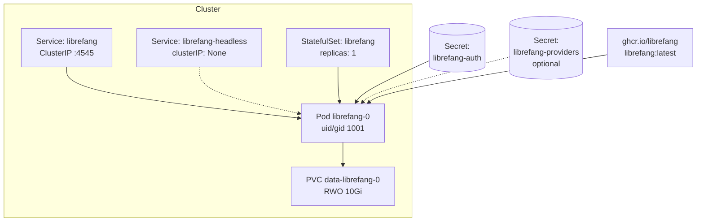
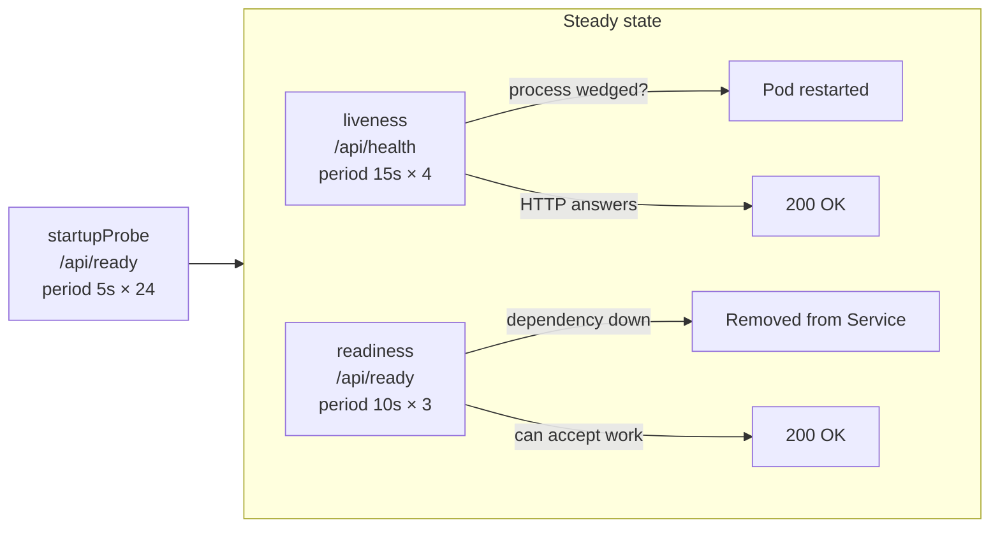

# deploy — kubernetes

# deploy/kubernetes

Kustomize manifests that run the LibreFang daemon as a single-replica StatefulSet on Kubernetes. The deployment shape is intentionally constrained to one replica — this is the architecture the daemon actually supports, not a placeholder for horizontal scaling that is coming later. A second pod against the same state is prevented by `/data/daemon.lock` (an exclusive `flock` held by `run_daemon`), and even giving each replica its own volume would not fix the process-local singletons in cron dispatch, session ownership, budget enforcement, and the audit hash chain. See `docs/architecture/multi-replica-rfc.md` for what lifting this would require.

The manifests apply with plain `kubectl` — no Helm, no operators, no CRDs.

## Architecture Overview



Clients talk to the `librefang` ClusterIP Service. The headless Service exists solely to satisfy the StatefulSet contract (`spec.serviceName`) and give the pod its stable DNS name. The PVC is created from `volumeClaimTemplates` and outlives both the pod and the StatefulSet itself.

## Manifests

### `base/kustomization.yaml`

Bundles `statefulset.yaml` and `service.yaml`. Applies a `app.kubernetes.io/part-of: librefang` label to all resources. Pins the image to `ghcr.io/librefang/librefang:latest` — override per-environment with `kustomize edit set image` to avoid an untested build rolling forward unintentionally.

The kustomization deliberately does **not** create the Secrets the StatefulSet references. This is by design: a credential should never land in version control, and a missing mandatory key produces a `CreateContainerConfigError` at the kubelet — a better failure point than a daemon that boots open on a non-loopback bind.

### `base/statefulset.yaml`

The core resource. Key configuration decisions:

| Setting | Value | Rationale |
| --- | --- | --- |
| `replicas` | `1` | Hard constraint — see [Single-replica constraint](#single-replica-constraint) |
| `serviceName` | `librefang-headless` | Headless Service required by the StatefulSet contract |
| `updateStrategy` | `RollingUpdate` | StatefulSet terminates the old pod before creating the replacement, so two daemons never contend for the RWO volume |
| `runAsUser` / `runAsGroup` | `1001` | Matches the uid the Docker entrypoint drops to via `gosu`; pinning it here removes the root start entirely |
| `fsGroup` | `1001` | Makes the kubelet `chgrp` a fresh PVC so the unprivileged process can write to it |
| `fsGroupChangePolicy` | `OnRootMismatch` | Skips recursive relabelling when ownership already matches — matters as `/data` grows |
| `terminationGracePeriodSeconds` | `60` | Covers SQLite WAL checkpoint plus in-flight agent turns |
| `readOnlyRootFilesystem` | not set | The daemon writes outside `/data`: MCP server venvs, plugin installs, `$TMPDIR` scratch |

The container listens on `0.0.0.0:4545` (`LIBREFANG_LISTEN`). The pod's loopback is unreachable from the kubelet and from other pods, so a wildcard bind is mandatory. A non-loopback bind refuses to start without configured authentication, which is why the `librefang-auth` Secret is mandatory rather than optional hardening.

### `base/service.yaml`

Defines two Services:

- **`librefang`** (ClusterIP, port 4545) — what clients talk to. ClusterIP only: the API exposes shell exec, the credential vault, and provider keys behind one bearer token. Reaching it from outside the cluster should be deliberate — use an Ingress with TLS, or `kubectl port-forward`.
- **`librefang-headless`** (`clusterIP: None`) — satisfies `StatefulSet.spec.serviceName` and gives the pod its stable DNS name (`librefang-0.librefang-headless.<ns>.svc`). Not for client traffic.

## Secrets Model

Two Secrets, split by obligation:

### `librefang-auth` — mandatory

| Key | Purpose | Generation |
| --- | --- | --- |
| `api-key` | Bearer token for all `/api/*` calls | `openssl rand -hex 32` |
| `vault-key` | Credential-vault master key; must base64-decode to exactly 32 bytes | `openssl rand -base64 32` |
| `dashboard-user` | Web UI login (also satisfies the non-loopback bind auth guard) | — |
| `dashboard-pass` | Web UI password | `openssl rand -hex 24` |
| `state-secret` | HMAC key for OAuth/OIDC state tokens; same 32-byte shape as `vault-key` | `openssl rand -base64 32` |

`state-secret` is marked `optional: true` in the StatefulSet because it only matters when `[external_auth] enabled = true`. With external auth off, an absent value means each boot derives a random per-process key — which invalidates any external login in flight across a pod replacement, but does not prevent boot. With external auth on, `boot.rs`'s `validate_state_secret_env` refuses to start without it.

### `librefang-providers` — optional

Provider API keys (`anthropic-api-key`, `openai-api-key`, `groq-api-key`). All marked `optional: true`. Omit the entire Secret for a local-model-only cluster — the daemon boots without them and reports the missing provider when an agent first needs it.

`secrets.example.yaml` documents the exact key names but is a reference, not something to apply. Filling it in and committing puts credentials in git.

## Pod Security: `restricted`

The manifests satisfy the `restricted` Pod Security Standard with no exemptions:

- `runAsNonRoot: true`, `runAsUser: 1001`, `runAsGroup: 1001`
- `allowPrivilegeEscalation: false`
- `capabilities.drop: [ALL]`
- `seccompProfile.type: RuntimeDefault`

The published image declares no `USER` directive because under plain Docker its entrypoint starts as root to `chown` a bind-mounted volume, then drops to uid 1001 via `gosu`. Pinning `runAsUser: 1001` in the pod spec takes that root start away: `deploy/docker-entrypoint.sh` detects the drop (`id -u` is not 0), skips both the `chown` and the `gosu` call, and execs the daemon directly. One image serves both Docker and Kubernetes — there is no separate rootless tag.

Label the namespace to have the API server enforce the standard:

```bash
kubectl label namespace librefang \
  pod-security.kubernetes.io/enforce=restricted \
  pod-security.kubernetes.io/enforce-version=latest
```

## Storage and Volume Ownership

### `ReadWriteOnce` only

The PVC is `ReadWriteOnce`. Shared network storage (NFS, CIFS) is **not supported** unless you have explicitly validated its locking guarantees. Runtime state under `/data` is a SQLite database in WAL mode, whose consistency depends on:

- POSIX advisory locking
- `mmap`-visible shared-memory (`-shm`) semantics

These are commonly implemented incorrectly or not at all on network filesystems. The same applies to `/data/daemon.lock`, the `flock` that prevents two daemons from sharing a state directory: on a filesystem where `flock` is a no-op, that safety check silently passes and both processes corrupt each other's writes.

### Volume ownership

An unprivileged process cannot take ownership of a freshly provisioned volume. The manifests use `fsGroup: 1001`, which makes the kubelet `chgrp` the volume to gid 1001 at mount time. This works with every in-tree CSI driver that reports `fsGroupPolicy: File` or `ReadWriteOnceWithFSType`.

**Some drivers ignore `fsGroup` entirely** — most NFS and CIFS provisioners, and any driver reporting `fsGroupPolicy: None`. On those, the entrypoint exits non-zero with a message pointing to this constraint rather than letting SQLite fail later on an opaque `EACCES`.

Check your driver:

```bash
kubectl get csidriver -o custom-columns=NAME:.metadata.name,FSGROUP:.spec.fsGroupPolicy
```

If your driver ignores `fsGroup`, either pre-own the volume as `1001:1001` out of band (privileged Job, or backend export options like NFS `all_squash` with `anonuid=1001,anongid=1001`), or use a StorageClass whose driver honours it.

## Health Probes

Three probes, two contracts. Confusing them causes restart loops.



| Probe | Endpoint | Meaning | On failure |
| --- | --- | --- | --- |
| `startupProbe` | `/api/ready` | First boot finished (`librefang init`, registry seed) | Pod restarted after 24 × 5s (120s) |
| `livenessProbe` | `/api/health` | The process is responsive | **Pod restarted** |
| `readinessProbe` | `/api/ready` | The daemon can accept work | Pod removed from Service endpoints |

### Why `/api/health` returns 200 even when degraded

`/api/health` returns 200 whenever the HTTP server can answer, even when its body reports `status: degraded`. This is intentional: a recoverable storage or provider incident must not get the pod killed and restarted into the same incident. Liveness asks "is the process wedged?" — not "is everything perfect?"

### Why `/api/ready` returns 503

`/api/ready` returns 503 when a dependency required to accept work is unavailable — the SQLite substrate, or an embedding provider the operator pinned explicitly while leaving vector search on. An unset or `"auto"` embedding provider is an optional enhancement and never fails readiness, because falling back to FTS text search is a supported mode rather than a degradation.

### Both endpoints are public

The kubelet issues probes with no credential, and a 401 would pin the pod out of Service endpoints permanently. Payloads are minimal — check names and a coarse status, no version, hostname, provider id, or error text. Detailed diagnostics stay behind the authenticated `/api/health/detail`.

## Pod Lifecycle and Updates

### Ordered replacement

A StatefulSet terminates its pod before creating the replacement, so two daemons never contend for the volume. State survives pod replacement because the PVC created from `volumeClaimTemplates` outlives the pod — and outlives the StatefulSet itself, which is why deleting the StatefulSet does not delete your agents.

### Graceful shutdown

`terminationGracePeriodSeconds: 60` covers the SQLite WAL checkpoint plus any in-flight agent turn. The daemon stops accepting new work on SIGTERM; the window is for finishing what it already started, so a turn mid-LLM-call is not killed with its tool results unpersisted.

### If you prefer a Deployment

A Deployment must set `strategy: Recreate`. The default `RollingUpdate` briefly runs both pods, and the new one either fails to attach the ReadWriteOnce PVC or — on a driver that permits multi-attach — fails the `daemon.lock` flock.

### Resource defaults

```yaml
requests:
  cpu: 250m
  memory: 512Mi
limits:
  memory: 2Gi
```

These are starting values, not tuned recommendations — the honest floor for a daemon running an axum server, a SQLite substrate, and the agent supervisor. Memory scales with concurrent agent turns and history size. No CPU limit is set: throttling the reactor during an LLM stream shows up as latency, not as a clean failure.

## Single-Replica Constraint

`replicas` must remain `1`. The hard stop is `/data/daemon.lock`: `run_daemon` holds an exclusive flock, so a second pod sharing the volume cannot boot. Giving each replica its own volume removes that error without fixing the real problem, because the coordination gaps are in the daemon, not the storage:

| Subsystem | Failure mode with N replicas |
| --- | --- |
| Cron and trigger dispatch | No leader election — every replica fires every job |
| `(agent_id, session_id)` execution ownership | Process-local — two replicas racing one session interleave writes |
| Budget enforcement | Reads per-process metering — N replicas enforce roughly N× the cap |
| Audit hash chain | Single tip per process — replicas diverge into unverifiable chains |

These are architecture questions, not configuration ones. `docs/architecture/multi-replica-rfc.md` enumerates every singleton subsystem and the coordination mechanism each would need.

## Migration from Docker Compose

`deploy/docker-compose.yml` and these manifests run the same image with the same `/data` layout, so the migration is a volume copy:

1. Stop the Compose stack so nothing is mid-write.
2. Tar the volume out (preserves uid/gid 1001 ownership).
3. Apply the manifests, scale to zero, seed the PVC from the tar, scale back to one.

Credentials move from `.env` / `environment:` entries to the two Secrets. `LIBREFANG_API_KEY` is the env var the Kubernetes path uses to supply `api_key`, since `config.toml` lives inside the daemon's own writable data dir and cannot be mounted from a Secret.

See the README quick start for the full command sequence.

## Observability

`deploy/docker-compose.observability.yml` (Prometheus / Tempo / Grafana / OTel collector) has no Kubernetes counterpart in this module.

The daemon exposes `/api/metrics` in Prometheus format on the same port (4545), so a `ServiceMonitor` or a `prometheus.io/scrape` annotation is enough for metrics. Tracing needs `OTEL_EXPORTER_OTLP_ENDPOINT` pointed at your collector.

## Key Invariants

- **One replica, one volume, one daemon.** The flock, the SQLite WAL, and the process-local singletons all depend on it.
- **Secrets are out-of-band.** The kustomization never creates them; a missing mandatory key fails at the kubelet, not at runtime.
- **`0.0.0.0` bind with mandatory auth.** The pod's loopback is unreachable from the kubelet; a non-loopback bind without authentication refuses to start.
- **`restricted` PSS, no exemptions.** One image serves both Docker (root entrypoint + gosu drop) and Kubernetes (direct exec as uid 1001).
- **RWO storage only.** POSIX locking and `mmap` semantics are non-negotiable for SQLite WAL correctness.
- **Liveness ≠ readiness.** `/api/health` answers 200 to avoid restart loops through recoverable incidents; `/api/ready` returns 503 to drain when the daemon cannot accept work.