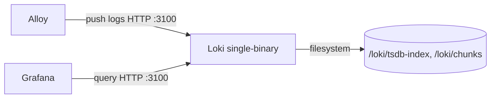

# deploy — loki

# deploy — loki

Konfiguracja Grafana Loki dla lokalnego stosu deweloperskiego LibreFang. Pojedynczy plik YAML uruchamiający Loki w trybie pojedynczego binary z magazynem opartym na systemie plików, przygotowany do odbierania strumieni logów z Alloy i udostępniania ich Grafanie do wizualizacji.

## Rola w stosie deweloperskim

Loki to backend agregacji logów. Nie zbiera logów samodzielnie — ta odpowiedzialność spoczywa na Alloy, który odpytuje kontenerowe i plikowe źródła logów i przesyła je przez HTTP do API przyjmowania danych Loki. Grafana następnie odpytuje Loki przez ten sam port HTTP, aby renderować panele logów.



Wszystkie trzy komponenty zazwyczaj działają razem w ramach definicji compose stosu deweloperskiego. Loki eksponuje pojedynczy port (`3100`) zarówno dla ruchu przyjmowania, jak i zapytań.

## Model magazynowania

Loki działa w najprostszej żywotnej topologii: jedna instancja, jedna replika, pierścień w pamięci. Pozwala to uniknąć zależności od Consul/etcd, która występuje w wdrożeniach produkcyjnych.

| Obszar | Wybór | Uwagi |
|---|---|---|
| Backend pierścienia | `inmemory` | Utraceny przy restarcie; akceptowalne w środowisku deweloperskim |
| Replikacja | `1` | Bez redundancji |
| Magazyn obiektów | `filesystem` | Bez wymogu S3/GCS |
| Schemat | `v13` | Aktualnie rekomendowany schemat |
| Magazyn indeksu | `tsdb` | Sparowany z `tsdb_shipper` |

Ścieżki magazynowania są osadzone w katalogu `/loki`:

- `/loki/tsdb-index` — aktywne pliki indeksu TSDB
- `/loki/tsdb-cache` — pamięć podręczna shippera dla przesyłania indeksów (no-op przy magazynie plikowym, ale wymagana przez shippera)
- `/loki/chunks` — magazyn skompresowanych fragmentów logów
- `/loki/compactor` — katalog roboczy kompaktora

Wszystkie te ścieżki rozstrzygają się wewnątrz kontenera Loki. Stos compose odpowiada za zamontowanie wolumenu w `/loki`, jeśli zachowanie trwałości danych między restartami kontenera jest pożądane.

## Przegląd konfiguracji

### Serwer

```yaml
server:
  http_listen_port: 3100
  log_level: warn
```

Pojedynczy nasłuchiwacz HTTP zarówno dla endpointów przyjmowania (`/loki/api/v1/push`), jak i zapytań (`/loki/api/v1/query_range`, `/loki/api/v1/label`). `log_level: warn` utrzymuje czytelność wyjścia kontenera; zmień na `info` podczas diagnozowania problemów z przyjmowaniem lub zapytaniami.

### Wspólne

```yaml
common:
  ring:
    instance_addr: 127.0.0.1
    kvstore:
      store: inmemory
  replication_factor: 1
  path_prefix: /loki
```

`instance_addr: 127.0.0.1` jest poprawne, ponieważ pierścień znajduje się w pamięci i nigdy nie jest ogłaszany równorzędonym węzłom. `path_prefix` ustawia katalog główny dla każdej ścieżki podsystemu — wszystko poniżej dziedziczy `/loki`, chyba że zostanie jawnie nadpisane.

### Schemat i magazyn

```yaml
schema_config:
  configs:
    - from: 2024-01-01
      store: tsdb
      object_store: filesystem
      schema: v13
```

Data `from` to najwcześniejszy możliwy do przyjęcia znacznik czasu w ramach tego schematu. Ponieważ stos deweloperski nadpisuje domyślny wiek odrzucania starych próbek (patrz poniżej), logi datowane do tej granicy zostaną przyjęte. Jeśli data jest ustawiona w przyszłości względem zegara systemowego, przyjmowanie danych zawodzi po cichu — ustaw ją w przeszłości.

### Limity — dostrojenie specyficzne dla środowiska deweloperskiego

```yaml
limits_config:
  reject_old_samples: true
  reject_old_samples_max_age: 720h
  allow_structured_metadata: true
```

To jedyna sekcja celowo odchodząca od wartości domyślnych i najbardziej prawdopodobne źródło nieporozumień.

Domyślna wartość `reject_old_samples_max_age` w Loki wynosi `168h` (7 dni). Działa to przy podglądzie na żywo, ale po cichu odrzuca wpisy podczas odtwarzania nieaktualnego logu demona — częsta operacja podczas lokalnego uzupełniania danych. Konfiguracja podnosi tę wartość do `720h` (30 dni), aby starsze pliki źródłowe mogły być ponownie przyjęte bez utraty danych.

Jeśli widzisz logi docierające do pipeline'u Alloy, ale nigdy nie pojawiające się w Grafanie, sprawdź logi Loki pod kątem przyczyn odrzucenia `too old` przed szukaniem gdzie indziej.

`allow_structured_metadata: true` jest wymagane dla schematu v13 i musi pozostać włączone.

## Uwierzytelnianie

```yaml
auth_enabled: false
```

Tryb wielodostępcowy jest wyłączony. Wszystkie żądania są traktowane jako należące do jednego domyślnego dzierżawcy. Zgodne to z założeniem stosu deweloperskiego, że Loki jest osiągalny tylko z wewnątrz sieci compose i nie powinien być eksponowany na zewnątrz. Nie włączaj tej opcji bez jednoczesnego dodania pipeline'u Alloy świadomego dzierżawców.

## Uwagi operacyjne

- **Retencja i kompaktacja** korzystają z wbudowanych wartości domyślnych Loki. Kompaktor jest skonfigurowany z katalogiem roboczym, ale bez jawnego okresu retencji. Jest to wystarczające dla stosów działających kilka dni; w przypadku dłużej żyjących środowisk dodaj `compactor.retention_enabled` oraz `limits_config.retention_period`.
- **W tym module nie istnieją żadne przepływy wykonania** — jest to czysta konfiguracja konsumowana przez binary Loki przy starcie. Całe zachowanie integracyjne znajduje się w definicjach scrape Alloy i udostępnianiu źródeł danych Grafany.
- **Zachowanie przy restarcie**: pierścień w pamięci i KV store w pamięci oznaczają, że restart Loki płucze stan pierścienia. Ponieważ `replication_factor` wynosi `1`, nie ma węzła równorzędnego, z którego można by się odzyskać. Przyjmowane w locie dane jeszcze nie zapisane do fragmentów mogą zostać utracone przy niegrzecznym wyłączeniu.

## Lista kontrolna dostrojenia dla środowisk niedeweloperskich

Jeśli przenosisz tę konfigurację do dłużej działającego lub współdzielonego środowiska, revisuj co najmniej:

1. `common.ring.kvstore.store` → przejdź z `inmemory` na Consul lub memberlist.
2. `storage_config.filesystem.directory` → zastąp magazynem obiektów S3 lub GCS.
3. `limits_config.reject_old_samples_max_age` → zresetuj do `168h` lub wartości odpowiadającej Twojej polityce retencji.
4. `auth_enabled` → włącz ze strategią dzierżawców.
5. Dodaj jawną retencję w `compactor` i `limits_config`.
