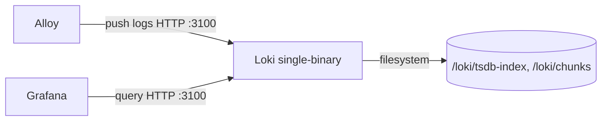

# deploy — loki

# deploy — loki

Grafana Loki configuration for LibreFang's local development stack. A single YAML file that runs Loki in single-binary mode with filesystem-backed storage, positioned to receive log streams from Alloy and serve them to Grafana for visualization.

## Role in the Dev Stack

Loki is the log aggregation backend. It does not collect logs itself — that responsibility belongs to Alloy, which scrapes container and file-based log sources and pushes them over HTTP to Loki's ingestion API. Grafana then queries Loki over the same HTTP port to render log panels.



All three components typically run together via the dev stack's compose definition. Loki exposes a single port (`3100`) for both ingest and query traffic.

## Storage Model

Loki runs in its simplest viable topology: one instance, one replica, in-memory ring. This avoids the Consul/etcd dependency that production deployments carry.

| Concern | Choice | Notes |
|---|---|---|
| Ring backend | `inmemory` | Lost on restart; acceptable for dev |
| Replication | `1` | No redundancy |
| Object store | `filesystem` | No S3/GCS requirement |
| Schema | `v13` | Current recommended schema |
| Index store | `tsdb` | Paired with `tsdb_shipper` |

Storage paths are anchored under `/loki`:

- `/loki/tsdb-index` — active TSDB index files
- `/loki/tsdb-cache` — shipper cache for index uploads (no-op against filesystem, but required by the shipper)
- `/loki/chunks` — compressed log chunk storage
- `/loki/compactor` — compactor working directory

All of these resolve inside the Loki container. The compose stack is responsible for mounting a volume at `/loki` if persistence across container restarts is desired.

## Configuration Walkthrough

### Server

```yaml
server:
  http_listen_port: 3100
  log_level: warn
```

Single HTTP listener for both the ingest (`/loki/api/v1/push`) and query (`/loki/api/v1/query_range`, `/loki/api/v1/label`) endpoints. `log_level: warn` keeps container output readable; flip to `info` when diagnosing ingest or query issues.

### Common

```yaml
common:
  ring:
    instance_addr: 127.0.0.1
    kvstore:
      store: inmemory
  replication_factor: 1
  path_prefix: /loki
```

`instance_addr: 127.0.0.1` is correct because the ring is in-memory and never advertised to peers. `path_prefix` sets the root for every subsystem path — everything below inherits `/loki` unless explicitly overridden.

### Schema and Storage

```yaml
schema_config:
  configs:
    - from: 2024-01-01
      store: tsdb
      object_store: filesystem
      schema: v13
```

The `from` date is the earliest ingestible timestamp under this schema. Because the dev stack overrides the default old-sample rejection age (see below), logs dated back to this boundary will be accepted. If the date is set in the future relative to the system clock, ingestion fails silently — keep it in the past.

### Limits — the dev-specific tuning

```yaml
limits_config:
  reject_old_samples: true
  reject_old_samples_max_age: 720h
  allow_structured_metadata: true
```

This is the one section deliberately diverged from defaults and the most likely source of confusion.

Loki's default `reject_old_samples_max_age` is `168h` (7 days). That works for live tailing but silently drops entries when replaying a stale daemon log — a common operation during local backfills. The config bumps it to `720h` (30 days) so older source files can be re-ingested without data loss.

If you see logs arriving in Alloy's pipeline but never appearing in Grafana, check Loki's logs for `too old` rejection reasons before investigating elsewhere.

`allow_structured_metadata: true` is required for schema v13 and must remain enabled.

## Authentication

```yaml
auth_enabled: false
```

Multi-tenant mode is disabled. All requests are treated as belonging to a single implicit tenant. This matches the dev stack's assumption that Loki is only reachable from within the compose network and should not be exposed externally. Do not flip this on without also adding a tenant-aware Alloy pipeline.

## Operational Notes

- **Retention and compaction** use Loki's built-in defaults. The compactor is configured with a working directory but no explicit retention period. This is fine for stacks that run a few days; for longer-lived environments, add `compactor.retention_enabled` and a `limits_config.retention_period`.
- **No execution flows exist within this module** — it is pure configuration consumed by the Loki binary at startup. All integration behavior lives in Alloy's scrape definitions and Grafana's datasource provisioning.
- **Restart behavior**: the in-memory ring and in-memory KV store mean a Loki restart flushes ring state. Because `replication_factor` is `1`, there is no peer to recover from. In-flight ingested data not yet flushed to chunks may be lost on ungraceful shutdown.

## Tuning Checklist for Non-Dev Use

If lifting this config for a longer-running or shared environment, revisit at minimum:

1. `common.ring.kvstore.store` → move off `inmemory` to Consul or memberlist.
2. `storage_config.filesystem.directory` → replace with S3 or GCS object store.
3. `limits_config.reject_old_samples_max_age` → reset to `168h` or a value matching your retention policy.
4. `auth_enabled` → enable with a tenant strategy.
5. Add explicit retention under `compactor` and `limits_config`.