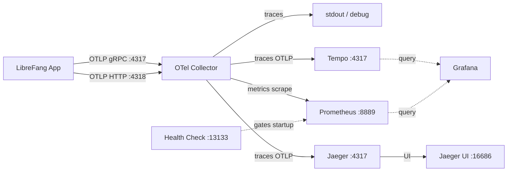

# deploy — otel-collector

# deploy/otel-collector

Konfiguracja OpenTelemetry Collector dla lokalnego środowiska deweloperskiego LibreFang. Działa jako centralny węzeł telemetrii: przyjmuje ślady i metryki OTLP z aplikacji i rozdziela je do wielu backendów w celu przechowywania, wizualizacji i debugowania.

## Przeznaczenie

LibreFang emituje telemetrię za pomocą standardowego protokołu OTLP. Zamiast pozwalania aplikacji na bezpośrednią komunikację z każdym backendem, ten collector znajduje się pomiędzy nimi, aby:

- **Ujednolicić przyjmowanie danych** — aplikacja musi znać tylko jeden punkt końcowy (collector), niezależnie od tego, ile backendów konsumuje dane.
- **Rozdzielić ślady** — jednocześnie do Tempo (korelacja w Grafanie), Jaeger (interfejs debugowania śladów) oraz stdout (szybka widoczność lokalna).
- **Zmostkować metryki do Prometheus** — udostępnia punkt końcowy scrapowania, od którego Prometheus pobiera dane.
- **Warunkować uruchomienie** — udostępnia health check, dzięki czemu zależne usługi (Prometheus, Grafana) uruchamiają się dopiero, gdy collector faktycznie akceptuje ruch OTLP.

## Plik konfiguracyjny

### `config.yaml`

Jedyny plik w tym module. Wczytywany przez obraz `otel/opentelemetry-collector-contrib` podczas uruchamiania kontenera.

#### Receivery

| Receiver | Protokół | Punkt końcowy | Przeznaczenie |
|----------|----------|---------------|---------------|
| `otlp` | gRPC | `0.0.0.0:4317` | Główne przyjmowanie śladów i metryk z LibreFang |
| `otlp` | HTTP | `0.0.0.0:4318` | Alternatywne przyjmowanie OTLP przez HTTP |

Oba punkty końcowe wiążą się z `0.0.0.0`, więc są osiągalne z innych kontenerów w sieci bridge Docker.

#### Rozszerzenie: `health_check`

Udostępnia punkty końcowe health check (`/`, `/health/status` itp.) na `0.0.0.0:13133`. Docker Compose korzysta z tego w dyrektywie healthcheck — usługi zależne czekają, aż collector przejdzie ten sprawdzian, zanim się uruchomią.

#### Procesor: `batch`

Zastosowany do obu pipeline'ów. Grupuje telemetrię w batche przed eksportem, zmniejszając liczbę żądań wychodzących do Tempo, Jaeger i Prometheus. Używa ustawień domyślnych (rozmiar batcha wysyłania: 8192, timeout: 200 ms).

#### Eksportery

| Eksporter | Typ | Punkt końcowy | Uwagi |
|-----------|-----|---------------|-------|
| `debug` | stdout | — | Normalna szczegółowość. Drukuje ślady w logach collectora do szybkiego debugowania. |
| `prometheus` | punkt końcowy scrapowania | `0.0.0.0:8889` | Udostępnia zebrane metryki w formacie Prometheus do scrapowania. |
| `otlp/tempo` | OTLP/gRPC | `tempo:4317` | Długoterminowe przechowywanie śladów. `tls.insecure: true` — tekst jawny na wewnętrznej sieci bridge Docker. |
| `otlp/jaeger` | OTLP/gRPC | `jaeger:4317` | Interfejs debugowania śladów (waterfall, diff, graf zależności). Również tekst jawny na sieci bridge. |

Flaga `tls.insecure` w eksporterach Tempo i Jaeger jest celowa i bezpieczna: cały ruch pozostaje w sieci bridge Docker i nigdy nie przechodzi przez sieć zewnętrzną.

#### Pipeliny usług

Zdefiniowane są dwa pipeliny:

**Pipeline śladów:**
```
otlp receiver → batch processor → [debug, otlp/tempo, otlp/jaeger]
```
Każdy span śladu jest jednocześnie rozsyłany do wszystkich trzech eksporterów. Tempo jest długoterminowym magazynem odpytywanym przez Grafanę; Jaeger udostępnia dedykowany interfejs debugowania śladów pod `:16686`; stdout zapewnia natychmiastową widoczność lokalną bez otwierania przeglądarki.

**Pipeline metryk:**
```
otlp receiver → batch processor → prometheus exporter
```
Metryki są grupowane w batche i udostępniane do scrapowania przez Prometheus na `:8889`.

## Przepływ danych



## Odniesienie portów

| Port | Protokół | Kierunek | Opis |
|------|----------|----------|------|
| `4317` | OTLP/gRPC | Przychodzący | Przyjmowanie śladów i metryk z aplikacji |
| `4318` | OTLP/HTTP | Przychodzący | Przyjmowanie OTLP przez HTTP |
| `13133` | HTTP | Przychodzący | Health check (Docker Compose healthcheck) |
| `8889` | HTTP | Wychodzący (scrapowanie) | Punkt końcowy metryk Prometheus |
| `tempo:4317` | OTLP/gRPC | Wychodzący | Eksport śladów do Tempo |
| `jaeger:4317` | OTLP/gRPC | Wychodzący | Eksport śladów do Jaeger |

## Integracja ze środowiskiem deweloperskim

Ten moduł jest wykorzystywany przez konfigurację Docker Compose najwyższego poziomu. Kontener collectora zależy od dostępności `tempo` i `jaeger` (łączy się z nimi po nazwie usługi Docker). Z kolei `prometheus` i `grafana` zależą od tego, aby health check collectora przeszedł pomyślnie, zanim się uruchomią.

Podczas dodawania nowej telemetrii do LibreFang:

1. **Ślady** — Skonfiguruj eksporter OTLP aplikacji tak, aby wskazywał na `localhost:4317` (lub nazwę usługi collectora wewnątrz Compose). Spany będą automatycznie pojawiać się w stdout, Tempo (przez Grafanę) i Jaeger.

2. **Metryki** — Ten sam punkt końcowy OTLP. Metryki są kierowane przez pipeline metryk i udostępniane na `:8889` do scrapowania przez Prometheus. Upewnij się, że instrumenty metryk aplikacji używają eksportera metryk OTLP.

Nie są potrzebne żadne zmiany kodu w tym module podczas dodawania nowej telemetrii — pipeliny to uniwersalne receivery OTLP. Modyfikacje w tym miejscu są wymagane tylko przy zmianie miejsca, do którego telemetria jest wysyłana, lub sposobu jej przetwarzania.
