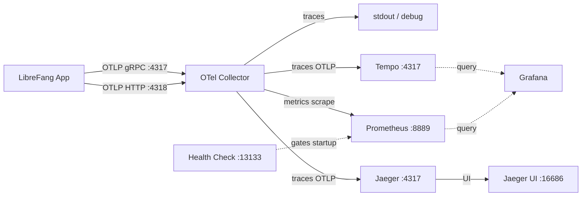

# deploy — otel-collector

# deploy/otel-collector

OpenTelemetry Collector configuration for LibreFang's local development stack. Acts as the central telemetry hub: ingests OTLP traces and metrics from the application and fans them out to multiple backends for storage, visualization, and debugging.

## Purpose

LibreFang emits telemetry via the standard OTLP protocol. Rather than having the application talk directly to each backend, this collector sits in between to:

- **Normalize ingestion** — the app only needs to know one endpoint (the collector), regardless of how many backends consume the data.
- **Fan out traces** — simultaneously to Tempo (Grafana correlation), Jaeger (trace-debug UI), and stdout (quick local visibility).
- **Bridge metrics to Prometheus** — exposes an scrape endpoint that Prometheus polls.
- **Gate startup** — provides a health check so dependent services (Prometheus, Grafana) only start once the collector is actually accepting OTLP traffic.

## Configuration File

### `config.yaml`

The sole file in this module. Loaded by the `otel/opentelemetry-collector-contrib` image at container startup.

#### Receivers

| Receiver | Protocol | Endpoint | Purpose |
|----------|----------|----------|---------|
| `otlp` | gRPC | `0.0.0.0:4317` | Primary trace + metric ingestion from LibreFang |
| `otlp` | HTTP | `0.0.0.0:4318` | Alternative HTTP-based OTLP ingestion |

Both endpoints bind to `0.0.0.0` so they are reachable from other containers on the Docker bridge network.

#### Extension: `health_check`

Exposes health endpoints (`/`, `/health/status`, etc.) on `0.0.0.0:13133`. Docker Compose uses this in its healthcheck directive — dependent services are gated on the collector passing this check before they start.

#### Processor: `batch`

Applied to both pipelines. Groups telemetry into batches before export, reducing the number of outbound requests to Tempo, Jaeger, and Prometheus. Uses default settings (send batch size: 8192, timeout: 200ms).

#### Exporters

| Exporter | Type | Endpoint | Notes |
|----------|------|----------|-------|
| `debug` | stdout | — | Normal verbosity. Prints traces to collector logs for quick debugging. |
| `prometheus` | scrape endpoint | `0.0.0.0:8889` | Exposes collected metrics in Prometheus format for scraping. |
| `otlp/tempo` | OTLP/gRPC | `tempo:4317` | Long-term trace storage. `tls.insecure: true` — plaintext on internal Docker bridge. |
| `otlp/jaeger` | OTLP/gRPC | `jaeger:4317` | Trace debugging UI (waterfall, diff, dependency graph). Same plaintext bridge. |

The `tls.insecure` flag on both Tempo and Jaeger exporters is intentional and safe: all traffic stays on the Docker bridge network and never traverses an external network.

#### Service Pipelines

Two pipelines are defined:

**Traces pipeline:**
```
otlp receiver → batch processor → [debug, otlp/tempo, otlp/jaeger]
```
Every trace span is fanned out to all three exporters simultaneously. Tempo is the long-term store queried by Grafana; Jaeger provides the dedicated trace-debugging UI at `:16686`; stdout gives immediate local visibility without opening a browser.

**Metrics pipeline:**
```
otlp receiver → batch processor → prometheus exporter
```
Metrics are batched and then made available for Prometheus to scrape on `:8889`.

## Data Flow



## Port Reference

| Port | Protocol | Direction | Description |
|------|----------|-----------|-------------|
| `4317` | OTLP/gRPC | Inbound | Application trace + metric ingestion |
| `4318` | OTLP/HTTP | Inbound | HTTP-based OTLP ingestion |
| `13133` | HTTP | Inbound | Health check (Docker Compose healthcheck) |
| `8889` | HTTP | Outbound (scrape) | Prometheus metrics endpoint |
| `tempo:4317` | OTLP/gRPC | Outbound | Trace export to Tempo |
| `jaeger:4317` | OTLP/gRPC | Outbound | Trace export to Jaeger |

## Integration with the Dev Stack

This module is consumed by the top-level Docker Compose configuration. The collector container depends on `tempo` and `jaeger` being available (it connects to them by Docker service name). Conversely, `prometheus` and `grafana` depend on the collector's health check passing before they start.

When adding new telemetry to LibreFang:

1. **Traces** — Configure the app's OTLP exporter to point at `localhost:4317` (or the collector service name from within Compose). Spans will automatically appear in stdout, Tempo (via Grafana), and Jaeger.

2. **Metrics** — Same OTLP endpoint. Metrics are routed through the metrics pipeline and made available at `:8889` for Prometheus to scrape. Ensure the app's metric instruments use the OTLP metrics exporter.

No code changes to this module are needed when adding new telemetry — the pipelines are generic OTLP receivers. Modifications here are only required when changing where telemetry is sent or how it is processed.