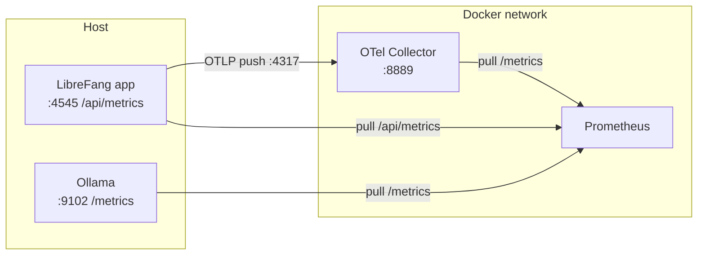

# deploy — prometheus

# deploy — prometheus

## Przegląd

Ten moduł zawiera konfigurację scrapowania Prometheus dla stosu obserwowalności LibreFang. Definiuje, z których usług Prometheus pobiera metryki, jak często i przez jakie punkty końcowe. Plik `prometheus.yml` jest jedynym źródłem prawdy dla wykrywania celów i częstotliwości zbierania.

Prometheus wykorzystuje **model pull**: aktywnie scrapuje każdy skonfigurowany cel w stałym interwale i zapisuje wynikowe szeregi czasowe. Ta konfiguracja niczego nigdzie nie wypycha — jedynie deklaruje skąd i kiedy Prometheus powinien pobierać.

## Odniesienie do konfiguracji

### Ustawienia globalne

| Ustawienie | Wartość | Znaczenie |
|---|---|---|
| `scrape_interval` | `15s` | Jak często Prometheus pobiera metryki z każdego celu. |
| `evaluation_interval` | `15s` | Jak często Prometheus ocenia reguły alertowania i reguły zapisu (recording rules). |

Oba interwały są celowo ustawione na to samo 15-sekundowe okno, aby utrzymać synchronizację świeżości metryk i oceny reguł. Jeśli w przyszłości zostaną dodane reguły alertów, zostaną wyzwolone najpóźniej 15 sekund po tym, jak warunek po raz pierwszy stanie się prawdziwy.

### Cele scrapowania

Konfiguracja deklaruje trzy zadania. Każde zadanie ma `job_name`, `metrics_path` oraz jeden lub więcej celów ze statycznymi etykietami.

#### 1. `librefang` — aplikacja

- **Ścieżka:** `/api/metrics`
- **Cel:** `host.docker.internal:4545`
- **Etykieta:** `instance: "librefang-local"`

To jest główna usługa LibreFang udostępniająca własne metryki aplikacyjne przez swoje HTTP API. Nazwa hosta `host.docker.internal` rozwiązuje się do hosta Docker, co oznacza, że LibreFang jest uruchamiany poza siecią Docker kolektora (np. bezpośrednio na maszynie deweloperskiej lub w osobnym projekcie compose).

#### 2. `ollama` — serwer wnioskowania LLM

- **Ścieżka:** `/metrics`
- **Cel:** `host.docker.internal:9102`
- **Etykieta:** `instance: "ollama-local"`

Scrapuje punkt końcowy metryk Ollamy. Natywne metryki Ollamy są udostępniane na `/metrics`, a Prometheus konsumuje je bezpośrednio. Podobnie jak LibreFang, ten cel jest osiągany przez hosta Docker, więc Ollama musi być powiązana z portem osiągalnym z sieci hosta.

#### 3. `otel-collector` — przekaznik OpenTelemetry

- **Ścieżka:** `/metrics`
- **Cel:** `otel-collector:8889`
- **Etykieta:** `instance: "otel-collector"`

To zadanie scrapuje port eksportera Prometheus kolektora OpenTelemetry. W przeciwieństwie do dwóch pozostałych zadań, ten cel używa nazwy usługi Docker `otel-collector`, co oznacza, że kolektor działa w tej samej sieci Docker co Prometheus. Kolektor działa jako pośrednik dla metryk emitowanych przez OTLP: LibreFang wypycha metryki do kolektora przez OTLP (gRPC na `:4317`), kolektor je przetwarza i eksportuje, a następnie Prometheus pobiera zagregowany wynik z `:8889`.

## Topologia zbierania metryk

Trzy zadania tworzą dwie odrębne ścieżki zbierania — bezpośredni pull i pośrednie przekazywanie:



Należy zauważyć, że LibreFang jest scrapowany **dwukrotnie** przez dwie niezależne ścieżki: bezpośrednio przez Prometheus na `/api/metrics` oraz pośrednio przez kolektor OTel na `:8889`. Ta redundancja jest celowa podczas wdrażania — bezpośredni scrap przechwytuje metryki emitowane przez aplikację w formacie ekspozycji Prometheus, podczas gdy ścieżka przez kolektor przechwytuje metryki emitowane przez SDK OpenTelemetry. Podczas utwardzania stosu, wybierz jedną ścieżkę na rodzinę metryk, aby uniknąć podwójnego liczenia.

## Jak to łączy się z resztą bazy kodu

- **Katalogi równorzędne w `deploy/`.** Ta konfiguracja jest konsumowana przez cokolwiek uruchamia Prometheusa — zazwyczaj `docker-compose.yml` lub odpowiednik w `deploy/`, który montuje `prometheus.yml` do kontenera Prometheus. Nazwa usługi `otel-collector` używana jako nazwa hosta celu musi odpowiadać nazwie usługi zdefiniowanej w tym pliku compose.
- **Aplikacja LibreFang.** Punkt końcowy `/api/metrics` jest implementowany przez serwer HTTP LibreFang. Jakakolwiek zmiana tej ścieżki lub portu, na którym nasłuchuje, musi zostać odzwierciedlona tutaj, w przeciwnym razie scrapowanie `librefang` nie powiedzie się.
- **Wdrożenie Ollamy.** Port `9102` to oczekiwany port metryk Ollamy. Jeśli Ollama zostanie przekonfigurowana tak, aby udostępniać metryki na innym porcie, zaktualizuj cel tutaj.
- **Reguły alertowania.** `evaluation_interval` jest ustawiony, ale w tej konfiguracji nie odwołuje się do żadnych plików reguł. Jeśli reguły alertów zostaną dodane w `rule_files:`, interwał oceny określa, jak szybko zostaną wyzwolone.

## Uwagi operacyjne

- **Przenośność `host.docker.internal`.** Ta nazwa hosta działa od razu w Docker Desktop (macOS, Windows), ale wymaga dodatkowej konfiguracji na Linuksie (np. `--add-host=host.docker.internal:host-gateway`). Jeśli Prometheus jest wdrożony na hoście Linux, upewnij się, że to mapowanie istnieje w definicji usługi compose.
- **Brak service discovery.** Wszystkie cele używają `static_configs`, więc dodanie lub usunięcie usługi wymaga edycji tego pliku i przeładowania Prometheusa (`POST /-/reload` lub restart kontenera). Nie ma dynamicznego wykrywania (Consul, Kubernetes, EC2 itp.).
- **Brak zadeklarowanych reguł alertowania lub reguł zapisu.** `evaluation_interval` jest nieaktywny, dopóki nie zostanie dodany blok `rule_files:`. Operatorzy dodający alerty powinni umieścić pliki YAML reguł obok tego pliku i odwołać się do nich z konfiguracji.
- **Brak remote write/read.** Metryki pozostają lokalne dla instancji Prometheus. Jeśli potrzebne jest długoterminowe przechowywanie lub federacja, dodaj blok `remote_write` wskazujący na wybrane miejsce docelowe.

## Rozszerzanie konfiguracji

Aby dodać nowy cel scrapowania, dołącz blok zadania pod `scrape_configs`:

```yaml
  - job_name: "my-service"
    metrics_path: /metrics
    static_configs:
      - targets: ["my-service:8080"]
        labels:
          instance: "my-service-local"
```

Utrzymuj spójność tych konwencji:

- Używaj nazwy usługi Docker jako nazwy hosta dla wszystkiego wewnątrz sieci Prometheus.
- Używaj `host.docker.internal:<port>` dla usług uruchomionych na hoście.
- Ustaw czytelną dla człowieka etykietę `instance`, która odzwierciedla *gdzie* działa usługa, a nie tylko jej nazwę — to ułatwia czytanie paneli Grafana i alertów, gdy ta sama usługa jest wdrożona w wielu środowiskach.
