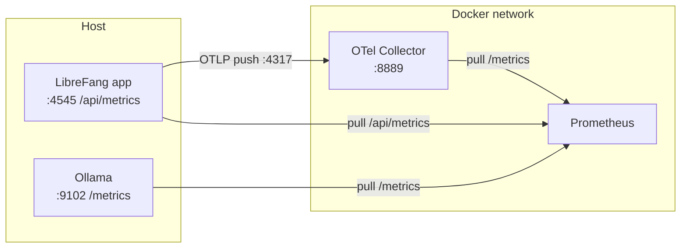

# deploy — prometheus

# deploy — prometheus

## Overview

This module contains the Prometheus scrape configuration for the LibreFang observability stack. It defines which services Prometheus polls for metrics, how often, and through what endpoints. The file `prometheus.yml` is the single source of truth for target discovery and collection cadence.

Prometheus uses a **pull model**: it actively scrapes each configured target on a fixed interval and stores the resulting time series. This configuration does not push anything anywhere — it only declares where and when Prometheus should pull.

## Configuration Reference

### Global settings

| Setting | Value | Meaning |
|---|---|---|
| `scrape_interval` | `15s` | How often Prometheus pulls metrics from every target. |
| `evaluation_interval` | `15s` | How often Prometheus evaluates alerting and recording rules. |

Both intervals are deliberately set to the same 15-second window to keep metric freshness and rule evaluation in lockstep. If alert rules are added later, they will fire no later than 15 seconds after the condition first becomes true.

### Scrape targets

The configuration declares three jobs. Each job has a `job_name`, a `metrics_path`, and one or more targets with static labels.

#### 1. `librefang` — the application

- **Path:** `/api/metrics`
- **Target:** `host.docker.internal:4545`
- **Label:** `instance: "librefang-local"`

This is the primary LibreFang service exposing its own application-level metrics on its HTTP API. The `host.docker.internal` hostname resolves to the Docker host, meaning LibreFang is expected to be running outside the collector's Docker network (e.g., launched directly on the developer's machine or in a separate compose project).

#### 2. `ollama` — the LLM inference server

- **Path:** `/metrics`
- **Target:** `host.docker.internal:9102`
- **Label:** `instance: "ollama-local"`

Scrapes the Ollama metrics endpoint. Ollama's native metrics are exposed at `/metrics`, and Prometheus consumes them directly. Like LibreFang, this target is reached via the Docker host, so Ollama must bind to a port reachable from the host network.

#### 3. `otel-collector` — OpenTelemetry relay

- **Path:** `/metrics`
- **Target:** `otel-collector:8889`
- **Label:** `instance: "otel-collector"`

This job scrapes the OpenTelemetry Collector's Prometheus exporter port. Unlike the other two jobs, this target uses the Docker service name `otel-collector`, meaning the collector runs in the same Docker network as Prometheus. The collector acts as an intermediary for OTLP-emitted metrics: LibreFang pushes metrics to the collector over OTLP (gRPC on `:4317`), the collector processes and exports them, and Prometheus then pulls the aggregated result from `:8889`.

## Metrics collection topology

The three jobs form two distinct collection paths — a direct pull and an indirect relay:



Note that LibreFang is scraped **twice** through two independent paths: directly by Prometheus at `/api/metrics`, and indirectly via the OTel collector at `:8889`. This redundancy is intentional during bring-up — the direct scrape captures metrics the application emits in Prometheus exposition format, while the collector path captures metrics emitted via OpenTelemetry SDKs. When hardening the stack, pick one path per metric family to avoid double-counting.

## How this connects to the rest of the codebase

- **`deploy/` siblings.** This config is consumed by whatever brings Prometheus up — typically a `docker-compose.yml` or equivalent in `deploy/` that mounts `prometheus.yml` into the Prometheus container. The service name `otel-collector` used as a target hostname must match the service name defined in that compose file.
- **LibreFang application.** The `/api/metrics` endpoint is implemented by the LibreFang HTTP server. Any change to that path or the port it listens on must be reflected here, or the `librefang` scrape will fail.
- **Ollama deployment.** Port `9102` is the expected Ollama metrics port. If Ollama is reconfigured to expose metrics on a different port, update the target here.
- **Alerting rules.** `evaluation_interval` is set, but no rule files are referenced in this config. If alert rules are added under `rule_files:`, the evaluation interval governs how quickly they fire.

## Operational notes

- **`host.docker.internal` portability.** This hostname works out of the box on Docker Desktop (macOS, Windows) but requires extra setup on Linux (e.g., `--add-host=host.docker.internal:host-gateway`). If Prometheus is deployed on a Linux host, ensure that mapping exists in the compose service definition.
- **No service discovery.** All targets use `static_configs`, so adding or removing a service requires editing this file and reloading Prometheus (`POST /-/reload` or container restart). There is no dynamic discovery (Consul, Kubernetes, EC2, etc.).
- **No alerting or recording rules declared.** The `evaluation_interval` is a no-op until a `rule_files:` block is added. Operators adding alerts should place rule YAMLs alongside this file and reference them from the config.
- **No remote write/read.** Metrics stay local to the Prometheus instance. If long-term storage or federation is needed, add a `remote_write` block pointing at the chosen sink.

## Extending the configuration

To add a new scrape target, append a job block under `scrape_configs`:

```yaml
  - job_name: "my-service"
    metrics_path: /metrics
    static_configs:
      - targets: ["my-service:8080"]
        labels:
          instance: "my-service-local"
```

Keep these conventions consistent:

- Use the Docker service name as the hostname for anything inside the Prometheus network.
- Use `host.docker.internal:<port>` for services running on the host.
- Set a human-readable `instance` label that reflects *where* the service runs, not just its name — this makes Grafana dashboards and alerts easier to read when the same service is deployed in multiple environments.