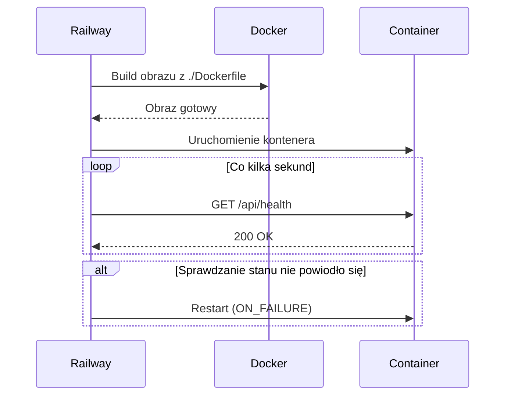

# deploy — railway

# Konfiguracja wdrożenia na Railway

## Przegląd

Moduł `deploy/railway` zawiera pliki konfiguracyjne określające sposób budowania i wdrażania aplikacji na platformie [Railway](https://railway.com). Railway odczytuje jeden z tych plików podczas wdrożenia, aby ustalić lokalizację pliku Dockerfile, endpoint sprawdzania stanu oraz zachowanie restartu kontenera.

## Pliki

| Plik | Format | Zastosowanie |
|------|--------|---------------|
| `railway.json` | JSON (walidacja schematem) | Konfiguracja główna, walidowana względem opublikowanego schematu Railway |
| `railway.toml` | TOML | Alternatywna konfiguracja dla narzędzi lub edytorów preferujących TOML |

Oba pliki deklarują identyczne ustawienia. Railway użyje dowolnego z dostępnych formatów; jeśli istnieją oba, `railway.json` zazwyczaj ma pierwszeństwo. Utrzymanie ich spójności jest istotne, aby uniknąć nieoczekiwanego zachowania.

## Odniesienie do konfiguracji

### Budowanie

```json
{
  "build": {
    "dockerfilePath": "./Dockerfile"
  }
}
```

- **`dockerfilePath`** — Ścieżka względna do pliku Dockerfile używanego do budowania obrazu. Ścieżka jest resolved od głównego katalogu repozytorium (lub skonfigurowanego katalogu usługi). Wskazuje na `./Dockerfile`, co oznacza, że Railway oczekuje pliku Dockerfile na najwyższym poziomie projektu.

### Wdrożenie

```json
{
  "deploy": {
    "healthcheckPath": "/api/health",
    "restartPolicyType": "ON_FAILURE"
  }
}
```

- **`healthcheckPath`** — Ścieżka HTTP, którą Railway odpytuje, aby potwierdzić, że kontener jest zdrowy i gotowy do obsługi ruchu. Aplikacja **musi** eksponować `GET /api/health` i zwracać kod statusu `200` po pełnym uruchomieniu. Niepowodzenie sprawdzania stanu zablokuje przejście wdrożenia na produkcję.
- **`restartPolicyType`** — Określa, kiedy Railway restartuje kontener. `ON_FAILURE` oznacza, że kontener jest restartowany tylko wtedy, gdy zakończy działanie z kodem różnym od zera. Awarie wyzwalają restart; czyste zakończenia (`0`) — nie.

## Powiązanie z bazą kodu

Ten moduł zawiera wyłącznie konfigurację; nie posiada kodu wykonywalnego ani wewnętrznych zależności wywołań. Stanowi jednak dwa twarde kontrakty z resztą aplikacji:

1. **Plik `Dockerfile` musi istnieć** w głównym katalogu repozytorium i umożliwiać budowanie uruchamialnego obrazu.
2. **Endpoint `/api/health` musi być zaimplementowany** przez serwer HTTP aplikacji i musi zwracać `200 OK`, gdy usługa jest gotowa.

Jeśli dowolny z tych elementów jest nieobecny lub błędnie skonfigurowany, wdrożenia na Railway zakończą się niepowodzeniem lub zawieszą się na etapie sprawdzania stanu.

## Cykl życia wdrożenia



## Modyfikacja tego modułu

Zmieniając zachowanie wdrożenia:

1. **Zaktualizuj oba pliki** (`railway.json` i `railway.toml`), aby pozostały spójne.
2. **Zweryfikuj endpoint sprawdzania stanu** — nadal odpowiada pod `/api/health`, jeśli zmienisz `healthcheckPath`.
3. **Potwierdź poprawność ścieżki pliku Dockerfile** względem głównego katalogu usługi Railway, jeśli restrukturyzujesz repozytorium.
4. **Sprawdź [odniesienie do konfiguracji Railway](https://docs.railway.com/deploy/config-as-code)**, aby zapoznać się z pełną listą obsługiwanych kluczy przed dodaniem nowych ustawień.

## Często używane ustawienia, które możesz dodać

Te ustawienia nie są obecnie skonfigurowane, ale często się przydają:

- **`restartPolicyMaxRetries`** — Ogranicza liczbę restartów nieudanego kontenera przez Railway przed poddaniem się.
- **`healthcheckTimeout`** — Określa czas oczekiwania na odpowiedź sprawdzania stanu przed uzaniem jej za nieudaną.
- **`numReplicas`** — Skaluje usługę na wiele instancji kontenera.
- **`env`** — Wbudowane zmienne środowiskowe (choć zazwyczaj preferowany jest panel Railway lub połączone zmienne).
