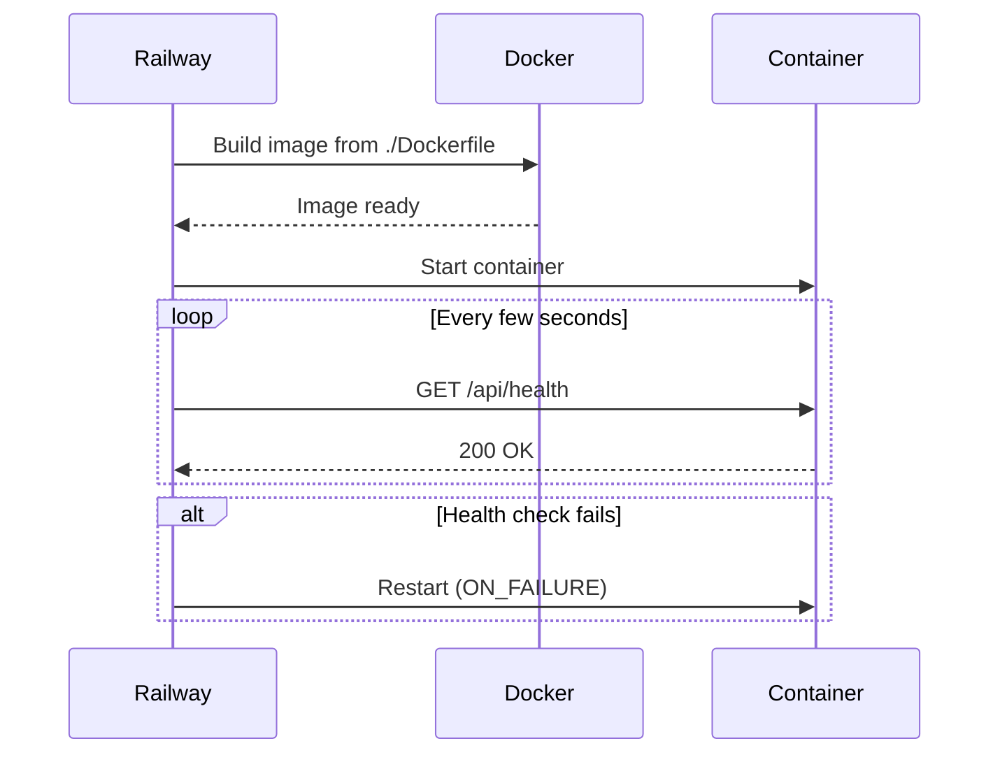

# deploy — railway

# Railway Deployment Configuration

## Overview

The `deploy/railway` module contains configuration files that define how the application is built and deployed on the [Railway](https://railway.com) platform. Railway reads one of these files at deploy time to determine the Dockerfile location, health check endpoint, and container restart behavior.

## Files

| File | Format | Usage |
|------|--------|-------|
| `railway.json` | JSON (schema-validated) | Primary configuration, validated against Railway's published schema |
| `railway.toml` | TOML | Alternative configuration for tooling or editor workflows that prefer TOML |

Both files declare identical settings. Railway will use whichever format is present; if both exist, `railway.json` typically takes precedence. Keeping them in sync is important to avoid unexpected behavior.

## Configuration Reference

### Build

```json
{
  "build": {
    "dockerfilePath": "./Dockerfile"
  }
}
```

- **`dockerfilePath`** — Relative path to the Dockerfile used for the image build. The path is resolved from the repository root (or the configured service root). It points to `./Dockerfile`, meaning Railway expects a Dockerfile at the top level of the project.

### Deploy

```json
{
  "deploy": {
    "healthcheckPath": "/api/health",
    "restartPolicyType": "ON_FAILURE"
  }
}
```

- **`healthcheckPath`** — HTTP path Railway polls to confirm the container is healthy and ready to receive traffic. The application **must** expose `GET /api/health` and return a `200` status code when fully started. A failing health check will block the deployment from going live.
- **`restartPolicyType`** — Controls when Railway restarts the container. `ON_FAILURE` means the container restarts only when it exits with a non-zero code. Crashes trigger a restart; clean exits (`0`) do not.

## How It Connects to the Codebase

This module is configuration-only; it has no executable code or internal call dependencies. However, it establishes two hard contracts with the rest of the application:

1. **A `Dockerfile` must exist** at the repository root capable of building a runnable image.
2. **An `/api/health` endpoint must be implemented** by the application's HTTP server and must return `200 OK` once the service is ready.

If either of these is missing or misconfigured, Railway deploys will fail or stall at the health-check stage.

## Deployment Lifecycle



## Modifying This Module

When changing deployment behavior:

1. **Update both files** (`railway.json` and `railway.toml`) so they remain consistent.
2. **Verify the health endpoint** still responds at `/api/health` if you change `healthcheckPath`.
3. **Confirm the Dockerfile path** is correct relative to the Railway service root if you restructure the repository.
4. **Consult the [Railway configuration reference](https://docs.railway.com/deploy/config-as-code)** for the full list of supported keys before adding new settings.

## Common Settings You Might Add

These are not currently configured but are frequently useful:

- **`restartPolicyMaxRetries`** — Limits how many times Railway restarts a failing container before giving up.
- **`healthcheckTimeout`** — How long to wait for a health-check response before considering it failed.
- **`numReplicas`** — Scales the service across multiple container instances.
- **`env`** — Inline environment variables (though Railway's dashboard or linked variables are usually preferred).