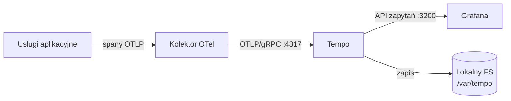

# deploy — tempo

# deploy/tempo

Konfiguracja Grafana Tempo dla lokalnego stosu deweloperskiego LibreFang. Ten moduł udostępnia backend rozproszonego śledzenia (distributed tracing), który przechowuje i odpytuje ślady OpenTelemetry emitowane przez usługi aplikacyjne podczas dewelopmentu.

## Cel

Ta konfiguracja definiuje minimalne wdrożenie Tempo w **trybie pojedynczego binary** z **lokalnym przechowywaniem na systemie plików**. Istnieje, aby zapewnić deweloperom działający potok śledzenia (trace pipeline) w lokalnym stosie Docker — usługi emitują spany, Tempo je przechowuje, a Grafana je odpytuje w celu wizualizacji.

W tym module nie ma kodu wykonywalnego; jest to statyczny plik konfiguracyjny zużywany przez kontener Tempo przy starcie.

## Architektura

Tempo znajduje się za kolektorem OpenTelemetry i przed Grafaną w potoku śledzenia:



Kluczowy szczegół sieciowy: Tempo nasłuchuje OTLP/gRPC na porcie **4317** *wewnątrz sieci Docker*. Port 4317 maszyny hosta jest przypisany do kolektora, nie do Tempo — więc ślady przepływają app → kolektor → Tempo bez bezpośredniego wystawienia Tempo na hosta.

## Odniesienie do konfiguracji

### Serwer

```yaml
server:
  http_listen_port: 3200
```

Port `3200` to HTTP API zapytań Tempo. Datasource Tempo w Grafanie wskazuje na ten port, aby wykonywać zapytania o ślady (np. `Search`, `TraceQL`).

### Dystrybutor / Pozyskiwanie

```yaml
distributor:
  receivers:
    otlp:
      protocols:
        grpc:
          endpoint: 0.0.0.0:4317
```

Tempo przyjmuje ślady OTLP/gRPC na `0.0.0.0:4317`. Kolektor jest skonfigurowany do przekazywania na ten endpoint przez sieć Docker.

### Przechowywanie danych

```yaml
storage:
  trace:
    backend: local
    wal:
      path: /var/tempo/wal
    local:
      path: /var/tempo/blocks
```

Używa backendu lokalnego systemu plików — nie wymaga konfiguracji S3, GCS ani Azure. Używane są dwa katalogi:

- **`/var/tempo/wal`** — Dziennik zapisu wyprzedzającego (write-ahead log) dla przychodzących śladów, zanim zostaną zapisane w blokach.
- **`/var/tempo/blocks`** — Skompaktowane, odpytywalne przechowywanie śladów.

Obie ścieżki są wewnętrzne dla kontenera i powinny być wspierane przez wolumen Docker, jeśli pożądane jest zachowanie danych pomiędzy restartami kontenera.

## Uwagi operacyjne

### Wartości domyślne

Kadencja zapisu (flush) ingestera i retencja kompaktora używają wbudowanych wartości domyślnych Tempo. Nie zdefiniowano sekcji `ingester:` ani `compactor:`.

### Dostosowywanie retencji i zapisu

Aby zmienić zachowanie zapisu lub retencji śladów, dodaj sekcje najwyższego poziomu `ingester:` lub `compactor:`. Te bloki używają **ścisłego dekodowania** — nieprawidłowe lub błędnie zapisane klucze spowodują niepowodzenie startu Tempo. Zawsze konsultuj dokumentację Tempo pod kątem dokładnego schematu dopasowanego do wersji obrazu przed edycją.

### Relacja z kolektorem

Tempo nie odbiera śladów bezpośrednio od procesów aplikacyjnych w tym stosie. Kolektor OpenTelemetry (nasłuchujący na porcie `4317` hosta) jest jedynym punktem pozyskiwania, a on przekazuje do Tempo wewnętrznie. Oznacza to:

- Instrumentacja aplikacji musi znać tylko endpoint kolektora.
- Tempo może pozostać niewystawione na hosta, co upraszcza zarządzanie portami.
- Przetwarzanie wsadowe, ponowne próby i wzbogacanie atrybutów odbywają się w kolektorze, zanim ślady dotrą do Tempo.
