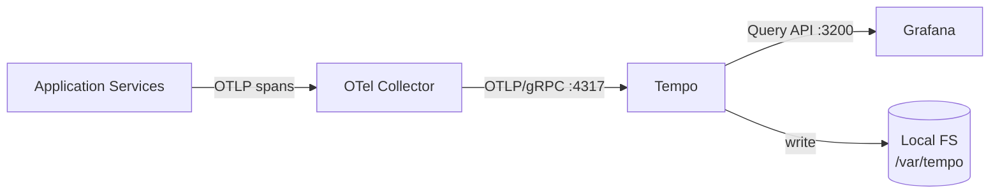

# deploy — tempo

# deploy/tempo

Grafana Tempo configuration for the LibreFang local development stack. This module provides a distributed tracing backend that stores and queries OpenTelemetry traces emitted by application services during development.

## Purpose

This config defines a minimal Tempo deployment in **single-binary mode** with **local filesystem storage**. It exists to give developers a working trace pipeline in the local Docker stack — services emit spans, Tempo stores them, and Grafana queries them for visualization.

There is no executable code in this module; it is a static configuration file consumed by the Tempo container at startup.

## Architecture

Tempo sits downstream of the OpenTelemetry collector and upstream of Grafana in the trace pipeline:



Key networking detail: Tempo listens for OTLP/gRPC on port **4317** *inside the Docker network*. The host machine's port 4317 is bound to the collector, not Tempo — so traces flow app → collector → Tempo without Tempo ever being exposed directly to the host.

## Configuration Reference

### Server

```yaml
server:
  http_listen_port: 3200
```

Port `3200` is Tempo's HTTP query API. Grafana's Tempo datasource points at this port to execute trace queries (e.g., `Search`, `TraceQL`).

### Distributor / Ingestion

```yaml
distributor:
  receivers:
    otlp:
      protocols:
        grpc:
          endpoint: 0.0.0.0:4317
```

Tempo accepts OTLP/gRPC traces on `0.0.0.0:4317`. The collector is configured to forward to this endpoint over the Docker network.

### Storage

```yaml
storage:
  trace:
    backend: local
    wal:
      path: /var/tempo/wal
    local:
      path: /var/tempo/blocks
```

Uses the local filesystem backend — no S3, GCS, or Azure configuration required. Two directories are used:

- **`/var/tempo/wal`** — Write-ahead log for incoming traces before they are flushed to blocks.
- **`/var/tempo/blocks`** — Compacted, queryable trace storage.

Both paths are internal to the container and should be backed by a Docker volume if persistence across container restarts is desired.

## Operational Notes

### Defaults

Ingester flush cadence and compactor retention use Tempo's built-in defaults. No `ingester:` or `compactor:` sections are defined.

### Customizing Retention and Flush

To change flush behavior or trace retention, add `ingester:` or `compactor:` top-level sections. These blocks use **strict decoding** — invalid or misspelled keys will cause Tempo to fail to start. Always consult the Tempo documentation for the exact schema matching your image version before editing.

### Relationship to the Collector

Tempo does not receive traces directly from application processes in this stack. The OpenTelemetry collector (listening on the host's `4317`) is the single ingestion point, and it forwards to Tempo internally. This means:

- Application instrumentation only needs to know about the collector's endpoint.
- Tempo can remain unexposed to the host, simplifying port management.
- Batch processing, retries, and attribute enrichment happen in the collector before traces reach Tempo.