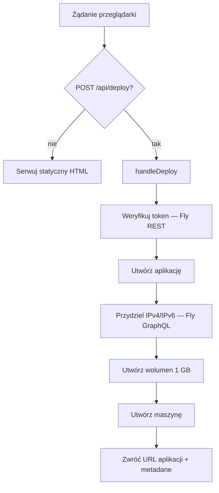

# deploy — worker

# deploy — worker

Cloudflare Worker napędzający `deploy.librefang.ai` — portal jednoklikkowego wdrażania dla LibreFang. Serwuje statyczną stronę HTML z przeglądem wielu opcji wdrażania i udostępnia jeden endpoint API (`POST /api/deploy`), który orkiestruje pełne wdrożenie na Fly.io w imieniu użytkownika.

## Przeznaczenie

Worker pozwala użytkownikom wdrożyć instancję LibreFang na Fly.io bez instalowania jakichkolwiek narzędzi. Użytkownik podaje osobisty token dostępu Fly.io przez interfejs; worker używa REST-owych i GraphQL-owych API Fly.io, aby utworzyć aplikację, przydzielić adresy IP, utworzyć trwały wolumen i uruchomić maszynę z obrazem `ghcr.io/librefang/librefang:latest`.

Oprócz Fly.io, serwowana strona HTML zawiera linki do alternatywnych ścieżek wdrażania (Render, Railway, GCP przez Terraform, Docker oraz platformowe instalatory lokalne), ale tylko ścieżka Fly.io jest obsługiwana po stronie serwera przez ten worker.

## Architektura

Worker to pojedynczy moduł (`src/index.js`) z domyślnym eksportem implementującym handler Cloudflare `fetch(request, env)`. Routing jest trywialny — tylko dwie gałęzie:

- `POST /api/deploy` → `handleDeploy(request, env)`
- wszystko inne → statyczna stała `HTML`

Brak persystencji, bazy danych, autentykacji i stanu między żądaniami. Token Fly.io użytkownika jest używany w locie i odrzucany.



## Kluczowe komponenty

### Obsługa żądań

Domyślny eksport sprawdza `url.pathname` i `request.method`. Tylko dokładne dopasowanie `POST /api/deploy` jest przechwytywane; wszystkie pozostałe żądania otrzymują stronę HTML. Brak obsługi przeciążenia metod ani logiki opartej na parametrach zapytania.

### `handleDeploy(request, env)`

Główna funkcja orkiestracji. Wykonuje sześć kolejnych kroków wobec dwóch różnych powierzchni API Fly.io:

| Krok | Powierzchnia API | Endpoint / mutacja |
|------|------------------|--------------------|
| 1. Weryfikacja tokenu | REST (`api.machines.dev/v1`) | `GET /apps` — błąd 401 przerywa z komunikatem błędu dla użytkownika |
| 2. Utworzenie aplikacji | REST | `POST /apps` z `app_name: librefang-<losowe>`, `org_slug: personal` |
| 3. Przydzielenie adresów IP | GraphQL (`api.fly.io/graphql`) | Mutacje `allocateIPAddress` dla `shared_v4` i `v6` |
| 4. Utworzenie wolumenu | REST | `POST /apps/<nazwa>/volumes` — 1 GB, o nazwie `librefang_data` |
| 5. Budowanie env | (lokalne) | Ustawia `LIBREFANG_HOME=/data` i `OPENROUTER_API_KEY` z `env` |
| 6. Utworzenie maszyny | REST | `POST /apps/<nazwa>/machines` z pełną konfiguracją |

**Nazewnictwo aplikacji.** `librefang-` plus `randomHex(6)` — 12 znaków heksadecymalnych z `crypto.getRandomValues`. Kolizje są możliwe, ale mało prawdopodobne ze względu na zachowanie przestrzeni nazw Fly.io.

**Obsługa błędów.** Kroki 1, 2, 4 i 6 sprawdzają `response.ok` i zwracają błąd JSON z treścią odpowiedzi nadrzędnej. Krok 3 (przydzielanie IP) **nie** sprawdza `ok` — błędy w tym kroku są cicho ignorowane. Cała funkcja jest owinięta w `try/catch`, który zwraca ogólny błąd 500 przy każdym wyjątku.

**Kształt odpowiedzi sukcesu:**

```json
{
  "success": true,
  "appName": "librefang-a1b2c3d4e5f6",
  "url": "https://librefang-<hex>.fly.dev",
  "dashboardUrl": "https://fly.io/apps/librefang-<hex>",
  "machineId": "<uuid-maszyny>",
  "region": "nrt"
}
```

### Konfiguracja maszyny

Konfiguracja maszyny przekazywana do Fly.io jest istotna, ponieważ definiuje kształt uruchomieniowy każdej wdrożonej instancji:

- **Obraz:** `ghcr.io/librefang/librefang:latest` (stała `DOCKER_IMAGE`)
- **Region:** `nrt` (Tokio) — zakodowany na stałe przez `REGION`
- **Zasoby obliczeniowe:** 1 współdzielony CPU, 256 MB RAM
- **Usługa:** TCP na wewnętrznym porcie `4545`, ekspozycja przez handlery TLS/HTTP Fly.io na portach 443 i 80
- **Montaż:** wolumen `librefang_data` w `/data`
- **Env:** `LIBREFANG_HOME=/data`, `OPENROUTER_API_KEY` (z `env` workera)

`OPENROUTER_API_KEY` wstrzykiwany do każdej wdrożonej instancji realizuje obietnicę „darmowy LLM, bez klucza API" na stronie docelowej — własny skonfigurowany klucz workera jest ponownie używany we wszystkich wdrożeniach.

### Statyczny HTML

Stała `HTML` to samodzielna strona docelowa (bez zewnętrznego JS/CSS poza zestawem ikon SVG/emoji). Zawiera:

- Siatkę wyboru platformy (Fly.io, Render, Railway, GCP, Docker oraz instalatory lokalne macOS/Linux/Windows)
- Ukryty formularz wdrażania Fly.io, ujawniany po kliknięciu karty Fly.io
- Skrypt JS po stronie klienta (funkcja `deploy()`), który wysyła żądanie POST na `/api/deploy` i animuje pięciostopniowy wskaźnik postępu przy stałym interwale 1,5 s

Animacja postępu **nie** jest napędzana rzeczywistymi zdarzeniami serwerowymi — to kosmetyczny `setInterval`, który przesuwa kroki niezależnie od faktycznego żądania fetch. Gdy fetch się rozwiąże, wszystkie kroki są oznaczane jako ukończone (przy sukcesie) lub resetowane (przy niepowodzeniu).

### Funkcje pomocnicze

- `randomHex(len)` — kryptograficznie losowy ciąg heksadecymalny przez `crypto.getRandomValues`.
- `json(data, status)` — skrót do `new Response(JSON.stringify(...))` z poprawnym typem zawartości.

## Konfiguracja

### `wrangler.toml`

```toml
name = "librefang-deploy"
main = "src/index.js"
compatibility_date = "2024-12-01"

routes = [
  { pattern = "deploy.librefang.ai/*", zone_name = "librefang.ai" }
]
```

Worker jest powiązany z trasą `deploy.librefang.ai/*` w strefie `librefang.ai`. Komentarz w tomlu wskazuje, że wdrażanie jest automatyzowane przez GitHub Actions — nie ma ręcznego kroku publikacji w normalnym przepływie pracy.

### Wymagane sekrety

| Sekret | Przeznaczenie |
|--------|---------------|
| `OPENROUTER_API_KEY` | Wstrzykiwany do każdej wdrożonej instancji jako domyślny klucz dostawcy LLM. Jeśli nie jest ustawiony, wysyłany jest pusty ciąg, a wdrożone instancje nie będą miały działającego domyślnego modelu. |

Ustawiany przez `wrangler secret put OPENROUTER_API_KEY`.

## Stałe

Wszystkie parametry konfiguracyjne znajdują się na górze `src/index.js`:

```js
const FLY_API = 'https://api.machines.dev/v1';
const DOCKER_IMAGE = 'ghcr.io/librefang/librefang:latest';
const REGION = 'nrt';
```

Zmiana regionu lub obrazu wymaga edycji źródła — nie ma konfiguracji czasu wykonania dla tych wartości.

## Uwagi dotyczące bezpieczeństwa

- Token Fly.io użytkownika przechodzi przez worker, ale **nigdy nie jest przechowywany** — żyje tylko w zmiennych zasięgu żądania. Strona docelowa wyraźnie o tym informuje.
- Worker sam w sobie nie ma autentykacji na `/api/deploy`; każdy, kto może dotrzeć do `deploy.librefang.ai`, może wyzwolić wdrożenie używając własnego tokenu Fly.io. Nadużycia są ograniczone wymogiem posiadania ważnego tokenu Fly przez wywołującego.
- `OPENROUTER_API_KEY` jest sekretem workera, który jest wbudowywany w środowisko każdej wdrożonej instancji. Każdy, kto wdraża przez ten worker, skutecznie otrzymuje klucz OpenRouter operatora workera.

## Modyfikowanie

Typowe zmiany:

- **Zmiana domyślnego regionu:** edytuj `REGION`. Kody regionów Fly to trzy litery (`nrt`, `sjc`, `fra` itd.).
- **Zwiększenie zasobów maszyny:** edytuj blok `guest` w kroku 6 (`cpus`, `memory_mb`, `cpu_kind`).
- **Zmiana źródła dołączonego klucza LLM:** zastąp `env.OPENROUTER_API_KEY` w konstrukcji `env_vars`. Całkowite usunięcie oznacza, że wdrożone instancje uruchomią się bez domyślnego modelu.
- **Dodanie nowej karty platformy:** dodaj znaczniki wewnątrz `#platform-selection .platform-grid`. Karty linkujące zewnętrznie używają `<a class="platform-card">`; karty ujawniające formularze wbudowane używają `onclick`.
- **Zaostrzenie obsługi błędów alokacji IP:** krok 3 obecnie ignoruje błędy. Jeśli chcesz ścisłego zachowania, sprawdzaj `.ok` w obu odpowiedziach GraphQL i prezentuj błędy tak samo jak kroki 2/4/6.

## Relacja z resztą bazy kodu

Ten worker jest jednym z kilku pomocników wdrażania w katalogu `deploy/`:

- `deploy/fly/deploy.sh` — skrypt wdrażania Fly.io oparty na terminalu, linkowany z karty „wdrażaj z terminala" na stronie docelowej.
- `deploy/docker-compose.yml` — linkowany z karty Docker.
- `deploy/gcp/` — moduł Terraform linkowany z karty GCP.

Worker nie importuje ani nie odwołuje się do żadnego z nich — linkuje do nich wyłącznie przez URL-e w statycznym HTML. Wdrażany obraz Docker (`ghcr.io/librefang/librefang:latest`) jest budowany gdzie indziej w CI i nie jest produkowany przez nic w `deploy/worker/`.
