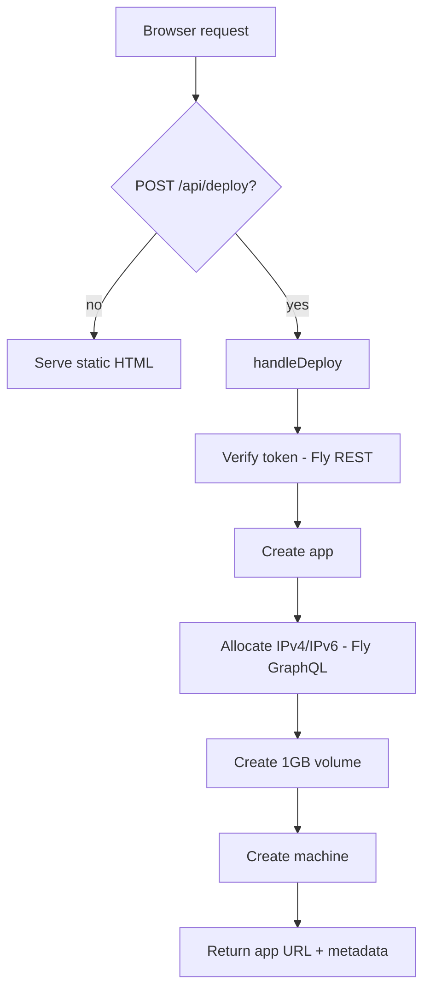

# deploy — worker

# deploy — worker

A Cloudflare Worker that powers `deploy.librefang.ai`, a one-click deployment portal for LibreFang. It serves a static HTML landing page showcasing multiple deployment options and exposes a single API endpoint (`POST /api/deploy`) that orchestrates a full Fly.io deployment on behalf of the user.

## Purpose

The worker lets users deploy a LibreFang instance to Fly.io without installing any tooling. The user supplies a Fly.io personal access token through the UI; the worker uses the Fly.io REST and GraphQL APIs to provision an app, allocate IPs, create a persistent volume, and launch a machine running the `ghcr.io/librefang/librefang:latest` image.

Beyond Fly.io, the served HTML page links out to alternative deployment paths (Render, Railway, GCP via Terraform, Docker, and platform-specific local installers), but only the Fly.io path is handled server-side by this worker.

## Architecture

The worker is a single module (`src/index.js`) with a default export implementing the Cloudflare `fetch(request, env)` handler. Routing is trivial — two branches only:

- `POST /api/deploy` → `handleDeploy(request, env)`
- everything else → the static `HTML` constant

There is no persistence, no database, no authentication, and no state between requests. The user's Fly.io token is used in-flight and discarded.



## Key components

### Request handler

The default export inspects `url.pathname` and `request.method`. Only the exact match `POST /api/deploy` is intercepted; all other requests get the HTML page. There is no method-overload handling or query-string logic.

### `handleDeploy(request, env)`

The core orchestration function. It performs six sequential steps against two different Fly.io API surfaces:

| Step | API surface | Endpoint / mutation |
|------|-------------|---------------------|
| 1. Verify token | REST (`api.machines.dev/v1`) | `GET /apps` — a 401 here aborts with a user-facing error |
| 2. Create app | REST | `POST /apps` with `app_name: librefang-<random>`, `org_slug: personal` |
| 3. Allocate IPs | GraphQL (`api.fly.io/graphql`) | `allocateIPAddress` mutations for `shared_v4` and `v6` |
| 4. Create volume | REST | `POST /apps/<name>/volumes` — 1 GB, named `librefang_data` |
| 5. Build env | (local) | Sets `LIBREFANG_HOME=/data` and `OPENROUTER_API_KEY` from `env` |
| 6. Create machine | REST | `POST /apps/<name>/machines` with full config |

**App naming.** `librefang-` plus `randomHex(6)` — 12 hex chars from `crypto.getRandomValues`. Collisions are possible but unlikely given Fly.io's namespace behavior.

**Error handling.** Steps 1, 2, 4, and 6 check `response.ok` and return a JSON error with the upstream response body. Steps 3 (IP allocation) intentionally do **not** check `ok` — failures here are silently ignored. The whole function is wrapped in a `try/catch` that returns a generic 500 on any thrown exception.

**Success response shape:**

```json
{
  "success": true,
  "appName": "librefang-a1b2c3d4e5f6",
  "url": "https://librefang-<hex>.fly.dev",
  "dashboardUrl": "https://fly.io/apps/librefang-<hex>",
  "machineId": "<machine-uuid>",
  "region": "nrt"
}
```

### Machine configuration

The machine config passed to Fly.io is worth understanding because it defines the runtime shape of every deployed instance:

- **Image:** `ghcr.io/librefang/librefang:latest` (constant `DOCKER_IMAGE`)
- **Region:** `nrt` (Tokyo) — hardcoded via `REGION`
- **Compute:** 1 shared CPU, 256 MB RAM
- **Service:** TCP on internal port `4545`, exposed via Fly's TLS/HTTP handlers on 443 and 80
- **Mount:** `librefang_data` volume at `/data`
- **Env:** `LIBREFANG_HOME=/data`, `OPENROUTER_API_KEY` (from the worker's `env`)

The `OPENROUTER_API_KEY` injected into each deployed instance is what powers the "free LLM, no API key needed" promise on the landing page — the worker's own configured key is reused across all deployments.

### Static HTML

The `HTML` constant is a self-contained landing page (no external JS/CSS beyond an SVG/emoji icon set). It contains:

- A platform-selection grid (Fly.io, Render, Railway, GCP, Docker, plus macOS/Linux/Windows local installers)
- A hidden Fly.io deploy form revealed by clicking the Fly.io card
- Client-side JS (`deploy()` function) that posts to `/api/deploy` and animates a five-step progress indicator on a fixed 1.5 s interval

The progress animation is **not** driven by real server-sent events — it is a cosmetic `setInterval` that advances steps independently of the actual fetch. When the fetch resolves, all steps are marked done (on success) or reset (on failure).

### Helpers

- `randomHex(len)` — cryptographically random hex string via `crypto.getRandomValues`.
- `json(data, status)` — shorthand for `new Response(JSON.stringify(...))` with the correct content type.

## Configuration

### `wrangler.toml`

```toml
name = "librefang-deploy"
main = "src/index.js"
compatibility_date = "2024-12-01"

routes = [
  { pattern = "deploy.librefang.ai/*", zone_name = "librefang.ai" }
]
```

The worker is bound to the `deploy.librefang.ai/*` route on the `librefang.ai` zone. The toml comment notes that deployment is automated via GitHub Actions — there is no manual publish step in normal workflow.

### Required secrets

| Secret | Purpose |
|--------|---------|
| `OPENROUTER_API_KEY` | Injected into every deployed instance as the default LLM provider key. If unset, an empty string is sent, and deployed instances will not have a working default model. |

Set via `wrangler secret put OPENROUTER_API_KEY`.

## Constants

All tunables live at the top of `src/index.js`:

```js
const FLY_API = 'https://api.machines.dev/v1';
const DOCKER_IMAGE = 'ghcr.io/librefang/librefang:latest';
const REGION = 'nrt';
```

Changing the region or image requires editing the source — there is no runtime configuration for these.

## Security considerations

- The user's Fly.io token transits the worker but is **never stored** — it lives only in request-scoped variables. The landing page explicitly advertises this.
- The worker itself has no auth on `/api/deploy`; anyone who can reach `deploy.librefang.ai` can trigger a deployment using their own Fly.io token. Abuse is bounded by the caller needing a valid Fly token.
- `OPENROUTER_API_KEY` is a worker secret that gets baked into every deployed instance's env. Anyone who deploys via this worker effectively receives the worker operator's OpenRouter key.

## Modifying

Common changes:

- **Change default region:** edit `REGION`. Fly region codes are three letters (`nrt`, `sjc`, `fra`, etc.).
- **Bump machine resources:** edit the `guest` block in step 6 (`cpus`, `memory_mb`, `cpu_kind`).
- **Change the bundled LLM key source:** replace `env.OPENROUTER_API_KEY` in the `env_vars` construction. Removing it entirely means deployed instances boot without a default model.
- **Add a new platform card:** add markup inside `#platform-selection .platform-grid`. Cards that link externally use `<a class="platform-card">`; cards that reveal inline forms use `onclick`.
- **Tighten IP-allocation error handling:** steps 3 currently ignore failures. If you want strict behavior, check `.ok` on both GraphQL responses and surface errors the same way steps 2/4/6 do.

## Relationship to the rest of the codebase

This worker is one of several deploy helpers under `deploy/`:

- `deploy/fly/deploy.sh` — terminal-based Fly.io deploy script, linked from the landing page's "deploy from your terminal" card.
- `deploy/docker-compose.yml` — linked from the Docker card.
- `deploy/gcp/` — Terraform module linked from the GCP card.

The worker does not import or reference any of these — it links to them purely via URLs in the static HTML. The deployed Docker image (`ghcr.io/librefang/librefang:latest`) is built elsewhere in CI and is not produced by anything in `deploy/worker/`.