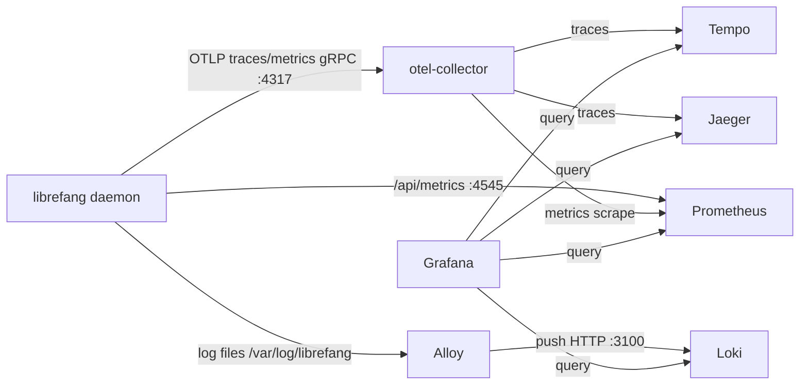

# deploy

# deploy — Wdrażanie i Obserwowalność

Wszystko, co potrzebne do uruchomienia LibreFang w środowisku produkcyjnym, deweloperskim lub jednym kliknięciem z przeglądarki. Ten moduł grupuje trzy obszary: definicje wdrażania kontenerów/hostów, automatyzację wdrażania specyficzną dla platform oraz lokalny stos obserwowalności.

## Struktura w pigułce

| Warstwa | Moduły | Przeznaczenie |
|---------|--------|---------------|
| **Kontener i Host** | Root-level `docker-compose.yml`, `docker-entrypoint.sh`, `librefang.service` | Punkt wejścia obrazu Docker, jednostka systemd i bazowy plik compose |
| **PaaS / Platformy chmurowe** | [fly](fly.md), [gcp](gcp.md), [kubernetes](kubernetes.md), [railway](railway.md), `render.yaml` | Infrastructure-as-code i skrypty bootstrapowe dla każdej platformy |
| **Portal jednym kliknięciem** | [worker](worker.md) | Cloudflare Worker obsługujący `deploy.librefang.ai` |
| **Obserwowalność** | [alloy](alloy.md), [loki](loki.md), [tempo](tempo.md), [otel-collector](otel-collector.md), [prometheus](prometheus.md), [grafana](grafana.md) | Lokalny pipeline telemetrii poprzez `docker-compose.observability.yml` |

## Ścieżki wdrażania

Moduł obsługuje kilka celów wdrażania, każdy samodzielny:

- **Docker / Compose** — Rootowy `docker-compose.yml` pobiera opublikowany obraz i montuje nazwany wolumen w `/data`. [docker-entrypoint.sh](#) obsługuje inicjalizację przy pierwszym uruchomieniu, przepisywanie konfiguracji, zarządzanie uprawnieniami w trybie podwójnym (root dla Dockera, uid 1001 dla zablokowanych Podów Kubernetes) oraz guard wstrzykiwania TOML na `$PORT` / `$LIBREFANG_MODEL`.
- **Kubernetes** — [Manifesty Kustomize](kubernetes.md) uruchamiają StatefulSet z jedną repliką. Skalowanie horyzontalne jest architektonicznie blokowane przez singletony lokalne procesu i wyłączny `flock` na `/data/daemon.lock`.
- **Fly.io** — Interaktywne [skrypty deploy/uninstall](fly.md) oraz szablon `fly.toml`. Dostępne również przez portal jednym kliknięciem.
- **GCP** — [Moduł Terraform](gcp.md) aprowizujący instancję `e2-micro` z bezpłatnego tieru z przekazaniem cloud-init do systemd.
- **Railway / Render** — Walidowany schematem [konfig Railway](railway.md) i Blueprint `render.yaml` celujący w bezpłatny tier Render.
- **Jednym kliknięciem** — [Cloudflare Worker](worker.md) serwuje stronę lądowania i orkiestruje wdrożenia Fly.io poprzez `POST /api/deploy`, używając tokenu Fly.io użytkownika do aprowizacji aplikacji, IP, wolumenu i maszyny.

## Pipeline obserwowalności

Przy lokalnym uruchomieniu z `docker-compose.observability.yml`, sub-moduły tworzą kompletny stos telemetrii:

[OTel Collector](otel-collector.md) jest centralnym węzłem: normalizuje pozyskiwanie danych, tak że demon potrzebuje tylko jednego endpointu, a następnie rozdziela trace'y do [Tempo](tempo.md) i Jaegera oraz mostkuje metryki do [Prometheus](prometheus.md). [Alloy](alloy.md) śledzi pliki logów i przesyła je do [Loki](loki.md). [Grafana](grafana.md) spaja wszystko razem za pomocą czterech prekonfigurowanych źródeł danych i pięciu dashboardów — bez konieczności ręcznej konfiguracji UI.

## Kluczowe przepływy pracy między modułami

1. **Wejście → Inicjalizacja → Serwis** — `docker-entrypoint.sh` weryfikuje środowisko, tworzy `/data` i `logs/`, uruchamia `librefang init` przy pierwszym starcie, przepisuje `config.toml` dla sieci kontenerowej, a następnie wykonuje demona. Ta sekwencja jest wspólna dla Dockera, Kubernetes (ścieżka rootless) i GCP cloud-init.

2. **Portal → Fly.io** — `handleDeploy` w [workerze](worker.md) orkiestruje pełny cykl życia Fly.io: tworzenie aplikacji, alokację wolumenu, przypisanie IP i uruchomienie maszyny — te same kroki co interaktywny [fly/deploy.sh](fly.md), ale po stronie serwera poprzez REST/GraphQL API Fly.io.

3. **Korelacja telemetrii** — Gdy demon oznacza logi `trace_id`, pochodne pola w Grafanie umożliwią przejście kliknięciem ze spana trace'a do odpowiadającego strumienia logów w Loki, łącząc połówki [Tempo](tempo.md) i [Loki](loki.md) w pipeline.
