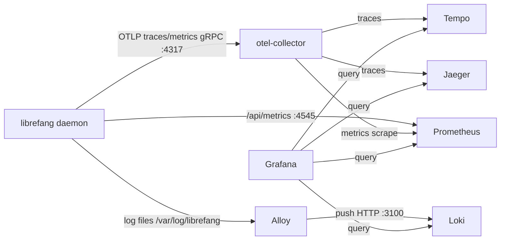

# deploy

# deploy — Deployment & Observability

Everything needed to run LibreFang in production, development, or one-click from a browser. This module groups three concerns: container/host deployment definitions, platform-specific deployment automation, and a local observability stack.

## Structure at a Glance

| Layer | Modules | Purpose |
|-------|---------|---------|
| **Container & Host** | Root-level `docker-compose.yml`, `docker-entrypoint.sh`, `librefang.service` | Docker image entrypoint, systemd unit, and base compose file |
| **PaaS / Cloud Platforms** | [fly](fly.md), [gcp](gcp.md), [kubernetes](kubernetes.md), [railway](railway.md), `render.yaml` | Infrastructure-as-code and bootstrap scripts per platform |
| **One-Click Portal** | [worker](worker.md) | Cloudflare Worker powering `deploy.librefang.ai` |
| **Observability** | [alloy](alloy.md), [loki](loki.md), [tempo](tempo.md), [otel-collector](otel-collector.md), [prometheus](prometheus.md), [grafana](grafana.md) | Local telemetry pipeline via `docker-compose.observability.yml` |

## Deployment Paths

The module supports several deployment targets, each self-contained:

- **Docker / Compose** — The root `docker-compose.yml` pulls the published image and mounts a named volume at `/data`. The [docker-entrypoint.sh](#) handles first-boot init, config rewriting, dual-mode privilege management (root for Docker, uid 1001 for Kubernetes restricted Pods), and a TOML injection guard on `$PORT` / `$LIBREFANG_MODEL`.
- **Kubernetes** — [Kustomize manifests](kubernetes.md) run a single-replica StatefulSet. Horizontal scaling is architecturally blocked by process-local singletons and an exclusive `flock` on `/data/daemon.lock`.
- **Fly.io** — Interactive [deploy/uninstall scripts](fly.md) plus a `fly.toml` template. Also reachable through the one-click portal.
- **GCP** — [Terraform module](gcp.md) provisioning an always-free-tier `e2-micro` with cloud-init handoff to systemd.
- **Railway / Render** — Schema-validated [Railway config](railway.md) and a `render.yaml` Blueprint targeting Render's free tier.
- **One-click** — The [Cloudflare Worker](worker.md) serves a landing page and orchestrates Fly.io deployments via `POST /api/deploy`, using the user's Fly.io token to provision app, IPs, volume, and machine.

## Observability Pipeline

When running locally with `docker-compose.observability.yml`, the sub-modules form a complete telemetry stack:

The [OTel Collector](otel-collector.md) is the central hub: it normalizes ingestion so the daemon only needs one endpoint, then fans out traces to [Tempo](tempo.md) and Jaeger, and bridges metrics to [Prometheus](prometheus.md). [Alloy](alloy.md) tails log files and ships them to [Loki](loki.md). [Grafana](grafana.md) ties everything together with four pre-provisioned datasources and five dashboards — no manual UI configuration required.

## Key Cross-Module Workflows

1. **Entry → Init → Serve** — `docker-entrypoint.sh` validates environment, creates `/data` and `logs/`, runs `librefang init` on first boot, rewrites `config.toml` for container networking, then execs the daemon. This sequence is shared by Docker, Kubernetes (rootless path), and GCP cloud-init.

2. **Portal → Fly.io** — The [worker](worker.md)'s `handleDeploy` orchestrates the full Fly.io lifecycle: app creation, volume allocation, IP assignment, and machine launch — the same steps the interactive [fly/deploy.sh](fly.md) performs, but server-side via the Fly.io REST/GraphQL APIs.

3. **Telemetry correlation** — Once the daemon stamps `trace_id` into log lines, Grafana's derived fields will enable click-through from a trace span to the corresponding log stream in Loki, linking the [Tempo](tempo.md) and [Loki](loki.md) halves of the pipeline.