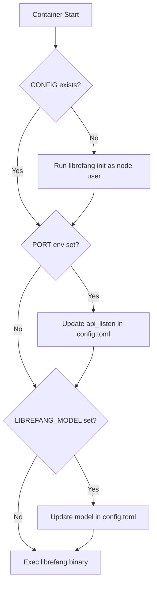

# Deployment — deploy

# LibreFang Deployment Module

The `deploy/` directory contains all artifacts needed to package, ship, and run LibreFang in production environments. This includes Docker builds, systemd services, container orchestration, and observability infrastructure.

## Architecture Overview

LibreFang uses a multi-stage Docker build to produce a lean production image. The final image combines a Rust-compiled binary with a Node.js runtime, supporting both the core daemon and the embedded React dashboard.

```mermaid
flow LR
    subgraph Build["Build Phase"]
        D[Dashboard Source] --> NB[Node Builder]
        RC[Rust Crates] --> RB[Rust Builder]
        NB --> S1[Stage 1 Artifacts]
        RB --> S2[Stage 2 Artifacts]
    end
    
    subgraph Runtime["Runtime Image"]
        S1 --> Final[librefang:latest]
        S2 --> Final
        Final --> DC[Docker Container]
        DC --> V[Volumes]
        DC --> E[Environment]
    end
```

## Docker Build Process

### Multi-Stage Build

The `Dockerfile` produces the final image through three stages:

**Stage 1: Dashboard Builder**
- Base: `node:20-alpine`
- Builds the React dashboard from `crates/librefang-api/dashboard`
- Runs `npm install && npm run build`
- Output: compiled static assets in `./static/react`

**Stage 2: Rust Builder**
- Base: `rust:1-slim-bookworm`
- Compiles the `librefang` binary with `cargo build --release --bin librefang`
- Caches cargo registry, git deps, and target directory via Docker buildkit mounts
- Output: `/usr/local/bin/librefang` binary

**Stage 3: Runtime Image**
- Base: `node:lts-bookworm-slim`
- Installs: `ca-certificates`, `python3`, `libicu72`, `gosu`
- Copies: compiled Rust binary, packages directory, dashboard static files
- Default command: `librefang start --foreground`
- Listens on port 4545

### Image Details

| Component | Version | Purpose |
|-----------|---------|---------|
| Base image | `node:lts-bookworm-slim` | Runtime environment |
| Rust binary | Built from source | Core daemon |
| `gosu` | Latest | Privilege dropping |
| `libicu72` | Debian bookworm | Internationalization support |
| `python3` | Debian package | Future extensibility |

## Container Configuration

### Environment Variables

The `docker-compose.yml` configures these environment variables:

| Variable | Purpose | Required |
|----------|---------|----------|
| `LIBREFANG_LISTEN` | Bind address | No (default: internal) |
| `ANTHROPIC_API_KEY` | Anthropic LLM | Yes |
| `OPENAI_API_KEY` | OpenAI LLM | Yes |
| `GROQ_API_KEY` | Groq LLM | Yes |
| `TELEGRAM_BOT_TOKEN` | Telegram integration | No |
| `DISCORD_BOT_TOKEN` | Discord integration | No |
| `SLACK_BOT_TOKEN` | Slack bot token | No |
| `SLACK_APP_TOKEN` | Slack app-level token | No |

### Volumes

The `librefang-data` Docker volume mounts at `/data` and persists:
- `config.toml` — Main configuration
- Conversation history
- Local database (if used)

### Data Directory Initialization

The entrypoint script handles `/data` directory setup:

1. Creates directory if missing
2. Changes ownership to `node:node` on first run
3. Runs `librefang init` only if `config.toml` doesn't exist
4. Subsequent boots skip initialization (kernel re-syncs registry at startup)

## Entrypoint Script Behavior

The `docker-entrypoint.sh` script executes in this order:



### Platform-Specific Handling

The entrypoint supports cloud platforms that inject environment variables:

| Platform | Injected Variable | Action |
|----------|-------------------|--------|
| Railway | `PORT` | Update `api_listen` in config |
| Render | `PORT` | Update `api_listen` in config |
| Fly | `PORT` | Update `api_listen` in config |

This ensures LibreFang binds to the port the platform allocates, even after container rescheduling.

## Systemd Service

The `librefang.service` file provides systemd integration for Linux servers.

### Installation

```bash
sudo cp deploy/librefang.service /etc/systemd/system/
sudo systemctl daemon-reload
sudo systemctl enable librefang
sudo systemctl start librefang
```

### Security Hardening

The service file applies defense-in-depth measures:

| Setting | Protection |
|---------|------------|
| `NoNewPrivileges=true` | Prevent privilege escalation |
| `ProtectSystem=strict` | Read-only `/usr`, `/boot`, `/etc` |
| `ProtectHome=true` | Hide user home directories |
| `ReadWritePaths=/var/lib/librefang` | Only data dir is writable |
| `PrivateTmp=true` | Isolated `/tmp` and `/var/tmp` |
| `ProtectKernelTunables=true` | Block `/proc/sys` modification |
| `ProtectKernelModules=true` | Block module loading |
| `ProtectControlGroups=true` | Block cgroup manipulation |
| `RestrictSUIDSGID=true` | Block setuid binaries |
| `RestrictRealtime=true` | Block realtime scheduling |

### Resource Limits

```
LimitNOFILE=65536   # Open file descriptors
LimitNPROC=4096     # Process count
```

### Environment

Environment variables load from `/etc/librefang/env` (optional). The service runs as the `librefang` user and group, requiring prior creation:

```bash
sudo useradd -r -s /usr/sbin/nologin librefang
sudo mkdir /var/lib/librefang
sudo chown librefang:librefang /var/lib/librefang
```

## Observability Stack

The `docker-compose.observability.yml` deploys Prometheus and Grafana for monitoring.

### Quick Start

```bash
# Enable metrics in config.toml first
[telemetry]
prometheus_enabled = true

# Start monitoring stack
cd deploy
docker compose -f docker-compose.observability.yml up -d
```

### Metrics Endpoint

Prometheus scrapes `/api/metrics` from the LibreFang daemon every 15 seconds via `host.docker.internal:4545`.

For remote deployments, update `prometheus/prometheus.yml` with the actual host address.

### Grafana Access

- URL: `http://localhost:3000`
- Credentials: `admin` / `admin`
- Dashboards and datasource are auto-provisioned

### Available Dashboards

| Dashboard | Focus |
|-----------|-------|
| `librefang.json` | System health, uptime, agent counts |
| `librefang-llm.json` | Token usage, LLM calls by agent/provider |
| `librefang-http.json` | Request rate, latency, error rates |
| `librefang-cost.json` | Spending estimates, cost trends |

## Cloud Platform Deployment

### Render

The `render.yaml` configures Render.com deployment:

- Runtime: Docker
- Health check: `GET /api/health`
- Compatible with free tier (no persistent disk)
- For persistent storage, upgrade to paid plan and add a disk mounting at `/data`

**Note:** On Render's free tier, data is lost on each deploy because persistent disks aren't supported.

### Railway / Fly / Other

Use the standard `docker-compose.yml` as a base, then configure:
1. Set required `*_API_KEY` environment variables
2. Configure the platform to expose port 4545
3. Mount a persistent volume at `/data` for config and state

## Building from Source

To build the Docker image locally:

```bash
cd deploy
docker build -t librefang:local -f Dockerfile ..
```

Or use the pre-configured docker-compose build:

```bash
# Uncomment the build section in docker-compose.yml first
docker compose build
docker compose up -d
```

## Dependencies Summary

| File | Purpose |
|------|---------|
| `Dockerfile` | Container image definition |
| `docker-compose.yml` | Container orchestration |
| `docker-compose.observability.yml` | Monitoring stack |
| `docker-entrypoint.sh` | Runtime initialization |
| `librefang.service` | systemd unit file |
| `render.yaml` | Render.com deployment |
| `prometheus/prometheus.yml` | Prometheus scrape config |
| `grafana/provisioning/*` | Grafana auto-provisioning |
| `grafana/dashboards/*.json` | Pre-built dashboards |

## Connecting to Core Codebase

The deploy module connects to the rest of LibreFang at these points:

| Artifact | References |
|----------|------------|
| `Dockerfile` | `Cargo.toml`, `Cargo.lock`, `crates/` directory |
| Dashboard build | `crates/librefang-api/dashboard/` |
| Binary path | `--bin librefang` (defined in `Cargo.toml`) |
| Entrypoint `init` command | `librefang kernel` subsystem |
| Metrics endpoint | `crates/librefang-api/src/metrics.rs` |
| Health endpoint | `crates/librefang-api/src/health.rs` |
| Config location | `LIBREFANG_HOME` environment variable |