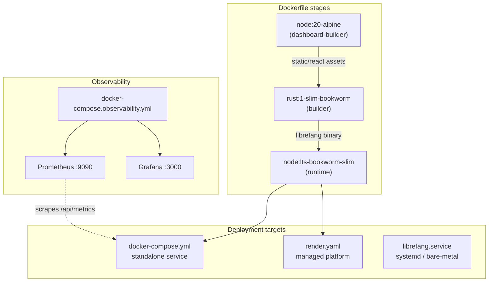

# Deployment — deploy

# Deployment — `deploy/`

Deployment configurations and tooling for LibreFang. This module provides everything needed to run LibreFang in production: a multi-stage Docker build, container orchestration files, a systemd unit for bare-metal installs, a cloud platform blueprint, and a full observability stack.

## Architecture Overview



---

## Dockerfile

A three-stage build that produces a minimal runtime image.

### Stage 1 — `dashboard-builder`

- **Base:** `node:20-alpine`
- Builds the React dashboard from `crates/librefang-api/dashboard`
- Outputs static assets to `/build/static/react`

### Stage 2 — `builder`

- **Base:** `rust:1-slim-bookworm`
- Installs build dependencies (`build-essential`, `pkg-config`, `libssl-dev`, `perl`)
- Copies the full workspace: `Cargo.toml`, `Cargo.lock`, `crates/`, `xtask/`, `packages/`
- Copies the React build artifacts from stage 1 into `crates/librefang-api/static/react`
- Uses Docker build caches for the cargo registry, git clone cache, and `target/` directory to speed up rebuilds
- Produces the release binary at `/usr/local/bin/librefang`

### Stage 3 — Runtime

- **Base:** `node:lts-bookworm-slim`
- Installs runtime dependencies:
  - `ca-certificates` — TLS certificate validation
  - `python3` / `python3-venv` — required for package sandboxing
  - `libicu72` — ICU data for internationalization
  - `gosu` — privilege dropping for the entrypoint
- Copies the binary from the builder stage and the `packages/` directory to `/opt/librefang/packages`
- Copies `docker-entrypoint.sh` as the container entrypoint
- Exposes port **4545**
- Sets `LIBREFANG_HOME=/data`

The choice of `node:lts-bookworm-slim` as the runtime base (instead of a Rust-specific image) is intentional — the `packages/` sandbox may invoke Node.js tooling.

---

## docker-entrypoint.sh

Runs as **root** during initialization, then drops to the `node` user via `gosu` before executing the main process.

### Initialization sequence

1. **Data directory** — Creates `$LIBREFANG_HOME` (default `/data`) and ensures it is owned by `node:node`. Subsequent boots skip the `chown` if ownership is already correct.

2. **First-boot init** — Runs `librefang init` only when `$DATA_DIR/config.toml` does not exist. This is intentional: the kernel re-syncs its internal registry on every startup, so re-running init would accumulate timestamped config backups without adding value.

3. **Cloud platform port injection** — When `PORT` is set (injected by Railway, Render, Fly.io), the entrypoint rewrites `api_listen` in `config.toml` on every boot. This is necessary because a rescheduled machine may receive a different port.

4. **Model override** — When `LIBREFANG_MODEL` is set, overwrites `model =` in `config.toml`. Useful for switching models without recreating the container.

5. **Exec** — `exec gosu node "$@"` replaces the shell process with the actual command (default: `librefang start --foreground`) running as `node`.

---

## docker-compose.yml

The primary compose file for running LibreFang as a standalone service.

**Key configuration:**

| Setting | Value | Notes |
|---------|-------|-------|
| Image | `ghcr.io/librefang/librefang:latest` | Pre-built from GitHub Container Registry |
| Port | `4545:4545` | API and dashboard |
| Volume | `librefang-data:/data` | Named volume for persistent data |
| Restart | `unless-stopped` | Survives host reboots |

**Environment variables** are passed through for LLM provider keys (`ANTHROPIC_API_KEY`, `OPENAI_API_KEY`, `GROQ_API_KEY`) and messaging platform bot tokens (`TELEGRAM_BOT_TOKEN`, `DISCORD_BOT_TOKEN`, `SLACK_BOT_TOKEN`, `SLACK_APP_TOKEN`). All default to empty, so only keys you set in your `.env` file or shell environment are forwarded.

**Building from source** — Uncomment the `build:` block to build locally instead of pulling the GHCR image:

```yaml
build:
  context: ..
  dockerfile: deploy/Dockerfile
```

---

## docker-compose.observability.yml

A separate compose file that runs Prometheus and Grafana alongside LibreFang. Uses the `librefang` project name so it can coexist with the main compose file.

### Services

- **Prometheus** (`prom/prometheus:latest`) — Listens on `:9090`. Scrapes LibreFang at `http://host.docker.internal:4545/api/metrics` every 15 seconds. Configuration is loaded from `deploy/prometheus/prometheus.yml`.

- **Grafana** (`grafana/grafana:latest`) — Listens on `:3000`. Default credentials: `admin` / `admin`. Datasource and four dashboards are auto-provisioned from `deploy/grafana/`.

### Prerequisites

Prometheus metrics must be enabled in the LibreFang configuration:

```toml
[telemetry]
prometheus_enabled = true
```

### Dashboards

| Dashboard | File | Purpose |
|-----------|------|---------|
| LibreFang Overview | `librefang.json` | System health: version, uptime, agent counts, sessions, daily cost, panics/restarts |
| LLM & Token Usage | `librefang-llm.json` | Token consumption by agent/provider/model with interactive template variables |
| HTTP & API | `librefang-http.json` | Request rates, latency percentiles (p50/p90/p99), status codes, slowest endpoints |
| Cost & Budget | `librefang-cost.json` | Spending visibility with per-agent breakdown and input/output cost ratios |

All four dashboards include cross-navigation links to each other.

### Usage

```bash
# Start the observability stack (LibreFang must already be running)
docker compose -f docker-compose.observability.yml up -d

# Stop and remove containers
docker compose -f docker-compose.observability.yml down

# Stop and delete all stored metrics data
docker compose -f docker-compose.observability.yml down -v
```

### Customizing the scrape target

Edit `prometheus/prometheus.yml` to point at a remote LibreFang instance:

```yaml
scrape_configs:
  - job_name: "librefang"
    metrics_path: /api/metrics
    static_configs:
      - targets: ["your-server.example.com:4545"]
```

---

## librefang.service

A systemd unit file for running LibreFang directly on a host (VM, bare metal) without Docker.

### Installation

```bash
sudo cp deploy/librefang.service /etc/systemd/system/
sudo useradd --system --home-dir /var/lib/librefang librefang
sudo mkdir -p /var/lib/librefang
sudo chown librefang:librefang /var/lib/librefang
sudo systemctl daemon-reload
sudo systemctl enable --now librefang
```

### Configuration

- **User/Group:** `librefang` — the service never runs as root
- **Working directory:** `/var/lib/librefang`
- **Environment file:** `/etc/librefang/env` (optional; create it to set API keys without modifying the unit)

Example `/etc/librefang/env`:

```
ANTHROPIC_API_KEY=sk-ant-...
OPENAI_API_KEY=sk-...
```

### Security hardening

The unit applies strict systemd sandboxing:

| Directive | Effect |
|-----------|--------|
| `NoNewPrivileges=true` | Prevents escalation via setuid binaries |
| `ProtectSystem=strict` | Makes the entire filesystem read-only except explicit paths |
| `ReadWritePaths=/var/lib/librefang` | Only writable directory |
| `ProtectHome=true` | Hides `/home`, `/root`, `/run/user` |
| `PrivateTmp=true` | Isolated `/tmp` |
| `ProtectKernelTunables=true` | Read-only `/sys`, `/proc/sys` |
| `ProtectKernelModules=true` | Blocks module loading |
| `ProtectControlGroups=true` | Read-only `/sys/fs/cgroup` |
| `RestrictSUIDSGID=true` | Blocks setuid/setgid creation |
| `MemoryDenyWriteExecute=false` | Disabled — JIT compilers in Node.js packages require W+X memory |

`MemoryDenyWriteExecute` is explicitly set to `false` because the package sandboxing system spawns Node.js processes that use JIT compilation.

### Resource limits

- **LimitNOFILE=65536** — High file descriptor limit for concurrent agent sessions and package operations
- **LimitNPROC=4096** — Allows the `librefang` user to spawn sufficient child processes

---

## render.yaml

Blueprint for deploying to [Render](https://render.com) as a managed Docker service.

### Limitations on the free tier

The free plan does **not** support persistent disks. All data (config, conversation history, local database) is lost on each deploy or restart. The YAML includes commented-out instructions for attaching a disk on paid plans:

```yaml
disk:
  name: librefang-data
  mountPath: /data
  sizeGB: 1
```

### Configuration

- **Health check:** `/api/health` — Render uses this to determine instance readiness
- **Environment variables:** `ANTHROPIC_API_KEY`, `OPENAI_API_KEY`, `GROQ_API_KEY` — marked as `sync: false` so they are not inherited from the Render account and must be set manually for security

To deploy, connect your repository to Render and it will detect `deploy/render.yaml` automatically, or specify `deploy/render.yaml` as the blueprint path.

---

## Quick Reference: Choosing a Deployment Method

| Method | Best for | Persistent data | Command |
|--------|----------|-----------------|---------|
| Docker Compose | Self-hosted servers, full control | ✅ Named volume | `docker compose up -d` |
| Systemd | Bare-metal/VM without Docker | ✅ `/var/lib/librefang` | `systemctl enable --now librefang` |
| Render | Managed hosting, no ops | ⚠️ Paid plans only | Push to connected repo |
| Docker manual | Custom orchestration | Mount a volume | `docker run -v ... ghcr.io/librefang/librefang:latest` |