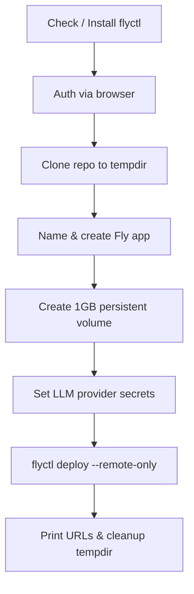

# Deployment — fly

# Deployment — Fly.io

The `deploy/fly/` module provides a fully automated, one-command deployment pipeline for LibreFang on [Fly.io](https://fly.io). It includes interactive provisioning, configuration, deployment, and teardown — no prior Fly.io setup required.

## Files

| File | Purpose |
|---|---|
| `deploy/fly/deploy.sh` | End-to-end provisioning and deployment script |
| `deploy/fly/fly.toml` | Fly.io machine/app configuration (image, volumes, HTTP service) |
| `deploy/fly/uninstall.sh` | Interactive teardown of deployed LibreFang apps |

## Quick Start

```bash
# Deploy
curl -sL https://raw.githubusercontent.com/librefang/librefang/main/deploy/fly/deploy.sh | bash

# Uninstall
curl -sL https://raw.githubusercontent.com/librefang/librefang/main/deploy/fly/uninstall.sh | bash
```

Both scripts are safe to pipe into bash — they are pure shell with no hidden dependencies beyond `flyctl`, `git`, `openssl`, and `python3`.

## Deployment Pipeline (`deploy.sh`)

The script runs eight sequential stages. Each stage must succeed before the next begins (`set -euo pipefail`).



### Stage Details

**1. Prerequisite check** — Verifies `flyctl` is on `$PATH`. If missing, downloads and installs it via the official Fly.io installer, then adds `~/.fly/bin` to `$PATH`.

**2. Authentication** — Runs `flyctl auth whoami` to test for an existing session. If unauthenticated, opens a browser for OAuth login via `flyctl auth login`.

**3. Clone** — Creates a temporary directory, shallow-clones (`--depth 1`) the LibreFang repository, and `cd`s into it.

**4. App creation** — Prompts for an app name. Accepts custom names (sanitized to lowercase alphanumeric with hyphens) or auto-generates one as `librefang-<8-hex-chars>`. Retries on name collision. Updates the `app` field in `fly.toml` via `sed`.

**5. Persistent volume** — Creates a 1 GB volume named `librefang_data` in the configured region. This volume is mounted at `/data` inside the container (see `fly.toml` `[mounts]`).

**6. LLM provider secrets** — Presents an interactive TUI multi-select menu for eight LLM providers:

| Provider | Environment Variable |
|---|---|
| OpenAI | `OPENAI_API_KEY` |
| Anthropic | `ANTHROPIC_API_KEY` |
| Google Gemini | `GEMINI_API_KEY` |
| Groq | `GROQ_API_KEY` |
| DeepSeek | `DEEPSEEK_API_KEY` |
| OpenRouter | `OPENROUTER_API_KEY` |
| Mistral | `MISTRAL_API_KEY` |
| xAI / Grok | `XAI_API_KEY` |

For each selected provider, the script prompts for the API key and sets it via `flyctl secrets set`. This stage is optional — pressing `Esc` or `q` skips it entirely.

**7. Deploy** — Runs `flyctl deploy` using the modified `fly.toml`, with `--remote-only` so the build happens on Fly's remote builders (no Docker required locally).

**8. Cleanup** — Prints the dashboard URL (`https://<app>.fly.dev`), health check endpoint, and management commands. Removes the temporary clone directory.

### Default Region

The default region is `nrt` (Tokyo). To change it, modify the `REGION` variable at the top of `deploy.sh` and the `primary_region` in `fly.toml`.

## App Configuration (`fly.toml`)

```toml
app = "librefang"               # Overwritten at deploy time
primary_region = "nrt"

[build]
image = "ghcr.io/librefang/librefang:latest"   # Pre-built OCI image

[env]
LIBREFANG_HOME = "/data"
LIBREFANG_LISTEN = "0.0.0.0:4545"

[http_service]
internal_port = 4545
force_https = true
auto_stop_machines = "suspend"   # Machines suspend on idle
auto_start_machines = true
min_machines_running = 1

[mounts]
source = "librefang_data"        # Created by deploy.sh stage 5
destination = "/data"

[[vm]]
memory = "256mb"
cpu_kind = "shared"
cpus = 1
```

Key configuration points:

- **Image source**: Deploys from the published GHCR container image, not a local build.
- **Persistence**: The `librefang_data` volume is mounted at `/data`, which `LIBREFANG_HOME` points to. All mutable state lives here.
- **HTTP service**: Listens on port `4545` internally, exposed with forced HTTPS and automatic machine management.
- **VM sizing**: 256 MB shared-CPU — sufficient for the proxy workload. Adjust `[[vm]]` for higher throughput.

## Uninstallation (`uninstall.sh`)

Teardown is the reverse of provisioning:

1. **Verify `flyctl` and auth** — Same checks as `deploy.sh`.
2. **Discover apps** — Fetches all apps via `flyctl apps list --json` and filters for names starting with `librefang` using an inline Python script.
3. **Interactive selection** — Same TUI multi-select pattern as deploy: choose one or more apps to destroy, or cancel with `Esc`/`q`.
4. **Confirmation** — Requires typing `yes` explicitly. Warns that all data, volumes, and secrets are permanently deleted.
5. **Destroy** — Calls `flyctl apps destroy <app> --yes` for each selected app.

## TUI Multi-Select Pattern

Both scripts share a terminal UI for multi-selection. Understanding its controls helps when guiding users:

| Key | Action |
|---|---|
| `↑` / `k` | Move cursor up |
| `↓` / `j` | Move cursor down |
| `Space` | Toggle selection on current item |
| `Enter` | Confirm (selects current item if none toggled) |
| `Esc` / `q` | Cancel / skip |

The implementation hides the terminal cursor (`\033[?25l`), redraws in-place using `\033[<n>A` to move up, and restores the cursor on exit via a `trap` on `RETURN`.

## Managing Secrets After Deployment

API keys can be added or rotated at any time without redeploying:

```bash
# Add a new provider key
flyctl secrets set ANTHROPIC_API_KEY=sk-ant-... --app librefang-myapp

# Rotate an existing key
flyctl secrets set OPENAI_API_KEY=sk-new-key --app librefang-myapp

# List current secrets (names only, values are hidden)
flyctl secrets list --app librefang-myapp
```

Fly.io injects secrets as environment variables on the next machine start. If the app is already running with `auto_stop_machines = "suspend"`, you can force a restart:

```bash
flyctl machines restart --app librefang-myapp
```