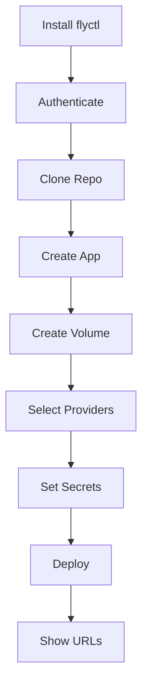

# Deployment — fly

# Deployment — Fly.io

This module provides one-command deployment of LibreFang to [Fly.io](https://fly.io), a platform that runs applications close to users with automatic scaling and persistent storage.

## Files

| File | Purpose |
|------|---------|
| `deploy/fly/deploy.sh` | One-command deployment script |
| `deploy/fly/fly.toml` | Fly.io application configuration |
| `deploy/fly/uninstall.sh` | Cleanup script to remove deployments |

## Quick Start

```bash
curl -sL https://raw.githubusercontent.com/librefang/librefang/main/deploy/fly/deploy.sh | bash
```

The script will:
1. Install `flyctl` if needed
2. Open a browser for Fly.io authentication
3. Create a new app (custom or auto-generated name)
4. Set up a 1GB persistent volume
5. Configure LLM provider API keys
6. Deploy LibreFang

## Deploy Script (`deploy.sh`)

### Execution Flow



### Prerequisites

- `flyctl` CLI (installed automatically if missing)
- Fly.io account (browser-based login via `flyctl auth login`)
- For API keys: accounts with supported providers (OpenAI, Anthropic, etc.)

### Interactive Prompts

**App Name**
- Leave empty for auto-generated name (format: `librefang-<hex>`)
- Enter a custom name (auto-normalized to lowercase with dashes)

**LLM Provider Selection**
- TUI with arrow keys (`↑`/`↓`), space to toggle, Enter to confirm
- Press `q` or `Esc` to skip without configuring any providers
- Providers supported: OpenAI, Anthropic, Google Gemini, Groq, DeepSeek, OpenRouter, Mistral, xAI/Grok

### Environment Variables Set

| Variable | Description |
|----------|-------------|
| `LIBREFANG_HOME` | Data directory (`/data`) |
| `LIBREFANG_LISTEN` | Listen address (`0.0.0.0:4545`) |

### Secrets (Per-Provider)

The script prompts for API keys based on selected providers:

| Provider | Secret Name |
|----------|-------------|
| OpenAI | `OPENAI_API_KEY` |
| Anthropic | `ANTHROPIC_API_KEY` |
| Google Gemini | `GEMINI_API_KEY` |
| Groq | `GROQ_API_KEY` |
| DeepSeek | `DEEPSEEK_API_KEY` |
| OpenRouter | `OPENROUTER_API_KEY` |
| Mistral | `MISTRAL_API_KEY` |
| xAI / Grok | `XAI_API_KEY` |

### Output

On success, the script displays:
```
✓ LibreFang is live!

  Dashboard:  https://<app-name>.fly.dev
  API:        https://<app-name>.fly.dev/api/health
  Manage:     flyctl dashboard --app <app-name>
```

## Fly.toml Configuration

The `fly.toml` file defines how Fly.io runs LibreFang:

```toml
app = "librefang"
primary_region = "nrt"  # Tokyo
```

### Key Settings

| Setting | Value | Purpose |
|---------|-------|---------|
| `primary_region` | `nrt` | Tokyo region for deployment |
| `image` | `ghcr.io/librefang/librefang:latest` | Container image |
| `internal_port` | `4545` | Port LibreFang listens on |
| `memory` | `256mb` | VM memory allocation |
| `cpus` | `1` | Shared CPU (1 core) |
| `volume_size` | `1GB` | Persistent storage |

### Auto-Scaling

```toml
[http_service]
  auto_stop_machines = "suspend"
  auto_start_machines = true
  min_machines_running = 1
```

This configuration:
- Suspends VMs after 10 minutes of inactivity (saves costs)
- Automatically starts VMs when requests arrive
- Keeps at least 1 machine running (reduces cold start latency)

### Persistent Storage

```toml
[mounts]
  source = "librefang_data"
  destination = "/data"
```

Data persists across deployments and restarts via a named volume.

## Uninstall Script (`uninstall.sh`)

Removes LibreFang deployments from your Fly.io account.

```bash
curl -sL https://raw.githubusercontent.com/librefang/librefang/main/deploy/fly/uninstall.sh | bash
```

### Behavior

1. Lists all Fly.io apps with names starting with `librefang`
2. TUI to select which apps to remove (multi-select supported)
3. Requires typing `yes` to confirm destruction
4. Deletes apps, volumes, and secrets

### Safety Checks

- Only targets apps matching `librefang*` prefix
- Requires explicit `yes` confirmation
- Reports failures without stopping (continues to next app)

## Managing Secrets After Deployment

Add or update API keys without redeploying:

```bash
flyctl secrets set OPENAI_API_KEY=sk-... --app <app-name>
flyctl secrets set ANTHROPIC_API_KEY=sk-ant-... --app <app-name>
```

List current secrets (names only):

```bash
flyctl secrets list --app <app-name>
```

Remove a secret:

```bash
flyctl secrets unset PROXY_API_KEY --app <app-name>
```

## Connection to Main Codebase

```
deploy/fly/
├── deploy.sh      → Clones librefang repo, runs flyctl deploy
├── fly.toml       → Read by flyctl during deployment
└── uninstall.sh   → Lists/destroys apps created by deploy.sh
```

The deployment script:
- References `ghcr.io/librefang/librefang:latest` as the container image
- Expects the app to listen on port `4545` (configured in `fly.toml`)
- Stores persistent data in `/data` (configured as `LIBREFANG_HOME`)
- Uses a pre-built OCI image rather than building from source during deploy

## Troubleshooting

**"App name is already taken"**
Choose a different name or let the script auto-generate one.

**Deployment fails with image pull error**
Ensure the container image `ghcr.io/librefang/librefang:latest` exists and your Fly.io account has access to GitHub Packages.

**Volume creation fails**
Fly.io quotas may limit volumes. Check your dashboard or run `flyctl volumes list`.

**Machine suspended, slow response**
First request after suspension triggers machine restart (~10-30 seconds). This is expected behavior with `auto_stop_machines = "suspend"`.