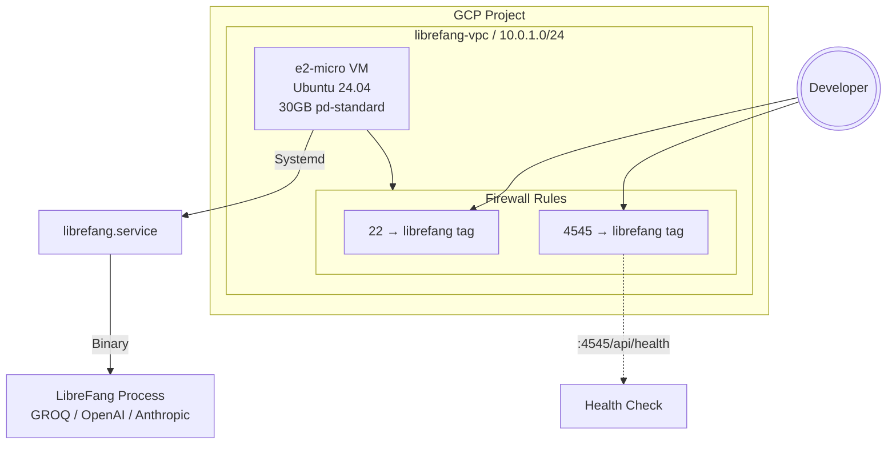

# Deployment — gcp

# Deploy — GCP Module

Provisions a complete LibreFang deployment on Google Cloud Platform using the always-free tier. The module creates networking infrastructure, configures firewall rules, and uses cloud-init to provision a VM with LibreFang running as a systemd service.

## Overview

This module deploys LibreFang on a single `e2-micro` VM with persistent storage, suitable for personal use, development, or light production workloads. All resources fall within GCP's free tier limits:

| Resource | Free Allowance | Deployed |
|----------|----------------|----------|
| e2-micro instance | 1/month | 1 |
| Standard PD storage | 30 GB/month | 30 GB |
| Network egress | 1 GB/month | ~0 (minimal) |

The deployment completes in approximately 2 minutes and requires no ongoing management beyond configuration updates.

## Architecture



## Component Details

### Networking (`main.tf`)

The module creates a dedicated VPC with a private subnet to isolate the LibreFang instance:

```hcl
resource "google_compute_network" "librefang" {
  name                    = "librefang-vpc"
  auto_create_subnetworks = false  # Custom subnet only
}

resource "google_compute_subnetwork" "librefang" {
  name          = "librefang-subnet"
  ip_cidr_range = "10.0.1.0/24"
}
```

Using a custom subnet (rather than the default) provides:
- Predictable IP ranges for future expansions
- Explicit firewall control at the subnet level
- No conflicts with other project resources

### Firewall Rules

Two firewall rules control inbound access, both targeting instances with the `librefang` tag:

| Rule | Port | Source | Purpose |
|------|------|--------|---------|
| `librefang-allow-ssh` | 22 | `0.0.0.0/0` | Administrative access |
| `librefang-allow-http` | 4545 | `0.0.0.0/0` | LibreFang dashboard and API |

SSH access is intentionally open to support initial setup and debugging. Consider restricting the source range for production deployments:

```hcl
source_ranges = ["0.0.0.0/0"]  # Restrict for prod: ["${var.admin_ip}/32"]
```

### Compute Instance

```hcl
resource "google_compute_instance" "librefang" {
  name         = "librefang"
  machine_type = "e2-micro"
  tags         = ["librefang"]  # Firewall target
  
  boot_disk {
    initialize_params {
      image = "ubuntu-os-cloud/ubuntu-2404-lts-amd64"
      size  = 30
      type  = "pd-standard"
    }
  }
  
  network_interface {
    subnetwork = google_compute_subnetwork.librefang.id
    access_config {}  # Ephemeral public IP
  }
}
```

**Key decisions:**
- **e2-micro**: 0.25 vCPU, 1 GB RAM — sufficient for LibreFang's lightweight binary
- **Ubuntu 24.04 LTS**: Current stable release with 10-year support
- **pd-standard**: Included in free tier; pd-balanced or pd-ssd would improve performance at cost
- **Ephemeral IP**: No static IP charge; IP changes on VM replacement

### Cloud-Init Provisioning

The `cloud-init.yml.tpl` handles all VM configuration after boot. This is passed via the `user-data` metadata field.

#### User Setup

Creates a dedicated service account with sudo privileges:

```yaml
users:
  - name: librefang
    shell: /bin/bash
    sudo: ALL=(ALL) NOPASSWD:ALL
```

LibreFang runs as this user rather than root for security isolation.

#### Package Installation

```yaml
packages:
  - curl      # Downloads
  - jq        # JSON parsing for release detection
  - htop      # Resource monitoring
  - fail2ban  # SSH brute-force protection
```

#### Systemd Service

The service unit file is written to `/etc/systemd/system/librefang.service`:

```ini
[Unit]
Description=LibreFang Agent OS
After=network-online.target
Wants=network-online.target

[Service]
Type=simple
User=librefang
Environment=LIBREFANG_HOME=/data
Environment=LIBREFANG_BIND=0.0.0.0:4545
Environment=GROQ_API_KEY=${groq_api_key}
Environment=OPENAI_API_KEY=${openai_api_key}
Environment=ANTHROPIC_API_KEY=${anthropic_api_key}
ExecStart=/usr/local/bin/librefang start
Restart=on-failure
RestartSec=5

# Security hardening
ProtectSystem=strict
ReadWritePaths=/data
PrivateTmp=true
NoNewPrivileges=true

[Install]
WantedBy=multi-user.target
```

**Hardening measures:**
- `ProtectSystem=strict`: Mount `/usr`, `/boot`, `/etc` read-only
- `ReadWritePaths=/data`: Explicitly allow writes to data directory only
- `PrivateTmp=true`: Isolated /tmp and /var/tmp
- `NoNewPrivileges=true`: Prevents privilege escalation

#### Binary Installation

The runcmd section downloads the LibreFang release:

```bash
ARCH=$(uname -m)
case "$ARCH" in
  x86_64)  TARGET="x86_64-unknown-linux-gnu" ;;
  aarch64) TARGET="aarch64-unknown-linux-gnu" ;;
esac

# Fetch download URL from GitHub API (latest) or construct directly (tag)
curl -fsSL "$DOWNLOAD_URL" -o /tmp/librefang.tar.gz
tar xzf /tmp/librefang.tar.gz -C /usr/local/bin/
```

Architecture detection handles both Intel/AMD (x86_64) and ARM (aarch64) VMs.

## Provisioning Flow

```
terraform apply
    │
    ├─→ Create VPC "librefang-vpc"
    │       └─→ Create subnet "librefang-subnet" (10.0.1.0/24)
    │
    ├─→ Create firewall rules
    │       ├─→ Allow SSH (22) → librefang tag
    │       └─→ Allow HTTP (4545) → librefang tag
    │
    └─→ Create VM "librefang"
            │
            └─→ Cloud-init executes (parallel):
                    │
                    ├─1. Create 'librefang' user
                    ├─2. Install packages (curl, jq, htop, fail2ban)
                    ├─3. Create /data directory
                    ├─4. Download LibreFang binary from GitHub
                    ├─5. Install binary to /usr/local/bin/
                    ├─6. Write systemd unit file
                    └─7. Start librefang.service
```

Cloud-init runs as root during provisioning. The `librefang` binary executes as the `librefang` user via systemd, with restricted permissions enforced by the service hardening.

## Configuration

### Required Variables

```hcl
project_id = "my-gcp-project-123"  # GCP project identifier
```

### Optional Variables

| Variable | Default | Description |
|----------|---------|-------------|
| `region` | `us-central1` | GCP region for resources |
| `zone` | `us-central1-a` | Specific zone within region |
| `ssh_pub_key_path` | `~/.ssh/id_rsa.pub` | Public key for `librefang` user |
| `librefang_version` | `latest` | Release tag or `latest` |
| `groq_api_key` | `""` | Groq API key (recommended for free tier) |
| `openai_api_key` | `""` | OpenAI API key |
| `anthropic_api_key` | `""` | Anthropic API key |

At least one LLM API key is required. Groq provides the best free tier experience with generous rate limits.

### Generating terraform.tfvars

```bash
cd deploy/gcp
cp terraform.tfvars.example terraform.tfvars
```

Edit the file:

```hcl
project_id = "your-actual-project-id"
groq_api_key = "gsk_..."  # At least one key required
```

## Deployment

### Initial Deployment

```bash
# Authenticate with GCP
gcloud auth application-default login

# Configure variables
cp terraform.tfvars.example terraform.tfvars
vim terraform.tfvars  # Add project_id and API keys

# Deploy infrastructure
terraform init
terraform apply       # Type 'yes' when prompted

# Terraform outputs:
# dashboard_url = "http://34.x.x.x:4545"
# ssh_command   = "ssh librefang@34.x.x.x"
```

### Verifying Deployment

Wait approximately 60 seconds for cloud-init to complete, then:

```bash
curl http://<external_ip>:4545/api/health
```

Expected response:

```json
{"status":"ok","version":"...","model":"groq/..."}
```

### SSH Access

```bash
ssh librefang@<external_ip>
```

The `librefang` user has passwordless sudo. To switch to root:

```bash
sudo -i
```

### Service Management

On the VM, control the LibreFang service:

```bash
# Check status
sudo systemctl status librefang

# View logs
sudo journalctl -u librefang -f

# Restart (after config changes)
sudo systemctl restart librefang

# Stop/start
sudo systemctl stop librefang
sudo systemctl start librefang
```

### Updating LibreFang

To upgrade the binary, redeploy with a specific version:

```bash
# Option 1: Use specific release tag
terraform apply -var="librefang_version=v0.4.2-20260314"

# Option 2: Update to latest
terraform apply -var="librefang_version=latest"
```

Cloud-init's idempotent runcmd will skip re-download if the binary already exists at the target path. To force reinstallation, either replace the VM or manually remove the binary first.

### Tear Down

```bash
terraform destroy
```

This removes all GCP resources created by the module. The `--auto-approve` flag can skip confirmation:

```bash
terraform destroy --auto-approve
```

## Cost Optimization

The current configuration stays within free tier limits. To reduce costs further:

| Optimization | Impact |
|--------------|--------|
| Use Groq exclusively | Zero API cost up to rate limits |
| Schedule downtime | Not applicable (always-on needed) |
| Monitor egress | GCP free tier includes 1 GB/month; LibreFang uses minimal bandwidth |

To avoid unexpected charges:

1. Set a billing budget alert in GCP Console
2. Review [GCP free tier terms](https://cloud.google.com/free) — limits vary by region
3. Monitor actual usage via `gcloud compute instances describe librefang`

## Security Considerations

### Current Configuration

- **SSH open to internet**: Acceptable for development; restrict `source_ranges` for production
- **No HTTPS**: Traffic to port 4545 is unencrypted; use a VPN or SSH tunnel for sensitive data
- **API keys in metadata**: Visible in GCP Console; keys are injected into the VM's environment

### Production Hardening

For internet-facing deployments:

1. **Restrict SSH access**:
   ```hcl
   source_ranges = ["${var.admin_ip}/32"]  # Your IP only
   ```

2. **Add HTTPS termination**:
   - Deploy nginx or Caddy as a reverse proxy
   - Use Let's Encrypt for certificates
   - Update firewall to route 443 → 4545

3. **Store secrets in Secret Manager**:
   ```hcl
   data "google_secret_manager_secret_version" "groq_key" {
     secret_id = "librefang-groq-key"
   }
   ```

4. **Enable VPC Flow Logs** for network monitoring

## Troubleshooting

### Deployment Fails

```bash
# Check Terraform state
terraform show

# Validate configuration
terraform validate

# Review plan before applying
terraform plan
```

### VM Won't Start

Check in GCP Console → Compute Engine → VM Instances → librefang → Logs

### Cloud-Init Errors

Cloud-init logs are available in `/var/log/cloud-init-output.log`:

```bash
ssh librefang@<ip>
sudo cat /var/log/cloud-init-output.log
```

### LibreFang Not Responding

```bash
# Check service status
sudo systemctl status librefang

# View systemd journal
sudo journalctl -u librefang --no-pager -n 50

# Verify binary exists
ls -la /usr/local/bin/librefang
file /usr/local/bin/librefang

# Test binary directly
sudo -u librefang /usr/local/bin/librefang version
```

### Health Check Returns Error

```bash
# From your local machine
curl -v http://<ip>:4545/api/health

# On the VM
curl -v http://localhost:4545/api/health

# Check LibreFang logs for startup errors
sudo journalctl -u librefang | grep -i error
```

## File Structure

```
deploy/gcp/
├── main.tf                 # GCP resource definitions
├── variables.tf            # Input variable declarations
├── outputs.tf             # Output value definitions
├── terraform.tfvars.example # Configuration template
├── cloud-init.yml.tpl      # VM provisioning template
└── README.md               # This module's documentation
```

## Relationship to Codebase

This module is independent of the LibreFang core codebase. It consumes the pre-built binary distributed via GitHub Releases (`librefang-*.tar.gz`). The module does not interact with:

- Source code in `src/`
- Tests in `tests/`
- Package definitions in `package.json` or similar

The only coupling is the release artifact URL pattern:

```
https://github.com/librefang/librefang/releases/download/{version}/librefang-{target}.tar.gz
```

When releasing a new version, ensure the release tag matches `librefang_version` variable or use `latest` to always pull the most recent release.