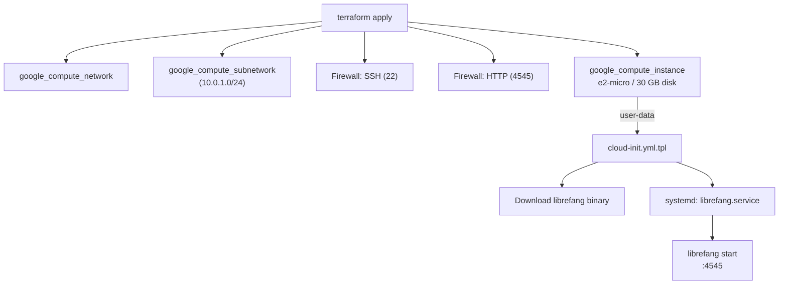

# Deployment — gcp

# Deployment — GCP (Free Tier)

Provisions a single `e2-micro` Compute Engine instance running LibreFang, entirely within GCP's always-free tier. The deployment uses Terraform for infrastructure and cloud-init for VM bootstrapping — no Ansible, no Packer, no container registry required.

## Architecture



The result is a single Ubuntu 24.04 VM exposing LibreFang's dashboard and API on port 4545 with an ephemeral public IP.

## File Reference

| File | Purpose |
|------|---------|
| `main.tf` | All Terraform resources: VPC, subnet, firewall rules, compute instance |
| `variables.tf` | Input variables with defaults and sensitivity flags |
| `outputs.tf` | Post-apply outputs: `external_ip`, `ssh_command`, `dashboard_url` |
| `cloud-init.yml.tpl` | Cloud-init template rendered with API keys and version; creates the systemd unit |
| `terraform.tfvars.example` | Copy-to-`terraform.tfvars` template with commented defaults |

## Infrastructure Details

### Compute

- **Machine type:** `e2-micro` (0.25 vCPU, 1 GB RAM) — covered by free tier
- **Boot disk:** 30 GB `pd-standard` on Ubuntu 24.04 LTS — matches the 30 GB free-tier disk allowance
- **Networking:** Custom VPC (`librefang-vpc`) with a single subnet (`10.0.1.0/24`). An ephemeral public IP is assigned automatically via the `access_config` block.

### Firewall

Two rules attached to the `librefang` target tag:

| Rule | Protocol | Port | Source |
|------|----------|------|--------|
| `librefang-allow-ssh` | TCP | 22 | `0.0.0.0/0` |
| `librefang-allow-http` | TCP | 4545 | `0.0.0.0/0` |

Both are open to the internet. For production use, restrict `source_ranges` to your own IP ranges.

## Cloud-Init Bootstrap

The `cloud-init.yml.tpl` template is rendered by Terraform at apply time, injecting API keys and the desired release version. It performs the following in order:

1. **Creates a `librefang` user** with passwordless sudo.
2. **Installs packages:** `curl`, `jq`, `htop`, `fail2ban`.
3. **Writes the systemd unit** to `/etc/systemd/system/librefang.service` with these environment variables:
   - `LIBREFANG_HOME=/data`
   - `LIBREFANG_BIND=0.0.0.0:4545`
   - `GROQ_API_KEY`, `OPENAI_API_KEY`, `ANTHROPIC_API_KEY` (from Terraform variables)
4. **Downloads the LibreFang binary** from GitHub Releases. Supports both `latest` (queries the GitHub API with `jq` to find the matching asset) and pinned versions (constructs the URL directly). Detects architecture (`x86_64` or `aarch64`) automatically.
5. **Enables and starts** the `librefang` systemd service.

### Service Hardening

The systemd unit applies these restrictions:

```ini
ProtectSystem=strict
ReadWritePaths=/data
PrivateTmp=true
NoNewPrivileges=true
```

The process runs as the `librefang` user with write access only to `/data`.

## Configuration

Copy and edit the variables file:

```bash
cp terraform.tfvars.example terraform.tfvars
```

### Required Variables

| Variable | Description |
|----------|-------------|
| `project_id` | Your GCP project ID |

### Optional Variables

| Variable | Default | Description |
|----------|---------|-------------|
| `region` | `us-central1` | GCP region for all resources |
| `zone` | `us-central1-a` | GCP zone for the VM |
| `ssh_pub_key_path` | `~/.ssh/id_rsa.pub` | Local path to your SSH public key (injected into the VM via metadata) |
| `librefang_version` | `latest` | GitHub release tag, or `"latest"` to auto-detect |

### API Key Variables

At least one must be non-empty for LibreFang to function. All are marked `sensitive` so they won't appear in Terraform logs.

| Variable | Default |
|----------|---------|
| `groq_api_key` | `""` |
| `openai_api_key` | `""` |
| `anthropic_api_key` | `""` |

## Deployment

```bash
cd deploy/gcp

# Authenticate gcloud (sets up application-default credentials)
gcloud auth application-default login

# Initialize Terraform providers
terraform init

# Review the plan
terraform plan

# Apply (~2 minutes for GCP to provision the VM)
terraform apply
```

After `apply` completes, note the outputs:

```
dashboard_url = "http://XX.XX.XX.XX:4545"
ssh_command   = "ssh librefang@XX.XX.XX.XX"
```

### Verify

Wait approximately one minute for cloud-init to finish downloading and starting LibreFang:

```bash
curl http://$(terraform output -raw external_ip):4545/api/health
```

### SSH Access

```bash
ssh librefang@$(terraform output -raw external_ip)
```

Your public key (from `ssh_pub_key_path`) is injected via the instance's `ssh-keys` metadata, authenticating you as the `librefang` user.

## Teardown

```bash
terraform destroy
```

This deletes the VM, disk, firewall rules, subnet, and VPC. The ephemeral public IP is released automatically. Any data in `/data` on the VM is lost.

## Free-Tier Cost

| Resource | Free Allowance | This Deployment |
|----------|---------------|-----------------|
| e2-micro | 1 instance/month (us-west1, us-central1, us-east1 only) | 1 instance |
| Standard persistent disk | 30 GB/month | 30 GB |
| Outbound egress | 1 GB/month (to non-China/Australia) | Minimal |

The deployment costs **$0/month** as long as you stay within these limits. Egress beyond 1 GB/month is billed at standard rates.

> **Note:** The `region` default is `us-central1`, which qualifies for the free-tier e2-micro. Changing to a non-free-tier region will incur charges.

## Customization Points

- **Pin a version:** Set `librefang_version = "v0.4.2-20260314"` in `terraform.tfvars` for reproducible deploys.
- **Restrict firewall access:** Edit the `source_ranges` in `main.tf` for `google_compute_firewall.allow_ssh` and `allow_http` to limit access by IP.
- **Add a persistent disk:** Attach an additional `google_compute_disk` and mount it in cloud-init if you need data persistence independent of the boot disk.
- **HTTPS:** Place Cloudflare Tunnel or a reverse proxy (Caddy/nginx) in front of port 4545 for TLS termination — this is not included in the default config.