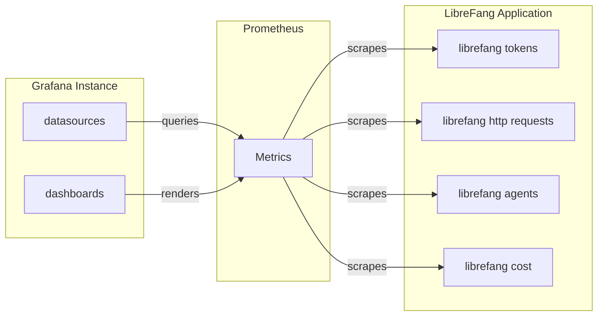

# Deployment — grafana

# LibreFang Grafana Monitoring Dashboards

This module provides pre-configured Grafana dashboards for monitoring a LibreFang deployment. Dashboards are automatically provisioned at startup via YAML configuration, pulling metrics from a Prometheus data source.

## Architecture Overview



## Dashboard Inventory

| Dashboard | UID | Purpose |
|-----------|-----|---------|
| Overview | `librefang-overview` | System health, version, uptime, agent/session counts, panics/restarts |
| LLM & Token Usage | `librefang-llm` | Token consumption, LLM calls, input/output breakdown by agent/provider/model |
| HTTP & API | `librefang-http` | Request rates, latency percentiles, error rates, slow endpoints |
| Cost & Budget | `librefang-cost` | USD cost tracking, token-based cost attribution, model cost distribution |

## Provisioning Configuration

### Dashboard Provider (`deploy/grafana/provisioning/dashboards/dashboard.yml`)

```yaml
apiVersion: 1
providers:
  - name: "LibreFang"
    orgId: 1
    folder: ""
    type: file
    disableDeletion: false
    editable: true
    options:
      path: /var/lib/grafana/dashboards
```

Dashboards are loaded from `/var/lib/grafana/dashboards/` as JSON files. The `editable: true` setting allows in-browser modifications.

### Prometheus Data Source (`deploy/grafana/provisioning/datasources/prometheus.yml`)

```yaml
apiVersion: 1
datasources:
  - name: Prometheus
    type: prometheus
    uid: librefang-prometheus
    access: proxy
    url: http://prometheus:9090
    isDefault: true
```

The data source uses proxy access mode to `http://prometheus:9090`. All dashboard panels reference this datasource via UID `librefang-prometheus`.

## Dashboard Navigation

Each dashboard includes links in the top navigation bar for cross-dashboard navigation:

```json
"links": [
  { "title": "Overview", "url": "/d/librefang-overview" },
  { "title": "LLM & Tokens", "url": "/d/librefang-llm" },
  { "title": "HTTP & API", "url": "/d/librefang-http" },
  { "title": "Cost & Budget", "url": "/d/librefang-cost" }
]
```

## Overview Dashboard (`librefang.json`)

Displays system-wide health and operational metrics with a 1-hour default time range.

### Key Panels

| Panel | Metric | Description |
|-------|--------|-------------|
| Version | `librefang_info` | Current LibreFang version |
| Uptime | `librefang_uptime_seconds` | System uptime in `dtdurations` format |
| Active Agents | `librefang_agents_active` | Currently active agent count (thresholds: >10 yellow, >50 red) |
| Total Agents | `librefang_agents_total` | Total registered agents |
| Active Sessions | `librefang_active_sessions` | Concurrent user sessions (thresholds: >5 yellow, >20 red) |
| Cost Today | `librefang_cost_usd_today` | Daily cost in USD (thresholds: >$1 yellow, >$10 red) |
| Panics | `librefang_panics_total` | Total panic count (thresholds: >1 orange, >100 red) |
| Restarts | `librefang_restarts_total` | Total restart count (threshold: >1 red) |

### Time Series Panels

- **Panics & Restarts Over Time** — Tracks the cumulative panic and restart counts to identify instability patterns
- **Active vs Total Agents** — Compares active agent load against total registered agents

## LLM & Token Usage Dashboard (`librefang-llm.json`)

Focused on token consumption and LLM interaction metrics with filterable variables for `agent`, `provider`, and `model`.

### Template Variables

```yaml
- name: agent
  query: label_values(librefang_tokens, agent)
- name: provider
  query: label_values(librefang_tokens, provider)
- name: model
  query: label_values(librefang_tokens{provider=~"$provider"}, model)
```

The `model` variable's query depends on the selected `provider`, enabling hierarchical filtering.

### Key Panels

| Panel | Metrics | Visualization |
|-------|---------|---------------|
| Total / Input / Output Tokens | `librefang_tokens`, `librefang_tokens_input`, `librefang_tokens_output` | Stat cards |
| LLM Calls | `librefang_llm_calls` | Stat card |
| Tokens Consumed by Agent | `librefang_tokens` grouped by agent | Stacked timeseries |
| LLM Calls by Agent | `librefang_llm_calls` grouped by agent | Stacked bar chart |
| Input vs Output Tokens | `librefang_tokens_input`, `librefang_tokens_output` | Stacked bar chart |
| Tokens by Provider/Model | `librefang_tokens` grouped by `(provider, model)` | Stacked timeseries |
| Agent Token Breakdown | `librefang_tokens` | Donut pie chart |
| Token Input/Output Ratio | `librefang_tokens_input`, `librefang_tokens_output` | Donut pie chart |
| Tool Calls by Agent | `librefang_tool_calls` | Stacked bar chart |

### Key Metric Labels

- `agent` — Name of the agent making the request
- `provider` — LLM provider (e.g., openai, anthropic)
- `model` — Model identifier (e.g., gpt-4, claude-3)

## HTTP & API Dashboard (`librefang-http.json`)

Monitors HTTP traffic patterns and API performance with a 1-hour default time range.

### Key Panels

| Panel | Metrics | Description |
|-------|---------|-------------|
| HTTP Request Rate | `rate(librefang_http_requests_total[5m])` | Requests per second, total and by method |
| Request Latency (p50/p90/p99) | `histogram_quantile()` on duration histogram | Latency percentiles in seconds |
| Request Rate by Status Code | `rate(librefang_http_requests_total[5m])` grouped by status | Stacked view of 2xx/4xx/5xx responses |
| HTTP Error Rate | `rate(librefang_http_requests_total{status=~"4.."}[5m])` | 4xx and 5xx error rates |
| Top Endpoints by Request Count | `topk(10, sum by (path) (increase(...)))` | Top 10 busiest endpoints |
| Slowest Endpoints | `histogram_quantile(0.99, ...)` grouped by path | Top 10 highest p99 latency endpoints |

### Latency Thresholds

The latency panel uses color-coded percentiles:
- **p50** — green (typical response time)
- **p90** — orange (slow requests)
- **p99** — red (tail latency)

## Cost & Budget Dashboard (`librefang-cost.json`)

Tracks LLM usage costs and token-driven cost attribution with filterable variables for `agent`, `provider`, and `model`.

### Key Panels

| Panel | Metrics | Visualization |
|-------|---------|---------------|
| Cost Today | `librefang_cost_usd_today` | Stat card with USD currency formatting (thresholds: >$1 yellow, >$5 orange, >$10 red) |
| Total Tokens (1h) | `sum(librefang_tokens{...})` | Stat card |
| LLM Calls (1h) | `sum(librefang_llm_calls{...})` | Stat card |
| Cost Trend | `librefang_cost_usd_today` | Timeseries showing cost accumulation |
| Tokens by Agent | `librefang_tokens{...}` grouped by agent | Stacked timeseries (token volume as cost proxy) |
| Cost by Model | `librefang_tokens` grouped by `(provider, model)` | Donut pie chart |
| Output Tokens by Agent | `topk(10, librefang_tokens_output{...})` | Bar gauge showing top 10 agents by output token count |
| Input/Output Token Ratio | `sum(librefang_tokens_input)`, `sum(librefang_tokens_output)` | Donut pie chart |

### Cost Insight

Output tokens are annotated as 3-5x more expensive than input tokens. The output token bar gauge helps identify which agents are generating the highest-cost completions.

## Prometheus Metrics Reference

The dashboards query the following metrics exported by the LibreFang application:

| Metric | Type | Labels | Description |
|--------|------|--------|-------------|
| `librefang_info` | Gauge | `version` | Build information |
| `librefang_uptime_seconds` | Gauge | — | Seconds since process start |
| `librefang_agents_active` | Gauge | — | Currently active agents |
| `librefang_agents_total` | Gauge | — | Total registered agents |
| `librefang_active_sessions` | Gauge | — | Active user sessions |
| `librefang_cost_usd_today` | Gauge | — | Today's cumulative cost in USD |
| `librefang_panics_total` | Counter | — | Total panic events |
| `librefang_restarts_total` | Counter | — | Total restart events |
| `librefang_tokens` | Counter | `agent`, `provider`, `model` | Total tokens consumed |
| `librefang_tokens_input` | Counter | `agent`, `provider`, `model` | Input (prompt) tokens |
| `librefang_tokens_output` | Counter | `agent`, `provider`, `model` | Output (completion) tokens |
| `librefang_llm_calls` | Counter | `agent`, `provider`, `model` | LLM API call count |
| `librefang_tool_calls` | Counter | `agent`, `provider`, `model` | Tool invocation count |
| `librefang_http_requests_total` | Counter | `method`, `path`, `status` | Total HTTP requests |
| `librefang_http_request_duration_seconds_bucket` | Histogram | `method`, `path`, `status` | Request duration buckets |

## Deployment Requirements

The dashboards assume:

1. **Prometheus** is running and accessible at `http://prometheus:9090`
2. **LibreFang** is configured to expose Prometheus metrics at its `/metrics` endpoint
3. Prometheus has a scrape target configured for the LibreFang application

### Container Volume Mounts

For the provisioning to work in Docker/Kubernetes:

| Host Path | Container Path | Purpose |
|-----------|---------------|---------|
| `deploy/grafana/dashboards/` | `/var/lib/grafana/dashboards/` | Dashboard JSON files |
| `deploy/grafana/provisioning/dashboards/` | `/etc/grafana/provisioning/dashboards/` | Dashboard provider config |
| `deploy/grafana/provisioning/datasources/` | `/etc/grafana/provisioning/datasources/` | Datasource config |

## Customization

### Adding New Metrics

To extend dashboards with new metrics:

1. Ensure the metric is exported by LibreFang (check `/metrics` endpoint)
2. Edit the dashboard JSON directly or via Grafana UI (`editable: true` is set)
3. Add a new panel targeting the metric with appropriate visualization

### Threshold Tuning

Each panel's `thresholds` can be adjusted based on your deployment scale:

```json
"thresholds": {
  "mode": "absolute",
  "steps": [
    { "color": "green", "value": null },
    { "color": "yellow", "value": 100 },  // Adjust to match your baseline
    { "color": "red", "value": 1000 }
  ]
}
```

### New Template Variables

To add filtering by additional dimensions (e.g., `region`, `environment`), add to the `templating.list` array:

```json
{
  "name": "environment",
  "label": "Environment",
  "type": "query",
  "datasource": { "type": "prometheus", "uid": "librefang-prometheus" },
  "query": "label_values(librefang_tokens, environment)",
  "refresh": 2,
  "includeAll": true,
  "allValue": ".*"
}
```