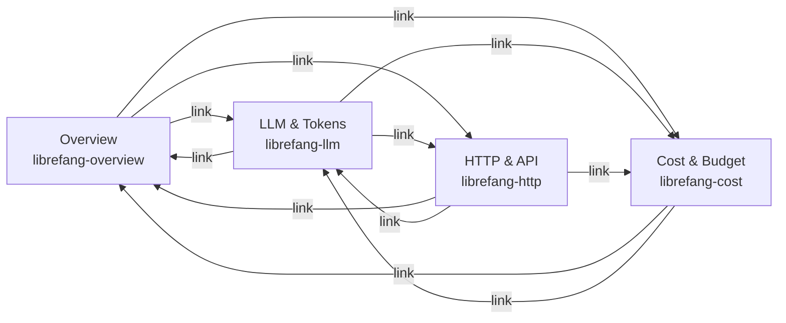

# Deployment — grafana

# Deployment — Grafana

## Overview

This module provides a complete Grafana observability stack for LibreFang, consisting of four pre-built dashboards and the provisioning configuration to load them automatically. All dashboards query a single Prometheus datasource and are cross-linked for quick navigation between views.

## Directory Layout

```
deploy/grafana/
├── dashboards/
│   ├── librefang.json           # System Overview (uid: librefang-overview)
│   ├── librefang-llm.json       # LLM & Token Usage (uid: librefang-llm)
│   ├── librefang-http.json      # HTTP & API Metrics (uid: librefang-http)
│   └── librefang-cost.json      # Cost & Budget (uid: librefang-cost)
└── provisioning/
    ├── dashboards/
    │   └── dashboard.yml         # Auto-loads JSON from /var/lib/grafana/dashboards
    └── datasources/
        └── prometheus.yml         # Registers Prometheus at http://prometheus:9090
```

## Provisioning

### Datasource

`provisioning/datasources/prometheus.yml` registers a single Prometheus instance:

| Field | Value |
|-------|-------|
| `name` | Prometheus |
| `uid` | `librefang-prometheus` |
| `type` | prometheus |
| `access` | proxy |
| `url` | `http://prometheus:9090` |
| `isDefault` | true |
| `editable` | false |

Every dashboard targets this datasource by uid (`"uid": "librefang-prometheus"`). The hostname `prometheus` assumes a Docker Compose or Kubernetes network where Prometheus is reachable at that name on port 9090.

### Dashboard Provider

`provisioning/dashboards/dashboard.yml` tells Grafana to recursively load all JSON files from `/var/lib/grafana/dashboards`. In a container deployment, mount the `dashboards/` directory to that path:

```yaml
volumes:
  - ./deploy/grafana/dashboards:/var/lib/grafana/dashboards:ro
```

The provider allows edits and deletions from the UI (`editable: true`, `disableDeletion: false`), but those changes are ephemeral — they reset when the container restarts unless you persist Grafana's data directory.

## Dashboard Navigation

All four dashboards include a top-level link bar for cross-navigation:



Each link uses the dashboard uid in the URL path (e.g. `/d/librefang-llm`) so they work regardless of the Grafana root URL.

## Dashboard Details

### 1. LibreFang Overview (`librefang-overview`)

**File**: `librefang.json`  
**Default time range**: Last 1 hour  
**Template variables**: None

The landing dashboard showing system health at a glance.

**Row 1 — Status bar** (6 stat panels):

| Panel | Metric | Notes |
|-------|--------|-------|
| Version | `librefang_info` | Displays `{{version}}` label, no graph |
| Uptime | `librefang_uptime_seconds` | Formatted as duration |
| Active Agents | `librefang_agents_active` | Yellow at 10, red at 50 |
| Total Agents | `librefang_agents_total` | Instant query |
| Active Sessions | `librefang_active_sessions` | Yellow at 5, red at 20 |
| Cost Today | `librefang_cost_usd_today` | USD, yellow at $1, red at $10 |

**Row 2 — Health indicators** (2 stat panels):

| Panel | Metric | Notes |
|-------|--------|-------|
| Panics | `librefang_panics_total` | Orange at 1, red at 100 |
| Restarts | `librefang_restarts_total` | Red at ≥1 |

**Charts**:

| Panel | Type | Metrics |
|-------|------|---------|
| Panics & Restarts Over Time | timeseries | `librefang_panics_total`, `librefang_restarts_total` |
| Active vs Total Agents | timeseries | `librefang_agents_active`, `librefang_agents_total` |

---

### 2. LLM & Token Usage (`librefang-llm`)

**File**: `librefang-llm.json`  
**Default time range**: Last 1 hour  
**Template variables**: `agent`, `provider`, `model` (all multi-select with "All" default)

Deep-dive into LLM usage patterns.

**Template Variables**

| Name | Query | Dependency |
|------|-------|------------|
| `$agent` | `label_values(librefang_tokens, agent)` | None |
| `$provider` | `label_values(librefang_tokens, provider)` | None |
| `$model` | `label_values(librefang_tokens{provider=~"$provider"}, model)` | Filtered by `$provider` |

All three use `allValue: ".*"` with regex matching in queries (e.g. `agent=~"$agent"`).

**Row 1 — Summary stats** (4 panels):

| Panel | Metric |
|-------|--------|
| Total Tokens | `sum(librefang_tokens{...})` |
| Input Tokens | `sum(librefang_tokens_input{...})` |
| Output Tokens | `sum(librefang_tokens_output{...})` |
| LLM Calls | `sum(librefang_llm_calls{...})` |

**Charts**:

| Panel | Type | Details |
|-------|------|---------|
| Tokens Consumed by Agent | stacked timeseries | Per-agent token lines, legend shows last value and max |
| LLM Calls by Agent | stacked bars | Per-agent call counts |
| Input vs Output Tokens | stacked bars | Blue=input, orange=output |
| Tokens by Provider/Model | stacked timeseries | Grouped by `(provider, model)` |
| Agent Token Breakdown | donut chart | Current distribution per agent |
| Token Input/Output Ratio | donut chart | Global ratio, blue vs orange |
| Tool Calls by Agent | stacked bars | `librefang_tool_calls` metric |

---

### 3. HTTP & API Metrics (`librefang-http`)

**File**: `librefang-http.json`  
**Default time range**: Last 1 hour  
**Template variables**: None

Standard RED (Rate, Errors, Duration) metrics for the HTTP layer.

**Metrics used**:

| Metric | Type | Labels |
|--------|------|--------|
| `librefang_http_requests_total` | counter | `method`, `status`, `path` |
| `librefang_http_request_duration_seconds_bucket` | histogram | `path`, `le` |

**Panels**:

| Panel | Type | PromQL |
|-------|------|--------|
| HTTP Request Rate | timeseries | `sum(rate(librefang_http_requests_total[5m]))` + by method |
| Request Latency (p50/p90/p99) | timeseries | `histogram_quantile(0.50/0.90/0.99, ...)` over 5m windows |
| Request Rate by Status Code | stacked timeseries | Grouped by `status` label |
| HTTP Error Rate (4xx/5xx) | timeseries | Regex matchers `status=~"4.."` and `status=~"5.."` |
| Top Endpoints by Request Count | horizontal bargauge | `topk(10, sum by (path) (increase(...[1h])))` |
| Slowest Endpoints (p99) | horizontal bargauge | `topk(10, histogram_quantile(0.99, ...))` by path |

The latency panel uses fixed colors: green for p50, orange for p90, red for p99. Error rates use orange for 4xx and red for 5xx.

---

### 4. Cost & Budget (`librefang-cost`)

**File**: `librefang-cost.json`  
**Default time range**: Last 6 hours  
**Template variables**: Same as LLM dashboard (`agent`, `provider`, `model`)

Focuses on spending patterns and token cost proxies.

**Panels**:

| Panel | Type | Purpose |
|-------|------|---------|
| Cost Today (USD) | stat | Direct cost metric with 4-step threshold ($0→green, $1→yellow, $5→orange, $10→red) |
| Total Tokens | stat | 1h window sum, used as cost proxy |
| LLM Calls | stat | 1h window sum |
| Cost Trend | timeseries | `librefang_cost_usd_today` over time |
| Tokens by Agent (cost proxy) | stacked timeseries | Per-agent token consumption |
| Cost by Model (token share) | donut chart | `sum by (provider, model)` |
| Output Tokens by Agent | horizontal bargauge | `topk(10, librefang_tokens_output{...})` — highlights most expensive agents |
| Input / Output Token Ratio | donut chart | Blue=input (cheaper), orange=output (expensive) |

The 6-hour default window is wider than other dashboards to better show daily cost accumulation.

## Required Prometheus Metrics

The application must expose the following metrics at its `/metrics` endpoint for these dashboards to function:

```
# Info
librefang_info{version="..."}

# System health
librefang_uptime_seconds
librefang_agents_active
librefang_agents_total
librefang_active_sessions
librefang_panics_total
librefang_restarts_total

# Cost
librefang_cost_usd_today

# LLM usage (labels: agent, provider, model)
librefang_tokens
librefang_tokens_input
librefang_tokens_output
librefang_llm_calls
librefang_tool_calls

# HTTP (labels: method, status, path)
librefang_http_requests_total
librefang_http_request_duration_seconds_bucket
```

All label names in the dashboards are hardcoded — the application must use exactly `agent`, `provider`, `model`, `method`, `status`, and `path` as label keys.

## Deployment

Mount both directories into the Grafana container:

```yaml
services:
  grafana:
    image: grafana/grafana:latest
    volumes:
      - ./deploy/grafana/dashboards:/var/lib/grafana/dashboards:ro
      - ./deploy/grafana/provisioning:/etc/grafana/provisioning:ro
    environment:
      - GF_SECURITY_ADMIN_USER=admin
      - GF_SECURITY_ADMIN_PASSWORD=secret
    ports:
      - "3000:3000"
```

Grafana reads provisioning on startup. To reload dashboards without restarting, send a `POST` to the admin API or set `GF_DASHBOARDS_DEFAULT_HOME_DASHBOARD_PATH` to one of the JSON files to set a custom landing page.

## Modifying Dashboards

1. **Edit in Grafana UI** — make changes, then use "Inspect → JSON Model" to export back to the JSON files.
2. **Edit JSON directly** — all files use schema version 39. Key fields to preserve:
   - `uid` — used by cross-dashboard links and the provisioning system.
   - `datasource.uid` — must remain `"librefang-prometheus"`.
   - `templating.list` — variable names (`$agent`, `$provider`, `$model`) are referenced in PromQL expressions via regex matchers like `agent=~"$agent"`.
3. **Add new panels** — respect the `gridPos` layout. Panels are positioned on a 24-column grid. The `y` coordinate determines row placement.

When adding a new dashboard, create the JSON file in `dashboards/`, choose a uid matching the `librefang-*` convention, and add navigation links in the `links` array of the other dashboards to integrate it into the cross-navigation flow.