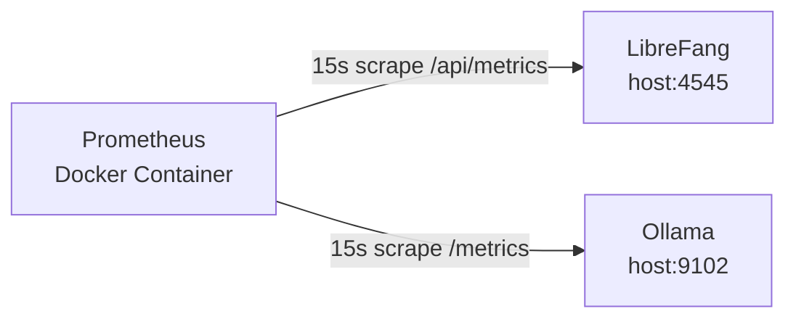

# Deployment — prometheus

# Deployment — Prometheus Configuration

## Purpose

This module provides the Prometheus scrape configuration for monitoring the LibreFang application and its Ollama inference backend. It is a static YAML configuration file consumed directly by a Prometheus server instance, typically running in Docker alongside the application services.

## Configuration File

**Location:** `deploy/prometheus/prometheus.yml`

## Global Settings

| Setting | Value | Description |
|---------|-------|-------------|
| `scrape_interval` | `15s` | How frequently Prometheus scrapes targets across all jobs |
| `evaluation_interval` | `15s` | How frequently Prometheus evaluates alerting and recording rules |

Both intervals use the same 15-second default, which balances observability granularity with minimal overhead on the scraped services.

## Scrape Targets

The configuration defines two scrape jobs:

### `librefang`

Scrapes application-level metrics from the main LibreFang service.

- **Metrics endpoint:** `/api/metrics`
- **Target:** `host.docker.internal:4545`
- **Instance label:** `librefang-local`

The use of `host.docker.internal` indicates Prometheus runs inside a Docker container while the LibreFang application runs on the host machine. The port `4545` must match the application's listening port.

### `ollama`

Scrapes metrics from the Ollama LLM inference service.

- **Metrics endpoint:** `/metrics`
- **Target:** `host.docker.internal:9102`
- **Instance label:** `ollama-local`

Ollama exposes its own Prometheus-compatible metrics at `/metrics`. The port `9102` must match the Ollama exporter or service port.

## Architecture



Prometheus reaches both services through the Docker host networking bridge (`host.docker.internal`), which allows a containerized Prometheus to access services bound to host ports.

## Usage

### Running with Docker

```bash
docker run -d \
  --name prometheus \
  -p 9090:9090 \
  -v $(pwd)/deploy/prometheus/prometheus.yml:/etc/prometheus/prometheus.yml \
  prom/prometheus
```

After startup, the Prometheus UI is available at `http://localhost:9090`.

### Running with Docker Compose

If integrating into a compose file, mount this configuration as a volume:

```yaml
services:
  prometheus:
    image: prom/prometheus
    ports:
      - "9090:9090"
    volumes:
      - ./deploy/prometheus/prometheus.yml:/etc/prometheus/prometheus.yml
```

## Modifying the Configuration

### Adding a new scrape target

Append a new entry under `scrape_configs`:

```yaml
- job_name: "my-service"
  metrics_path: /metrics
  static_configs:
    - targets: ["host.docker.internal:8080"]
      labels:
        instance: "my-service-local"
```

### Changing the scrape interval for a single job

Override the global interval per-job:

```yaml
- job_name: "librefang"
  scrape_interval: 10s
  metrics_path: /api/metrics
  static_configs:
    - targets: ["host.docker.internal:4545"]
```

### Switching to service discovery

For non-local deployments, replace `static_configs` with a service discovery mechanism (e.g., DNS, Consul, or Kubernetes SD). Example with DNS:

```yaml
- job_name: "librefang"
  metrics_path: /api/metrics
  dns_sd_configs:
    - names: ["librefang.production.internal"]
      type: A
      port: 4545
```

## Notes

- This configuration does not define alerting rules or an `alertmanager` section. For production use, add a `rule_files` block and configure alerting endpoints.
- There are no recording rules configured. Long-running dashboards may benefit from pre-aggregated recording rules to reduce query load.
- The `host.docker.internal` hostname resolves correctly on Docker Desktop (macOS, Windows). On Linux, add `extra_hosts: ["host.docker.internal:host-gateway"]` to the Prometheus container configuration.