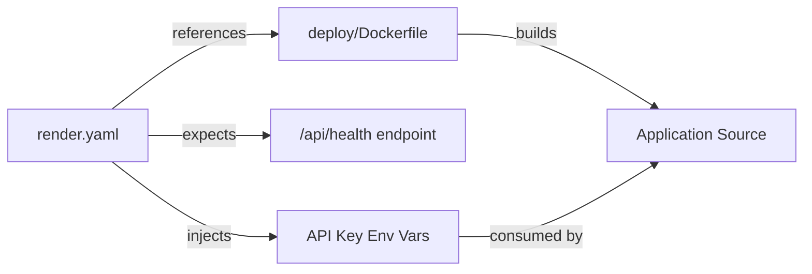

# Deployment — render.yaml

# Deployment — `render.yaml`

## Purpose

This file defines the Render platform deployment configuration for **LibreFang**. It tells Render how to build, run, and configure the application as a containerized web service.

## Overview

The configuration specifies a single Docker-based web service with three LLM provider API keys injected as environment variables. It targets Render's **free tier**, which comes with a critical caveat around data persistence.

## Service Definition

| Field | Value |
|---|---|
| **Service type** | `web` (HTTP-accessible) |
| **Runtime** | Docker |
| **Name** | `librefang` |
| **Dockerfile path** | `deploy/Dockerfile` |
| **Plan** | Free |
| **Health check** | `GET /api/health` |

The application must implement a handler at `/api/health` that returns a successful HTTP response (typically `200 OK`). Render uses this endpoint to determine whether the service is running and ready to receive traffic.

## Environment Variables

Three API keys are defined with `sync: false`, meaning they are **manually set** by the developer in the Render dashboard and never pulled from a linked repository or auto-synced source.

| Variable | Purpose |
|---|---|
| `GROQ_API_KEY` | Authentication key for the Groq LLM API |
| `OPENAI_API_KEY` | Authentication key for the OpenAI API |
| `ANTHROPIC_API_KEY` | Authentication key for the Anthropic API |

All three are optional at the config level — the application decides which providers to enable based on which keys are present. Set only the keys for providers you intend to use.

## Free Tier Limitations

Render's free tier does **not** support persistent disks. This means:

- **Configuration**, **conversation history**, and any **local database** are stored in-memory or on ephemeral filesystem.
- All data is **lost on every deploy or restart**.
- The service spins down after periods of inactivity, causing further data loss.

This is acceptable for testing and demonstration, but not for production use.

## Upgrading to Persistent Storage

To retain data across restarts, upgrade to a paid Render plan and add a disk block to the service definition:

```yaml
services:
  - type: web
    runtime: docker
    name: librefang
    dockerfilePath: deploy/Dockerfile
    plan: starter                # paid plan required
    healthCheckPath: /api/health
    disk:
      name: librefang-data
      mountPath: /data
      sizeGB: 1
    envVars:
      - key: LIBREFANG_HOME
        value: /data
      - key: GROQ_API_KEY
        sync: false
      - key: OPENAI_API_KEY
        sync: false
      - key: ANTHROPIC_API_KEY
        sync: false
```

Then set `LIBREFANG_HOME=/data` so the application writes all persistent state to the mounted disk. Adjust `sizeGB` based on your storage needs.

## Relationship to Other Files



- **`deploy/Dockerfile`** — The actual container build instructions. `render.yaml` points to this file; Render executes it during deployment.
- **`/api/health`** — Must be implemented in the application source. Without a responding health check, Render will consider the service unhealthy and may terminate it.
- **Application code** — Reads the injected `GROQ_API_KEY`, `OPENAI_API_KEY`, and `ANTHROPIC_API_KEY` environment variables at runtime to configure LLM provider clients.

## Deployment Workflow

1. Push changes to the connected Git branch.
2. Render detects the `render.yaml` at the repository root.
3. Render builds the Docker image using `deploy/Dockerfile`.
4. The container starts; Render begins polling `/api/health`.
5. Once the health check passes, the service is marked live and receives traffic.

## Notes

- The `sync: false` flag on each env var means you **must** set them manually in the Render dashboard under the service's Environment settings. They will not appear in logs or build output.
- No `startCommand` is needed because the Dockerfile's `CMD` or `ENTRYPOINT` defines the startup process.
- No `buildFilter` or branch configuration is specified here. If needed, add a `buildFilter` block to limit which branches or path changes trigger deploys.