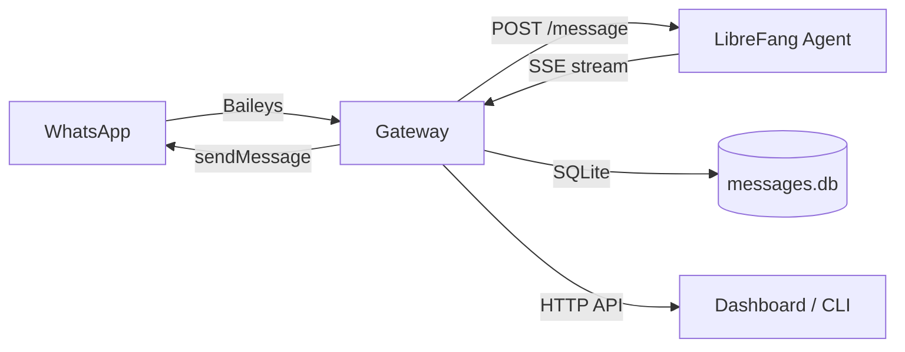
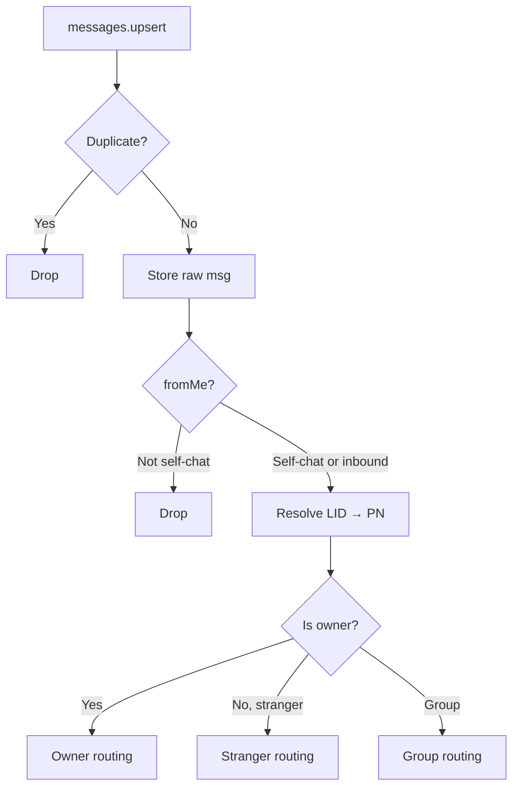

# Deployment — whatsapp-gateway

# WhatsApp Gateway

The `whatsapp-gateway` is a standalone Node.js process that bridges WhatsApp (via the Baileys library) and the LibreFang agent platform. It receives WhatsApp messages, forwards them to a LibreFang agent for processing, and delivers the agent's responses back to WhatsApp contacts.

## Architecture



## Configuration

The gateway reads from two sources, merged at startup:

| Source | Priority | Path |
|--------|----------|------|
| `config.toml` | base defaults | `~/.librefang/config.toml` (overridable via `LIBREFANG_CONFIG`) |
| Environment variables | overrides | — |

### Environment Variables

| Variable | Default | Purpose |
|----------|---------|---------|
| `WHATSAPP_GATEWAY_PORT` | `3009` | HTTP API listen port |
| `LIBREFANG_URL` | `http://127.0.0.1:4545` | LibreFang daemon URL |
| `LIBREFANG_DEFAULT_AGENT` | from config.toml | Agent name or UUID |
| `WHATSAPP_DB_PATH` | `./messages.db` | SQLite database path |
| `WHATSAPP_OWNER_JID` | — | Single owner JID (overrides config.toml `owner_numbers`) |
| `CONVERSATION_TTL_HOURS` | `24` | Stranger conversation expiry |
| `WA_HEARTBEAT_MS` | `180000` | Heartbeat timeout before forced reconnect |
| `WA_HEARTBEAT_CHECK_MS` | `30000` | Heartbeat check interval |
| `LIBREFANG_ECHO_TRACKER` | — | Set to `off` to disable echo suppression |

### config.toml (WhatsApp section)

```toml
[channels.whatsapp]
default_agent = "assistant"
owner_numbers = ["+391234567890"]
conversation_ttl_hours = 24
```

`owner_numbers` is critical — it determines which WhatsApp contacts are treated as the **owner** (full agent access + relay capabilities) versus **strangers** (sandboxed conversations with escalation tags).

## Startup Flow

1. Initialize SQLite (`messages.db`) with WAL mode and `messages` + `jid_last_seen` tables
2. Read `config.toml` for agent name, owner numbers, conversation TTL
3. Validate owner number format (7–15 digits)
4. Build `OWNER_JIDS` set via `deriveOwnerJids()` from `lib/identity`
5. Start HTTP server on `127.0.0.1:PORT`
6. If `auth_store/creds.json` exists, auto-connect to WhatsApp
7. Schedule background tasks: conversation eviction, DB cleanup, catch-up sweep

## Connection Lifecycle

### QR Pairing (`POST /login/start`)

Creates a Baileys socket with `useMultiFileAuthState` from `./auth_store`. The QR code is converted to a base64 data URL and returned to the caller. Credentials are persisted on `creds.update` events so subsequent starts skip the QR flow.

### Reconnection

Non-terminal disconnects trigger exponential backoff reconnection via `computeBackoffDelay()`:

- Base: `2s × 1.8^(attempt-1)`, capped at 30s
- ±25% jitter
- No hard stop — retries continue indefinitely at the capped interval

Terminal disconnects (`loggedOut`, `forbidden`) clear the auth store and require manual re-pairing.

### Heartbeat Watchdog (ST-01)

A periodic check (`WA_HEARTBEAT_CHECK_MS` interval) compares `Date.now()` against `lastInboundAt`. If no inbound `messages.upsert` event arrives within `WA_HEARTBEAT_MS` (default 180s), the socket is force-closed to trigger the reconnect path.

## Message Processing Pipeline



### Inbound Message Handling (`messages.upsert`, type `notify`)

For each message:

1. **Raw storage** — store in `messageStore` Map for Baileys retry decryption
2. **Deduplication** — `recentMessageIds` Map with 60s window
3. **Self-chat filter** — `fromMe` messages are only processed if addressed to own JID (WhatsApp "Notes to Self")
4. **LID resolution** — resolve opaque `<digits>@lid` identifiers to phone-number JIDs via `resolvePeerId()` from `lib/identity`, with proactive `sock.onWhatsApp()` lookup for first-seen LIDs (`resolveLidProactively`)
5. **Owner/stranger classification** — based on `OWNER_JIDS` and `ownerLidJids` sets
6. **Rate limiting** — 3 messages per 60s window for strangers and groups
7. **Agent resolution** — resolve `DEFAULT_AGENT` name → UUID via `GET /api/agents`
8. **Media processing** — download from WhatsApp, upload to LibreFang (`POST /api/agents/{id}/upload`)
9. **Echo suppression** — drop messages matching recently-sent outbound text (EB-01)
10. **Context enrichment** — reply quotes, forwarded flags, location/contact parsing
11. **DB save** — insert into `messages` table with `processed=0`
12. **Read receipt** — send blue ticks immediately
13. **Forward to LibreFang** — via streaming SSE endpoint with progressive WhatsApp edits
14. **Response delivery** — strip `NO_REPLY` sentinel, convert markdown, send or edit message
15. **DB update** — mark message as `processed=1`

### Stranger Routing (Step C)

Strangers receive a `[WHATSAPP_STRANGER_CONTEXT]` prefix injected before their message, containing:
- Sender identity (push name, phone)
- Conversation metadata (message count, start time)
- Available routing tags (`[NOTIFY_OWNER]`)

Agent responses to strangers are:
- Cleaned of `[NOTIFY_OWNER]` tags before delivery to the stranger
- Any extracted notifications are forwarded to the owner JID with 5-minute debounce per stranger

### Owner Routing (Step E)

When the owner messages the gateway and active stranger conversations exist, the agent receives:
- `[ACTIVE_STRANGER_CONVERSATIONS]` block listing all active strangers with last message excerpts
- `[SYSTEM_INSTRUCTION_WHATSAPP_RELAY]` instructing the agent to use `[RELAY_TO_STRANGER]` tags

Relay commands are validated:
- Target JID must exist in `activeConversations`
- Message is reformulated by the agent (never raw owner text)
- Audit-logged with timestamp, recipient, and message excerpt
- Failed relays report errors back to the owner

### Group Routing

Group messages include sender identity prefix `[Group message from ...]`. Participant rosters are fetched via `sock.groupMetadata()` and cached for 5 minutes (`GROUP_METADATA_TTL_MS`). The roster is forwarded to LibreFang in the `group_participants` payload field. Mention detection checks `mentionedJid` arrays against own JID.

### NO_REPLY Sentinel

Agents can emit `NO_REPLY` to silently decline answering. The `stripNoReply()` function handles three observed patterns:
- Bare: entire response is `NO_REPLY`
- Trailing: `...text\nNO_REPLY`
- Glued: `...emoji🎩NO_REPLY`

When the stripped result is empty, message delivery is suppressed entirely.

## Streaming (Progressive Edits)

When the LibreFang SSE endpoint (`/api/agents/{id}/message/stream`) is available, the gateway:

1. Opens a POST with `Accept: text/event-stream`
2. Accumulates `chunk` events into a growing text buffer
3. Calls `onProgress(accumulatedText)` at most every 2 seconds (`STREAMING_EDIT_INTERVAL_MS`)
4. `onProgress` sends the first message via `sock.sendMessage({ text })`, then edits it in-place via `{ edit: key }`
5. Internal tags (`[NOTIFY_OWNER]`, `[RELAY_TO_STRANGER]`, `NO_REPLY`) are scrubbed from partial text before each edit
6. Falls back to non-streaming `forwardToLibreFang()` on any SSE error

## Media Processing

Supported media types: image, video, audio (including voice notes/Push-to-Talk), stickers, documents.

Flow:
1. `getDownloadableMedia()` detects the media type key in the Baileys message object
2. `downloadMedia()` calls Baileys' `downloadMediaMessage()` with a 30s timeout and one retry
3. Size check against `MAX_MEDIA_SIZE` (50MB)
4. `uploadToLibreFang()` POSTs the buffer to `POST /api/agents/{id}/upload` with content type and filename headers
5. If the upload response includes a `transcription` field (for audio), it's used as the message text
6. On failure, falls back to a text descriptor like `[Photo from Alice]`

Audio messages with PTT flag (voice notes) are transcribed when LibreFang's upload endpoint returns a transcription.

## SQLite Message Store

WAL-mode database with two tables:

**`messages`** — every inbound/outbound message:
- `id` (primary key), `jid`, `sender_jid`, `push_name`, `phone`, `text`
- `direction` (`inbound`/`outbound`), `timestamp` (epoch ms)
- `processed`: `0` = pending, `1` = done, `-1` = permanently failed
- `retry_count`, `raw_type` (`text`, `image`, `audio`, `location`, `contact`, `decryption_error`, etc.)

**`jid_last_seen`** — last message timestamp per JID for gap detection.

Prepared statements are created once at module load for performance.

### Catch-Up Sweep (Fase 3.1)

Runs every 5 minutes. Selects messages with `processed=0` older than 30 seconds and re-forwards them to LibreFang. Messages with null/empty `jid` are skipped (`shouldSkipCatchupForMissingJid`). Group messages are skipped entirely (cannot determine mention context for replay). After `CATCHUP_MAX_RETRIES` (3) failures, messages are marked `processed=-1`.

### Gap Detection (Fase 3.2 Option C)

Runs every 10 minutes. Warns if a JID with recent activity (within 2 hours) has been silent for more than 30 minutes while an active conversation exists — indicates possible message loss.

### DB Cleanup

Runs daily. Deletes processed/failed messages older than 7 days.

## Markdown → WhatsApp Formatting

`markdownToWhatsApp()` converts LLM Markdown output to WhatsApp's formatting syntax:

| Markdown | WhatsApp |
|----------|----------|
| `**bold**` | `*bold*` |
| `*italic*` | `_italic_` |
| `~~strike~~` | `~strike~` |
| `` `code` `` | ` ```code``` ` |

Notable edge cases handled:
- `__init__` (Python dunders) is **not** converted to bold
- Bullet list items (`* item`) are **not** converted to italic
- Inline code content is protected from bold/italic conversion
- Backslash-escaped stars (`\*`) are preserved as literal `*`
- Bold content containing `*` is shielded from italic regex collision

## Identity Resolution (LID ↔ Phone Number)

WhatsApp assigns opaque LID identifiers (`<digits>@lid`) that are unrelated to phone numbers. The gateway maintains two caches:

- `lidToPnJid` (Map) — populated from `msg.key.senderPn` and proactive `sock.onWhatsApp()` lookups
- `ownerLidJids` (Set) — resolved once at connection open for all `OWNER_NUMBERS`

Resolution priority in `resolvePeerId()`:
1. `msg.key.senderPn` (Baileys-provided)
2. `lidToPnJid` cache
3. `msg.key.participant` (group sender)
4. Raw `remoteJid` if already `@s.whatsapp.net`

Unresolved identities log a structured `identity_unresolved` event with a reason tag.

## Decryption Retry

Baileys may fail to decrypt messages (stub type 39 / status `ERROR`). The gateway:

1. Tracks retry counts in `decryptRetryMap` (keyed by `jid:msgId`)
2. After `DECRYPT_RETRY_MAX` (3) failures, marks the message as permanently failed
3. Sends a fallback notification to the owner with the message ID and a hint to ask the contact to resend
4. Successful retries (arriving via later `messages.upsert`) clear the retry entry

## Conversation Tracker

In-memory `Map<jid, ConversationState>` for stranger conversations only:

- TTL-based eviction (configurable, default 24h) via 15-minute sweep
- Capped at 20 messages per conversation
- Tracks push name, phone, message count, escalation status
- Provides context blocks for owner-facing agent prompts

## HTTP API

All endpoints accept/return JSON. CORS is restricted to `localhost`, `127.0.0.1`, `tauri://localhost`, and `app://localhost` origins.

| Method | Path | Purpose |
|--------|------|---------|
| `POST` | `/login/start` | Start Baileys connection, returns QR data URL |
| `GET` | `/login/status` | Poll connection status |
| `POST` | `/message/send` | Send text message (`{ to, text }`) |
| `POST` | `/message/send-image` | Send image (`{ to, image_url, caption }`) |
| `POST` | `/message/send-audio` | Send audio/voice note (`{ to, audio_url, ptt }`) |
| `GET` | `/conversations` | List active stranger conversations |
| `GET` | `/messages/unprocessed` | List failed-to-forward messages |
| `GET` | `/messages/:jid` | Message history for a chat (`?limit=&since=`) |
| `GET` | `/health` | Health check with connection status |

Request body size is capped at 64KB.

## Session Isolation

Each WhatsApp conversation gets its own LibreFang session via the `channel_type` field:

```
channel_type: "whatsapp:<chatJid>"
```

This ensures the kernel creates separate sessions per contact. The gateway fails fast (throws `CHATJID_EMPTY`) if `chatJid` is missing, preventing unrelated chats from merging into a single session.

## Background Tasks

| Task | Interval | Purpose |
|------|----------|---------|
| Conversation eviction | 15 min | Remove expired stranger conversations |
| Rate limit cleanup | 5 min | Purge expired rate limit entries |
| Dedup cleanup | 2 min | Purge expired message IDs |
| Escalation debounce cleanup | 10 min | Purge stale escalation timestamps |
| Message store + decrypt retry cleanup | 1 min | Purge expired raw message cache and decrypt retry entries |
| Catch-up sweep | 5 min | Re-process unprocessed messages |
| Gap detection | 10 min | Warn on suspicious silence |
| DB cleanup | 24 hr | Delete old processed/failed messages |
| Heartbeat check | 30s | Force-reconnect if no inbound activity |

## Graceful Shutdown

On `SIGINT`/`SIGTERM`:

1. Re-entry guarded (prevents double-shutdown from overlapping signals)
2. Stops heartbeat watchdog
3. Tears down Baileys socket (`cleanupSocket`)
4. Closes HTTP server (drains connections via `closeAllConnections`)
5. Force-exits after 10s timeout

## Exported API (for testing)

The module exports internal functions for unit testing:

- `markdownToWhatsApp`, `extractNotifyOwner`, `extractRelayCommands`
- `buildConversationsContext`, `isRateLimited`
- `buildCorsHeaders`, `isAllowedOrigin`, `parseBody`
- `forwardToLibreFang`, `forwardToLibreFangStreaming`
- `shouldSkipCatchupForMissingJid`, `resolveLidProactively`
- `checkHeartbeat`, `computeBackoffDelay`
- `getGroupParticipants`, `invalidateGroupRoster`, `groupMetadataCache`
- `echoTracker`, `ECHO_TRACKER_ENABLED`, `EchoTracker`