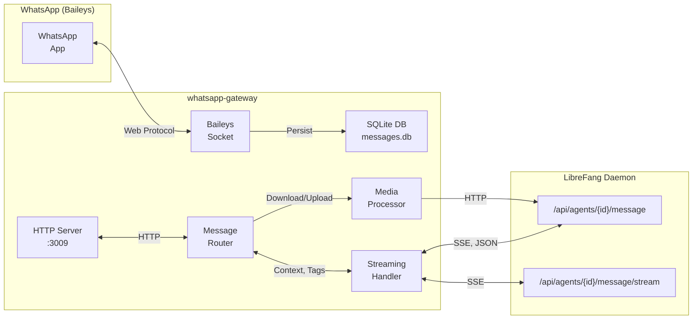
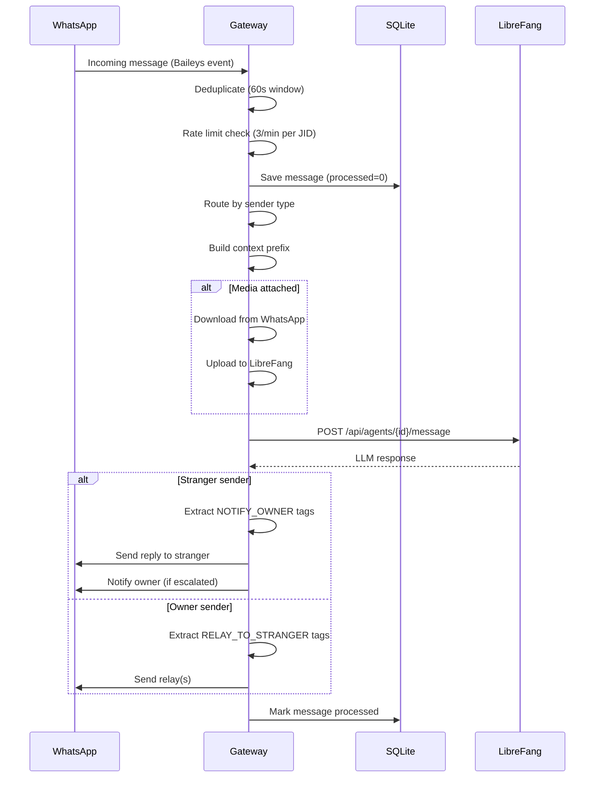

# Deployment — whatsapp-gateway

# WhatsApp Gateway — LibreFang

The WhatsApp gateway bridges WhatsApp Web with the LibreFang agent runtime. It handles QR-code authentication, incoming message routing, media processing, streaming LLM responses, and outbound messaging. Messages are persisted to a local SQLite database for history, retry recovery, and gap detection.

## Architecture Overview



## Configuration

The gateway reads configuration from two sources, in priority order:

1. **Environment variables** (override everything)
2. **`~/.librefang/config.toml`** (primary source)

### Environment Variables

| Variable | Default | Description |
|----------|---------|-------------|
| `WHATSAPP_DB_PATH` | `messages.db` in gateway dir | SQLite database path |
| `WHATSAPP_GATEWAY_PORT` | `3009` | HTTP server port |
| `WHATSAPP_OWNER_JID` | — | Single owner number (alternative to config) |
| `LIBREFANG_URL` | `http://127.0.0.1:4545` | LibreFang daemon URL |
| `LIBREFANG_DEFAULT_AGENT` | `assistant` | Default agent name |
| `LIBREFANG_CONFIG` | `~/.librefang/config.toml` | Config file path |
| `CONVERSATION_TTL_HOURS` | `24` | Conversation expiration time |

### config.toml Structure

```toml
[channels.whatsapp]
default_agent = "assistant"
owner_numbers = ["+1234567890", "+0987654321"]
conversation_ttl_hours = 24
```

### Owner Routing

Owner numbers from config are normalized to JIDs (`+1234567890` → `1234567890@s.whatsapp.net`). The **primary owner** (first in the list) receives escalation notifications. All owners can send relay commands.

## Message Flow

### Incoming Messages (WhatsApp → LibreFang → WhatsApp)



### Sender Types

The gateway classifies each incoming message:

| Type | Condition | Routing |
|------|-----------|---------|
| **Owner** | Sender JID in `OWNER_JIDS` | Reply directly; allow RELAY commands |
| **Stranger** | Not in `OWNER_JIDS`, not group | Reply directly; allow NOTIFY_OWNER |
| **Group** | JID ends with `@g.us` | Reply if mentioned |

### Context Prefixes

Stranger messages receive a contextual prefix so the LLM understands the routing context:

```
[WHATSAPP_STRANGER_CONTEXT]
Incoming WhatsApp message from: Alice (+1234567890)
This person is NOT the owner. They are an external contact.
Active conversation: 5 messages, started 2024-01-15T10:30:00Z

Available routing tags:
- [NOTIFY_OWNER]{"reason": "...", "summary": "..."}[/NOTIFY_OWNER]
[/WHATSAPP_STRANGER_CONTEXT]
```

Owner messages include active conversation summaries when strangers are being managed:

```
[ACTIVE_STRANGER_CONVERSATIONS]
1. Alice (+1234567890) [JID: ...] — last: "Hello?" (5min ago)
[/ACTIVE_STRANGER_CONVERSATIONS]

[OWNER_MESSAGE]
The user wants to reply to the stranger
```

## Agent Commands

The gateway recognizes special tags in LLM responses:

### NOTIFY_OWNER (Stranger Escalation)

```json
[NOTIFY_OWNER]{"reason": "urgent", "summary": "Customer needs help with billing"}[/NOTIFY_OWNER]
```

When the agent includes this tag, the gateway sends a notification to the primary owner. Escalations are debounced (5-minute cooldown per stranger) to prevent notification spam.

### RELAY_TO_STRANGER (Owner-Initiated Outreach)

```json
[RELAY_TO_STRANGER]{"jid":"1234567890@s.whatsapp.net","message":"Your order has shipped!"}[/RELAY_TO_STRANGER]
```

When the owner sends a message that the agent interprets as a reply to a stranger, the gateway extracts this tag and sends the reformulated message. Relay commands are validated:

- JID must correspond to an active conversation (prevents arbitrary outreach)
- Socket must be connected
- All relays are audit-logged

## Streaming Responses

The gateway uses Server-Sent Events (SSE) for progressive LLM responses. As tokens arrive, the gateway edits the WhatsApp message in-place, giving users a "typing" effect:

1. Agent sends first token → initial message sent to WhatsApp
2. Subsequent tokens arrive → message edited in-place (`edit` parameter)
3. Stream completes → final message confirmed

This works because Baileys supports editing sent messages. The streaming endpoint is `/api/agents/{id}/message/stream`. If SSE fails (wrong content-type, connection error), it falls back to non-streaming.

**Minimum edit interval**: 2000ms to avoid WhatsApp rate limiting on edits.

## Media Processing

### Download Flow

1. Detect downloadable media type (image, video, audio, sticker, document)
2. Download from Baileys (30s timeout, one retry)
3. Check size limit (50MB)
4. Upload to LibreFang (`/api/agents/{id}/upload`)
5. Return `{ file_id, transcription? }`

### Supported Types

| Type | Caption Handling | Transcription |
|------|------------------|---------------|
| Image | Caption becomes message text | No |
| Video | Caption becomes message text | No |
| Audio (voice note) | None | Yes (if available) |
| Audio (file) | Caption becomes message text | Yes (if available) |
| Sticker | Metadata descriptor | No |
| Document | Caption becomes message text | No |

### Location Messages

Location and live location messages are converted to a Google Maps link:

```
[Location: Central Park — 40.7829, -73.9654 — https://maps.google.com/?q=40.7829,-73.9654]
```

### Contact Messages

Shared contacts are parsed from vCard format:

```
[Shared contact: John Doe +1234567890]
```

## SQLite Schema

```sql
CREATE TABLE messages (
    id TEXT PRIMARY KEY,
    jid TEXT NOT NULL,
    sender_jid TEXT,
    push_name TEXT,
    phone TEXT,
    text TEXT,
    direction TEXT NOT NULL,  -- 'inbound' | 'outbound'
    timestamp INTEGER NOT NULL,
    processed INTEGER DEFAULT 0,  -- 0=pending, 1=success, -1=failed
    retry_count INTEGER DEFAULT 0,
    raw_type TEXT,
    created_at TEXT DEFAULT (datetime('now'))
);

CREATE TABLE jid_last_seen (
    jid TEXT PRIMARY KEY,
    last_timestamp INTEGER NOT NULL,
    updated_at TEXT DEFAULT (datetime('now'))
);
```

### Indexes

- `idx_messages_jid_ts`: Query messages by JID and timestamp range
- `idx_messages_processed`: Find unprocessed messages for catch-up

## Background Tasks

| Task | Interval | Description |
|------|----------|-------------|
| Catch-up sweep | 5 min | Re-process messages stuck with `processed=0` (30s age threshold) |
| DB cleanup | 24 hours | Delete processed/failed messages older than 7 days |
| Conversation eviction | 15 min | Remove conversations inactive for `CONVERSATION_TTL_HOURS` |
| Rate limit cleanup | 5 min | Remove expired rate limit entries |
| Dedup cleanup | 2 min | Remove expired message IDs from dedup cache |
| Escalation cleanup | 10 min | Remove stale escalation debounce entries |
| Decrypt retry cleanup | 60s | Remove expired decryption retry entries |
| Gap detection | 10 min | Warn if active conversation silent for 30+ minutes |

## Decryption Retry Handling

When Baileys reports a decryption failure (stub type 39 or status ERROR):

1. Increment retry counter in `decryptRetryMap`
2. After 3 retries, mark message as permanently failed
3. Notify the owner with a system message
4. After cleanup interval, remove from retry map

## HTTP API

All endpoints accept CORS requests from `localhost`, `127.0.0.1`, `tauri://localhost`, and `app://localhost`.

### POST /login/start

Initiates Baileys connection and returns QR code.

```json
// Response
{
  "qr_data_url": "data:image/png;base64,...",
  "session_id": "uuid",
  "message": "Scan this QR code...",
  "connected": false
}
```

### GET /login/status

Poll for connection status.

```json
{
  "connected": true,
  "message": "Connected to WhatsApp",
  "expired": false
}
```

### POST /message/send

Send outbound message from LibreFang daemon.

```json
// Request
{ "to": "+1234567890", "text": "Hello!" }

// Response
{ "success": true, "message": "Sent" }
```

### POST /message/send-image

Send image by URL.

```json
// Request
{ "to": "+1234567890", "image_url": "https://...", "caption": "Check this out" }
```

### GET /conversations

List active stranger conversations.

```json
{
  "conversations": [
    {
      "jid": "1234567890@s.whatsapp.net",
      "pushName": "Alice",
      "phone": "+1234567890",
      "messageCount": 12,
      "lastActivity": 1705312200000,
      "escalated": false,
      "lastMessage": { "text": "Hello", "direction": "inbound", "timestamp": 1705312200000 }
    }
  ]
}
```

### GET /messages/:jid

Message history for a chat (newest first).

```
GET /messages/1234567890@s.whatsapp.net?limit=50&since=0
```

### GET /messages/unprocessed

Messages that failed to forward (for debugging).

### GET /health

Health check endpoint.

```json
{
  "status": "ok",
  "connected": true,
  "session_id": "uuid",
  "active_conversations": 3
}
```

## Markdown Conversion

LLM responses use standard Markdown, which the gateway converts to WhatsApp formatting:

| Markdown | WhatsApp |
|----------|----------|
| `**bold**` | `*bold*` |
| `*italic*` | `_italic_` |
| `~~strike~~` | `~strike~` |
| `` `code` `` | ` ```code``` ` |

Special cases handled:
- Bullet list items (`* item`) are not converted to italic
- Inline code is protected before formatting runs
- Backslash-escaped stars (`\*`) become literal `*`
- Python dunders (`__init__`) are not converted to bold

## Termux/Android Support

The `postinstall.js` script handles native addon compilation on Termux, where `node-gyp` references undefined `android_ndk_path`. It patches `common.gypi` to remove the NDK reference, then rebuilds `better-sqlite3`.

## Exports (for testing)

```javascript
module.exports = {
  markdownToWhatsApp,
  extractNotifyOwner,
  extractRelayCommands,
  buildConversationsContext,
  isRateLimited,
  buildCorsHeaders,
  isAllowedOrigin,
  parseBody,
  MAX_BODY_SIZE,
};
```

## Error Handling

- **Connection loss**: Exponential backoff reconnection (max 10 attempts, 60s cap)
- **Forward failure**: Message stays `processed=0`; catch-up sweep retries
- **Media download failure**: Fall back to text descriptor (e.g., `[Photo from Alice]`)
- **Agent UUID stale**: Auto-retry with fresh UUID resolution
- **Rate limited**: Message dropped; logged but not stored as error
- **Logged out**: Auth cleared; new QR required

## Security Notes

- SQLite database file permissions set to `0o600` (owner read/write only)
- CORS restricted to local origins only
- Relay commands validated against active conversations (no arbitrary outreach)
- Escalation debounced to prevent notification spam
- Message deduplication prevents processing the same message twice