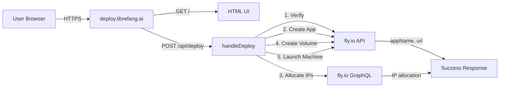

# Deployment — worker

# Deployment — Worker Module

The `deploy/worker` module is a Cloudflare Workers application that powers **deploy.librefang.ai** — a zero-infrastructure web interface for launching self-hosted LibreFang instances on Fly.io. It handles the complete provisioning workflow: token validation, app creation, network setup, persistent storage, and machine launch.

## Overview

This module serves two purposes:

1. **Web UI** — An interactive HTML page where users select a deployment platform and enter their Fly.io credentials
2. **API Endpoint** — A `POST /api/deploy` handler that orchestrates Fly.io provisioning programmatically

The worker is deployed via GitHub Actions and routes all traffic to `deploy.librefang.ai/*` through the `librefang.ai` zone.

## Architecture



## Request Flow

### GET / (Default Route)

Returns the full HTML interface. The page is a single-page application with two views:

1. **Platform Selection** — Grid of deployment options (Fly.io, Render, Railway, GCP, Docker, local installs)
2. **Fly.io Deploy Form** — Token input and deployment progress UI

### POST /api/deploy

Expects a JSON body with a `token` field containing the Fly.io personal access token.

**Validation steps:**

| Step | Action | Failure Handling |
|------|--------|------------------|
| 1 | Verify token via `GET /apps` | Returns 401 if token invalid |
| 2 | Create app with random name `librefang-{6-hex-chars}` | Returns 500 if creation fails |
| 3 | Allocate shared IPv4 and IPv6 via GraphQL | Non-fatal — failures logged |
| 4 | Create 1GB volume named `librefang_data` in `nrt` region | Returns 500 if creation fails |
| 5 | Launch machine with Docker image | Returns 500 if machine creation fails |

**Success response:**

```json
{
  "success": true,
  "appName": "librefang-a1b2c3",
  "url": "https://librefang-a1b2c3.fly.dev",
  "dashboardUrl": "https://fly.io/apps/librefang-a1b2c3",
  "machineId": "machine-id",
  "region": "nrt"
}
```

**Error response:**

```json
{
  "error": "Human-readable error message"
}
```

## Machine Configuration

The deployed Fly.io machine uses:

```javascript
{
  region: 'nrt',
  image: 'ghcr.io/librefang/librefang:latest',
  guest: { cpu_kind: 'shared', cpus: 1, memory_mb: 256 },
  services: [
    {
      ports: [
        { port: 443, handlers: ['tls', 'http'] },
        { port: 80, handlers: ['http'] }
      ],
      protocol: 'tcp',
      internal_port: 4545
    }
  ],
  mounts: [{ volume: 'librefang_data', path: '/data' }],
  env: {
    LIBREFANG_HOME: '/data',
    OPENROUTER_API_KEY: '<from env>'
  }
}
```

Key details:
- **Port 4545** is the internal service port
- **HTTPS termination** is handled by Fly.io's edge (handlers: `tls, http`)
- **Volume** is mounted at `/data` for persistent configuration and storage
- **OpenRouter key** is pre-populated from the worker's `OPENROUTER_API_KEY` secret for the free Step 3.5 Flash model

## Environment Configuration

The worker requires the following secret (set via `wrangler secret put` or Cloudflare dashboard):

| Variable | Purpose |
|----------|---------|
| `OPENROUTER_API_KEY` | Pre-configured API key injected into new deployments for free LLM access |

## Key Functions

### `handleDeploy(request, env)`

Main deployment orchestrator. Returns a `Response` object (not a thrown error) for all cases including failures.

### `randomHex(len)`

Generates cryptographically random hex strings for app naming:

```javascript
function randomHex(len) {
  const arr = new Uint8Array(len);
  crypto.getRandomValues(arr);
  return Array.from(arr, (b) => b.toString(16).padStart(2, '0')).join('');
}
```

### `json(data, status)`

Convenience helper for building JSON responses with consistent headers:

```javascript
function json(data, status = 200) {
  return new Response(JSON.stringify(data), {
    status,
    headers: { 'Content-Type': 'application/json' },
  });
}
```

## Frontend Integration

The HTML page includes a JavaScript client (`deploy()` function) that:

1. Shows a multi-step progress indicator as deployment proceeds
2. Advances the progress UI every 1.5 seconds regardless of actual progress (a UI convenience, not tied to real state)
3. Displays the result with direct links to the deployed app and Fly.io dashboard
4. Handles errors by resetting the form and showing the error message

## Deployment

The worker is deployed via GitHub Actions using Wrangler. See `wrangler.toml`:

```toml
name = "librefang-deploy"
main = "src/index.js"
compatibility_date = "2024-12-01"

routes = [
  { pattern = "deploy.librefang.ai/*", zone_name = "librefang.ai" }
]
```

## Security Considerations

- **Token handling**: The Fly.io API token is passed directly to Fly.io's API and never stored or logged by this worker
- **Token validation**: The token is validated before any resources are created to fail fast on authentication errors
- **App naming**: Random hex suffixes prevent naming collisions and add unpredictability
- **Read-only env vars**: Users cannot inject arbitrary environment variables through this interface; only the pre-configured OpenRouter key is passed

## Relationship to Other Modules

The call graph indicates this module's `json()` helper is referenced across the codebase as a standard response format. Other services (the Rust-based runtime, CLI, kernel) follow the same response structure convention established here for consistent API responses.