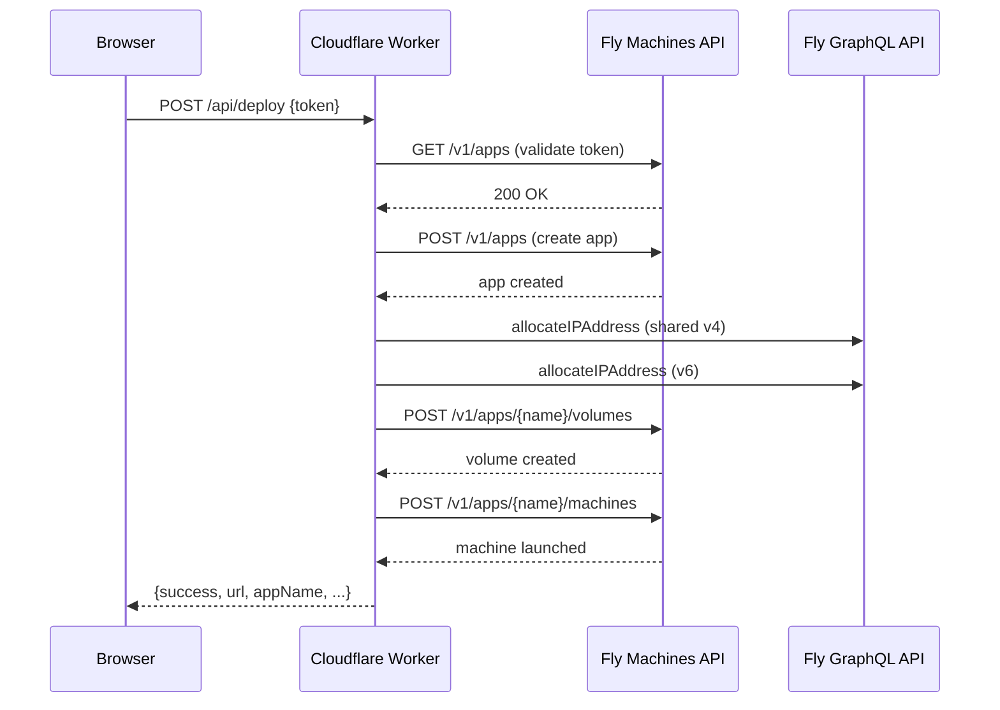

# Deployment — worker

# Deployment Worker

A Cloudflare Worker that provides a web UI and API for one-click LibreFang deployment to Fly.io, along with links to alternative deployment platforms.

## Overview

The worker serves two purposes:

- **Static HTML page** at the root path — a deployment portal listing platform options (Fly.io, Render, Railway, GCP, Docker, and local installers)
- **Deployment API** at `POST /api/deploy` — orchestrates a full Fly.io provisioning pipeline using the user's API token

**Route:** `deploy.librefang.ai/*`

## Architecture



## Key Constants

| Constant | Value | Purpose |
|---|---|---|
| `FLY_API` | `https://api.machines.dev/v1` | Fly.io Machines REST API base |
| `DOCKER_IMAGE` | `ghcr.io/librefang/librefang:latest` | Container image deployed to Fly |
| `REGION` | `nrt` | Tokyo region for all provisioned resources |

## Core Functions

### `fetch(request, env)`

Worker entry point. Routes based on path and method:

- `POST /api/deploy` → `handleDeploy`
- All other requests → serves the static HTML page

The `env` binding provides access to Cloudflare Worker secrets, specifically `OPENROUTER_API_KEY` which is injected into deployed instances as a free default LLM provider.

### `handleDeploy(request, env)`

Orchestrates the six-step Fly.io provisioning pipeline:

1. **Validate token** — `GET /v1/apps` against the Fly Machines API. Returns `401` if invalid.
2. **Create app** — `POST /v1/apps` with name `librefang-{randomHex(6)}` under the `personal` org.
3. **Allocate IP addresses** — Two GraphQL mutations via `https://api.fly.io/graphql`:
   - Shared IPv4 (required for public HTTPS)
   - IPv6
4. **Create persistent volume** — `POST /v1/apps/{name}/volumes` — 1 GB volume named `librefang_data` in region `nrt`.
5. **Build environment** — Sets `LIBREFANG_HOME=/data` and `OPENROUTER_API_KEY` from the worker's own secret.
6. **Launch machine** — `POST /v1/apps/{name}/machines` with:
   - 1 shared CPU, 256 MB RAM
   - HTTP/TLS service on ports 80/443 → internal port 4545
   - Volume mounted at `/data`
   - `auto_destroy: false`

On success, returns:

```json
{
  "success": true,
  "appName": "librefang-a1b2c3d4e5f6",
  "url": "https://librefang-a1b2c3d4e5f6.fly.dev",
  "dashboardUrl": "https://fly.io/apps/librefang-a1b2c3d4e5f6",
  "machineId": "...",
  "region": "nrt"
}
```

Error responses at any step include a descriptive message and appropriate HTTP status.

### `randomHex(len)`

Cryptographically secure hex string generator using `crypto.getRandomValues()`. Used for unique app name suffixes.

### `json(data, status)`

Response helper. Returns a `Response` with JSON content type and the given status code (default `200`).

## Environment Bindings

Set via `wrangler.toml` or the Cloudflare dashboard:

| Variable | Required | Purpose |
|---|---|---|
| `OPENROUTER_API_KEY` | Yes | Injected into deployed instances as the default free LLM provider (Step 3.5 Flash) |

## Frontend

The `HTML` constant contains the entire single-page application. Key sections:

- **Platform selection grid** — Cards for Fly.io, Render, Railway, GCP, Docker, and local installers (macOS/Linux/Windows) with copy-to-clipboard install commands
- **Fly.io deploy form** — Revealed when the user selects Fly.io. Contains step-by-step instructions, a token input field, and a deploy button
- **Progress indicator** — Animated step-by-step progress during deployment (auth → app → network → volume → machine)
- **Result view** — Links to the deployed instance and Fly.io console on success
- **Troubleshooting** — Expandable FAQ covering SSO token issues, missing images, and post-deploy configuration

The frontend POSTs the token to `/api/deploy` and handles the response entirely client-side. A simulated progress indicator advances on a 1.5-second interval while the actual API call is in flight.

## Configuration

**`wrangler.toml`:**

```toml
name = "librefang-deploy"
main = "src/index.js"
compatibility_date = "2024-12-01"

routes = [
  { pattern = "deploy.librefang.ai/*", zone_name = "librefang.ai" }
]
```

The worker is auto-deployed via GitHub Actions on changes to `deploy/worker/`.

## Security Considerations

- **Token handling:** The user's Fly.io API token is sent from the browser to the worker, then forwarded directly to Fly.io APIs. It is never stored or logged by the worker.
- **No authentication on the worker itself:** The `/api/deploy` endpoint is public. Rate limiting and abuse prevention rely on Cloudflare's built-in protections and the fact that deployment requires a valid Fly.io token.