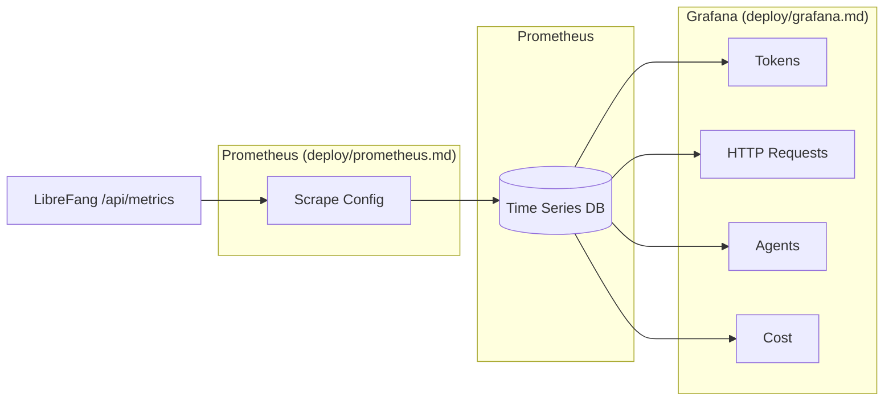

# Deployment

# Deployment Module

The `deploy/` directory contains everything needed to package, ship, and operate LibreFang in production. It supports multiple deployment targets and includes the observability stack for monitoring running instances.

## Deployment Targets

LibreFang can be deployed to several platforms, each optimized for different use cases:

| Platform | Best For | Configuration |
|----------|----------|---------------|
| [Fly.io](deploy-fly.md) | One-command self-hosted deployment | `fly/deploy.sh` |
| [Google Cloud Platform](deploy-gcp.md) | Free-tier single VM | `gcp/` |
| [Railway](deploy-railway.md) | Docker-based hosting | `railway.json` / `railway.toml` |
| [Render](deploy-render-yaml.md) | Simple cloud deployment | `render.yaml` |

All platform-specific deployments use the same [Dockerfile](deploy.md), which produces a multi-stage image combining the Rust-compiled daemon with the Node.js runtime for the React dashboard.

## Observability Stack

Monitoring is implemented as a three-layer pipeline:

Prometheus scrapes metrics from `/api/metrics` every 15 seconds. Grafana dashboards are auto-provisioned from YAML, visualizing token usage, HTTP request latency, agent activity, and cost.

## WhatsApp Integration

The [WhatsApp Gateway](deploy-whatsapp-gateway.md) bridges WhatsApp Web to the LibreFang agent runtime. It handles QR authentication, message routing, media processing, and streaming LLM responses. Messages are persisted to SQLite for history and retry recovery, then forwarded to the LibreFang daemon for agent processing.

## Web-Based Deployment

[deploy.librefang.ai](deploy-worker.md) provides a zero-infrastructure web UI for launching self-hosted instances on Fly.io. Built as a Cloudflare Worker, it handles the full provisioning workflow—token validation, app creation, persistent volume setup, and machine launch—without requiring server infrastructure.

## Key Files

| File | Purpose |
|------|---------|
| `Dockerfile` | Multi-stage production image (Rust + Node.js) |
| `fly/deploy.sh` | One-command Fly.io deployment |
| `prometheus/prometheus.yml` | Metrics scrape configuration |
| `grafana/provisioning/dashboards/` | Pre-built monitoring dashboards |
| `whatsapp-gateway/index.js` | WhatsApp bridge service |
| `worker/src/index.js` | Cloudflare Worker for deploy.librefang.ai |