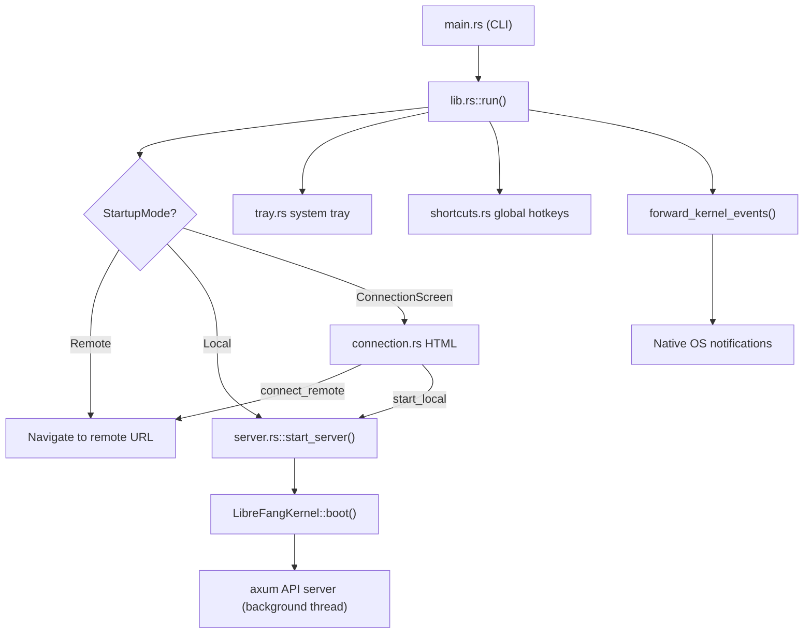

# Desktop Application

# LibreFang Desktop

Native desktop and mobile wrapper for the LibreFang Agent OS, built on Tauri 2.0. The app provides a system window pointing at the LibreFang web dashboard, backed by either an embedded kernel + API server (local mode) or a connection to a remote daemon (remote mode). Includes system tray integration, global shortcuts, auto-start, auto-updates, and native OS notifications.

## Architecture Overview

## Startup Flow

`main.rs` parses CLI arguments (`--server-url <URL>`, `--local`) and calls `lib.rs::run()`. On mobile, `mobile_main()` wraps `run()` with no arguments since CLI flags don't apply.

`run()` resolves the startup mode using this priority chain:

1. **CLI `--server-url`** → Remote mode
2. **CLI `--local`** → Local mode (desktop only)
3. **`LIBREFANG_SERVER_URL` env var** → Remote mode
4. **Saved preference** in `~/.librefang/desktop.toml` → Resumes last mode
5. **Fallback** → Connection screen

Before anything else, `run()` loads `~/.librefang/.env` into the process environment via `librefang_extensions::dotenv`. This must happen synchronously at startup because `std::env::set_var` is undefined behavior once other threads exist.

### Connection Screen

When no mode is pre-resolved, the app serves a self-contained HTML/CSS/JS connection page via a custom `lfconnect://` URI scheme protocol (registered through `tauri::Builder::register_uri_scheme_protocol`). This replaced an older `about:blank` + `document.write` approach that broke on WebKitGTK 2.50 (#3052).

The connection screen offers two paths:
- **Connect Remote** — validates the URL via `validate_server_url`, hits `/api/health`, persists the preference, then navigates the WebView.
- **Start Local Server** — boots the kernel on a blocking thread, stores state, and navigates to `http://127.0.0.1:{port}`.

On mobile, the local server button and divider are stripped at compile time. The JavaScript `setAllDisabled` function's reference to `btn-local` is also removed — without this, a TypeError would be thrown on first click.

## Managed State

Tauri managed state types provide interior mutability (`RwLock`) so commands and the connection flow can update values after app setup. All state is registered once in `run()` with initial values; subsequent updates go through the locks.

| Type | Field | Purpose |
|---|---|---|
| `PortState` | `RwLock<Option<u16>>` | Embedded server port. `None` in remote mode. |
| `KernelState` | `RwLock<Option<KernelInner>>` | Kernel handle + `started_at` instant. `None` in remote mode. |
| `ServerUrlState` | `RwLock<String>` | Current WebView target URL (local or remote). |
| `RemoteMode` | `RwLock<bool>` | Whether connected to a remote server. |
| `ServerHandleHolder` | `Mutex<Option<ServerHandle>>` | Desktop only. Holds the server handle for shutdown. |

`KernelInner` wraps an `Arc<LibreFangKernel>` and an `Instant` for uptime tracking.

## Embedded Server (`server.rs`)

Desktop only. Not compiled on iOS/Android.

`start_server()` performs these steps on the calling thread:

1. Boots the kernel via `LibreFangKernel::boot(None)`.
2. Calls `kernel.set_self_handle()`.
3. Binds a `TcpListener` to `127.0.0.1:0` to acquire a random free port.
4. Spawns a named thread (`librefang-server`) that creates its own multi-threaded tokio runtime.
5. Inside that runtime: starts background agents, spawns the approval sweep task, and runs the axum server with graceful shutdown via a `watch::channel`.

`ServerHandle` owns the shutdown sender and join handle. Calling `shutdown()` sends the signal, joins the thread, and calls `kernel.shutdown()`. `Drop` does a best-effort send without blocking — `Drop` uses `compare_exchange` on an `AtomicBool` to prevent double shutdown.

## URL Validation (`validate_server_url`)

Security gate that rejects `http://` for non-loopback hosts. The concern (#3673) is that a MITM on the WebView's HTTP connection could inject arbitrary IPC calls into the Tauri webview, achieving RCE.

Rules:
- `https://` — always allowed.
- `http://` with `localhost`, `127.x.x.x`, or `[::1]` — allowed.
- `http://` with any other host — rejected with an error message pointing to #3673.
- URLs containing `@` (userinfo) — rejected to prevent loopback bypass via `http://[::1]@evil.com/`.
- Non-`http`/`https` schemes — rejected.

## IPC Commands (`commands.rs`)

All commands are `#[tauri::command]` functions exposed to the frontend via `invoke`. Desktop-only commands are gated with `#[cfg(not(any(target_os = "ios", target_os = "android")))]`.

### Status & Query

- **`get_port`** — Returns the embedded server port from `PortState`.
- **`get_status`** — Returns JSON with `status`, `port`, `agents` count, and `uptime_secs`.
- **`get_agent_count`** — Returns the number of registered agents.

### Agent & Skill Import

- **`import_agent_toml`** — Opens a native file picker for TOML files, parses as `AgentManifest`, copies to `~/.librefang/workspaces/agents/{name}/agent.toml`, and calls `kernel.spawn_agent()`.
- **`import_skill_file`** — Opens a picker for skill files (`.md`, `.toml`, `.py`, `.js`, `.wasm`), copies to `~/.librefang/skills/`, and calls `kernel.reload_skills()`.

### Auto-start (desktop only)

- **`get_autostart`** / **`set_autostart(enabled)`** — Wraps `tauri_plugin_autostart`.

### Updates (desktop only)

- **`check_for_updates`** — Async. Returns `UpdateInfo` with `available`, `version`, `body`.
- **`install_update`** — Async. Downloads, installs, and restarts. Does not return on success.

### Credential Storage (mobile only)

On iOS/Android, daemon credentials are stored in the OS keyring under service `librefang-mobile`, account `daemon-credentials`. JSON-encoded as `{"base_url": ..., "api_key": ...}`.

- **`store_credentials(base_url, api_key)`**
- **`get_credentials`** — Returns `Option<Value>`. `None` if no entry exists.
- **`clear_credentials`** — Idempotent (no-op if nothing stored).

### Utilities

- **`open_config_dir`** — Opens `~/.librefang/` in the OS file manager.
- **`open_logs_dir`** — Opens `~/.librefang/logs/` in the OS file manager.
- **`uninstall_app`** — Platform-specific uninstall (see below).

#### Uninstall Behavior

| Platform | Behavior |
|---|---|
| Windows | Queries `HKCU\...\Uninstall` registry for `LibreFang`, extracts `UninstallString`, runs the NSIS uninstaller, exits. |
| macOS | Locates the enclosing `.app` bundle from the executable path, moves it to Trash via `osascript` + Finder, exits. |
| Linux (AppImage) | Deletes the AppImage binary (or `$APPIMAGE` env var), exits. |
| Linux (system package) | Returns an error with the appropriate `apt`/`dnf`/`pacman` remove command. |
| iOS/Android | Returns an error directing the user to the platform app store. |

## Connection Management (`connection.rs`)

### Preference Persistence

`ConnectionPreference` (`mode` + optional `server_url`) is serialized as TOML into `~/.librefang/desktop.toml` under a `connection` key wrapped in a `DesktopConfig` struct.

- `load_saved_preference()` — Reads and parses the file.
- `save_preference()` — Writes atomically (creates parent directory if needed).

### Navigation Target

`navigation_target(daemon_url)` determines where the WebView should navigate:

- **Mobile release builds** (`cfg(all(mobile, not(debug_assertions)))`): Returns `tauri://localhost/index.html#api={daemon_url}` — the bundled dashboard with the daemon URL hash-encoded. The dashboard's `bundleMode` fences API/WS requests onto the daemon (CORS must allow `tauri://localhost`).
- **All other builds** (mobile debug, desktop): Returns the daemon URL directly (thin-client mode).

### IPC Commands

- **`test_connection(url)`** — Validates the URL, hits `{url}/api/health` with a 10-second timeout, returns the JSON response.
- **`connect_remote(url, remember)`** — Validates, health-checks, optionally saves preference, updates all managed state (clears `PortState`/`KernelState`, sets `ServerUrlState`/`RemoteMode`), navigates the WebView.
- **`start_local(remember)`** *(desktop only)* — Boots the server via `start_server()`, populates all managed state, stores the `ServerHandle`, spawns event forwarding, optionally saves preference, navigates the WebView.

## Event Forwarding (`forward_kernel_events`)

Subscribes to all kernel events via `event_bus_ref().subscribe_all()`. Uses `recv_event_skipping_lag` from the kernel event bus to handle slow consumers — dropped events are counted in `EventBus::dropped_count()` and logged as errors rather than silently discarded.

Only critical events trigger native OS notifications:
- `LifecycleEvent::Crashed` — Agent crash with agent ID and error.
- `SystemEvent::KernelStopping` — Kernel shutdown.
- `SystemEvent::QuotaEnforced` — Agent hit spending limit.

## System Tray (`tray.rs`)

Desktop only. On Linux, additionally gated behind the `linux-tray` Cargo feature to avoid pulling deprecated GTK3 dependencies (RUSTSEC-2024-0411..0420, #3667).

The tray menu provides:
- **Show Window** / **Open in Browser** / **Change Server...**
- **Status** (uptime or remote URL) and **Agent count** — display-only (disabled items)
- **Launch at Login** — toggle via `CheckMenuItem`
- **Check for Updates** — silent download + restart on success, notification on failure
- **Open Config Directory**
- **Quit LibreFang**

Left-click on the tray icon shows/focuses the main window. "Change Server" shuts down any local server, clears kernel state, and re-renders the connection screen HTML into the WebView via `document.open(); document.write(...)`.

## Global Shortcuts (`shortcuts.rs`)

Desktop only. Three system-wide hotkeys:

| Shortcut | Action |
|---|---|
| `Ctrl+Shift+O` | Show/focus window |
| `Ctrl+Shift+N` | Show/focus window + emit `navigate` event with `"agents"` |
| `Ctrl+Shift+C` | Show/focus window + emit `navigate` event with `"chat"` |

The frontend listens for `navigate` events to route accordingly. Registration failure is non-fatal — a warning is logged and the app continues without shortcuts.

## Auto-Updater (`updater.rs`)

Desktop only. Uses `tauri_plugin_updater`.

`spawn_startup_check()` runs after a 10-second delay. Before invoking the plugin, it performs a HEAD request against the configured updater endpoint (`manifest_reachable`) — when no `latest.json` exists (e.g., `TAURI_SIGNING_PRIVATE_KEY` is missing from CI), this avoids noisy error logs.

On success: downloads silently, shows a notification, waits 3 seconds, then restarts. All errors are logged but never panic.

`check_for_update()` and `download_and_install_update()` are also exposed as IPC commands for on-demand checks from the UI or tray.

## Window Behavior

On desktop, closing the window is intercepted (`on_window_event` → `CloseRequested`) — the window is hidden instead of destroyed. The app continues running in the tray. `SingleInstancePlugin` focuses the existing window if a second instance is launched.

## Platform Differences Summary

| Feature | Desktop | Mobile |
|---|---|---|
| Embedded server | Yes (`server.rs`) | No (thin client) |
| System tray | Yes (Linux gated by feature) | No |
| Global shortcuts | Yes | No |
| Auto-start | Yes | No |
| Auto-updater | Yes | No |
| Credential storage | N/A | OS keyring (`keyring` crate) |
| Navigation target | Direct URL | Bundled dashboard + hash fragment (release) |
| `ServerHandleHolder` | Registered | Not compiled |
| IPC handler set | Full set (21 commands) | Reduced set (13 commands, no local/update/autostart) |