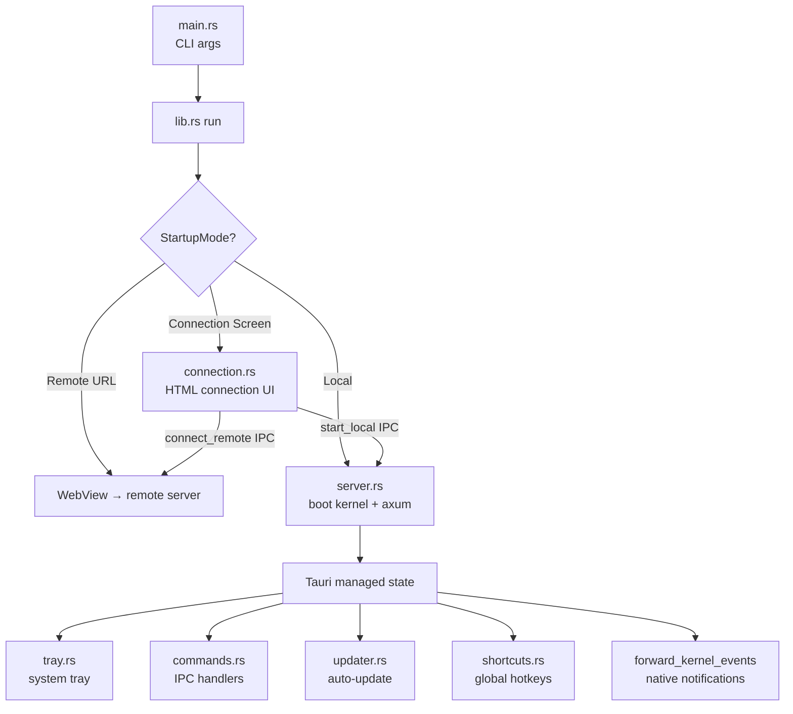

# Desktop Application

# LibreFang Desktop

Native desktop application built on **Tauri 2.0** that wraps the LibreFang Agent OS. The app operates in one of two modes — **local** (boots an embedded kernel and API server) or **remote** (thin client connecting to an external LibreFang instance). On mobile platforms (iOS/Android), only remote mode is available.

## Architecture Overview



## Startup Flow

The application resolves its connection mode from multiple sources, in priority order:

1. **CLI `--server-url <URL>`** → immediately connect to remote server
2. **CLI `--local`** → skip connection screen, boot local kernel (desktop only)
3. **`LIBREFANG_SERVER_URL` env var** → connect to remote server
4. **Saved preference** in `~/.librefang/desktop.toml` → replay last choice
5. **Connection screen** → present UI for user to choose

The connection preference is serialized as:

```toml
# ~/.librefang/desktop.toml
[connection]
mode = "remote"          # or "local"
server_url = "http://..." # absent for local mode
```

## Managed State

Tauri managed state uses **interior mutability** (`RwLock`) so the runtime mode can change when the user switches servers via the connection screen or tray menu. All state types are registered once during app setup with initial values derived from the resolved startup mode.

| Type | Contents | Desktop | Mobile |
|------|----------|---------|--------|
| `PortState` | `RwLock<Option<u16>>` — local server port | ✅ | ✅ (always `None`) |
| `KernelState` | `RwLock<Option<KernelInner>>` — kernel instance + start time | ✅ | ✅ (always `None`) |
| `ServerUrlState` | `RwLock<String>` — URL the WebView points at | ✅ | ✅ |
| `RemoteMode` | `RwLock<bool>` — true when connected to remote | ✅ | ✅ |
| `ServerHandleHolder` | `Mutex<Option<ServerHandle>>` — for shutdown | ✅ | ❌ |

`KernelInner` holds an `Arc<LibreFangKernel>` and the `Instant` the server started, enabling uptime reporting.

## Embedded Server (`server.rs`)

Desktop-only. Boots on the main thread (to guarantee port availability before window creation), then runs the axum server on a dedicated background thread with its own multi-threaded tokio runtime.

**Lifecycle:**

1. `LibreFangKernel::boot(None)` — synchronously initializes the kernel
2. `TcpListener::bind("127.0.0.1:0")` — claims a random free port on the main thread
3. Background thread: creates tokio runtime → `kernel.start_background_agents()` → `spawn_approval_sweep_task()` → `axum::serve()` with graceful shutdown via `watch` channel
4. Dashboard asset sync spawns in background during server startup

**Shutdown** is triggered via `ServerHandle::shutdown()` (blocking) or `Drop` (fire-and-forget signal). An `AtomicBool` prevents double-shutdown. The kernel's `shutdown()` method is called during explicit shutdown.

## Connection Screen (`connection.rs`)

A self-contained HTML/CSS/JS page served through a **custom URI scheme** (`lfconnect://localhost/`) rather than `about:blank` + `document.write` — the latter broke on WebKitGTK 2.50 (#3052). The page uses polling to wait for Tauri IPC availability (`window.__TAURI__.core.invoke`).

**IPC commands exposed:**

- **`test_connection(url)`** — HTTP GET to `{url}/api/health` with 10-second timeout. Returns the JSON response or an error.
- **`connect_remote(url, remember)`** — Validates URL, health-checks the server, updates all managed state (clears `PortState`/`KernelState`, sets `ServerUrlState`/`RemoteMode`), optionally saves preference, navigates the WebView.
- **`start_local(remember)`** (desktop only) — Calls `start_server()` on a blocking thread, populates all managed state, stores the `ServerHandle`, starts event forwarding, optionally saves preference, navigates to `http://127.0.0.1:{port}`.

## IPC Commands (`commands.rs`)

All commands return `Result<T, String>` for Tauri serialization. Desktop-only commands are gated with `#[cfg(not(any(target_os = "ios", target_os = "android")))]`.

### Status & Introspection

| Command | Returns |
|---------|---------|
| `get_port` | The local server port (`u16`) |
| `get_status` | JSON: `{ status, port, agents, uptime_secs }` |
| `get_agent_count` | Number of registered agents (`usize`) |

### Agent & Skill Import

- **`import_agent_toml`** — Opens a native file picker filtered to `.toml`, parses the file as `AgentManifest`, copies it to `~/.librefang/workspaces/agents/{name}/agent.toml`, and calls `kernel.spawn_agent()`.
- **`import_skill_file`** — Opens a file picker for `.md/.toml/.py/.js/.wasm`, copies to `~/.librefang/skills/`, and calls `kernel.reload_skills()`.

### System Operations

- **`open_config_dir`** / **`open_logs_dir`** — Creates the directory if needed and opens it in the OS file manager via the `open` crate.
- **`get_autostart`** / **`set_autostart(enabled)`** — Read/write login auto-start (desktop only).
- **`uninstall_app`** — Platform-specific uninstaller launch. Returns a hint string on Linux/system-package installs where elevation is needed.

### Updates (desktop only)

- **`check_for_updates`** → `UpdateInfo { available, version, body }`
- **`install_update`** — Downloads, installs, and restarts. Does not return `Ok` on success (the process exits).

## Auto-Updater (`updater.rs`)

Desktop-only. Two code paths:

1. **Startup check** (`spawn_startup_check`): 10-second delay after launch, pre-flights the update manifest endpoint via HEAD request (avoids noisy 404 errors when `latest.json` isn't published), then silently installs if available. Shows a notification before restarting.

2. **On-demand** (tray menu or IPC): Returns structured `UpdateInfo` so the UI can prompt the user, then `download_and_install_update` performs the actual install + restart.

The `manifest_reachable()` pre-flight reads the updater endpoint URL from `tauri.conf.json` plugins config and issues a 5-second HEAD request. This prevents log spam when the release pipeline hasn't published a manifest yet.

## System Tray (`tray.rs`)

Desktop-only. Provides:

- **Show Window** / **Open in Browser** / **Change Server...**
- **Status display** — shows "Remote (url)" or "Running (uptime)" plus agent count
- **Launch at Login** toggle — checkbox bound to `tauri-plugin-autostart`
- **Check for Updates** — triggers update check + notification
- **Open Config Directory**
- **Quit**

The "Change Server" action shuts down any running local server, clears kernel state, and re-renders the connection screen HTML into the existing WebView.

## Global Shortcuts (`shortcuts.rs`)

Desktop-only. Three system-wide hotkeys registered via `tauri-plugin-global-shortcut`:

| Shortcut | Action |
|----------|--------|
| `Ctrl+Shift+O` | Show/focus window |
| `Ctrl+Shift+N` | Show window + emit `navigate("agents")` |
| `Ctrl+Shift+C` | Show window + emit `navigate("chat")` |

Registration failure is non-fatal — the app continues without shortcuts.

## Native Notifications

`forward_kernel_events` subscribes to the kernel event bus and surfaces critical events as OS notifications:

- **Agent crashed** — agent ID + error message
- **Kernel stopping** — shutdown notification
- **Quota enforced** — agent spending hit its limit

Uses `tauri-plugin-notification`. Lagged broadcast messages are logged but don't crash the listener.

## Window Behavior

On desktop, closing the window **hides to tray** instead of quitting (`CloseRequested` → `hide()` + `api.prevent_close()`). The app fully exits only through the tray "Quit" item or `app.exit(0)`.

Single-instance enforcement (desktop) focuses the existing window when a second launch is attempted.

## Platform Differences

| Feature | Desktop (Win/macOS/Linux) | Mobile (iOS/Android) |
|---------|--------------------------|----------------------|
| Embedded server | ✅ | ❌ |
| System tray | ✅ | ❌ |
| Global shortcuts | ✅ | ❌ |
| Auto-updater | ✅ | ❌ (stores handle updates) |
| Shell plugin | ✅ | ❌ |
| Single instance | ✅ | ❌ |
| Autostart | ✅ | ❌ |
| Connection screen | Remote + local | Remote only |
| Uninstall | Platform-specific | Hint to use app store |

## CLI Arguments

```
librefang-desktop [OPTIONS]

Options:
  --server-url <URL>   Connect to a remote LibreFang server
  --local              Start local server, skip connection screen
  -h, --help           Print help
```

Environment loading (`~/.librefang/.env`) happens in `main()` before any async runtime is spawned, because `std::env::set_var` is undefined safe once other threads exist.