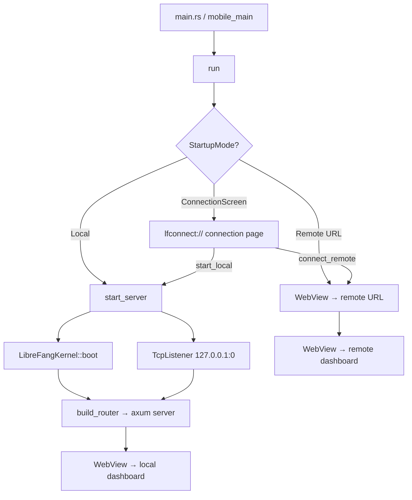

# Desktop Application

# LibreFang Desktop Application

The native desktop and mobile wrapper for LibreFang, built on Tauri 2.0. Provides a WebView-based UI backed by either an embedded kernel + API server (local mode) or a connection to a remote LibreFang instance (remote mode). Includes system tray integration, global shortcuts, auto-start, auto-update, native OS notifications, and platform-aware uninstall flows.

## Architecture Overview



## Startup and Connection Modes

The app resolves its startup mode from multiple sources in priority order:

1. **CLI argument** `--server-url <URL>` → remote mode
2. **CLI argument** `--local` → local mode (desktop only; mobile falls through)
3. **Environment variable** `LIBREFANG_SERVER_URL` → remote mode
4. **Saved preference** in `~/.librefang/desktop.toml` → whichever was last chosen
5. **Connection screen** → user picks interactively

The connection screen is served through a custom URI scheme protocol (`lfconnect://localhost/`) rather than `about:blank` + `document.write`, which broke on WebKitGTK 2.50.

### Mobile Differences

On iOS and Android the app is always a thin client — there is no embedded server. The `start_local` command and related state types are compiled out. Release mobile builds navigate to `tauri://localhost/index.html#api=<encoded-url>` so the dashboard ships embedded; debug builds stay in thin-client mode and navigate to the daemon URL directly.

## Managed State

All shared state is registered once during `run()` and updated through interior-mutable `RwLock`s:

| State Type | Contents | When `None` |
|---|---|---|
| `PortState` | `RwLock<Option<u16>>` — server port | Remote mode or before boot |
| `KernelState` | `RwLock<Option<KernelInner>>` — kernel + start time | Remote mode or before boot |
| `ServerUrlState` | `RwLock<String>` — current WebView URL | Empty string before connection |
| `RemoteMode` | `RwLock<bool>` — connected to remote? | — |
| `ServerHandleHolder` | `Mutex<Option<ServerHandle>>` — for shutdown | Desktop only; filled by `start_local` or direct boot |

## URL Validation (`validate_server_url`)

All user-supplied server URLs pass through `validate_server_url` before the WebView navigates. The rules prevent MITM-injected IPC abuse (issue #3673):

- **HTTPS** to any host → always allowed
- **HTTP** to `localhost`, `127.x.x.x`, `[::1]` → allowed (loopback)
- **HTTP** to any other host → **rejected** with an error message
- URLs with userinfo (`@`) → **rejected** (bypass attempt)
- No scheme, non-HTTP schemes → **rejected**

## Embedded Server (`server.rs`)

Desktop-only. Boots the kernel synchronously on the calling thread, binds a `TcpListener` to `127.0.0.1:0` (OS-assigned port), then spawns a dedicated thread with its own multi-threaded tokio runtime for the axum server.

Key lifecycle:

1. `LibreFangKernel::boot(None)` — sync, no tokio needed
2. `TcpListener::bind("127.0.0.1:0")` — port known before any window is created
3. `std::thread::spawn` → `tokio::runtime::Builder::new_multi_thread` → `build_router` + `axum::serve`
4. `start_background_agents()` and `spawn_approval_sweep_task()` run inside the tokio context
5. Dashboard asset sync runs as a background tokio task

`ServerHandle` owns a `watch::Sender<bool>` for shutdown signaling and an `AtomicBool` to prevent double-shutdown. `Drop` sends the signal without blocking; explicit `shutdown()` waits for the thread to join and then calls `kernel.shutdown()`.

## IPC Commands (`commands.rs`)

### Status and Info

| Command | Returns |
|---|---|
| `get_port` | Listening port (`u16`) |
| `get_status` | JSON with `status`, `port`, `agents`, `uptime_secs` |
| `get_agent_count` | Number of registered agents |

### Agent and Skill Import

- **`import_agent_toml`** — Opens a native file picker filtered to `.toml`, parses as `AgentManifest`, copies to `~/.librefang/workspaces/agents/{name}/agent.toml`, then calls `kernel.spawn_agent()`.
- **`import_skill_file`** — Opens a file picker (`.md`, `.toml`, `.py`, `.js`, `.wasm`), copies to `~/.librefang/skills/`, then calls `kernel.reload_skills()`.

### Auto-Start (Desktop)

- `get_autostart` / `set_autostart(enabled)` — Wraps `tauri-plugin-autostart`. Passes `--minimized` flag.

### Updates (Desktop)

- `check_for_updates` — Returns `UpdateInfo { available, version, body }`.
- `install_update` — Downloads, installs, and restarts. Does not return on success.

### Credentials (Mobile)

- `store_credentials(base_url, api_key)` / `get_credentials()` / `clear_credentials()` — Uses the OS keyring via the `keyring` crate. JSON-encodes `{"base_url": ..., "api_key": ...}`.

### Utility

- `open_config_dir` — Opens `~/.librefang/` in the OS file manager.
- `open_logs_dir` — Opens `~/.librefang/logs/`.
- `uninstall_app` — Platform-aware uninstall (see below).

### Uninstall Flow

Platform-specific behavior in `uninstall_app`:

- **Windows**: Queries `HKCU\Software\Microsoft\Windows\CurrentVersion\Uninstall` for the NSIS `UninstallString`, then runs it.
- **macOS**: Walks up from the executable to find the `.app` bundle, moves it to Trash via `osascript` + Finder.
- **Linux/AppImage**: Deletes the AppImage binary directly. For system packages, returns a hint string like `sudo apt remove librefang`.
- **Mobile**: Returns a message to use the platform app store.

## Connection Screen (`connection.rs`)

A self-contained HTML/CSS/JS page served at `lfconnect://localhost/`. Provides:

- **Server URL input** with Test Connection and Connect buttons
- **Start Local Server** button (stripped on mobile via `debug_assert`-guarded string replacement)
- **Remember preference** checkbox
- **Uninstall** button

The JS polls for `window.__TAURI__` with an 8-second deadline because WebView2 injects it asynchronously on custom-protocol pages.

### IPC Commands

| Command | Description |
|---|---|
| `test_connection(url)` | HTTP GET to `{url}/api/health`, returns JSON |
| `connect_remote(url, remember)` | Validates URL, checks health, saves preference, updates managed state, navigates WebView |
| `start_local(remember)` | Boots embedded server, updates all managed state, subscribes to kernel events, saves preference, navigates WebView (desktop only) |

### Navigation Target

`navigation_target(daemon_url)` resolves where the WebView should go:

- **Mobile release**: `tauri://localhost/index.html#api=<daemon_url>` (bundled dashboard)
- **Everything else**: The daemon URL directly (thin client)

### Preference Persistence

`ConnectionPreference { mode, server_url }` is stored as TOML in `~/.librefang/desktop.toml`:

```toml
[connection]
mode = "remote"
server_url = "http://192.168.1.100:4545"
```

## System Tray (`tray.rs`)

Desktop-only. Gated behind the `linux-tray` Cargo feature on Linux (avoids pulling deprecated GTK3 dependencies — see #3667). The tray menu provides:

- **Show Window** / **Open in Browser** / **Change Server...**
- **Status display** — agent count, uptime (local) or remote URL
- **Launch at Login** — `CheckMenuItem` toggling auto-start
- **Check for Updates** — triggers silent download + install + restart
- **Open Config Directory**
- **Quit**

**Change Server** shuts down any running local server, clears local-mode state, and re-renders the connection screen in the existing WebView via `document.open() / document.write()`.

Left-click on the tray icon shows and focuses the main window.

## Global Shortcuts (`shortcuts.rs`)

Desktop-only. Three system-wide shortcuts registered via `tauri-plugin-global-shortcut`:

| Shortcut | Action |
|---|---|
| `Ctrl+Shift+O` | Show/focus window |
| `Ctrl+Shift+N` | Show window + emit `navigate` event `"agents"` |
| `Ctrl+Shift+C` | Show window + emit `navigate` event `"chat"` |

Registration failure is non-fatal — the app logs a warning and continues.

## Auto-Updater (`updater.rs`)

Desktop-only. On startup, `spawn_startup_check` waits 10 seconds, then probes the updater manifest endpoint with a HEAD request. If the manifest is unreachable (e.g., no `latest.json` on the release), the check is skipped entirely to avoid noisy log spam.

When an update is found:
1. A native notification announces the update
2. After a 3-second delay, `download_and_install_update` runs
3. On success, `app_handle.restart()` terminates the process

`check_for_update` returns a structured `UpdateInfo` for on-demand checks from the tray or IPC commands.

## Event Forwarding

`forward_kernel_events` subscribes to all kernel events and surfaces critical ones as native OS notifications:

- **Agent crashed** (`LifecycleEvent::Crashed`)
- **Kernel stopping** (`SystemEvent::KernelStopping`)
- **Quota enforced** (`SystemEvent::QuotaEnforced`)

Uses `recv_event_skipping_lag` so consumer-side drops are counted in `EventBus::dropped_count()` and logged as errors rather than silently discarded.

## Window Lifecycle

On desktop, closing the window hides it to the system tray rather than quitting (`CloseRequested { api.prevent_close() }`). The app exits only when the user chooses **Quit** from the tray menu or the Tauri run event loop ends.

On mobile, the window is declared in `tauri.{ios,android}.conf.json` rather than built programmatically — Tauri 2 mobile does not honor `WebviewWindowBuilder` for the first window in `setup()`.

## Environment Loading

`~/.librefang/.env` (and `secrets.env` / vault) is loaded into the process environment at the synchronous `main()` boundary before any threads are spawned, because `std::env::set_var` is undefined behavior once other threads exist.