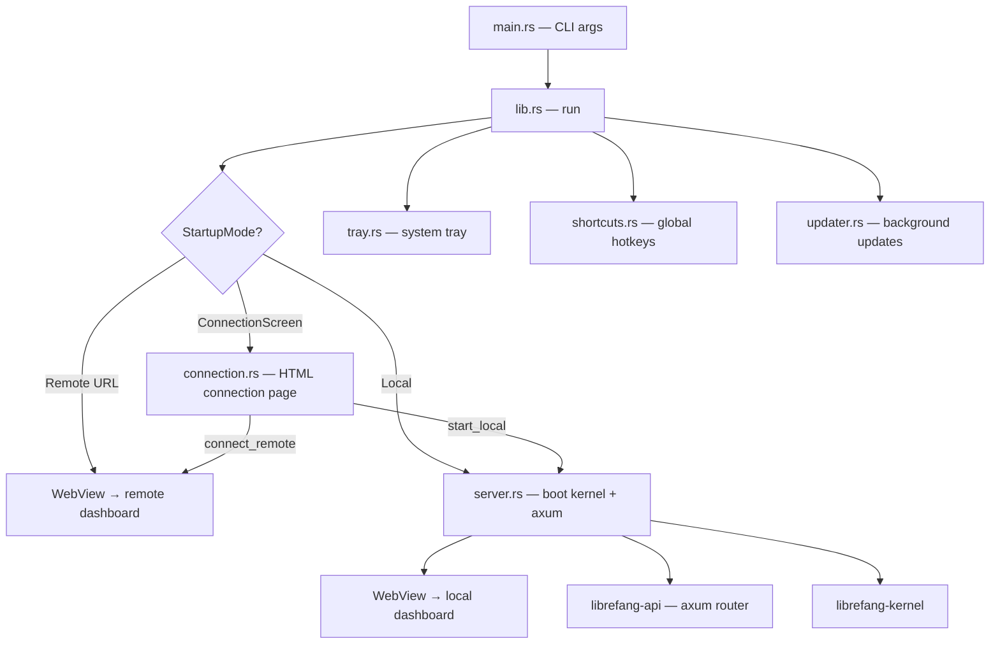

# Desktop Application

# LibreFang Desktop

Native desktop application wrapping the LibreFang Agent OS using Tauri 2.0. Provides a system tray, global shortcuts, auto-update, auto-start, and both local and remote server modes.

## Architecture

## Startup Flow

`main.rs` is a thin CLI wrapper. It loads environment variables from `~/.librefang/.env` synchronously (before any threads exist), parses `--server-url` and `--local` flags via clap, then calls `lib::run()`.

`run()` resolves the connection mode with this priority:

1. **CLI `--server-url`** → Remote mode, connect directly
2. **CLI `--local`** → Local mode, boot embedded server
3. **`LIBREFANG_SERVER_URL` env var** → Remote mode
4. **Saved preference** from `~/.librefang/desktop.toml` → Remote or Local per saved choice
5. **Fallback** → Show the connection screen

For direct modes (remote or local), the URL and server handle are resolved before the Tauri builder runs. For the connection screen, a blank page is injected with HTML from `connection::connection_html()`, and the user's choice triggers IPC commands that resolve everything at runtime.

## Managed State

Tauri managed state uses interior mutability (`RwLock`/`Mutex`) so state can be updated from IPC commands without re-registering. All five types are registered once at startup with initial values; updates go through the locks.

| State Type | Inner Type | Purpose |
|---|---|---|
| `PortState` | `RwLock<Option<u16>>` | Local server port. `None` in remote mode. |
| `KernelState` | `RwLock<Option<KernelInner>>` | Kernel instance + `Instant` start time. `None` in remote mode. |
| `ServerUrlState` | `RwLock<String>` | URL the WebView navigates to (local or remote). |
| `RemoteMode` | `RwLock<bool>` | `true` when connected to a remote server. |
| `ServerHandleHolder` | `Mutex<Option<ServerHandle>>` | Server handle for shutdown. Filled by `start_local` or direct boot. |

`KernelInner` holds an `Arc<LibreFangKernel>` and the `Instant` the server started, used for uptime reporting.

## Module Breakdown

### `server.rs` — Embedded Server Lifecycle

`start_server()` performs three steps:

1. Boots `LibreFangKernel` synchronously on the calling thread (no tokio needed).
2. Binds a `TcpListener` to `127.0.0.1:0` on the calling thread — this guarantees the port is known before any Tauri window is created.
3. Spawns a dedicated OS thread named `"librefang-server"` with its own multi-threaded tokio runtime. Inside that runtime:
   - `start_background_agents()` runs (requires tokio context).
   - `spawn_approval_sweep_task()` starts.
   - `run_embedded_server()` converts the std `TcpListener` to tokio, builds the axum router via `librefang_api::server::build_router`, and serves with graceful shutdown via a `watch` channel.

`ServerHandle` owns the shutdown sender, kernel, and server thread join handle. Calling `shutdown()` sends the signal, joins the thread, and calls `kernel.shutdown()`. `Drop` sends the signal without blocking — the thread exits on its own.

A double-shutdown guard (`AtomicBool`) prevents sending the signal twice (both explicit `shutdown()` and `Drop` may run).

### `connection.rs` — Remote/Local Mode Switching

Handles the connection screen and runtime server switching.

**Persistence.** `ConnectionPreference` (mode + optional server_url) is saved to `~/.librefang/desktop.toml` via `save_preference()`. Loaded at startup by `load_saved_preference()`.

**IPC commands:**

- `test_connection(url)` — GETs `{url}/api/health` with a 10-second timeout. Returns the JSON response or an error string.
- `connect_remote(url, remember)` — Validates the URL, confirms the server is healthy, updates all managed state (clears local state, sets remote mode), optionally saves preference, then navigates the WebView via `window.eval`.
- `start_local(remember)` — Spawns `server::start_server()` on a blocking thread, updates all managed state, stores the `ServerHandle`, starts event forwarding for notifications, optionally saves preference, then navigates the WebView.

`connection_html()` returns a self-contained HTML/CSS/JS string that renders the connection UI. The JavaScript polls for `window.__TAURI__` availability (WebView2 on `about:blank` loads IPC asynchronously) before calling `invoke`.

### `commands.rs` — IPC Command Handlers

All commands are `#[tauri::command]` functions exposed to the WebView.

**Status queries:**
- `get_port()` — Returns the local server port.
- `get_status()` — Returns JSON with `status`, `port`, `agents` count, `uptime_secs`.
- `get_agent_count()` — Returns registered agent count.

**File imports:**
- `import_agent_toml()` — Opens a native file picker filtered to `.toml`, parses as `AgentManifest`, copies to `~/.librefang/workspaces/agents/{name}/agent.toml`, spawns the agent via kernel.
- `import_skill_file()` — Opens a file picker for `.md/.toml/.py/.js/.wasm`, copies to `~/.librefang/skills/`, triggers `kernel.reload_skills()`.

**Settings:**
- `get_autostart()` / `set_autostart(enabled)` — Read/write OS auto-start via `tauri-plugin-autostart`.
- `check_for_updates()` — Delegates to `updater::check_for_update()`.
- `install_update()` — Delegates to `updater::download_and_install_update()`. On success the app restarts (never returns `Ok`).

**Utilities:**
- `open_config_dir()` / `open_logs_dir()` — Opens `~/.librefang/` or `~/.librefang/logs/` in the OS file manager.
- `uninstall_app()` — Platform-specific uninstall logic (see below).

**`uninstall_app()` platform behavior:**

| Platform | Method |
|---|---|
| Windows | Queries `HKCU\...\Uninstall` registry for `UninstallString`, runs the NSIS uninstaller, exits. |
| macOS | Locates the enclosing `.app` bundle from the executable path, moves it to Trash via `osascript` + Finder, exits. |
| Linux/AppImage | Deletes the `.AppImage` file (or `$APPIMAGE` path), exits. |
| Linux/system | Returns an error with the appropriate `apt`/`dnf`/`pacman` removal command. |

### `tray.rs` — System Tray

`setup_tray()` builds a tray icon from embedded `icons/32x32.png` with a menu containing:

- **Show Window** / **Open in Browser** / **Change Server...** — actions
- **Agents: N running** / **Status: Running/Remote** — display-only (disabled)
- **Launch at Login** — toggle via `CheckMenuItem`, talks to `tauri-plugin-autostart`
- **Check for Updates...** — spawns async check, shows notification, installs if available
- **Open Config Directory** — opens `~/.librefang/`
- **Quit LibreFang** — calls `app.exit(0)`

**Change Server** shuts down any running local server (takes the `ServerHandle` from the holder, spawns a thread for `shutdown()`), clears local-mode state, and re-injects the connection screen HTML.

Left-click on the tray icon shows and focuses the main window.

Status text adapts to mode: remote shows the URL, local shows uptime (formatted by `format_uptime`).

### `shortcuts.rs` — Global Keyboard Shortcuts

`build_shortcut_plugin()` registers three system-wide shortcuts:

| Shortcut | Action |
|---|---|
| `Ctrl+Shift+O` | Show/focus window |
| `Ctrl+Shift+N` | Show window + emit `"navigate"` event with `"agents"` |
| `Ctrl+Shift+C` | Show window + emit `"navigate"` event with `"chat"` |

The WebUI listens for the `"navigate"` event to switch pages. Registration failure is non-fatal — the app logs a warning and continues.

### `updater.rs` — Auto-Update

`UpdateInfo` is the structured result: `available`, `version`, `body`.

**Startup check.** `spawn_startup_check()` waits 10 seconds after launch, then checks for updates. If found, shows a notification, waits 3 seconds, then installs silently. Success triggers `app_handle.restart()` which terminates the process.

**On-demand.** `check_for_update()` returns `UpdateInfo`. `download_and_install_update()` calls `tauri-plugin-updater`'s download-and-install, then restarts.

Both the tray "Check for Updates" and the IPC `check_for_updates`/`install_update` commands use these functions.

## Event Forwarding

`forward_kernel_events()` subscribes to the kernel event bus and sends native OS notifications for critical events only:

- **Agent crashed** — `{agent_id} crashed: {error}`
- **Kernel stopping** — shutdown notification
- **Quota enforced** — agent hit spending limit

Broadcast lag is handled gracefully (logs and continues). Channel closure exits the loop.

Event forwarding is started in two places: `run()` for direct local boot, and `start_local` for connection-screen-initiated local boot.

## Window Behavior

On desktop, closing the window hides to tray instead of quitting (`CloseRequested` → `window.hide()` + `api.prevent_close()`). Single-instance enforcement focuses the existing window if a second instance is launched.

## Adding a New IPC Command

1. Write the function in `commands.rs` (or `connection.rs` for connection-related), annotated with `#[tauri::command]`.
2. Add it to the `generate_handler![]` macro in `lib.rs`.
3. Call it from the WebView via `window.__TAURI__.core.invoke('command_name', { args })`.

State access uses `tauri::State<'_, YourType>` as a parameter — Tauri injects the managed state automatically.