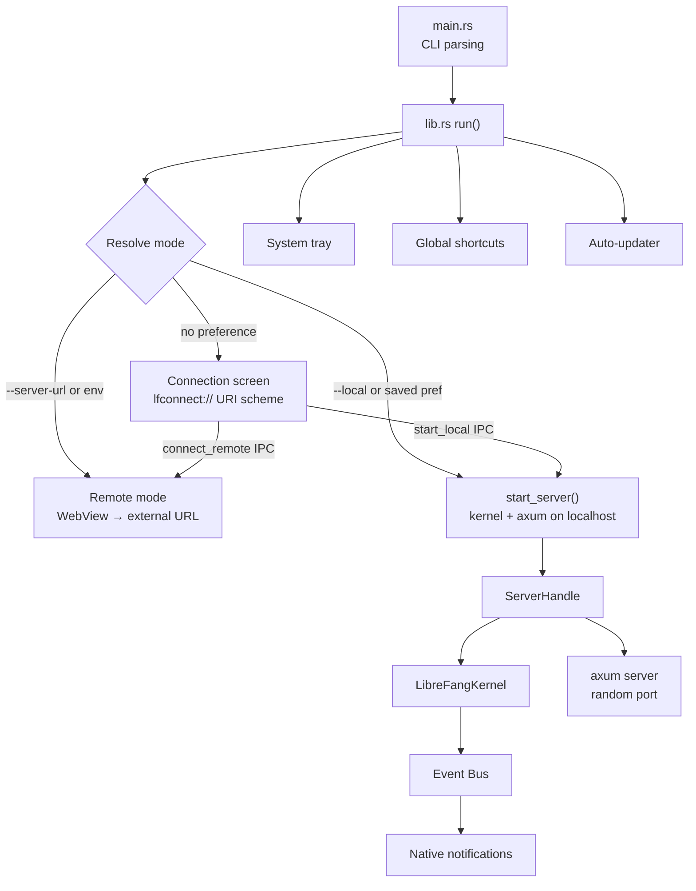

# Desktop Application

# LibreFang Desktop Application

Native desktop wrapper for the LibreFang Agent OS, built on **Tauri 2.0**. Boots the kernel and embedded API server in the background, opens a native WebView pointing at the WebUI dashboard, and provides system tray integration, global shortcuts, auto-start, auto-update, and native OS notifications.

Supports two operating modes — **local** (embedded server on a random localhost port) and **remote** (WebView connects to an existing LibreFang instance over the network).

## Architecture



## Module Layout

| File | Responsibility |
|---|---|
| `main.rs` | CLI argument parsing, dotenv loading, delegates to `lib::run()` |
| `lib.rs` | Application builder, state registration, window creation, mode resolution, event forwarding |
| `commands.rs` | Tauri IPC command handlers exposed to the frontend |
| `connection.rs` | Connection screen HTML, remote/local IPC commands, preference persistence |
| `server.rs` | Kernel boot, embedded axum server lifecycle on a background thread |
| `tray.rs` | System tray icon and context menu |
| `shortcuts.rs` | System-wide keyboard shortcut registration |
| `updater.rs` | Background update checking, download, install, and restart |

## Startup and Mode Resolution

`main()` synchronously loads environment variables from `~/.librefang/.env` (must happen before any threads are spawned), parses CLI flags via `clap`, then calls `lib::run()`.

`run()` resolves the connection mode with this priority:

1. **`--server-url <URL>`** CLI flag → remote mode
2. **`--local`** CLI flag → local mode
3. **`LIBREFANG_SERVER_URL`** environment variable → remote mode
4. **Saved preference** in `~/.librefang/desktop.toml` → remote or local
5. **Fallback** → show the connection screen

```toml
# ~/.librefang/desktop.toml structure
[connection]
mode = "remote"            # or "local"
server_url = "http://..."   # omitted for local mode
```

For local mode, `start_server()` is called immediately to boot the kernel and bind a random port before any Tauri window is created. For the connection screen, the app registers a custom `lfconnect://` URI scheme protocol that serves the connection HTML (avoids the WebKitGTK blank-page issue with `about:blank`).

## Managed State

Tauri managed state uses interior mutability (`RwLock`/`Mutex`) so values can be updated when switching between local and remote modes at runtime. All state types are registered once during `run()`:

| State Type | Inner Type | Purpose |
|---|---|---|
| `PortState` | `RwLock<Option<u16>>` | Local server port. `None` in remote mode. |
| `KernelState` | `RwLock<Option<KernelInner>>` | Kernel reference + startup instant. `None` in remote mode. |
| `ServerUrlState` | `RwLock<String>` | URL the WebView points at (local or remote). |
| `RemoteMode` | `RwLock<bool>` | Whether connected to a remote server. |
| `ServerHandleHolder` | `Mutex<Option<ServerHandle>>` | Handle for shutting down the local server. |

`KernelInner` holds an `Arc<LibreFangKernel>` and the `Instant` the server started (used for uptime display).

## Embedded Server (`server.rs`)

`start_server()` performs three things synchronously on the calling thread:

1. Boots `LibreFangKernel` (no tokio required)
2. Binds `TcpListener` to `127.0.0.1:0` to grab a random free port
3. Spawns a named background thread (`librefang-server`) with its own multi-threaded tokio runtime

The background thread calls `run_embedded_server()`, which:
- Calls `kernel.start_background_agents()` inside the tokio context
- Spawns the approval expiry sweep task
- Spawns dashboard asset sync via `librefang_api::webchat::sync_dashboard()`
- Runs the axum server with graceful shutdown via a `watch` channel

`ServerHandle` owns the shutdown sender and the thread join handle. Calling `shutdown()` sends the signal, waits for the thread, then calls `kernel.shutdown()`. Drop sends the signal without joining (best-effort to avoid blocking in drop). An `AtomicBool` guards against double-shutdown.

## IPC Commands (`commands.rs`)

All commands return `Result<T, String>` for Tauri serialization. Key commands:

| Command | Description |
|---|---|
| `get_port` | Returns the local server port from `PortState` |
| `get_status` | Returns JSON with `status`, `port`, `agents`, `uptime_secs` |
| `get_agent_count` | Returns the number of registered agents |
| `import_agent_toml` | Opens native file picker, validates TOML as `AgentManifest`, copies to `~/.librefang/workspaces/agents/{name}/agent.toml`, spawns the agent |
| `import_skill_file` | Opens native file picker, copies to `~/.librefang/skills/`, triggers skill registry hot-reload |
| `get_autostart` / `set_autostart` | Read/write login auto-start via `tauri-plugin-autostart` |
| `check_for_updates` | Proxies to `updater::check_for_update()` |
| `install_update` | Downloads, installs, and restarts (does not return on success) |
| `open_config_dir` / `open_logs_dir` | Opens `~/.librefang/` or `~/.librefang/logs/` in the OS file manager |
| `uninstall_app` | Platform-specific uninstall (see below) |

### Platform-specific Uninstall

`uninstall_app` is `async` and conditionally compiled:

- **Windows**: Queries `HKCU\Software\Microsoft\Windows\CurrentVersion\Uninstall` for the NSIS `UninstallString` registry value, then spawns the uninstaller and exits.
- **macOS**: Walks up from the executable to find the enclosing `.app` bundle, uses `osascript` to tell Finder to move it to Trash, then exits.
- **Linux/AppImage**: Detects AppImage via file extension or `APPIMAGE` env var, deletes the file, and exits. For system packages, returns a hint string like `"sudo apt remove librefang"`.

## Connection Screen (`connection.rs`)

Provides `connection_html()` — a self-contained HTML/CSS/JS page with dark-themed UI for:

- Entering a remote server URL and testing connectivity
- Connecting to a remote server
- Starting a local embedded server
- Persisting the choice via `save_preference()`
- Triggering uninstall

The JavaScript uses a polling `waitForTauri()` function (up to 8 seconds) to wait for the Tauri v2 IPC bridge to become available on the custom protocol page.

### IPC Commands

| Command | Description |
|---|---|
| `test_connection` | HTTP GET to `{url}/api/health` with a 10-second timeout, validates scheme |
| `connect_remote` | Validates URL, hits health endpoint, updates all managed state for remote mode, navigates WebView |
| `start_local` | Calls `start_server()` via `spawn_blocking`, updates all managed state for local mode, starts event forwarding, navigates WebView |

When switching modes, the previous mode's state is cleared (local kernel set to `None`, port set to `None`, etc.).

## Native Notifications (`lib.rs`)

`forward_kernel_events()` subscribes to the kernel event bus and surfaces critical events as native OS notifications:

- **Agent crashed** — `LifecycleEvent::Crashed`
- **Kernel stopping** — `SystemEvent::KernelStopping`
- **Quota enforced** — `SystemEvent::QuotaEnforced`

Broadcast lag is logged but not fatal. Channel closure terminates the loop.

## System Tray (`tray.rs`)

`setup_tray()` builds a context menu with:

- **Show Window** — focuses the main WebView window
- **Open in Browser** — opens the current server URL in the default browser
- **Change Server** — shuts down local server if running, clears state, navigates back to the connection screen via `document.write()`
- **Status display** — shows running/not connected and agent count (disabled items)
- **Launch at Login** — toggleable `CheckMenuItem` for auto-start
- **Check for Updates** — triggers update check, shows notification with result, auto-installs if available
- **Open Config Directory** — opens `~/.librefang/`
- **Quit LibreFang** — exits the app

Left-clicking the tray icon shows and focuses the window. The window close button is intercepted to hide to tray instead of quitting (desktop only).

## Global Shortcuts (`shortcuts.rs`)

`build_shortcut_plugin()` registers three system-wide shortcuts:

| Shortcut | Action |
|---|---|
| `Ctrl+Shift+O` | Show/focus window |
| `Ctrl+Shift+N` | Show window, emit `navigate` event with `"agents"` |
| `Ctrl+Shift+C` | Show window, emit `navigate` event with `"chat"` |

Registration failure is non-fatal — the app logs a warning and continues.

## Auto-Updater (`updater.rs`)

Two entry points:

- `spawn_startup_check()` — delays 10 seconds after launch, probes the update manifest endpoint via HEAD request (skips if 404 to avoid log noise when no manifest exists), then checks and silently installs any available update with a notification.
- `check_for_update()` / `download_and_install_update()` — on-demand versions called from IPC commands or tray menu.

`UpdateInfo` is returned as a structured JSON object with `available`, `version`, and `body` fields. On successful install, `app_handle.restart()` is called — the function does not return.

## Window Behavior (Desktop)

- **Single instance** — second launch attempts to focus the existing window via `tauri-plugin-single-instance`
- **Hide to tray on close** — `CloseRequested` event is intercepted; window is hidden instead of destroyed
- **Minimized launch** — auto-start passes `--minimized` so the app starts in the tray
- **Window size** — 1280×800 default, 800×600 minimum

## Data Paths

| Path | Purpose |
|---|---|
| `~/.librefang/` | Root config directory |
| `~/.librefang/desktop.toml` | Saved connection preference |
| `~/.librefang/workspaces/agents/{name}/agent.toml` | Imported agent manifests |
| `~/.librefang/skills/` | Imported skill files |
| `~/.librefang/logs/` | Application logs |
| `~/.librefang/.env` | Environment variables loaded at startup |