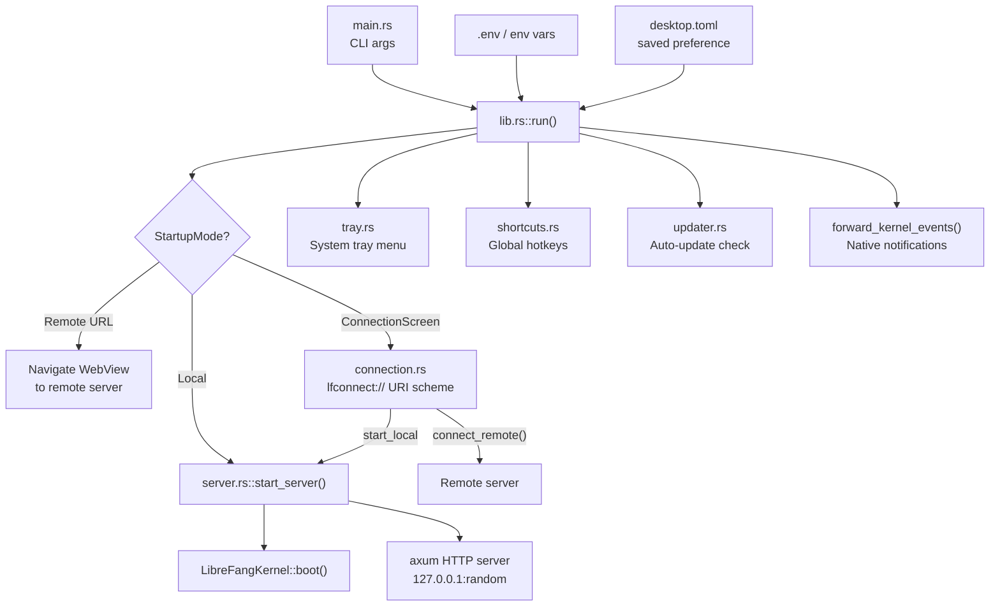

# Desktop Application

# LibreFang Desktop Application

Native desktop and mobile wrapper built on Tauri 2.0. The app embeds the LibreFang kernel and API server, provides a system tray, global shortcuts, auto-update, and a connection screen for switching between local and remote server modes.

## Architecture Overview



## Startup Flow

### Entry Points

- **Desktop**: `main.rs` parses CLI arguments (`--server-url`, `--local`) then calls `librefang_desktop::run()`.
- **Mobile**: `mobile_main()` is declared via `tauri::mobile_entry_point` and calls `run(None, false)` — mobile always starts in connection-screen mode unless a saved preference or env var exists.

### Startup Mode Resolution

`run()` resolves the startup mode in priority order:

1. **CLI `--server-url`** → `StartupMode::Remote(url)`
2. **CLI `--local`** → `StartupMode::Local` (desktop only; mobile falls through)
3. **`LIBREFANG_SERVER_URL` env var** → `StartupMode::Remote(url)`
4. **Saved preference** from `~/.librefang/desktop.toml` → `StartupMode::Remote` or `StartupMode::Local`
5. **Fallback** → `StartupMode::ConnectionScreen`

For direct modes (Remote or Local), the server URL is resolved immediately and the WebView navigates there. The connection screen is served via a custom `lfconnect://` URI scheme protocol (avoids WebKitGTK `about:blank` issues, see #3052).

### `.env` Loading

`librefang_extensions::dotenv::load_dotenv()` is called synchronously at the top of `main()` on desktop and inside `run()` for mobile. This loads `~/.librefang/.env`, `secrets.env`, and vault into the process environment before any threads are spawned (required because `std::env::set_var` is UB with concurrent threads).

## Managed State

Tauri managed state uses interior mutability (`RwLock`) so values can be updated when switching between local and remote mode without re-registering:

| Type | Contents | Purpose |
|------|----------|---------|
| `PortState` | `RwLock<Option<u16>>` | Embedded server port; `None` in remote mode |
| `KernelState` | `RwLock<Option<KernelInner>>` | Kernel instance + `started_at` instant; `None` in remote mode |
| `ServerUrlState` | `RwLock<String>` | URL the WebView points at (local or remote) |
| `RemoteMode` | `RwLock<bool>` | `true` when connected to a remote server |
| `ServerHandleHolder` | `Mutex<Option<ServerHandle>>` | Desktop-only. Holds the server handle for shutdown |

`KernelInner` holds an `Arc<LibreFangKernel>` and an `Instant` for uptime tracking.

## Connection Screen (`connection.rs`)

A self-contained HTML/CSS/JS page served at `lfconnect://localhost/`. Provides:

- **URL input** with "Test Connection" and "Connect" buttons
- **"Start Local Server"** button (stripped on mobile via `#[cfg(mobile)]` — no embedded server on iOS/Android)
- **"Remember this choice"** checkbox that persists to `~/.librefang/desktop.toml`
- **"Uninstall LibreFang"** button

The JS polls for `window.__TAURI__` readiness (up to 8 seconds) before issuing IPC calls, handling the async injection timing of WebView2/WebKit.

### Key IPC Commands

- **`test_connection(url)`** — Validates the URL, hits `/api/health` with a 10-second timeout, returns the JSON response.
- **`connect_remote(url, remember)`** — Validates URL, health-checks the server, updates managed state (clears local state, sets remote flag), navigates the WebView via `window.location.href`.
- **`start_local(remember)`** — Desktop-only. Calls `server::start_server()` on a blocking thread, populates all managed state, spawns event forwarding, navigates WebView to `http://127.0.0.1:{port}`.

### `navigation_target(daemon_url)`

On mobile release builds (`cfg(any(ios, android) && not(debug_assertions))`), returns `tauri://localhost/index.html#api={percent-encoded daemon_url}` to use the embedded dashboard bundle with hash-based API routing. All other builds return the daemon URL directly for thin-client mode.

## Embedded Server (`server.rs`)

Desktop-only. Boots the kernel and runs an axum HTTP server on a background thread.

### `start_server()`

1. Calls `LibreFangKernel::boot(None)` synchronously
2. Binds `TcpListener` to `127.0.0.1:0` on the calling thread (guarantees port is known before Tauri windows are created)
3. Spawns a named thread (`librefang-server`) that creates its own multi-thread tokio runtime
4. Inside that runtime: starts background agents, spawns approval sweep task, then runs the axum server

Returns a `ServerHandle` containing the port, kernel `Arc`, shutdown watch channel, and the server thread `JoinHandle`.

### Graceful Shutdown

- `ServerHandle::shutdown()` — Sends `true` on the watch channel, joins the server thread, calls `kernel.shutdown()`.
- `ServerHandle::drop()` — Best-effort: sends the shutdown signal without joining (avoids blocking in drop).
- An `AtomicBool` prevents double-shutdown between explicit `shutdown()` calls and `drop()`.

The server uses `axum::serve(...).with_graceful_shutdown()` listening on the watch channel.

## IPC Commands (`commands.rs`)

All commands are `#[tauri::command]` functions registered via `tauri::generate_handler![]`. Desktop and mobile register different sets (mobile excludes autostart, updates, and `start_local`; mobile includes credential storage).

### Status & Info

| Command | Returns |
|---------|---------|
| `get_port` | Embedded server port (`u16`) |
| `get_status` | JSON with `status`, `port`, `agents` count, `uptime_secs` |
| `get_agent_count` | Number of registered agents (`usize`) |

### Agent & Skill Import

- **`import_agent_toml`** — Opens a native file picker filtered to `.toml`, parses as `AgentManifest`, copies to `~/.librefang/workspaces/agents/{name}/agent.toml`, spawns the agent.
- **`import_skill_file`** — Opens a native file picker for `.md/.toml/.py/.js/.wasm`, copies to `~/.librefang/skills/`, triggers `kernel.reload_skills()`.

### Auto-Start (Desktop Only)

- **`get_autostart`** / **`set_autostart(enabled)`** — Wraps `tauri_plugin_autostart`.

### Updates (Desktop Only)

- **`check_for_updates`** — Returns `UpdateInfo { available, version, body }`.
- **`install_update`** — Downloads and installs; on success calls `app_handle.restart()` (never returns `Ok`).

### Credential Storage (Mobile Only)

- **`store_credentials(base_url, api_key)`** — JSON-encodes and stores in OS keyring under service `librefang-mobile`, account `daemon-credentials`.
- **`get_credentials`** — Returns stored JSON or `null`.
- **`clear_credentials`** — Deletes the keyring entry.

### System Integration

- **`open_config_dir`** — Opens `~/.librefang/` in the OS file manager.
- **`open_logs_dir`** — Opens `~/.librefang/logs/` in the OS file manager.
- **`uninstall_app`** — Platform-specific uninstall:
  - **Windows**: Queries NSIS registry key for `UninstallString`, runs it, exits app.
  - **macOS**: Moves the `.app` bundle to Trash via `osascript` + Finder.
  - **Linux/AppImage**: Deletes the AppImage binary directly.
  - **Linux/system package**: Returns a hint string with the appropriate package manager command.
  - **Mobile**: Returns an error directing the user to the platform app store.

## Security: URL Validation (`validate_server_url`)

`validate_server_url` enforces that plain `http://` is only allowed for loopback addresses. This prevents MITM-injected IPC abuse (#3673) where a compromised network could inject commands through the Tauri webview's elevated IPC privileges.

Rules:
- `https://` is always allowed
- `http://localhost` and `http://127.x.x.x` are allowed (loopback)
- `http://[::1]` is allowed (IPv6 loopback)
- `http://` to any other host is **rejected**
- URLs with userinfo (`@`) are **rejected** — prevents bypass via `http://[::1]@evil.com/`
- Malformed IPv6 or missing host are **rejected**

Tested exhaustively in `lib.rs::tests`.

## Global Shortcuts (`shortcuts.rs`)

Desktop-only. Registered via `tauri_plugin_global_shortcut`:

| Shortcut | Action |
|----------|--------|
| `Ctrl+Shift+O` | Show/focus the LibreFang window |
| `Ctrl+Shift+N` | Show window + emit `"navigate"` event with `"agents"` |
| `Ctrl+Shift+C` | Show window + emit `"navigate"` event with `"chat"` |

All shortcuts are system-wide (work even when the app is not focused). Registration failure is non-fatal — the app logs a warning and continues.

## System Tray (`tray.rs`)

Desktop-only. On Linux, additionally gated behind the `linux-tray` Cargo feature to avoid pulling deprecated GTK3 dependencies (advisories RUSTSEC-2024-0411..0420, see #3667).

### Menu Items

| Item | Behavior |
|------|----------|
| Show Window | Shows, unminimizes, and focuses the main window |
| Open in Browser | Opens the current server URL in the default browser |
| Change Server... | Shuts down local server, clears state, navigates back to connection screen |
| Status: Running/Remote | Display-only, shows uptime or remote URL |
| Agents: N running | Display-only |
| Launch at Login | Toggle `tauri_plugin_autostart` |
| Check for Updates... | Probes for update, installs if available, notifies |
| Open Config Directory | Opens `~/.librefang/` |
| Quit LibreFang | Calls `app.exit(0)` |

Left-clicking the tray icon also shows the main window.

### Close-to-Tray Behavior

`on_window_event` intercepts `CloseRequested` on desktop: hides the window and calls `api.prevent_close()`. The app keeps running in the tray until "Quit" is selected.

## Auto-Updater (`updater.rs`)

Desktop-only. Uses `tauri_plugin_updater`.

### `spawn_startup_check(app_handle)`

Spawns a background task that:
1. Waits 10 seconds (avoids startup I/O contention)
2. Probes the updater endpoint with a HEAD request via `manifest_reachable()` — if the manifest doesn't exist (404), skips silently (keeps logs clean during development)
3. Checks for an update via `do_check()`
4. If available, shows a notification, waits 3 seconds, then calls `download_and_install_update()`
5. On success, `app_handle.restart()` is called — the process exits and relaunches

### `manifest_reachable()`

Pre-flight HEAD request to the configured updater endpoint URL. Reads the endpoint from `tauri.conf.json` plugins config. Returns `false` on any error, non-2xx status, or missing config. This avoids noisy plugin errors when no `latest.json` has been published yet.

## Event Forwarding (`forward_kernel_events`)

Subscribes to the kernel event bus and forwards critical events as native OS notifications:

- **Agent Crashed** — `LifecycleEvent::Crashed { agent_id, error }`
- **Kernel Stopping** — `SystemEvent::KernelStopping`
- **Quota Enforced** — `SystemEvent::QuotaEnforced { agent_id, spent, limit }`

Uses `recv_event_skipping_lag` from `librefang_kernel::event_bus` so that if the consumer falls behind, skipped events are counted in `EventBus::dropped_count()` and logged as errors rather than silently dropped (issue #3630).

Spawned in two places:
- During `run()` setup for direct local-boot mode
- Inside `start_local` IPC command for connection-screen-initiated local boot

## Connection Preference Persistence

`ConnectionPreference { mode, server_url }` is stored as TOML in `~/.librefang/desktop.toml`:

```toml
[connection]
mode = "remote"
server_url = "http://192.168.1.100:4545"
```

Or for local mode:

```toml
[connection]
mode = "local"
```

`save_preference()` is called after a successful health check (remote) or server boot (local). `load_saved_preference()` reads it during startup mode resolution.

## Platform Differences

| Feature | Desktop | Mobile |
|---------|---------|--------|
| Embedded server | ✅ | ❌ (thin client only) |
| System tray | ✅ (Linux needs `linux-tray` feature) | ❌ |
| Global shortcuts | ✅ | ❌ |
| Auto-update | ✅ | ❌ |
| Auto-start on login | ✅ | ❌ |
| Credential storage | N/A | OS keyring via `keyring` crate |
| Connection screen | Full (includes "Start Local") | Remote-only (local button stripped) |
| Window management | Programmatic `WebviewWindowBuilder` | Declared in `tauri.{ios,android}.conf.json` |
| Close behavior | Hide to tray | Standard app lifecycle |
| Uninstall | Platform-specific native | App store / system settings |