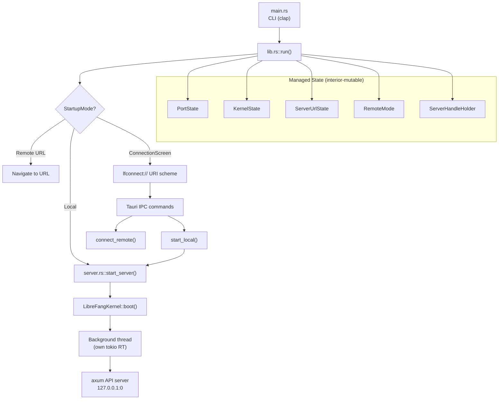

# Desktop Application

# LibreFang Desktop Application

Tauri 2.0 native wrapper for the LibreFang Agent Operating System. Provides a desktop window hosting the LibreFang WebUI, with an optional embedded kernel + API server, system tray integration, native notifications, global shortcuts, auto-start, and in-app updates. On mobile (iOS/Android), the app runs as a thin client connecting to a remote daemon.

## Architecture Overview



## Startup and Connection Mode Resolution

The application resolves how to connect through a priority chain:

1. **CLI `--server-url <URL>`** → Remote mode, connect directly
2. **CLI `--local`** → Local mode, boot embedded server (desktop only)
3. **Environment variable `LIBREFANG_SERVER_URL`** → Remote mode
4. **Saved preference** from `~/.librefang/desktop.toml` → Restores previous choice
5. **Connection screen** → User picks remote URL or starts local server

`main.rs` parses CLI arguments via clap and calls `librefang_desktop::run(server_url, force_local)`. On mobile, `mobile_main()` is the entry point (required by `tauri::mobile_entry_point`) and calls `run(None, false)`.

```rust
// Connection preference persisted at ~/.librefang/desktop.toml
pub struct ConnectionPreference {
    pub mode: String,              // "remote" or "local"
    pub server_url: Option<String>, // set for remote, None for local
}
```

## Managed State

All runtime state is registered once during `Tauri::Builder::setup()` via `builder.manage()`. Updates happen through interior mutability (`RwLock`/`Mutex`), never by re-managing.

| State Type | Inner Type | Purpose |
|---|---|---|
| `PortState` | `RwLock<Option<u16>>` | Embedded server port. `None` in remote mode or before boot. |
| `KernelState` | `RwLock<Option<KernelInner>>` | Kernel handle + `Instant` for uptime. `None` in remote mode. |
| `ServerUrlState` | `RwLock<String>` | URL the WebView points at (local or remote). |
| `RemoteMode` | `RwLock<bool>` | `true` when connected to a remote server. |
| `ServerHandleHolder` | `Mutex<Option<ServerHandle>>` | Desktop only. Holds the server handle for shutdown. |

`KernelInner` stores an `Arc<LibreFangKernel>` and the `Instant` the server started, enabling uptime calculations.

## Embedded Server (`server.rs`)

Desktop-only. Boots the kernel and runs the axum API server on a background thread with its own tokio runtime.

### Boot Sequence

1. `LibreFangKernel::boot(None)` — synchronous kernel initialization
2. `TcpListener::bind("127.0.0.1:0")` — bind to a random free port on the main thread (guarantees port is known before any window is created)
3. Spawn a named thread `"librefang-server"` with a fresh multi-thread tokio runtime
4. Inside the runtime: `kernel.start_background_agents()`, `kernel.spawn_approval_sweep_task()`, then `run_embedded_server()`
5. `build_router()` creates the axum app; `sync_dashboard()` downloads dashboard assets in the background

### Shutdown

`ServerHandle` owns a `watch::Sender<bool>` channel. Calling `shutdown()` or dropping the handle sends `true`, which triggers axum's graceful shutdown. A `compare_exchange` on `shutdown_initiated` prevents double-shutdown. The kernel's own `shutdown()` is called after the server thread joins.

## URL Validation (`validate_server_url`)

Enforces a security policy to prevent MITM attacks via IPC-injected webview content (issue #3673):

- `https://` is always accepted
- `http://` is only allowed for loopback addresses (`127.0.0.0/8`, `::1`, `localhost`)
- Userinfo in the authority (`@`) is always rejected — prevents `http://[::1]@evil.com/` bypass
- Unknown schemes are rejected

This runs before any WebView navigation to a user-supplied URL.

## IPC Commands (`commands.rs`)

All commands are `#[tauri::command]` functions invoked from the frontend. They are split into two handler sets based on target platform:

### Desktop + Mobile (shared)

| Command | Signature | Description |
|---|---|---|
| `get_port` | `() → Result<u16, String>` | Returns the embedded server port |
| `get_status` | `() → Result<JsonValue, String>` | Status object: `{ status, port, agents, uptime_secs }` |
| `get_agent_count` | `() → Result<usize, String>` | Number of registered agents |
| `import_agent_toml` | `() → Result<String, String>` | File picker → parse TOML manifest → copy to `~/.librefang/workspaces/agents/{name}/agent.toml` → `spawn_agent()` |
| `import_skill_file` | `() → Result<String, String>` | File picker → copy to `~/.librefang/skills/` → `reload_skills()` |
| `open_config_dir` | `() → Result<(), String>` | Opens `~/.librefang/` in OS file manager |
| `open_logs_dir` | `() → Result<(), String>` | Opens `~/.librefang/logs/` in OS file manager |
| `uninstall_app` | `async → Result<(), String>` | Platform-specific uninstall (see below) |
| `test_connection` | `(url) → Result<JsonValue, String>` | Hits `{url}/api/health` with 10s timeout |
| `connect_remote` | `async (url, remember, window) → Result<(), String>` | Validates URL, health-checks, updates managed state, navigates WebView |

### Desktop-only

| Command | Description |
|---|---|
| `get_autostart` | Check if launch-at-login is enabled |
| `set_autostart(enabled)` | Enable/disable launch-at-login |
| `check_for_updates` | Returns `UpdateInfo { available, version, body }` |
| `install_update` | Downloads, installs, and restarts |
| `start_local` | Boots embedded server, updates all managed state, navigates WebView |

### Mobile-only

| Command | Description |
|---|---|
| `store_credentials(base_url, api_key)` | JSON-encode into OS keyring (`librefang-mobile` / `daemon-credentials`) |
| `get_credentials` | Retrieve from keyring, returns `null` if none stored |
| `clear_credentials` | Delete from keyring |

### `uninstall_app` — Platform Behavior

- **Windows**: Queries `HKCU\Software\Microsoft\Windows\CurrentVersion\Uninstall` for `LibreFang`, extracts `UninstallString`, spawns the NSIS uninstaller, exits.
- **macOS**: Walks up from the executable to find the enclosing `.app` bundle, moves it to Trash via `osascript` + Finder, exits.
- **Linux/AppImage**: Deletes the AppImage binary (or `$APPIMAGE` env var) and exits.
- **Linux/system package**: Returns an error with the distro-specific uninstall command (`apt remove`, `dnf remove`, `pacman -R`).
- **Mobile**: Returns an error directing the user to the platform app store.

## Connection Screen (`connection.rs`)

A self-contained HTML/CSS/JS page served through a custom Tauri URI scheme protocol (`lfconnect://localhost/`). This replaced the old `about:blank` + `document.write` approach which broke on WebKitGTK 2.50 (issue #3052).

The page provides:
- Server URL input with **Test Connection** and **Connect** buttons
- **Start Local Server** button (stripped on mobile — no embedded server)
- **Remember this choice** checkbox
- **Uninstall LibreFang** button

The JS polls for `window.__TAURI__.core.invoke` availability (up to 8 seconds) to handle asynchronous IPC initialization on `about:blank`-equivalent pages.

### Mobile Bundling

On mobile release builds, the dashboard is embedded in the app bundle. `navigation_target()` returns `tauri://localhost/index.html#api=<percent-encoded daemon URL>` — the dashboard's `bundleMode` uses the hash-encoded URL to proxy API/WS requests to the daemon. On debug builds and desktop, `navigation_target()` returns the daemon URL directly.

## Native Notifications (`forward_kernel_events`)

Subscribes to the kernel event bus and forwards critical events as OS-level notifications via `tauri-plugin-notification`:

- **Agent Crashed** — `LifecycleEvent::Crashed { agent_id, error }`
- **Kernel Stopping** — `SystemEvent::KernelStopping`
- **Quota Enforced** — `SystemEvent::QuotaEnforced { agent_id, spent, limit }`

Uses `recv_event_skipping_lag` to handle slow consumers — dropped events are counted in `EventBus::dropped_count()` and logged as errors rather than silently discarded (issue #3630).

## System Tray (`tray.rs`)

Desktop-only. On Linux, gated behind the `linux-tray` Cargo feature due to GTK3 unmaintained-crate advisories (RUSTSEC-2024-0411..0420, 0429).

Menu items:
- **Show Window** — focus the main window
- **Open in Browser** — open the current server URL in the default browser
- **Change Server...** — shut down local server if running, clear state, navigate back to connection screen
- **Agents: N running** — display-only
- **Status: Running/Remote** — display-only with uptime or remote URL
- **Launch at Login** — toggle auto-start
- **Check for Updates...** — probe, download, install, restart
- **Open Config Directory** — opens `~/.librefang/`
- **Quit LibreFang** — `app.exit(0)`

Left-click on the tray icon shows the main window. The window's close button is intercepted to hide to tray instead of quitting.

## Global Shortcuts (`shortcuts.rs`)

Desktop-only. Registered via `tauri_plugin_global_shortcut`:

| Shortcut | Action |
|---|---|
| `Ctrl+Shift+O` | Show/focus window |
| `Ctrl+Shift+N` | Show window + emit `navigate` event with `"agents"` |
| `Ctrl+Shift+C` | Show window + emit `navigate` event with `"chat"` |

Registration failure is non-fatal — the app logs a warning and continues.

## Auto-Updater (`updater.rs`)

Desktop-only. Two entry points:

1. **Startup check** (`spawn_startup_check`) — 10-second delay, then probes the update manifest endpoint. If reachable, checks for updates and silently installs + restarts. A 3-second notification is shown before restart.
2. **On-demand** (`check_for_update` / `download_and_install_update`) — triggered from the tray menu or IPC commands.

`manifest_reachable()` does a pre-flight HEAD request to the configured updater endpoint. This avoids noisy error logs when the release pipeline hasn't published a `latest.json` manifest (e.g., missing `TAURI_SIGNING_PRIVATE_KEY`).

`download_and_install_update()` calls `app_handle.restart()` on success — the function never returns `Ok`.

## Window Behavior

- Close button → hide to tray (desktop), intercepted via `on_window_event`
- Single instance enforcement: second launch focuses the existing window
- Minimum window size: 800×600, default: 1280×800 (desktop)
- Mobile window is declared in `tauri.ios.conf.json` / `tauri.android.conf.json`

## File System Layout

```
~/.librefang/
├── desktop.toml              # Connection preference (mode + server_url)
├── .env                      # Environment overrides (loaded at startup)
├── secrets.env               # Secrets (loaded at startup)
├── vault                     # Encrypted vault (loaded at startup)
├── logs/                     # Application logs
├── skills/                   # Imported skill files (md, toml, py, js, wasm)
└── workspaces/
    └── agents/
        └── {name}/
            └── agent.toml    # Imported agent manifests
```