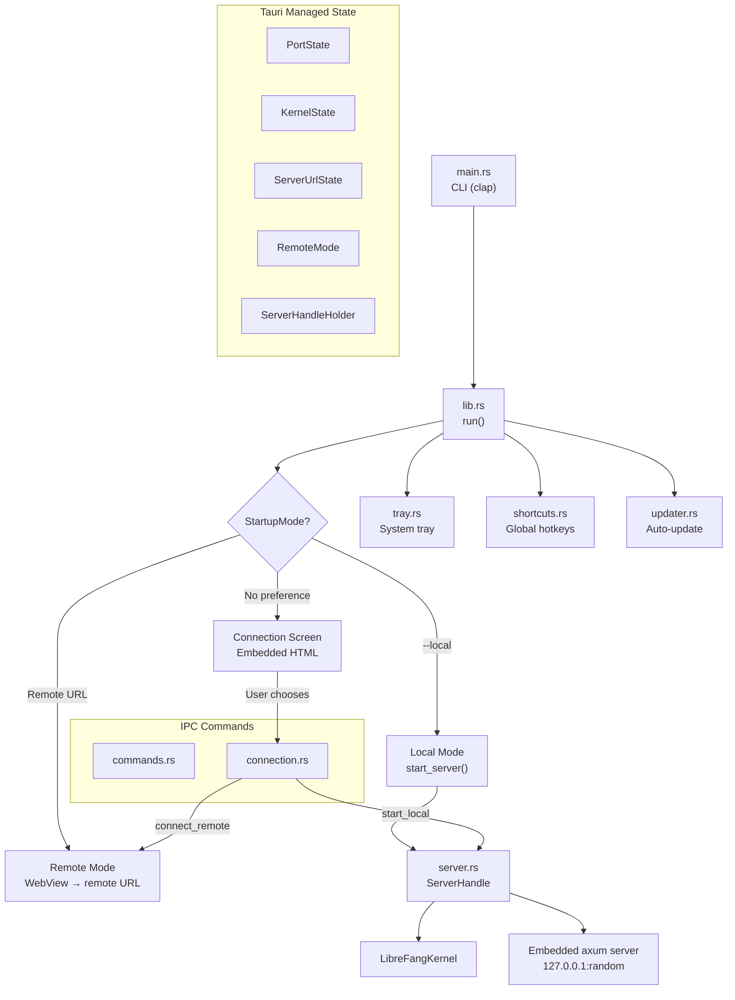

# Desktop Application

# LibreFang Desktop

Native desktop application wrapping the LibreFang Agent OS. Built on Tauri 2.0, it boots the kernel and embedded API server, opens a native WebView pointing at the WebUI dashboard, and provides system tray integration, single-instance enforcement, native OS notifications, global shortcuts, auto-start, and automatic updates.

Supports two modes of operation: **local mode** (embeds and manages a kernel + API server) and **remote mode** (connects the WebView to an already-running LibreFang instance elsewhere on the network).

---

## Architecture Overview



---

## Startup Flow

### Entry Point (`main.rs`)

The binary entry point does two things before anything else:

1. **Loads environment variables** from `~/.librefang/.env`, `secrets.env`, and vault files. This must happen synchronously at the top of `main()` because `std::env::set_var` is undefined behavior once other threads exist.
2. **Parses CLI arguments** via clap:

| Flag | Type | Purpose |
|------|------|---------|
| `--server-url <URL>` | `Option<String>` | Connect directly to a remote LibreFang server |
| `--local` | `bool` | Skip connection screen, start local server immediately |

Then calls `librefang_desktop::run(server_url, force_local)`.

### Startup Mode Resolution (`lib.rs::run`)

The application resolves its connection mode using a strict priority chain:

```
CLI --server-url  >  CLI --local  >  LIBREFANG_SERVER_URL env var  >  saved preference  >  connection screen
```

This produces one of three `StartupMode` variants:

- **`StartupMode::Remote(url)`** — WebView navigates directly to the remote URL. No local kernel or server is started.
- **`StartupMode::Local`** — `server::start_server()` is called immediately. The kernel boots, an axum server binds to `127.0.0.1:0` (random port), and the WebView navigates to `http://127.0.0.1:{port}`.
- **`StartupMode::ConnectionScreen`** — A blank window is created and injected with self-contained HTML from `connection::connection_html()`. The user chooses remote or local from the UI.

### Tauri Plugin Registration

Plugins are registered conditionally for desktop targets (`#[cfg(desktop)]`):

| Plugin | Purpose |
|--------|---------|
| `tauri_plugin_notification` | Native OS notifications |
| `tauri_plugin_shell` | Shell access |
| `tauri_plugin_dialog` | Native file dialogs |
| `tauri_plugin_single_instance` | Focus existing window if already running |
| `tauri_plugin_autostart` | Launch at login (passes `--minimized`) |
| `tauri_plugin_updater` | Self-update mechanism |
| `tauri_plugin_global_shortcut` | System-wide keyboard shortcuts |

If global shortcut registration fails, the app logs a warning and continues — it's non-fatal.

---

## Managed State

Tauri managed state is registered once at startup with interior-mutable wrappers. All updates flow through the `RwLock`/`Mutex` guards; `manage()` is never called a second time.

| State Type | Inner Type | Purpose |
|------------|------------|---------|
| `PortState` | `RwLock<Option<u16>>` | Local server port. `None` in remote mode or before boot. |
| `KernelState` | `RwLock<Option<KernelInner>>` | Kernel instance + startup `Instant`. `None` in remote mode. |
| `ServerUrlState` | `RwLock<String>` | The URL the WebView points at (local or remote). |
| `RemoteMode` | `RwLock<bool>` | Whether currently connected to a remote server. |
| `ServerHandleHolder` | `Mutex<Option<ServerHandle>>` | Handle to the running server. Filled after boot; taken on shutdown or server change. |

`KernelInner` holds an `Arc<LibreFangKernel>` and the `Instant` the kernel started, enabling uptime tracking.

---

## Server Lifecycle (`server.rs`)

### `start_server()`

1. Calls `LibreFangKernel::boot(None)` synchronously (no tokio required).
2. Binds a `TcpListener` to `127.0.0.1:0` on the calling thread to reserve a port before any window is created.
3. Spawns a named thread (`librefang-server`) that creates its own multi-threaded tokio runtime.
4. Inside that runtime: calls `kernel.start_background_agents()`, spawns the approval sweep task, then runs the axum server via `run_embedded_server()`.

Returns a `ServerHandle` containing the port, kernel `Arc`, shutdown watch channel, and the join handle.

### `ServerHandle` Shutdown

Shutdown uses a `watch::Sender<bool>` channel with double-shutdown protection via `AtomicBool`:

- **`shutdown(self)`** — Sends `true`, joins the server thread, then calls `kernel.shutdown()`. Blocks until complete.
- **`Drop`** — Sends `true` but does not join the thread (best-effort, non-blocking).

The `compare_exchange` on `shutdown_initiated` prevents both methods from racing if called concurrently.

### `run_embedded_server()`

Converts the `std::net::TcpListener` to `tokio::net::TcpListener`, builds the axum router via `librefang_api::server::build_router()`, syncs dashboard assets in the background, and serves with graceful shutdown driven by the watch channel. On shutdown, it stops the bridge manager's channel bridges.

---

## Connection Screen (`connection.rs`)

A self-contained HTML/CSS/JS page injected into an `about:blank` WebView. Provides two paths:

1. **Remote connection** — User enters a server URL. The app tests connectivity via `/api/health`, then navigates the WebView.
2. **Local server** — User clicks "Start Local Server". The app boots the kernel and server on a blocking thread, then navigates.

### Preference Persistence

Saved to `~/.librefang/desktop.toml` as:

```toml
[connection]
mode = "remote"        # or "local"
server_url = "http://..."  # absent for local mode
```

Loaded by `load_saved_preference()`, saved by `save_preference()`. Health check must succeed before saving.

### IPC Commands

| Command | Parameters | Description |
|---------|------------|-------------|
| `test_connection` | `url: String` | Hits `/api/health` on the remote server. Returns the JSON response or an error. |
| `connect_remote` | `url: String, remember: bool` | Validates URL, health-checks, saves preference, updates all managed state to remote mode, navigates WebView. |
| `start_local` | `remember: bool` | Boots local server via `spawn_blocking`, fills all managed state, starts event forwarding, navigates WebView. |

When switching modes, the commands clear the previous mode's state. For example, `connect_remote` sets `PortState` and `KernelState` to `None` since those are local-only.

---

## IPC Commands (`commands.rs`)

All commands return `Result<T, String>` for Tauri serialization.

| Command | Returns | Description |
|---------|---------|-------------|
| `get_port` | `u16` | Returns the local server port. Errors if no local server. |
| `get_status` | `serde_json::Value` | JSON with `status`, `port`, `agents` count, `uptime_secs`. |
| `get_agent_count` | `usize` | Number of registered agents in the kernel. |
| `import_agent_toml` | `String` | Opens native file picker, validates TOML as `AgentManifest`, copies to `~/.librefang/workspaces/agents/{name}/agent.toml`, spawns the agent. Returns agent name. |
| `import_skill_file` | `String` | Opens native file picker, copies to `~/.librefang/skills/`, triggers `kernel.reload_skills()`. Returns filename. |
| `get_autostart` | `bool` | Whether launch-at-login is enabled. |
| `set_autostart` | `bool` | Enable/disable autostart. Returns new state. |
| `check_for_updates` | `UpdateInfo` | On-demand update check. |
| `install_update` | `()` | Downloads and installs update, restarts app. Does not return on success. |
| `open_config_dir` | `()` | Opens `~/.librefang/` in OS file manager. |
| `open_logs_dir` | `()` | Opens `~/.librefang/logs/` in OS file manager. |

---

## System Tray (`tray.rs`)

`setup_tray()` builds a menu with contextual information and actions:

```
┌─────────────────────────────┐
│ Show Window                 │
│ Open in Browser             │
│ Change Server...            │
│ ─────────────────────────── │
│ Agents: 3 running           │  (disabled, display-only)
│ Status: Running (2h 15m)    │  (disabled, display-only)
│ ─────────────────────────── │
│ ☑ Launch at Login           │
│ Check for Updates...        │
│ Open Config Directory        │
│ ─────────────────────────── │
│ Quit LibreFang              │
└─────────────────────────────┘
```

Key behaviors:

- **Status items** reflect current mode: shows "Remote (url)" for remote mode or "Running (uptime)" for local mode. These are read at tray setup time and are not dynamically updated.
- **Open in Browser** reads `ServerUrlState` (works for both modes), falling back to `PortState` for backward compatibility.
- **Change Server** shuts down any running local server (in a spawned thread to avoid blocking the tray handler), clears local state, and re-injects the connection screen HTML into the WebView.
- **Left-click tray icon** shows and focuses the window.
- **Close button** is intercepted in `on_window_event` — the window is hidden instead of destroyed, keeping the app running in the tray.

---

## Global Shortcuts (`shortcuts.rs`)

`build_shortcut_plugin()` registers three system-wide shortcuts:

| Shortcut | Action |
|----------|--------|
| `Ctrl+Shift+O` | Show/focus the LibreFang window |
| `Ctrl+Shift+N` | Show window + emit `"navigate"` event with payload `"agents"` |
| `Ctrl+Shift+C` | Show window + emit `"navigate"` event with payload `"chat"` |

The WebUI listens for the `"navigate"` event to route to the appropriate page. Registration failure is non-fatal — the app logs a warning and continues without shortcuts.

---

## Auto-Update System (`updater.rs`)

### `UpdateInfo`

```rust
pub struct UpdateInfo {
    pub available: bool,
    pub version: Option<String>,
    pub body: Option<String>,
}
```

### Startup Auto-Update

`spawn_startup_check()` runs after a 10-second delay. If an update is found, it sends a notification, waits 3 seconds for visibility, then silently downloads and installs. On success, `app_handle.restart()` terminates the process — the function never returns.

### Manual Update

Two-step process exposed as IPC commands:

1. `check_for_update()` — Returns `UpdateInfo` for the frontend to display.
2. `download_and_install_update()` — Performs the actual download and restart. Does not return on success.

The tray's "Check for Updates..." menu item chains both steps: if an update is available, it notifies the user and installs immediately; if up-to-date, it shows a confirmation notification.

---

## Event Forwarding (`lib.rs::forward_kernel_events`)

When running in local mode, a background task subscribes to the kernel's event bus and forwards critical events as native OS notifications:

| Event | Notification Title |
|-------|--------------------|
| `LifecycleEvent::Crashed` | "Agent Crashed" |
| `SystemEvent::KernelStopping` | "Kernel Stopping" |
| `SystemEvent::QuotaEnforced` | "Quota Enforced" |

All other event types are skipped. The task handles broadcast lag gracefully (logs and continues) and exits cleanly when the channel closes.

---

## Window Behavior

- **Single instance** — If a second instance launches, the existing window is shown, unminimized, and focused. The second instance exits.
- **Close to tray** — Clicking the window close button hides the window instead of quitting. The app continues running in the system tray.
- **Connection screen** — Created by navigating to `about:blank` and injecting HTML via `window.eval()`. This avoids needing a separate HTML file in the Tauri bundle.
- **Title** — Set to "LibreFang — Connect" on the connection screen, "LibreFang" otherwise.

---

## Configuration Files

| File | Purpose |
|------|---------|
| `~/.librefang/.env` | Environment variables loaded at startup |
| `~/.librefang/secrets.env` | Secret environment variables |
| `~/.librefang/desktop.toml` | Persisted connection preference |
| `~/.librefang/workspaces/agents/{name}/agent.toml` | Agent manifests (created on import) |
| `~/.librefang/skills/` | Skill files directory (created on import) |
| `~/.librefang/logs/` | Application logs |

---

## Dependencies on Other Modules

| Module | Usage |
|--------|-------|
| `librefang_kernel` | `LibreFangKernel::boot()`, agent registry, skill reload, event bus, shutdown |
| `librefang_api` | `build_router()` for the embedded axum server, `sync_dashboard()` for WebUI assets |
| `librefang_types` | `Event`, `EventPayload`, `LifecycleEvent`, `SystemEvent`, `AgentManifest` |
| `librefang_extensions::dotenv` | `load_dotenv()` for environment loading at startup |