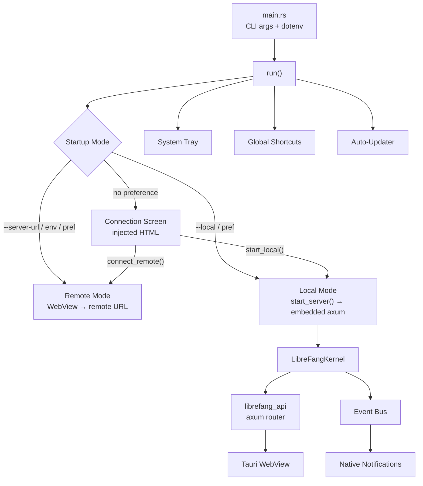

# Desktop Application

# LibreFang Desktop

Native desktop application wrapping the LibreFang Agent OS using Tauri 2.0. Provides a system tray, embedded local server, remote server connectivity, global shortcuts, auto-start on login, and auto-updates.

## Architecture



## Startup Flow

Entry point is `main()` in `main.rs`. It loads environment variables from `~/.librefang/.env` at the synchronous boundary (required before spawning threads), parses CLI arguments via `clap`, then delegates to `lib::run()`.

### Startup Mode Resolution

`run()` determines how to connect using this priority chain:

1. **`--server-url <URL>`** CLI argument → remote mode
2. **`--local`** CLI flag → local mode
3. **`LIBREFANG_SERVER_URL`** environment variable → remote mode
4. **Saved preference** in `~/.librefang/desktop.toml` → uses stored mode
5. **Connection screen** → interactive HTML page for user choice

For remote mode, the URL must use `http://` or `https://` or the process exits. For local mode, `server::start_server()` boots the kernel and binds an axum server to `127.0.0.1:0` before any Tauri window is created, ensuring the port is known up front.

## Managed State

Tauri managed state is registered once at build time with interior-mutable containers. IPC commands and tray handlers update state through `RwLock`/`Mutex` guards — `manage()` is never called twice.

| State Type | Inner Type | Purpose |
|---|---|---|
| `PortState` | `RwLock<Option<u16>>` | Local server port. `None` in remote mode or before boot. |
| `KernelState` | `RwLock<Option<KernelInner>>` | Kernel handle + `Instant` for uptime. `None` in remote mode. |
| `ServerUrlState` | `RwLock<String>` | Active URL the WebView points at (local or remote). |
| `RemoteMode` | `RwLock<bool>` | `true` when connected to a remote server. |
| `ServerHandleHolder` | `Mutex<Option<ServerHandle>>` | Handle for graceful shutdown of the embedded server. |

`KernelInner` holds an `Arc<LibreFangKernel>` and the `Instant` the kernel started, enabling uptime calculation.

## Embedded Server

**File:** `server.rs`

`start_server()` performs three operations synchronously on the calling thread:

1. Boots `LibreFangKernel` via `LibreFangKernel::boot(None)`
2. Binds a `TcpListener` to `127.0.0.1:0` to grab a random free port
3. Spawns a named thread (`librefang-server`) that creates its own tokio runtime

Inside the background thread, the runtime:
- Calls `kernel.start_background_agents()` (requires tokio context)
- Spawns the approval expiry sweep task
- Runs `run_embedded_server()` which builds the axum router via `librefang_api::server::build_router()`, syncs dashboard assets, and serves with graceful shutdown via a `watch` channel

### Shutdown

`ServerHandle` owns a `watch::Sender<bool>`. Signaling `true` triggers axum's graceful shutdown. Shutdown is guarded by an `AtomicBool` to prevent double-signal. The `Drop` impl sends the signal without joining the thread (non-blocking); the explicit `shutdown()` method also joins.

## IPC Commands

**File:** `commands.rs`

All commands are registered via `tauri::generate_handler![]` in `run()`.

### Status & Info

| Command | Parameters | Returns | Description |
|---|---|---|---|
| `get_port` | — | `u16` | Local server port |
| `get_status` | — | `serde_json::Value` | JSON with `status`, `port`, `agents`, `uptime_secs` |
| `get_agent_count` | — | `usize` | Number of registered agents |

### Agent & Skill Import

**`import_agent_toml`** — Opens a native file picker filtered to `.toml`. Reads and parses the file as `AgentManifest`. Copies it to `~/.librefang/workspaces/agents/{name}/agent.toml`, then calls `kernel.spawn_agent()`. Returns the agent name on success.

**`import_skill_file`** — Opens a native file picker filtered to `.md`, `.toml`, `.py`, `.js`, `.wasm`. Copies the file to `~/.librefang/skills/`, then calls `kernel.reload_skills()` for hot-reload.

### System Integration

| Command | Parameters | Returns | Description |
|---|---|---|---|
| `get_autostart` | — | `bool` | Check if launch-at-login is enabled |
| `set_autostart` | `enabled: bool` | `bool` | Enable/disable launch-at-login |
| `check_for_updates` | — | `UpdateInfo` | On-demand update check |
| `install_update` | — | `()` | Download, install, and restart |
| `open_config_dir` | — | `()` | Open `~/.librefang/` in OS file manager |
| `open_logs_dir` | — | `()` | Open `~/.librefang/logs/` in OS file manager |

All commands return `Result<T, String>` where the error string is surfaced directly to the frontend.

## Connection Management

**File:** `connection.rs`

### Connection Preference

Persisted in `~/.librefang/desktop.toml` as:

```toml
[connection]
mode = "remote"           # or "local"
server_url = "http://..."  # absent for local mode
```

`load_saved_preference()` and `save_preference()` handle serialization. Preferences are only saved after a successful health check.

### IPC Commands

**`test_connection(url)`** — HTTP GET to `{url}/api/health` with a 10-second timeout. Validates the URL scheme, checks for a successful status, and parses the JSON response.

**`connect_remote(url, remember)`** — Validates URL, performs health check, updates all managed state (`ServerUrlState`, `RemoteMode`, clears `PortState` and `KernelState`), optionally saves preference, then navigates the WebView via `window.eval()`.

**`start_local(remember)`** — Calls `start_server()` on a blocking thread, populates all managed state with the new kernel/port, stores the `ServerHandle`, subscribes to kernel events for native notifications, optionally saves preference, and navigates the WebView to `http://127.0.0.1:{port}`.

### Connection Screen HTML

`connection_html()` returns a self-contained HTML/CSS/JS string. It's injected into a `about:blank` WebView via `document.open(); document.write(); document.close()`. The page has:
- URL input with test/connect buttons
- "Start Local Server" button
- "Remember this choice" checkbox
- Status indicator area

All interaction goes through `window.__TAURI__.core.invoke()`.

## System Tray

**File:** `tray.rs`

`setup_tray()` builds a menu with these items:

| Menu Item | Behavior |
|---|---|
| Show Window | Show, unminimize, focus |
| Open in Browser | Opens `ServerUrlState` URL in default browser |
| Change Server... | Shuts down local server, resets state, shows connection screen |
| Agents: N running | Display-only (disabled) |
| Status: Running/Remote/Not connected | Display-only, shows uptime in local mode |
| Launch at Login | Toggle autostart via `tauri-plugin-autostart` |
| Check for Updates... | Silent download + install + restart, with notifications |
| Open Config Directory | Opens `~/.librefang/` |
| Quit LibreFang | `app.exit(0)` |

Left-click on the tray icon shows the window. On `CloseRequested`, the window is hidden instead of destroyed (desktop only).

## Global Shortcuts

**File:** `shortcuts.rs`

`build_shortcut_plugin()` registers three system-wide shortcuts via `tauri-plugin-global-shortcut`:

| Shortcut | Action |
|---|---|
| `Ctrl+Shift+O` | Show/focus window |
| `Ctrl+Shift+N` | Show window + emit `navigate` event with `"agents"` |
| `Ctrl+Shift+C` | Show window + emit `navigate` event with `"chat"` |

All shortcuts show and focus the window first. The `navigate` event is emitted for the WebView to handle routing. Registration failure is non-fatal — the app logs a warning and continues.

## Auto-Updater

**File:** `updater.rs`

Uses `tauri-plugin-updater`. Two flows:

### Startup Auto-Update

`spawn_startup_check()` waits 10 seconds after launch, then checks for updates. If found, sends a notification, waits 3 seconds for visibility, then downloads and installs. On success, `app_handle.restart()` is called — the function never returns.

### Manual Update

`check_for_updates` and `install_update` IPC commands expose on-demand checking and installation to the frontend. The tray's "Check for Updates..." item also uses these.

`UpdateInfo` is returned from checks with `available: bool`, `version: Option<String>`, and `body: Option<String>`.

## Native Notifications

`forward_kernel_events()` subscribes to the kernel event bus and forwards critical events as OS-level notifications via `tauri-plugin-notification`:

- **Agent crashed** (`LifecycleEvent::Crashed`) — shows agent ID and error
- **Kernel stopping** (`SystemEvent::KernelStopping`) — informational
- **Quota enforced** (`SystemEvent::QuotaEnforced`) — shows spend vs. limit

Broadcast lag is logged but not treated as fatal. Channel closure terminates the listener.

Event forwarding is started both from `run()` (for direct local boot) and `start_local()` (for connection-screen-initiated local boot).

## Dependencies on Other Crates

| Crate | Usage |
|---|---|
| `librefang_kernel` | Kernel boot, agent registry, skill reload, event bus |
| `librefang_api` | `build_router()` for embedded axum server, `sync_dashboard()` |
| `librefang_types` | `AgentManifest`, `Event`/`EventPayload` types |
| `librefang_extensions` | `dotenv::load_dotenv()` for env file loading |