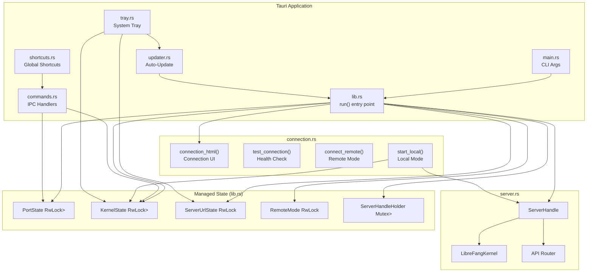
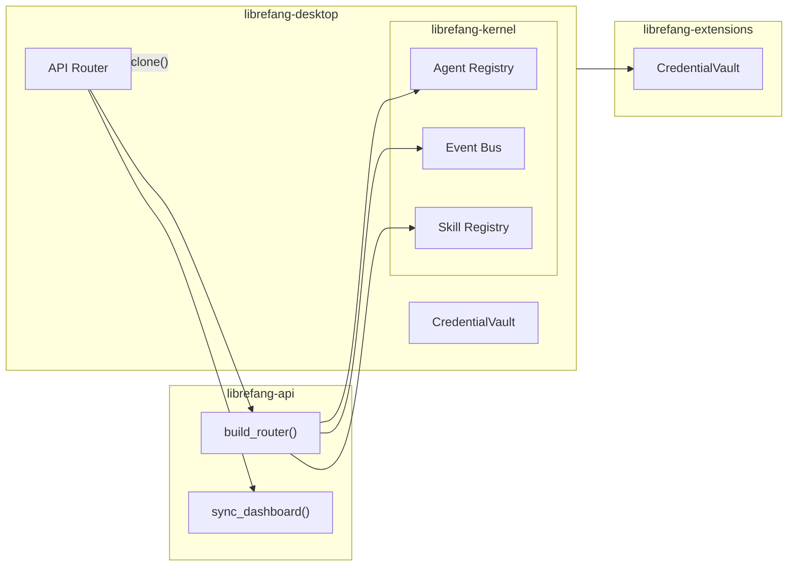

# Desktop Application

# LibreFang Desktop Application

A native Tauri 2.0 desktop wrapper for the LibreFang Agent OS. The application boots an embedded LibreFang kernel and API server, presents a WebUI through a native window, and provides system-level integration including a system tray, global shortcuts, auto-start, and auto-updates.

## Overview

The desktop app operates in two modes:

- **Local mode**: Boots the full LibreFang kernel and API server internally on a random localhost port. The WebView navigates to `http://127.0.0.1:{port}`.
- **Remote mode**: Connects to a running LibreFang server at a user-specified URL. No kernel is booted internally.

Connection preference (mode and URL) is persisted in `~/.librefang/desktop.toml` and resolved at startup with priority: CLI argument → `LIBREFANG_SERVER_URL` env var → saved preference → connection screen.

## Architecture



## Startup Flow

The `run(server_url, force_local)` function in `lib.rs` orchestrates initialization:

1. **Initialize tracing** — Sets up `tracing_subscriber` with env-filter.
2. **Load environment** — Calls `dotenv::load_dotenv()` to inject `~/.librefang/.env`, `secrets.env`, and vault secrets into `std::env`.
3. **Resolve startup mode** — Checks CLI args, env vars, and saved preferences to determine local, remote, or connection-screen mode.
4. **Pre-boot for direct modes** — If remote or forced local, the kernel/server starts immediately so the WebView URL is known before the window is created.
5. **Register managed state** — All state types (`PortState`, `KernelState`, `ServerUrlState`, `RemoteMode`, `ServerHandleHolder`) are registered with Tauri's state manager.
6. **Configure plugins** — Registers notification, shell, dialog, single-instance, autostart, updater, and global-shortcut plugins.
7. **Setup phase** — Creates the WebView window (navigating to the connection screen or direct URL), configures the system tray, starts event forwarding, and spawns the startup update check.
8. **Event loop** — Runs until exit. Closing the window hides to tray instead of quitting.

### Startup Mode Resolution

```
CLI --server-url → Remote
CLI --local      → Local
ENV LIBREFANG_SERVER_URL → Remote
saved desktop.toml:
  mode=remote + server_url → Remote
  mode=local              → Local
else                      → Connection Screen
```

## Key Components

### `lib.rs` — Application Entry Point

The central hub that wires together Tauri, the kernel, and system integration.

**Managed State Types**

All state uses interior mutability via `RwLock` or `Mutex`, allowing updates after initial registration:

```rust
pub struct PortState(pub std::sync::RwLock<Option<u16>>);         // Embedded server port
pub struct KernelState(pub std::sync::RwLock<Option<KernelInner>>); // Kernel + uptime
pub struct ServerUrlState(pub std::sync::RwLock<String>);          // Active server URL
pub struct RemoteMode(pub std::sync::RwLock<bool>);                // Local vs remote
pub struct ServerHandleHolder(pub std::sync::Mutex<Option<ServerHandle>>); // Shutdown handle
```

`KernelInner` holds the `Arc<LibreFangKernel>` and the `Instant` of startup, used for uptime display.

**Kernel Event Forwarding**

The `forward_kernel_events()` async function subscribes to the kernel's event bus and emits native OS notifications for critical events:

- `LifecycleEvent::Crashed` — Agent crash with error message
- `SystemEvent::KernelStopping` — Kernel shutdown signal
- `SystemEvent::QuotaEnforced` — Quota limit hit with spent/limit amounts

Non-critical events are silently ignored to avoid notification spam.

**Window Behavior**

- **On close**: Hides to system tray instead of quitting (`api.prevent_close()`)
- **On tray click**: Shows and focuses the window
- **Single instance**: If another instance launches, the existing window is focused

### `server.rs` — Embedded Kernel & Server

Manages the lifecycle of the local LibreFang kernel and its API server.

**`ServerHandle`**

Returned by `start_server()` and held in `ServerHandleHolder`. Contains:

- `port: u16` — The bound port
- `kernel: Arc<LibreFangKernel>` — Shared kernel reference
- `shutdown_tx: watch::Sender<bool>` — Shutdown signal channel
- `server_thread: JoinHandle` — Background thread handle
- `shutdown_initiated: AtomicBool` — Guards against double shutdown

**Shutdown Safety**

`ServerHandle` implements `Drop`, which signals shutdown if not already initiated. The `shutdown()` method waits for the thread to join. This ensures the embedded server stops cleanly when the app exits or when switching from local to remote mode.

**`start_server()` Process**

1. Boots `LibreFangKernel::boot(None)` synchronously
2. Binds `TcpListener` to `127.0.0.1:0` to get a free port on the main thread
3. Spawns a dedicated thread (`"librefang-server"`) with a multi-threaded tokio runtime
4. Inside that runtime: calls `kernel.start_background_agents()`, spawns the approval sweep task, and runs `run_embedded_server()`
5. Returns `ServerHandle` with the port immediately available

**`run_embedded_server()`**

1. Calls `build_router(kernel, listen_addr)` to create the axum router
2. Spawns a background task for `sync_dashboard()` (updates WebUI assets from release)
3. Converts the `std::net::TcpListener` to `tokio::net::TcpListener` in non-blocking mode
4. Runs the axum server with graceful shutdown (waits on the watch channel)
5. On shutdown, stops the bridge manager

### `connection.rs` — Connection Screen & Mode Switching

Provides a self-contained HTML connection page and IPC commands for remote/local switching.

**`connection_html()`**

Returns a complete, dark-themed HTML/CSS/JS page injected into a blank WebView. The JavaScript calls Tauri IPC commands:

- `test_connection(url)` — Validates server reachability via `/api/health`
- `connect_remote(url, remember)` — Switches to remote mode
- `start_local(remember)` — Boots local server and switches mode

**`ConnectionPreference`**

Persisted in `~/.librefang/desktop.toml`:

```toml
[connection]
mode = "local"        # or "remote"
server_url = "..."   # only for remote mode
```

**Mode Switching**

When switching modes via `start_local` or `connect_remote`:

1. Validates the input (URL scheme check)
2. Verifies server health (for remote) or boots kernel (for local)
3. Updates all interior-mutable state: `PortState`, `KernelState`, `ServerUrlState`, `RemoteMode`
4. Clears the other mode's state (e.g., clears `PortState` when going remote)
5. For local mode, takes ownership of the `ServerHandle` into `ServerHandleHolder`
6. Navigates the WebView to the new URL

### `commands.rs` — Tauri IPC Commands

All commands are registered with `tauri::generate_handler!` and callable from the WebUI via `window.__TAURI__.core.invoke()`.

**Status & Diagnostics**

| Command | Returns | Description |
|---------|---------|-------------|
| `get_port` | `u16` | Embedded server port (errors if remote or not started) |
| `get_status` | `JSON { status, port, agents, uptime_secs }` | Kernel status summary |
| `get_agent_count` | `usize` | Number of registered agents |

**Importing**

| Command | Action |
|---------|--------|
| `import_agent_toml` | Opens native file picker → parses TOML → copies to `~/.librefang/workspaces/agents/{name}/` → spawns agent |
| `import_skill_file` | Opens native file picker → copies to `~/.librefang/skills/` → hot-reloads skill registry |

**System Integration**

| Command | Action |
|---------|--------|
| `get_autostart` | Returns whether launch-at-login is enabled |
| `set_autostart(enabled)` | Enables or disables launch-at-login |
| `check_for_updates` | Returns `UpdateInfo { available, version, body }` |
| `install_update` | Downloads and installs update, then restarts |
| `open_config_dir` | Opens `~/.librefang/` in OS file manager |
| `open_logs_dir` | Opens `~/.librefang/logs/` in OS file manager |

### `dotenv.rs` — Environment Loading

Mirrors the CLI's dotenv behavior so the desktop app loads credentials consistently.

**Load Priority** (lowest to highest)

1. `~/.librefang/.env` file
2. `~/.librefang/secrets.env` file
3. Credential vault (`~/.librefang/vault.enc`)
4. System environment variables

The vault has the highest priority among config sources (but yields to system env vars). Files that don't exist are silently skipped.

**Vault Integration**

If `vault.enc` exists and can be unlocked, credentials are injected into `std::env`. The vault uses the machine fingerprint for key derivation, making credentials machine-specific.

### `tray.rs` — System Tray

Sets up a system tray icon with an enhanced menu showing real-time status.

**Tray Menu Structure**

```
Show Window
Open in Browser
Change Server...
─────────────
Agents: N running        (display only)
Status: Running (2h 15m) (display only, or "Remote (http://...)")
─────────────
Launch at Login    [✓]  (checkable)
Check for Updates...
Open Config Directory
─────────────
Quit LibreFang
```

**Key Behaviors**

- **Show Window**: Brings the window to front
- **Open in Browser**: Uses `ServerUrlState` (works for both modes)
- **Change Server**: Stops the local server, clears state, navigates to connection screen
- **Launch at Login**: Toggles autostart via `app.autolaunch()`
- **Check for Updates**: Performs full update check and install with notifications
- **Quit**: Calls `app.exit(0)` immediately

The status line and agent count are dynamically read from `KernelState` at tray setup time.

### `shortcuts.rs` — Global Keyboard Shortcuts

Three system-wide shortcuts registered with `tauri_plugin_global_shortcut`:

| Shortcut | Action |
|----------|--------|
| `Ctrl+Shift+O` | Show/focus the LibreFang window |
| `Ctrl+Shift+N` | Show window + emit `navigate` event with `"agents"` payload |
| `Ctrl+Shift+C` | Show window + emit `navigate` event with `"chat"` payload |

The `navigate` events allow the WebUI to respond to shortcuts without being focused. Shortcut registration failure is non-fatal—the app continues without shortcuts.

### `updater.rs` — Auto-Update

Integrates with `tauri_plugin_updater` for update checking and installation.

**Startup Check**

`spawn_startup_check()` waits 10 seconds after launch, then checks for updates. If available, shows a notification and installs silently, triggering an app restart.

**On-Demand Updates**

The tray menu's "Check for Updates..." and the IPC command `check_for_updates` both use `check_for_update()`. The `install_update` command downloads and installs, then calls `app_handle.restart()` (which terminates the current process).

**`UpdateInfo` Structure**

```rust
pub struct UpdateInfo {
    pub available: bool,
    pub version: Option<String>,
    pub body: Option<String>,
}
```

## Environment Variables & Configuration

The desktop app respects several environment variables:

| Variable | Effect |
|----------|--------|
| `LIBREFANG_HOME` | Overrides `~/.librefang` base directory |
| `LIBREFANG_SERVER_URL` | Sets default remote server URL |

Configuration files in `~/.librefang/`:

| File | Purpose |
|------|---------|
| `.env` | API keys, custom settings |
| `secrets.env` | Written by the dashboard's "Set API Key" feature |
| `vault.enc` | Encrypted credential storage |
| `desktop.toml` | Persisted connection preference |

## Integration with Other Modules



| Dependency | Usage |
|------------|-------|
| `librefang-kernel` | Boots `LibreFangKernel`, accesses agent registry, event bus, skill registry |
| `librefang-api` | Builds the API router, syncs dashboard assets |
| `librefang-types` | Event types, agent manifest types |
| `librefang-extensions` | Credential vault for secure storage |

The WebUI served by the embedded server provides the full dashboard experience (chat, agent management, settings). The desktop app's role is purely the native wrapper and system integration layer.